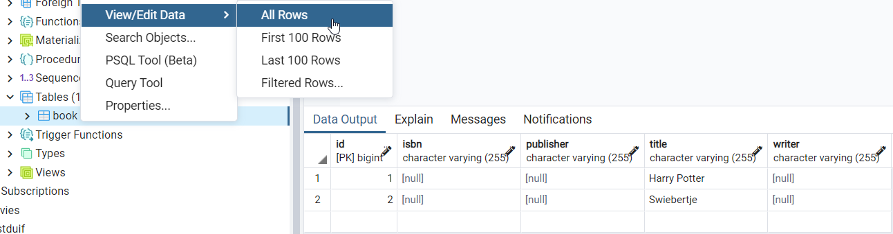
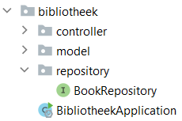
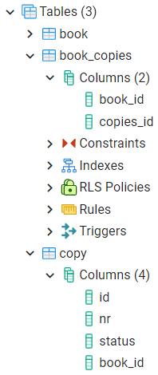

## Stap 1: Het idee

Beschrijf de applicatie. Probeer min of meer volledig te zijn zonder al te zeer op de details in te gaan.

    Voor een bibliotheek hebben we een systeem nodig waarin leden worden bijgehouden. 
    In dit systeem staan ook de beschikbare boeken. 
    Een lid kan een boek lenen voor 3 weken. 
    Het systeem houdt bij welke boeken aanwezig zijn in de bibliotheek.

## Stap 2: Ontwerp UML

### Stap 2a: eerste opzet

1. Markeer alle `zelfstandige naamwoorden` met een kleur
2. Markeer alle `werkwoorden` met een andere kleur
3. De zelfstandige naamwoorden zijn kandidaten om in de applicatie `classes` te worden
4. De werkwoorden zijn kandidaat `methoden`

#### Voorbeeld


De rode woorden zijn zelfstandige naamwoorden, de groene woorden zijn de werkwoorden.


#### Bibliotheek

De zelfstandige naamwoorden voor het idee zijn als volgt.


- Systeem
- Bibliotheek
- Lid
- Boek
- Leenperiode (=weken)

Systeem is het alles overkoepelende, dat is wat je gaat beschrijven, dus deze gebruiken we niet in het klassendiagram.

### Stap 2b: klassendiagram

Je kunt een klassendiagram met <a href="https://www.diagrams.net/" target="_blank">diagrams.net</a> maken.


Wanneer klassen iets met elkaar te maken hebben dan zet je er een verbinding tussen (een lijn).

- Een bibliotheek heeft een X aantal exemplaren (aggregatie - open diamant)
- Een bibliotheek heeft een X aantal leden (aggregatie - open diamant)
- Exemplaar heeft een relatie met een boek (associatie - lijn)
    - een boek kan meerdere exemplaren hebben (1..*)
    - ieder exemplaar gaat over 1 boek (1)
- Leenperiode: het exemplaar is geleend voor een periode door een lid. Leenperiode is een koppeling tussen
  exemplaar en lid (associatie - lijn)

## Stap 3: database en Spring Boot

### pgAdmin

De database die we gebruiken is pgAdmin. Hierin maken we een nieuwe database aan via Servers > PostgreSQL > Databases > rechts klikken > Create > Database en noemen hem `test_bibliotheek`.

Ga binnen de database `test_bibliotheek` naar Schemas > Tables > rechts klikken > Create > Table en maak een nieuwe tabel `books`.


In de tab `columns` gaan we de kolommen erin zetten en slaan we hem op.


We hebben nu een tabel waar we records in kunnen zetten.


### Hibernate

In Java heb je het over classes, objecten etc. In een database hebben we het over tabellen. Een verbinding tussen een
klasse en een tabel is niet altijd 1 op 1. In een klasse kun je bijvoorbeeld werken met lijsten, met een reeks, in een
database kan dit niet. In een database werk je altijd met een primary key en foreign keys en dit hoef je niet altijd in je classes te doen.

Spring Boot biedt een koppeling tussen de database en Java. Aan de Java kant heb je ORM: Object Relational Mapping. Een ORM heb je nodig om de koppeling/verbinding te maken.


In Spring Boot heet de ORM `Hibernate`. Hibernate is de populairste Object Relational Mapping (ORM) voor Java.

### Springboot

We gaan de classes van het klassendiagram uit stap 2b in Springboot maken.

#### Spring Initializr

We beginnen met een <a href="https://start.spring.io/" target="_blank">Spring Initializr</a> project.


Open het bestand in IntelliJ en load de Maven script (melding krijg je rechts onderin).


#### Bestand pom.xml

De `pom.xml` (maven dependency manager) specificeert welke pakketten je nodig hebt. De onderstaande heb je
geïnstalleerd.


Wanneer je in `pom.xml` een foutmelding krijgt bij de `version` van `parent`, zet je `<version>2.4.3</version>` erin.

#### Bestand application.properties

`@SpringBootApplication` moet gaan communiceren met postgreSQL. Om dit voorelkaar te krijgen moet je in het project van IntelliJ naar `resources` gaan en dan `application.properties`. De gegevens van postgreSQL worden aan de hand van de code die je daar inzet gekoppeld met de database. 

    # datasource PostgreSQL
    spring.jpa.database=postgresql
    spring.datasource.platform=postgres
    spring.datasource.url=jdbc:postgresql://localhost:5432/springboot
    spring.datasource.username=springboot
    spring.datasource.password=springboot
    spring.datasource.driver-class-name=org.postgresql.Driver
    spring.jpa.generate-ddl=true
    spring.jpa.properties.hibernate.jdbc.lob.non_contextual_creation=true
    spring.jpa.properties.hibernate.dialect= org.hibernate.dialect.PostgreSQLDialect
    
    spring.jpa.show-sql = true
    
    spring.jpa.hibernate.ddl-auto=create
    spring.datasource.initialization-mode=always

- `url` is de database naam in pgAdmin
- `username` is jouw username in pgAdmin 
- `password` is jouw wachtwoord in pgAdmin

#### Bestand model

We gaan de entities maken die we in ons klassendiagram hebben gezet. We maken een nieuwe package genaamd `model` en een
nieuwe klasse genaamd `Book.java` in IntelliJ.


In `Book.java` maken we de attributen en de getters en setters.

```java
package com.danielle.library.model;

public class Book {
    private String title;
    private String writer;
    private String isbn;
    private String publisher;

    public String getTitle() {
        return title;
    }

    public void setTitle(String title) {
        this.title = title;
    }

    public String getWriter() {
        return writer;
    }

    public void setWriter(String writer) {
        this.writer = writer;
    }

    public String getIsbn() {
        return isbn;
    }

    public void setIsbn(String isbn) {
        this.isbn = isbn;
    }

    public String getPublisher() {
        return publisher;
    }

    public void setPublisher(String publisher) {
        this.publisher = publisher;
    }
}
```

Dit is wat ze noemen een POJO: Plain Old Java Object. Een simpele klasse met alleen attributen en getters en setters. Hibernate maakt gebruik van de POJO.

Om dit te integreren met Spring Boot gaan we met annotaties werken: `@Entity`.

```java
import javax.persistence.Entity;

@Entity
public class Book {
}
```

Daarnaast geven we de attributen een annotatie `@Column`.

```java
import javax.persistence.Column;
import javax.persistence.Entity;

@Entity
public class Book {

    @Column
    private String title;
    @Column
    private String writer;
    @Column
    private String isbn;
    @Column
    private String publisher;
}
```

Als laatste maken we een primary key.

```java
package com.danielle.library.model;

import javax.persistence.*;

@Entity
public class Book {
    @Id
    @GeneratedValue(strategy = GenerationType.IDENTITY)
    private long id;

    @Column
    private String title;
    @Column
    private String writer;
    @Column
    private String isbn;
    @Column
    private String publisher;

    public long getId() {
        return id;
    }

    public void setId(long id) {
        this.id = id;
    }

    public String getTitle() {
        return title;
    }

    public void setTitle(String title) {
        this.title = title;
    }

    public String getWriter() {
        return writer;
    }

    public void setWriter(String writer) {
        this.writer = writer;
    }

    public String getIsbn() {
        return isbn;
    }

    public void setIsbn(String isbn) {
        this.isbn = isbn;
    }

    public String getPublisher() {
        return publisher;
    }

    public void setPublisher(String publisher) {
        this.publisher = publisher;
    }
}
```

We gaan de applicatie `LibraryApplication` runnen. Wanneer het is gelukt krijg je de melding `Started LibraryApplication` in de terminal van IntelliJ..

Ga naar de database in pgAdmin. In Schemas > Tables zie je dat er een `book` tables staat en er zijn 5 columns gemaakt.


#### Database H2

Wanneer de connectie met postgresSQL niet werkt kun je H2 gebruiken. Het volgende zet je in `application.properties`.

    # datasource H2
    spring.datasource.driverClassName=org.h2.Driver
    spring.datasource.username=sa
    spring.datasource.password=password
    spring.datasource.url=jdbc:h2:mem:testdb
    #spring.datasource.url=jdbc:h2:file:./data/testdb
    spring.datasource.hikari.connectionTimeout=20000
    spring.datasource.hikari.maximumPoolSize=5
    spring.h2.console.enabled=true
    spring.h2.console.path=/h2console/
    spring.jpa.database-platform=org.hibernate.dialect.H2Dialect
    spring.jpa.hibernate.ddl-auto=create

In de `pom.xml` zet je onder de dependency van `postgresql` de code van `h2`.

    <dependency>
       <groupId>com.h2database</groupId>
       <artifactId>h2</artifactId>
       <scope>runtime</scope>
    </dependency>

Er verschijnt een `Load Maven Changes` icoon in beeld. Deze klik je aan, zodat IntelliJ kan indexen. 

Run de applicatie.

De database H2 is in-memory. Je gaat naar de broswer en zoekt naar `localhost:8080/h2console`. Vervolgens krijg je in de browser een soort database te zien. Klik op `connect` en dan zie je de class `book` en de 5 columns staan.


#### Bestand data.sql

Wanneer de database werkt, gaan we `Book` vullen met een aantal zaken zodat we kunnen zien dat er data in de tabel
komt. Dit doe je door in de `resources` een nieuw file te maken en die noemen we `data.sql`. Dit is een `sql`
bestand waarmee we records kunnen toevoegen aan `Book`.

In dit bestand zet je de volgende code voor H2.

    insert into book (title) values 'Harry Potter';
    insert into book (title) values 'Swiebertje';

Voor postgreSQL geldt het volgende.

    insert into book (title) values ('Harry Potter');
    insert into book (title) values ('Swiebertje');

Wanneer je IntelliJ Ultimate heb krijg je het volgende te zien.


IntelliJ Ultimate heeft de mogelijkheid van Inspections. In de editor worden deze gebruikt om de code te onderzoeken en
suggesties te doen. Deze Inspections kunnen aan of uit worden gezet.

Bij het creëren van een .sql bestand zoals `data.sql` worden onder de volgende inspections geactiveerd:

- __SQL dialect detection__ Hiermee wordt de syntax van SQL gecontroleerd volgens een aangegeven SQL dialect
- __No data sources configured__ IntelliJ Ultimate biedt de mogelijkheid datasources te configureren. Leuk maar die optie gebruiken we niet in de Spring Boot projecten

Je kan de inspectie meldingen die in de gele balken verschijnen negeren, maar je kunt ze ook uitzetten. In de balk zie
je een instellingen icon (een radertje) met in de pulldown menu de optie `Disable inspection`.

Als je deze weer aan wilt zetten moet dat via het hoofdmenu > preferences > editor > inspections. Daar kun je de
betreffende inspections opzoeken in de lijst en het vinkje weer aanzetten.

Run de applicatie.

In postgreSQL krijg je de gegevens te zien die je in de `data.sql` heb gezet via book > View/Edit Data > All Rows.



### Repository

We gaan een controller maken in het project van IntelliJ. We maken eerste aan package genaamd `controller` en een bestand genaamd `BookController.java`.


Op hetzelfde niveau als controller maak je een nieuwe package `repository`
en daarin een interface bestand genaamd `BookRepository`. Via `bookRepository` gaan we naar de database.



De communicatie met de database gebeurd via een repository, dus BookRepository communiceert straks met de database. Het is een interface die op basis van een bestaande JpaRepository toegang heeft naar `book` op basis van de id wat `Long` is. Hij vertaald Java in SQL.

_BookRepository.java_

```java
package com.danielle.bibliotheek.repository;

import com.danielle.bibliotheek.model.Book;
import org.springframework.data.jpa.repository.JpaRepository;

public interface BookRepository extends JpaRepository<Book, Long> {
}
```

_BookController.java_

```java
package com.danielle.bibliotheek.controller;

import com.danielle.bibliotheek.model.Book;
import com.danielle.bibliotheek.repository.BookRepository;
import org.springframework.beans.factory.annotation.Autowired;
import org.springframework.http.HttpStatus;
import org.springframework.http.ResponseEntity;
import org.springframework.web.bind.annotation.GetMapping;
import org.springframework.web.bind.annotation.RestController;

import java.util.List;

@RestController
public class BookController {
    @Autowired
    private BookRepository bookRepository;

    @GetMapping(value = "/books")
    public ResponseEntity<Object> getBooks() {
        List<Book> books = bookRepository.findAll();
        return new ResponseEntity<>(books, HttpStatus.OK);
    }
}
```

We hebben een `@GetMapping` naar `/books` met een methode `getBooks`, die levert een `ResponseEntity` op en deze bestaat
uit `books` en books is een `List` naar type `Book`. Om deze boven water te krijgen doen we een bookRepository en `findAll();`. De bookRepository hebben we met `@Autowired` gedaan.

Run de applicatie.

Ga naar Postman en doe een `GET` naar `http://localhost:8080/books`. Je krijgt de data te zien uit `data.sql` in de body.


In de terminal van IntelliJ zie je allerlei opdrachten en daartussen staat `hibernate`. Je ziet `select .... from book` staan en dit
is de sql statement die hibernate heeft gegenereerd op basis van wat hij weet van de entity. Doordat wij
de `BookRepository.java` hebben toegevoegd (die eigenlijk niks doet) weet hij dat hij Book kan ophalen met een
Long id: `JpaRepository<Book, Long>` en wanneer je deze repository gaat gebruiken je een `findAll()` kan doen die
in `BookController` staat.


### Endpoint: /id

We gaan op basis van `/books` een `{id}` ophalen.

_BookController.java_

```java
package com.danielle.bibliotheek.controller;

import com.danielle.bibliotheek.model.Book;
import com.danielle.bibliotheek.repository.BookRepository;
import org.springframework.beans.factory.annotation.Autowired;
import org.springframework.http.HttpStatus;
import org.springframework.http.ResponseEntity;
import org.springframework.web.bind.annotation.GetMapping;
import org.springframework.web.bind.annotation.PathVariable;
import org.springframework.web.bind.annotation.RestController;

import java.util.List;
import java.util.Optional;

@RestController
public class BookController {
    @Autowired
    private BookRepository bookRepository;

    @GetMapping(value = "/books")
    public ResponseEntity<Object> getBooks() {
        List<Book> books = bookRepository.findAll();
        return new ResponseEntity<>(books, HttpStatus.OK);
    }

    @GetMapping(value = "/books/{id}")
    public ResponseEntity<Object> getBook(@PathVariable("id") long id) {
        return new ResponseEntity<>(bookRepository.findById(id), HttpStatus.OK);
    }
}
```

We hebben een `@GetMapping` voor een specifiek `{id}`. Deze gaat naar de bookRepository en die doet niet `findAll()`
maar `findfById(id)`.

Run de applicatie.

Wanneer je in Postman `http://localhost:8080/books/2` en `GET` doe dan krijg je het boek "Swiebertje" in de body.


### Toevoegen boeken

Met `@PostMapping` voegen we boeken toe.

_BookController.java_

```java
package com.danielle.bibliotheek.controller;

import com.danielle.bibliotheek.model.Book;
import com.danielle.bibliotheek.repository.BookRepository;
import org.springframework.beans.factory.annotation.Autowired;
import org.springframework.http.HttpStatus;
import org.springframework.http.ResponseEntity;
import org.springframework.web.bind.annotation.*;

import java.util.List;
import java.util.Optional;

@RestController
public class BookController {
    @Autowired
    private BookRepository bookRepository;

    @GetMapping(value = "/books")
    public ResponseEntity<Object> getBooks() {
        List<Book> books = bookRepository.findAll();
        return new ResponseEntity<>(books, HttpStatus.OK);
    }

    @GetMapping(value = "/books/{id}")
    public ResponseEntity<Object> getBook(@PathVariable("id") long id) {
        return new ResponseEntity<>(bookRepository.findById(id), HttpStatus.OK);
    }

    @PostMapping(value = "/books")
    public ResponseEntity<Object> createBook(@RequestBody Book book) {
        bookRepository.save(book);
        return new ResponseEntity<>("Book created", HttpStatus.CREATED);
    }
}
```

In de `@Postmapping` code is de `bookRepository` de poort en `.save` is het book die we krijgen: `bookRepository.save(book);`.

Run de applicatie.

In Postman gebruik je `POST` en de url `http://localhost:8080/books/` om boeken toe te voegen.


Het toevoegen van boeken doe je in de `body` en dan druk je op `send` om hem toe te voegen. Je krijgt een melding `Book created`.


Wanneer je `GET` selecteer en de url `http://localhost:8080/books/`, krijg je het boek dat je hebt toegevoegd in de
body.


Wanneer je in postgreSQL kijkt, dan staat het boek toegevoegd in de database: Schemas > Tables > book > rechts klikken >
View/Edit Data > All Rows


### Delete boeken

Het verwijderen van boeken doen we met `@DeleteMapping`.

```java
package com.danielle.bibliotheek.controller;

import com.danielle.bibliotheek.model.Book;
import com.danielle.bibliotheek.repository.BookRepository;
import org.springframework.beans.factory.annotation.Autowired;
import org.springframework.http.HttpStatus;
import org.springframework.http.ResponseEntity;
import org.springframework.web.bind.annotation.*;

import java.util.List;
import java.util.Optional;

@RestController
public class BookController {
    @Autowired
    private BookRepository bookRepository;

    @GetMapping(value = "/books")
    public ResponseEntity<Object> getBooks() {
        List<Book> books = bookRepository.findAll();
        return new ResponseEntity<>(books, HttpStatus.OK);
    }

    @GetMapping(value = "/books/{id}")
    public ResponseEntity<Object> getBook(@PathVariable("id") long id) {
        return new ResponseEntity<>(bookRepository.findById(id), HttpStatus.OK);
    }

    @PostMapping(value = "/books")
    public ResponseEntity<Object> createBook(@RequestBody Book book) {
        bookRepository.save(book);
        return new ResponseEntity<>("Book created", HttpStatus.CREATED);
    }

    @DeleteMapping(value = "/books/{id}")
    public ResponseEntity<Object> deleteBook(@PathVariable("id") long id) {
        bookRepository.deleteById(id);
        return new ResponseEntity<>("Book deleted", HttpStatus.OK);
    }
}
```

Run de applicatie.

We voegen data toe aan `POST` en url `http://localhost:8080/books/`.

```json
[
  {
    "title": "Demo Schrift",
    "writer": "Frummel",
    "isbn": "364957364583927",
    "publisher": null
  },
  {
    "title": "Demo Tijdschrift",
    "writer": "Freckle",
    "isbn": "92516374635404",
    "publisher": null
  },
  {
    "title": "Demo Book",
    "writer": "Frizzle",
    "isbn": "253446547384",
    "publisher": null
  }
]
```

Je hebt de volgende boeken in Postman staan.


Deze staan ook in postgreSQL.


Het deleten van een book doe je in Postman met `DELETE` en url `http://localhost:8080/books/2`.


Wanneer je alle boeken ophaalt in Postman met `GET` en `http://localhost:8080/books/` krijg je het volgende.


In postgreSQL is dit boek ook verdwenen.


### Verschillende soorten repository's

Je hebt verschillende soorten repository's. Alle drie doen ze verschillende dingen, waarbij de Jpa het meeste kan en het
zwaarste is.

- CrudRepository
- PagingAndSortingRepository
- JpaRepository

We gaan een `repository method` gebruiken waarbij we willen gaan zoeken naar een titel. We gebruiken `findAllByTitle` en geven `String` en `title` mee in de argumenten.

_BookRepository.java_

```java
package com.danielle.bibliotheek.repository;

import com.danielle.bibliotheek.model.Book;
import org.springframework.data.jpa.repository.JpaRepository;

import java.util.List;

public interface BookRepository extends JpaRepository<Book, Long> {

    List<Book> findAllByTitle(String title);
}
```

In de `BookController.java` gaan we dit toevoegen door een nieuwe `@GetMapping` en gebruiken `findAllByTitle`.

```java
package com.danielle.bibliotheek.controller;

import com.danielle.bibliotheek.model.Book;
import com.danielle.bibliotheek.repository.BookRepository;
import org.springframework.beans.factory.annotation.Autowired;
import org.springframework.http.HttpStatus;
import org.springframework.http.ResponseEntity;
import org.springframework.web.bind.annotation.*;

import java.util.List;
import java.util.Optional;

@RestController
public class BookController {
    @Autowired
    private BookRepository bookRepository;

    @GetMapping(value = "/books")
    public ResponseEntity<Object> getBooks() {
        List<Book> books = bookRepository.findAll();
        return new ResponseEntity<>(books, HttpStatus.OK);
    }

    @GetMapping(value = "/books/title/{title}")
    public ResponseEntity<Object> getBooks(@PathVariable("title") String title) {
        List<Book> books = bookRepository.findAllByTitle(title);
        return new ResponseEntity<>(books, HttpStatus.OK);
    }

    @GetMapping(value = "/books/{id}")
    public ResponseEntity<Object> getBook(@PathVariable("id") long id) {
        return new ResponseEntity<>(bookRepository.findById(id), HttpStatus.OK);
    }

    @PostMapping(value = "/books")
    public ResponseEntity<Object> createBook(@RequestBody Book book) {
        bookRepository.save(book);
        return new ResponseEntity<>("Book created", HttpStatus.CREATED);
    }

    @DeleteMapping(value = "/books/{id}")
    public ResponseEntity<Object> deleteBook(@PathVariable("id") long id) {
        bookRepository.deleteById(id);
        return new ResponseEntity<>("Book deleted", HttpStatus.OK);
    }
}
```

Run de applicatie.

We hebben vier boeken in Postman gezet.


Wanneer je opzoek gaat naar de titel `Book` met url `http://localhost:8080/books/title/Book` krijg je het volgende.


We gaan een `repository method` maken waarbij je alleen de eerste letter van de titel gebruikt om te zoeken. Vervang in `BookRepository.java` en `BookController.java` `findAllByTitle` voor `findAllByTitleStartingWith`.

Run de applicatie.

In Postman ga je op zoek naar de boeken die beginnen met de letter B met url `http://localhost:8080/books/title/B`.


Naast deze twee zoekopdrachten kun je verschillende query's gebruiken. Zie onderstaand overzicht.


_Tip_: de gebruiker weet niet welke query's er worden ondersteund, dus kun je een informatie controller maken (als
soort van documentatie naar de gebruiker toe). Kijk ook naar HATEOS, wanneer je iets heb opgevraagd, laat hij zien hoe je verder kan.

### Service

De Client praat via HTTPS met de Controller. De Controller praat met de Service en de Service praat via de Repository met de Database en kent Model.


In een Service zit de business intelligentie. De Service is op de hoogte van dingen die van belang
zijn om door te geven aan de BookRepository. De BookRepository houdt zich alleen bezig met de database. De
BookController houdt zich alleen bezig met de frontend, met de API. Hiertussen moet een Service zitten.

We voegen een nieuwe package toe genaamd `Service` met een nieuwe interface genaamd `BookService.java` en een klasse `BookServiceImpl.java`. Traditioneel wordt de Service gescheiden in een Interface en in een Implementatie.


In de Service ga je definiëren wat je allemaal met je boeken wilt gaat doen.

We kunnen bijvoorbeeld zeggen, we willen de volgende methodes `getAllBooks()`, `getBook()`, `getBooksTitleStartsWith()`
, `save()` en een `deleteById()`.

- De getAllBooks() geeft terug een lijst van een boek: `List<Book> getAllBooks();`
- De getBook() die geeft terug een boek: `Book getBook();`
- De getBooksTitleStartsWith() geeft een lijst van boeken terug: `List<Book> getBooksTitleStartsWith()`
- De save() is een void want die geeft niks terug: `void save();`
- De deleteById() is een void want geeft niks terug: `void deleteById()`

_BookService.java_

```java
package com.danielle.bibliotheek.service;

import com.danielle.bibliotheek.model.Book;
import java.util.List;

public interface BookService {

    public List<Book> getAllBooks();
    public Book getBook(long id);
    public List<Book> getBooksTitleStartsWith(String title);
    public void save(Book book);
    public void deleteById(long id);
}
```

De interface hoeft alleen maar te benoemen welke methodes je allemaal hebt. Deze methodes moet je implementeren
in `BookServiceImpl`.

De @Autowired van `BookController` zet je in `BookServiceImpl`. De service praat nu met de bookRepository.

```java
package com.danielle.bibliotheek.service;

import com.danielle.bibliotheek.model.Book;
import com.danielle.bibliotheek.repository.BookRepository;
import org.springframework.beans.factory.annotation.Autowired;
import org.springframework.stereotype.Service;

import java.util.List;

@Service
public class BookServiceImpl implements BookService {
    @Autowired
    private BookRepository bookRepository;

    @Override
    public List<Book> getAllBooks() {
        return bookRepository.findAll();
    }

    @Override
    public Book getBook(long id) {
        return bookRepository.findById(id).orElse(null);
    }

    @Override
    public List<Book> getBooksTitleStartsWith(String title) {
        return bookRepository.findAllByTitleStartingWith(title);
    }

    @Override
    public void save(Book book) {
        bookRepository.save(book);
    }

    @Override
    public void deleteById(long id) {
        bookRepository.deleteById(id);
    }
}
```

Wat je in de `BookController.java` moet gaan doen, is niet praten met `bookRepository` maar praten
met `bookService`.

_BookController.java_

```java
package com.danielle.bibliotheek.controller;

import com.danielle.bibliotheek.model.Book;
import com.danielle.bibliotheek.service.BookService;
import org.springframework.beans.factory.annotation.Autowired;
import org.springframework.http.HttpStatus;
import org.springframework.http.ResponseEntity;
import org.springframework.web.bind.annotation.*;

import java.util.List;

@RestController
public class BookController {
    @Autowired
    private BookService bookService;

    @GetMapping(value = "/books")
    public ResponseEntity<Object> getBooks() {
        List<Book> books = bookService.getAllBooks();
        return new ResponseEntity<>(books, HttpStatus.OK);
    }

    @GetMapping(value = "/books/title/{title}")
    public ResponseEntity<Object> getBooks(@PathVariable("title") String title) {
        List<Book> books = bookService.getBooksTitleStartsWith(title);
        return new ResponseEntity<>(books, HttpStatus.OK);
    }

    @GetMapping(value = "/books/{id}")
    public ResponseEntity<Object> getBook(@PathVariable("id") long id) {
        return new ResponseEntity<>(bookService.getBook(id), HttpStatus.OK);
    }

    @PostMapping(value = "/books")
    public ResponseEntity<Object> createBook(@RequestBody Book book) {
        bookService.save(book);
        return new ResponseEntity<>("Book created", HttpStatus.CREATED);
    }

    @DeleteMapping(value = "/books/{id}")
    public ResponseEntity<Object> deleteBook(@PathVariable("id") long id) {
        bookService.deleteById(id);
        return new ResponseEntity<>("Book deleted", HttpStatus.OK);
    }
}
```

We hebben nu de bookService ertussen gezet.

In Postman en in postgreSQL kun je hetzelfde doen als hiervoor, alleen staat de servicelaag ertussen. De
servicelaag maakt het makkelijker om intelligenter dingen te doen in Service.

BookController moet niet meer zijn dan wat het nu is: die vangt de request, die doet iets naar de Service en die
geeft een response met ResponseEntity. That's it.

De BookService praat met de BookRepository.

De BookRepository is niks anders dan alleen maar de query bouwen naar de database.

### Exception

Wanneer je `http://localhost:8080/books/9` opvraagt in Postman, dan krijg je geen antwoord, want deze bestaat niet. De statuscode
staat echter op `200 OK`, maar dit klopt niet, dit moet status code `404 NOT FOUND` zijn.

We gaan dit afvangen in `BookServiceImpl`. We gaan checken of nummer 9 bestaat. Dit kun je controleren met een
if-statement die checked of de `id` die je opvraagt er wel is.

```java
package com.danielle.bibliotheek.service;

import com.danielle.bibliotheek.exception.RecordNotFoundException;
import com.danielle.bibliotheek.model.Book;
import com.danielle.bibliotheek.repository.BookRepository;
import org.springframework.beans.factory.annotation.Autowired;
import org.springframework.stereotype.Service;

import java.util.List;

@Service
public class BookServiceImpl implements BookService {
    @Autowired
    private BookRepository bookRepository;

    @Override
    public List<Book> getAllBooks() {
        return bookRepository.findAll();
    }

    @Override
    public Book getBook(long id) {
        if (bookRepository.existsById(id)) {
            return bookRepository.findById(id).get();
        } else {
            throw new RecordNotFoundException("No book with id " + id);
        }
    }

    @Override
    public List<Book> getBooksTitleStartsWith(String title) {
        return bookRepository.findAllByTitleStartingWith(title);
    }

    @Override
    public void save(Book book) {
        bookRepository.save(book);
    }

    @Override
    public void deleteById(long id) {
        if (bookRepository.existsById(id)) {
            bookRepository.deleteById(id);
        } else {
            throw new RecordNotFoundException("No book with id " + id);
        }
    }
}
```

We maken een nieuwe package `exception` en daarin maken we nieuwe files `RecordNotFoundException.java`
en `NotAuthorizedException.java`.

_RecordNotFoundException.java_

```java
package com.danielle.bibliotheek.exception;

public class RecordNotFoundException extends RuntimeException {
    public RecordNotFoundException() {
        super();
    }

    public RecordNotFoundException(String message) {
        super(message);
    }
}
```

_NotAuthorizedException.java_

```java
package com.danielle.bibliotheek.exception;

public class NotAuthorizedException extends RuntimeException {

    public NotAuthorizedException() {
        super();
    }

    public NotAuthorizedException(String message) {
        super(message);
    }
}
```

In de package controller maken we een file `ExceptionController.java`.

```java
package com.danielle.bibliotheek.controller;

import com.danielle.bibliotheek.exception.NotAuthorizedException;
import com.danielle.bibliotheek.exception.RecordNotFoundException;
import org.springframework.http.HttpStatus;
import org.springframework.http.ResponseEntity;
import org.springframework.web.bind.annotation.ControllerAdvice;
import org.springframework.web.bind.annotation.ExceptionHandler;
import org.springframework.web.bind.annotation.RestController;

@RestController
@ControllerAdvice

public class ExceptionController {
    @ExceptionHandler(value = RecordNotFoundException.class)
    public ResponseEntity<Object> exception(RecordNotFoundException exception) {
        String message = exception.getMessage();
        return new ResponseEntity<>(message, HttpStatus.NOT_FOUND);
    }

    @ExceptionHandler(value = NotAuthorizedException.class)
    public ResponseEntity<Object> exception(NotAuthorizedException exception) {
        String message = exception.getMessage();
        return new ResponseEntity<>(message, HttpStatus.UNAUTHORIZED);
    }
}
```

Run de applicatie.

In Postman wanneer je naar boek 8 zoekt met `GET` en url `http://localhost:8080/books/8`, krijg je de
melding `No book with id 8`.


### Associatie

Book is gedaan en we gaan verder met exemplaar. In de map `model` maak je een nieuwe file aan `Copy.java`.

```java
package com.danielle.bibliotheek.model;

import javax.persistence.*;

@Entity
public class Copy {
    @Id
    @GeneratedValue(strategy = GenerationType.IDENTITY)
    private long id;

    @Column
    private String nr;
    @Column
    private String status;

    public long getId() {
        return id;
    }

    public void setId(long id) {
        this.id = id;
    }

    public String getNr() {
        return nr;
    }

    public void setNr(String nr) {
        this.nr = nr;
    }

    public String getStatus() {
        return status;
    }

    public void setStatus(String status) {
        this.status = status;
    }
}
```

We willen de associatie tussen Boek en Exemplaar zoals beschreven in het klassendiagram: één boek heeft meerdere
exemplaren. Dit is een one-to-many relatie.

Meestal zal het voorkomen dat in `exemplaar` een `foreign key` staat die verwijst naar `book_id`.

Deze foreign key moet je in Spring Boot zetten. We werken niet met id's, maar met `Book book; ` en we geven hem de
annotatie `@ManyToOne`.

_Copy.java_

```java
package com.danielle.bibliotheek.model;

import javax.persistence.*;

@Entity
public class Copy {
    @Id
    @GeneratedValue(strategy = GenerationType.IDENTITY)
    private long id;

    @Column
    private String nr;
    @Column
    private String status;

    @ManyToOne
    Book book;

    public long getId() {
        return id;
    }

    public void setId(long id) {
        this.id = id;
    }

    public String getNr() {
        return nr;
    }

    public void setNr(String nr) {
        this.nr = nr;
    }

    public String getStatus() {
        return status;
    }

    public void setStatus(String status) {
        this.status = status;
    }
}
```

In `Book.java` kun je afvragen: weet `Book` welke exemplaren er allemaal zijn. Dit kun je doen door de 
annotatie `@OneToMany`. We hebben het dan niet over één exemplaar, maar we hebben het over een `List`.

```java
package com.danielle.bibliotheek.model;

import javax.persistence.*;
import java.util.List;

@Entity
public class Book {
    @Id
    @GeneratedValue(strategy = GenerationType.IDENTITY)
    private long id;

    @Column
    private String title;
    @Column
    private String writer;
    @Column
    private String isbn;
    @Column
    private String publisher;

    @OneToMany
    List<Copy> copies;

    public long getId() {
        return id;
    }

    public void setId(long id) {
        this.id = id;
    }

    public String getTitle() {
        return title;
    }

    public void setTitle(String title) {
        this.title = title;
    }

    public String getWriter() {
        return writer;
    }

    public void setWriter(String writer) {
        this.writer = writer;
    }

    public String getIsbn() {
        return isbn;
    }

    public void setIsbn(String isbn) {
        this.isbn = isbn;
    }

    public String getPublisher() {
        return publisher;
    }

    public void setPublisher(String publisher) {
        this.publisher = publisher;
    }
}
```

We hebben `Book.java` en `Copy.java` aan elkaar gekoppeld.

Run de applicatie.

In postgreSQL zie je dat tabel `copy` erin staat, maar hij heeft ook zelf een associatie tabel gemaakt
genaamd `book_copies`.



Je hebt verschillende annotaties voor koppelingen tussen klassen.

- `@OneToOne`
- `@OneToMany`
- `@ManyToOne`
- `@ManyToMany`

### Decorateurs referentie

Je kan in Java met `@Table(name = "books")` aangeven dat de tabel naam `books` moet zijn in de database. 

```java

@Entity
@Table(name = "books")
public class Book {
}
```

Een column kun je ook een naam meegeven met `@Column(name = "the_title")`.

```java

@Entity
@Table(name = "books")
public class Book {
    @Id
    @GeneratedValue(strategy = GenerationType.IDENTITY)
    private long id;

    @Column(name = "the_title")
    private String title;
    @Column(name = "the_writer")
    private String writer;
    @Column(name = "the_isbn")
    private String isbn;
    @Column(name = "the_publisher")
    private String publisher;
}
```

Naast dat je een column een naam kan geven, kun je hem ook definiëren met een bepaalde lengte en eventueel of hij wel of
niet nul mag zijn.

```java

@Entity
@Table(name = "books")
public class Book {
    @Id
    @GeneratedValue(strategy = GenerationType.IDENTITY)
    private long id;

    @Column(name = "the_title", length = 255, nullable = false)
    private String title;
    @Column(name = "the_writer", length = 255, nullable = false)
    private String writer;
    @Column(name = "the_isbn", length = 255, nullable = true)
    private String isbn;
    @Column(name = "the_publisher", length = 255, nullable = true)
    private String publisher;
}
```

Bron: <a href="https://orkhan.gitbook.io/typeorm/docs/decorator-reference" target="_blank">decorator-reference</a> 

### AutoWired

`@AutoWired` is een onderdeel van Spring Boot die ervoor zorgt dat er onder de motorkap koppelingen  worden gelegd. Je hoeft dus niet nieuwe instanties te maken van een repository en elke keer opnieuw initialiseren. Hij weet door de AutoWired dat je dat nodig hebt en gebruikt een efficiënte manier om dit te doen.

`@Autowired` wordt gebruikt in de Controller om naar de Service te wijzen en om in de Service naar de Repository te wijzen.

In `BookController.java` gebruiken we AutoWired.

    @Autowired
    private BookService bookService;

Dit zorgt ervoor dat hij `bookService` heeft geïnitialiseerd, zodat je deze gelijk kan gaan gebruiken in de
bijvoorbeeld de `@GetMapping`.

Hetzelfde geldt voor `BookServiceImpl`.

    @Autowired
    private BookRepository bookRepository;

De `bookRepository` is klaar gemaakt om gelijk gebruikt te worden in de verschillende methodes.