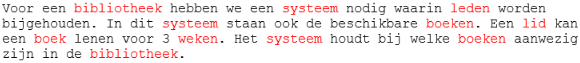

## Het idee

Er is een systeem nodig voor een bibliotheek waarin de leden worden bijgehouden. Ook de beschikbare boeken staan in het systeem. Een lid kan een boek lenen voor 3 weken. Het systeem houdt bij welke boeken aanwezig zijn in de bibliotheek.

## Eerste opzet klassendiagram

1. Beschrijf de applicatie. Probeer min of meer volledig te zijn zonder al te zeer op de details in te gaan
2. Markeer alle zelfstandige naamwoorden met een kleur
3. Markeer alle werkwoorden met een andere kleur
4. De zelfstandige naamwoorden zijn kandidaten om in de applicatie classes te worden
5. De werkwoorden zijn kandidaat methoden

### Voorbeeld tekst


De rode woorden zijn zelfstandige naamwoorden.<br/>
De groene woorden zijn de werkwoorden.


### Idee

De zelfstandige namen voor het idee zijn als volgt.



- Systeem 
- Bibliotheek
- Lid
- Boek
- Leenperiode (=weken)

Systeem is het alles overkoepelende, dat is juist wat je gaat beschrijven, dus deze gebruiken we niet in de klassendiagram UML.

## UML: klassendiagram

Wanneer klassen iets met elkaar te maken hebben dan zet je een verbinding ertussen.

- Een bibliotheek heeft een X aantal exemplaren (aggregatie - open diamant)
- Een bibliotheek heeft een X aantal leden (aggregatie - open diamant)
- Examplaar heeft een relatie met een boek (associatie - lijn)
    - een boek kan meerdere exemplaren hebben
    - ieder exemplaar gaat over 1 boek
- Lid kan een exemplaar lenen (associatie - lijn)
- Leenperiode: het exemplaar is geleend voor een periode door een lid. Leenperiode is een soort koppeling tussen exemplaar en lid (associatie - lijn)


## Database: postgresql

We gaan een nieuwe database maken in pgAdmin genaamd bieb. 

Ga naar schemas > tables en rechts klik om een nieuwe tabel `books` te maken.


In de tab `columns` gaan we de kolommen zetten en slaan we hem op.


We hebben nu een tabel waar we records in kunnen zetten.


## Hibernate

Hoe verbind je van je Java Applicatie naar je Database? Springboot biedt een koppeling tussen de database en Java.

In Java heb je het over klasses, objecten etc. In een database hebben we het over tabellen. Een verbinding tussen een klasse en een tabel is niet altijd even 1 op 1. In een klasse kun je bijvoorbeeld werken met lijsten, met een reeks, in een database kan dit niet. In een database werk je altijd met een primary key en foreign keys en dit hoef je niet altijd in je klasses te doen.

Aan de Java kant heb je ORM: Object Relational Mapping. Een ORM heb je nodig om de verbinding te maken.


In Springboot heet de ORM Hibernate. Hibernate is de populairste Object Relational Mapping (ORM) voor Java. 

## Springboot

We gaan de klasses van het klassendiagram in Springboot maken.

We beginnen met een Spring Initializr https://start.spring.io/ project.


Open het bestand in IntelliJ.


De `pom.xml` (maven dependency manager) specificeert welke pakketten je nodig hebt.


We moeten nu specificeren hoe `@SpringBootApplication` bij Postgresql kan. De wachtwoorden moeten worden ingesteld, dat doen we in de `application.properties` van IntelliJ. De volgende code zet je in dit bestand.

    # datasource PostgreSQL
    spring.jpa.database=postgresql
    spring.datasource.platform=postgres
    spring.datasource.url=jdbc:postgresql://localhost:5432/springboot
    spring.datasource.username=springboot
    spring.datasource.password=springboot
    spring.datasource.driver-class-name=org.postgresql.Driver
    spring.jpa.generate-ddl=true
    spring.jpa.properties.hibernate.jdbc.lob.non_contextual_creation=true
    spring.jpa.properties.hibernate.dialect= org.hibernate.dialect.PostgreSQLDialect
    
    spring.jpa.show-sql = true
    
    spring.jpa.hibernate.ddl-auto=create
    spring.datasource.initialization-mode=always

We gaan de entities maken die we in ons klassendiagram hebben gezet. We maken een nieuwe package genaamd `model` en een nieuwe klasse genaamd `Book.java` in Java.


In `Book.java` maken we de attributen en de getters en setters.

```java
package com.danielle.library.model;

public class Book {
    private String title;
    private String writer;
    private String isbn;
    private String publisher;

    public String getTitle() {
        return title;
    }

    public void setTitle(String title) {
        this.title = title;
    }

    public String getWriter() {
        return writer;
    }

    public void setWriter(String writer) {
        this.writer = writer;
    }

    public String getIsbn() {
        return isbn;
    }

    public void setIsbn(String isbn) {
        this.isbn = isbn;
    }

    public String getPublisher() {
        return publisher;
    }

    public void setPublisher(String publisher) {
        this.publisher = publisher;
    }
}
```

Dit is wat ze noemen een POJO: Plain Old Java Object -> simpele klasse met alleen attributen en getters en setters. Hibernate maakt gebruik van de POJO.

Om dit te integreren met Spring Boot gaan we met annotaties werken: `@Entity`.

```java
import javax.persistence.Entity;

@Entity
public class Book {
}
```

Vervolgens kunnen we van de attributen gaan zeggen, dit is een column: `@Column`.

```java
import javax.persistence.Column;
import javax.persistence.Entity;

@Entity
public class Book {

  @Column
  private String title;
  @Column
  private String writer;
  @Column
  private String isbn;
  @Column
  private String publisher;
}
```

Als laatste maken we een primary key.

```java
package com.danielle.library.model;

import javax.persistence.*;

@Entity
public class Book {
    @Id
    @GeneratedValue(strategy = GenerationType.IDENTITY)
    private long id;

    @Column
    private String title;
    @Column
    private String writer;
    @Column
    private String isbn;
    @Column
    private String publisher;

    public String getTitle() {
        return title;
    }

    public void setTitle(String title) {
        this.title = title;
    }

    public String getWriter() {
        return writer;
    }

    public void setWriter(String writer) {
        this.writer = writer;
    }

    public String getIsbn() {
        return isbn;
    }

    public void setIsbn(String isbn) {
        this.isbn = isbn;
    }

    public String getPublisher() {
        return publisher;
    }

    public void setPublisher(String publisher) {
        this.publisher = publisher;
    }
}
```

Wanneer je de `LibraryApplication` gaat runnen is het gelukt wanneer je de melding `Started LibraryApplication` krijgt.

Als je nu naar de database gaat in pgAdmin en je kijkt naar de schema's en dan tables zie je dat er ineens een `book` staan en de 5 columns die je hebt gemaakt.


Wanneer de connectie met postgresSQL niet werkt kun je ook H2 gebruiken. Het volgende zet je in `application.properties`.

    # datasource H2
    spring.datasource.driverClassName=org.h2.Driver
    spring.datasource.username=sa
    spring.datasource.password=password
    spring.datasource.url=jdbc:h2:mem:testdb
    #spring.datasource.url=jdbc:h2:file:./data/testdb
    spring.datasource.hikari.connectionTimeout=20000
    spring.datasource.hikari.maximumPoolSize=5
    spring.h2.console.enabled=true
    spring.h2.console.path=/h2console/
    spring.jpa.database-platform=org.hibernate.dialect.H2Dialect
    spring.jpa.hibernate.ddl-auto=create

In de `pom.xml` zet je onder de dependency van `postgresql` de code van `h2`.

    <dependency>
       <groupId>com.h2database</groupId>
       <artifactId>h2</artifactId>
       <scope>runtime</scope>
    </dependency>

Er verschijnt een `Load Maven Changes` icoon in beeld. Deze moet je aanklikken en dan gaat IntelliJ indexen, zodat het systeem h2 erbij heeft gezet.

Wanneer je de database h2.Driver gebruikt, die is in-memory, dat betekend dat je het verder niet kan zien. Dit is een path die heet h2console en wanneer je naar een browser gaat en tikt in localhost:8080/h2console dan krijg je een soort database, je klikt op `connect` dan zie je je class `book` en de 5 columns staan.

Wanneer de database werkt, gaan we `Book.java` vullen met een aantal zaken zodat we kunnen zien dat er data in de tabel komt. Dit doe je door in de `resources` een nieuw textfile te maken en die noemen we `data.sql`. Dit is een `sql` bestand waarmee we records kunnen toevoegen aan `Book.java`.

--- werkt niet