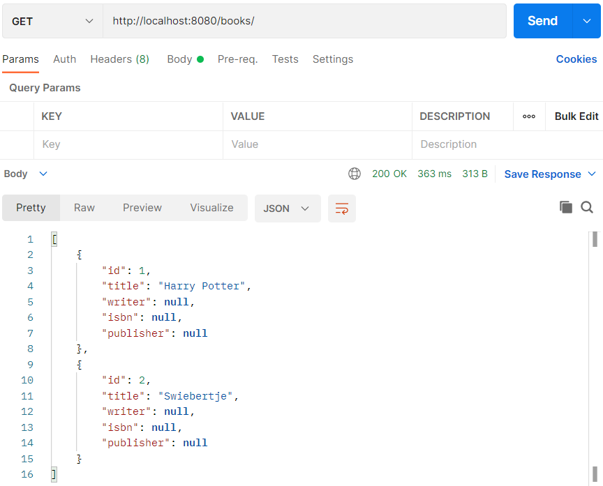
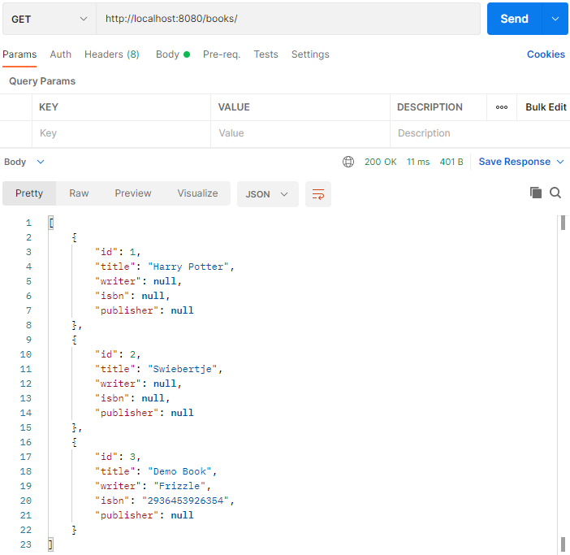
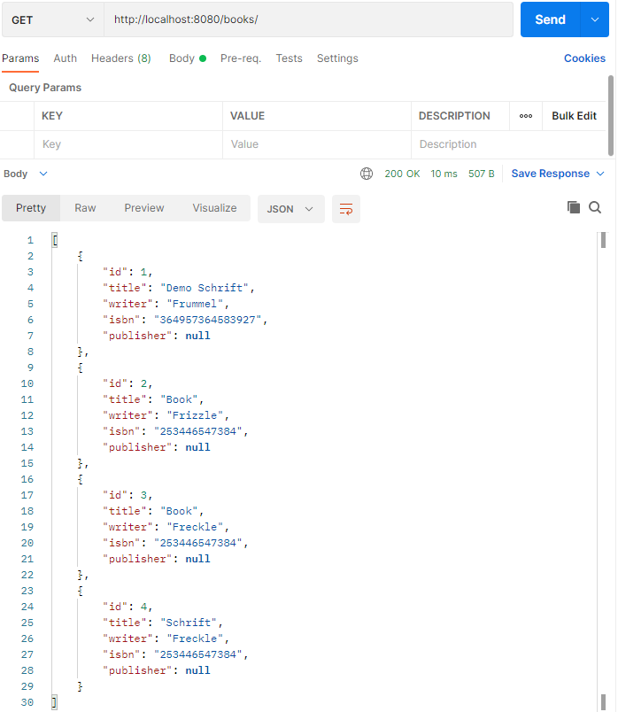

## Stap 1: Het idee

Beschrijf de applicatie. Probeer min of meer volledig te zijn zonder al te zeer op de details in te gaan.

    Voor een bibliotheek hebben we een systeem nodig waarin leden worden bijgehouden. 
    In dit systeem staan ook de beschikbare boeken. 
    Een lid kan een boek lenen voor 3 weken. 
    Het systeem houdt bij welke boeken aanwezig zijn in de bibliotheek.

## Stap 2: Ontwerp UML

### Stap 2a: eerste opzet

1. Markeer alle `zelfstandige naamwoorden` met een kleur
2. Markeer alle `werkwoorden` met een andere kleur
3. De zelfstandige naamwoorden zijn kandidaten om in de applicatie `classes` te worden
4. De werkwoorden zijn kandidaat `methoden`

#### Voorbeeld


De rode woorden zijn zelfstandige naamwoorden, de groene woorden zijn de werkwoorden.


#### Bibliotheek

De zelfstandige naamwoorden voor het idee zijn als volgt.


- Systeem
- Bibliotheek
- Lid
- Boek
- Leenperiode (=weken)

Systeem is het alles overkoepelende, dat is wat je gaat beschrijven, dus deze gebruiken we niet in het klassendiagram.

### Stap 2b: klassendiagram

Je kunt een klassendiagram met <a href="https://www.diagrams.net/" target="_blank">diagrams.net</a> maken.


Wanneer klassen iets met elkaar te maken hebben dan zet je er een verbinding tussen (een lijn).

- Een bibliotheek heeft een X aantal exemplaren (aggregatie - open diamant)
- Een bibliotheek heeft een X aantal leden (aggregatie - open diamant)
- Exemplaar heeft een relatie met een boek (associatie - lijn)
    - een boek kan meerdere exemplaren hebben (1..*)
    - ieder exemplaar gaat over 1 boek (1)
- Leenperiode: het exemplaar is geleend voor een periode door een lid. Leenperiode is een koppeling tussen
  exemplaar en lid (associatie - lijn)

## Stap 3: database en Spring Boot

### pgAdmin

De database die we gebruiken is pgAdmin. Hierin maken we een nieuwe database aan via Servers > PostgreSQL > Databases > rechts klikken > Create > Database en noemen hem `test_bibliotheek`.

Ga binnen de database `test_bibliotheek` naar Schemas > Tables > rechts klikken > Create > Table en maak een nieuwe tabel `books`.


In de tab `columns` gaan we de kolommen erin zetten en slaan we hem op.


We hebben nu een tabel waar we records in kunnen zetten.


### Hibernate

In Java heb je het over classes, objecten etc. In een database hebben we het over tabellen. Een verbinding tussen een
klasse en een tabel is niet altijd 1 op 1. In een klasse kun je bijvoorbeeld werken met lijsten, met een reeks, in een
database kan dit niet. In een database werk je altijd met een primary key en foreign keys en dit hoef je niet altijd in je classes te doen.

Spring Boot biedt een koppeling tussen de database en Java. Aan de Java kant heb je ORM: Object Relational Mapping. Een ORM heb je nodig om de koppeling/verbinding te maken.


In Spring Boot heet de ORM `Hibernate`. Hibernate is de populairste Object Relational Mapping (ORM) voor Java.

### Springboot

We gaan de classes van het klassendiagram uit stap 2b in Springboot maken.

#### Spring Initializr

We beginnen met een <a href="https://start.spring.io/" target="_blank">Spring Initializr</a> project.


Open het bestand in IntelliJ en load de Maven script (melding krijg je rechts onderin).


#### Bestand pom.xml

De `pom.xml` (maven dependency manager) specificeert welke pakketten je nodig hebt. De onderstaande heb je
geïnstalleerd.


Wanneer je in `pom.xml` een foutmelding krijgt bij de `version` van `parent`, zet je `<version>2.4.3</version>` erin.

#### Bestand application.properties

`@SpringBootApplication` moet gaan communiceren met postgreSQL. Om dit voorelkaar te krijgen moet je in het project van IntelliJ naar `resources` gaan en dan `application.properties`. De gegevens van postgreSQL worden aan de hand van de code die je daar inzet gekoppeld met de database. 

    # datasource PostgreSQL
    spring.jpa.database=postgresql
    spring.datasource.platform=postgres
    spring.datasource.url=jdbc:postgresql://localhost:5432/springboot
    spring.datasource.username=springboot
    spring.datasource.password=springboot
    spring.datasource.driver-class-name=org.postgresql.Driver
    spring.jpa.generate-ddl=true
    spring.jpa.properties.hibernate.jdbc.lob.non_contextual_creation=true
    spring.jpa.properties.hibernate.dialect= org.hibernate.dialect.PostgreSQLDialect
    
    spring.jpa.show-sql = true
    
    spring.jpa.hibernate.ddl-auto=create
    spring.datasource.initialization-mode=always

- `url` is de database naam in pgAdmin
- `username` is jouw username in pgAdmin 
- `password` is jouw wachtwoord in pgAdmin

#### Bestand model

We gaan de entities maken die we in ons klassendiagram hebben gezet. We maken een nieuwe package genaamd `model` en een
nieuwe klasse genaamd `Book.java` in IntelliJ.


In `Book.java` maken we de attributen en de getters en setters.

```java
package com.danielle.library.model;

public class Book {
    private String title;
    private String writer;
    private String isbn;
    private String publisher;

    public String getTitle() {
        return title;
    }

    public void setTitle(String title) {
        this.title = title;
    }

    public String getWriter() {
        return writer;
    }

    public void setWriter(String writer) {
        this.writer = writer;
    }

    public String getIsbn() {
        return isbn;
    }

    public void setIsbn(String isbn) {
        this.isbn = isbn;
    }

    public String getPublisher() {
        return publisher;
    }

    public void setPublisher(String publisher) {
        this.publisher = publisher;
    }
}
```

Dit is wat ze noemen een POJO: Plain Old Java Object. Een simpele klasse met alleen attributen en getters en setters. Hibernate maakt gebruik van de POJO.

Om dit te integreren met Spring Boot gaan we met annotaties werken: `@Entity`.

```java
import javax.persistence.Entity;

@Entity
public class Book {
}
```

Daarnaast geven we de attributen een annotatie `@Column`.

```java
import javax.persistence.Column;
import javax.persistence.Entity;

@Entity
public class Book {

    @Column
    private String title;
    @Column
    private String writer;
    @Column
    private String isbn;
    @Column
    private String publisher;
}
```

Als laatste maken we een primary key.

```java
package com.danielle.library.model;

import javax.persistence.*;

@Entity
public class Book {
    @Id
    @GeneratedValue(strategy = GenerationType.IDENTITY)
    private long id;

    @Column
    private String title;
    @Column
    private String writer;
    @Column
    private String isbn;
    @Column
    private String publisher;

    public long getId() {
        return id;
    }

    public void setId(long id) {
        this.id = id;
    }

    public String getTitle() {
        return title;
    }

    public void setTitle(String title) {
        this.title = title;
    }

    public String getWriter() {
        return writer;
    }

    public void setWriter(String writer) {
        this.writer = writer;
    }

    public String getIsbn() {
        return isbn;
    }

    public void setIsbn(String isbn) {
        this.isbn = isbn;
    }

    public String getPublisher() {
        return publisher;
    }

    public void setPublisher(String publisher) {
        this.publisher = publisher;
    }
}
```

We gaan de applicatie `LibraryApplication` runnen. Wanneer het is gelukt krijg je de melding `Started LibraryApplication` in de terminal van IntelliJ..

Ga naar de database in pgAdmin. In Schemas > Tables zie je dat er een `book` tables staat en er zijn 5 columns gemaakt.


#### Database H2

Wanneer de connectie met postgresSQL niet werkt kun je H2 gebruiken. Het volgende zet je in `application.properties`.

    # datasource H2
    spring.datasource.driverClassName=org.h2.Driver
    spring.datasource.username=sa
    spring.datasource.password=password
    spring.datasource.url=jdbc:h2:mem:testdb
    #spring.datasource.url=jdbc:h2:file:./data/testdb
    spring.datasource.hikari.connectionTimeout=20000
    spring.datasource.hikari.maximumPoolSize=5
    spring.h2.console.enabled=true
    spring.h2.console.path=/h2console/
    spring.jpa.database-platform=org.hibernate.dialect.H2Dialect
    spring.jpa.hibernate.ddl-auto=create

In de `pom.xml` zet je onder de dependency van `postgresql` de code van `h2`.

    <dependency>
       <groupId>com.h2database</groupId>
       <artifactId>h2</artifactId>
       <scope>runtime</scope>
    </dependency>

Er verschijnt een `Load Maven Changes` icoon in beeld. Deze klik je aan, zodat IntelliJ kan indexen. 

Run de applicatie.

De database H2 is in-memory. Je gaat naar de broswer en zoekt naar `localhost:8080/h2console`. Vervolgens krijg je in de browser een soort database te zien. Klik op `connect` en dan zie je de class `book` en de 5 columns staan.


#### Bestand data.sql

Wanneer de database werkt, gaan we `Book` vullen met een aantal zaken zodat we kunnen zien dat er data in de tabel
komt. Dit doe je door in de `resources` een nieuw file te maken en die noemen we `data.sql`. Dit is een `sql`
bestand waarmee we records kunnen toevoegen aan `Book`.

In dit bestand zet je de volgende code voor H2.

    insert into book (title) values 'Harry Potter';
    insert into book (title) values 'Swiebertje';

Voor postgreSQL geldt het volgende.

    insert into book (title) values ('Harry Potter');
    insert into book (title) values ('Swiebertje');

Wanneer je IntelliJ Ultimate heb krijg je het volgende te zien.


IntelliJ Ultimate heeft de mogelijkheid van Inspections. In de editor worden deze gebruikt om de code te onderzoeken en
suggesties te doen. Deze Inspections kunnen aan of uit worden gezet.

Bij het creëren van een .sql bestand zoals `data.sql` worden onder de volgende inspections geactiveerd:

- __SQL dialect detection__ Hiermee wordt de syntax van SQL gecontroleerd volgens een aangegeven SQL dialect
- __No data sources configured__ IntelliJ Ultimate biedt de mogelijkheid datasources te configureren. Leuk maar die optie gebruiken we niet in de Spring Boot projecten

Je kan de inspectie meldingen die in de gele balken verschijnen negeren, maar je kunt ze ook uitzetten. In de balk zie
je een instellingen icon (een radertje) met in de pulldown menu de optie `Disable inspection`.

Als je deze weer aan wilt zetten moet dat via het hoofdmenu > preferences > editor > inspections. Daar kun je de
betreffende inspections opzoeken in de lijst en het vinkje weer aanzetten.

Run de applicatie.

In postgreSQL krijg je de gegevens te zien die je in de `data.sql` heb gezet via book > View/Edit Data > All Rows.


### Repository

We gaan een controller maken in het project van IntelliJ. We maken eerste aan package genaamd `controller` en een bestand genaamd `BookController.java`.


Op hetzelfde niveau als controller maak je een nieuwe package `repository`
en daarin een interface bestand genaamd `BookRepository`. Via `bookRepository` gaan we naar de database.


De communicatie met de database gebeurd via een repository, dus BookRepository communiceert straks met de database. Het is een interface die op basis van een bestaande JpaRepository toegang heeft naar `book` op basis van de id wat `Long` is. Hij vertaald Java in SQL.

_BookRepository.java_

```java
package com.danielle.bibliotheek.repository;

import com.danielle.bibliotheek.model.Book;
import org.springframework.data.jpa.repository.JpaRepository;

public interface BookRepository extends JpaRepository<Book, Long> {
}
```

_BookController.java_

```java
package com.danielle.bibliotheek.controller;

import com.danielle.bibliotheek.model.Book;
import com.danielle.bibliotheek.repository.BookRepository;
import org.springframework.beans.factory.annotation.Autowired;
import org.springframework.http.HttpStatus;
import org.springframework.http.ResponseEntity;
import org.springframework.web.bind.annotation.GetMapping;
import org.springframework.web.bind.annotation.RestController;

import java.util.List;

@RestController
public class BookController {
    @Autowired
    private BookRepository bookRepository;

    @GetMapping(value = "/books")
    public ResponseEntity<Object> getBooks() {
        List<Book> books = bookRepository.findAll();
        return new ResponseEntity<>(books, HttpStatus.OK);
    }
}
```

We hebben een `@GetMapping` naar `/books` met een methode `getBooks`, die levert een `ResponseEntity` op en deze bestaat
uit `books` en books is een `List` naar type `Book`. Om deze boven water te krijgen doen we een bookRepository en `findAll();`. De bookRepository hebben we met `@Autowired` gedaan.

Run de applicatie.

Ga naar Postman en doe een `GET` naar `http://localhost:8080/books`. Je krijgt de data te zien uit `data.sql` in de body.



In de terminal van IntelliJ zie je allerlei opdrachten en daartussen staat `hibernate`. Je ziet `select .... from book` staan en dit
is de sql statement die hibernate heeft gegenereerd op basis van wat hij weet van de entity. Doordat wij
de `BookRepository.java` hebben toegevoegd (die eigenlijk niks doet) weet hij dat hij Book kan ophalen met een
Long id: `JpaRepository<Book, Long>` en wanneer je deze repository gaat gebruiken je een `findAll()` kan doen die
in `BookController` staat.


### Endpoint: /id

We gaan op basis van `/books` een `{id}` ophalen.

_BookController.java_

```java
package com.danielle.bibliotheek.controller;

import com.danielle.bibliotheek.model.Book;
import com.danielle.bibliotheek.repository.BookRepository;
import org.springframework.beans.factory.annotation.Autowired;
import org.springframework.http.HttpStatus;
import org.springframework.http.ResponseEntity;
import org.springframework.web.bind.annotation.GetMapping;
import org.springframework.web.bind.annotation.PathVariable;
import org.springframework.web.bind.annotation.RestController;

import java.util.List;
import java.util.Optional;

@RestController
public class BookController {
    @Autowired
    private BookRepository bookRepository;

    @GetMapping(value = "/books")
    public ResponseEntity<Object> getBooks() {
        List<Book> books = bookRepository.findAll();
        return new ResponseEntity<>(books, HttpStatus.OK);
    }

    @GetMapping(value = "/books/{id}")
    public ResponseEntity<Object> getBook(@PathVariable("id") long id) {
        return new ResponseEntity<>(bookRepository.findById(id), HttpStatus.OK);
    }
}
```

We hebben een `@GetMapping` voor een specifiek `{id}`. Deze gaat naar de bookRepository en die doet niet `findAll()`
maar `findfById(id)`.

Run de applicatie.

Wanneer je in Postman `http://localhost:8080/books/2` en `GET` doe dan krijg je het boek "Swiebertje" in de body.


### Toevoegen boeken

Met `@PostMapping` voegen we boeken toe.

_BookController.java_

```java
package com.danielle.bibliotheek.controller;

import com.danielle.bibliotheek.model.Book;
import com.danielle.bibliotheek.repository.BookRepository;
import org.springframework.beans.factory.annotation.Autowired;
import org.springframework.http.HttpStatus;
import org.springframework.http.ResponseEntity;
import org.springframework.web.bind.annotation.*;

import java.util.List;
import java.util.Optional;

@RestController
public class BookController {
    @Autowired
    private BookRepository bookRepository;

    @GetMapping(value = "/books")
    public ResponseEntity<Object> getBooks() {
        List<Book> books = bookRepository.findAll();
        return new ResponseEntity<>(books, HttpStatus.OK);
    }

    @GetMapping(value = "/books/{id}")
    public ResponseEntity<Object> getBook(@PathVariable("id") long id) {
        return new ResponseEntity<>(bookRepository.findById(id), HttpStatus.OK);
    }

    @PostMapping(value = "/books")
    public ResponseEntity<Object> createBook(@RequestBody Book book) {
        bookRepository.save(book);
        return new ResponseEntity<>("Book created", HttpStatus.CREATED);
    }
}
```

In de `@Postmapping` code is de `bookRepository` de poort en `.save` is het book die we krijgen: `bookRepository.save(book);`.

Run de applicatie.

In Postman gebruik je `POST` en de url `http://localhost:8080/books/` om boeken toe te voegen.


Het toevoegen van boeken doe je in de `body` en dan druk je op `send` om hem toe te voegen. Je krijgt een melding `Book created`.


Wanneer je `GET` selecteer en de url `http://localhost:8080/books/`, krijg je het boek dat je hebt toegevoegd in de
body.



Wanneer je in postgreSQL kijkt, dan staat het boek toegevoegd in de database: Schemas > Tables > book > rechts klikken >
View/Edit Data > All Rows


### Delete boeken

Het verwijderen van boeken doen we met `@DeleteMapping`.

```java
package com.danielle.bibliotheek.controller;

import com.danielle.bibliotheek.model.Book;
import com.danielle.bibliotheek.repository.BookRepository;
import org.springframework.beans.factory.annotation.Autowired;
import org.springframework.http.HttpStatus;
import org.springframework.http.ResponseEntity;
import org.springframework.web.bind.annotation.*;

import java.util.List;
import java.util.Optional;

@RestController
public class BookController {
    @Autowired
    private BookRepository bookRepository;

    @GetMapping(value = "/books")
    public ResponseEntity<Object> getBooks() {
        List<Book> books = bookRepository.findAll();
        return new ResponseEntity<>(books, HttpStatus.OK);
    }

    @GetMapping(value = "/books/{id}")
    public ResponseEntity<Object> getBook(@PathVariable("id") long id) {
        return new ResponseEntity<>(bookRepository.findById(id), HttpStatus.OK);
    }

    @PostMapping(value = "/books")
    public ResponseEntity<Object> createBook(@RequestBody Book book) {
        bookRepository.save(book);
        return new ResponseEntity<>("Book created", HttpStatus.CREATED);
    }

    @DeleteMapping(value = "/books/{id}")
    public ResponseEntity<Object> deleteBook(@PathVariable("id") long id) {
        bookRepository.deleteById(id);
        return new ResponseEntity<>("Book deleted", HttpStatus.OK);
    }
}
```

Run de applicatie.

We voegen data toe aan `POST` en url `http://localhost:8080/books/`.

```json
[
  {
    "title": "Demo Schrift",
    "writer": "Frummel",
    "isbn": "364957364583927",
    "publisher": null
  },
  {
    "title": "Demo Tijdschrift",
    "writer": "Freckle",
    "isbn": "92516374635404",
    "publisher": null
  },
  {
    "title": "Demo Book",
    "writer": "Frizzle",
    "isbn": "253446547384",
    "publisher": null
  }
]
```

Je hebt de volgende boeken in Postman staan.


Deze staan ook in postgreSQL.


Het deleten van een book doe je in Postman met `DELETE` en url `http://localhost:8080/books/2`.


Wanneer je alle boeken ophaalt in Postman met `GET` en `http://localhost:8080/books/` krijg je het volgende.


In postgreSQL is dit boek ook verdwenen.


### Verschillende soorten repository's

Je hebt verschillende soorten repository's. Alle drie doen ze verschillende dingen, waarbij de Jpa het meeste kan en het
zwaarste is.

- CrudRepository
- PagingAndSortingRepository
- JpaRepository

We gaan een `repository method` gebruiken waarbij we willen gaan zoeken naar een titel. We gebruiken `findAllByTitle` en geven `String` en `title` mee in de argumenten.

_BookRepository.java_

```java
package com.danielle.bibliotheek.repository;

import com.danielle.bibliotheek.model.Book;
import org.springframework.data.jpa.repository.JpaRepository;

import java.util.List;

public interface BookRepository extends JpaRepository<Book, Long> {

    List<Book> findAllByTitle(String title);
}
```

In de `BookController.java` gaan we dit toevoegen door een nieuwe `@GetMapping` en gebruiken `findAllByTitle`.

```java
package com.danielle.bibliotheek.controller;

import com.danielle.bibliotheek.model.Book;
import com.danielle.bibliotheek.repository.BookRepository;
import org.springframework.beans.factory.annotation.Autowired;
import org.springframework.http.HttpStatus;
import org.springframework.http.ResponseEntity;
import org.springframework.web.bind.annotation.*;

import java.util.List;
import java.util.Optional;

@RestController
public class BookController {
    @Autowired
    private BookRepository bookRepository;

    @GetMapping(value = "/books")
    public ResponseEntity<Object> getBooks() {
        List<Book> books = bookRepository.findAll();
        return new ResponseEntity<>(books, HttpStatus.OK);
    }

    @GetMapping(value = "/books/title/{title}")
    public ResponseEntity<Object> getBooks(@PathVariable("title") String title) {
        List<Book> books = bookRepository.findAllByTitle(title);
        return new ResponseEntity<>(books, HttpStatus.OK);
    }

    @GetMapping(value = "/books/{id}")
    public ResponseEntity<Object> getBook(@PathVariable("id") long id) {
        return new ResponseEntity<>(bookRepository.findById(id), HttpStatus.OK);
    }

    @PostMapping(value = "/books")
    public ResponseEntity<Object> createBook(@RequestBody Book book) {
        bookRepository.save(book);
        return new ResponseEntity<>("Book created", HttpStatus.CREATED);
    }

    @DeleteMapping(value = "/books/{id}")
    public ResponseEntity<Object> deleteBook(@PathVariable("id") long id) {
        bookRepository.deleteById(id);
        return new ResponseEntity<>("Book deleted", HttpStatus.OK);
    }
}
```

Run de applicatie.

We hebben vier boeken in Postman gezet.



Wanneer je opzoek gaat naar de titel `Book` met url `http://localhost:8080/books/title/Book` krijg je het volgende.


We gaan een `repository method` maken waarbij je alleen de eerste letter van de titel gebruikt om te zoeken. Vervang in `BookRepository.java` en `BookController.java` `findAllByTitle` voor `findAllByTitleStartingWith`.

Run de applicatie.

In Postman ga je op zoek naar de boeken die beginnen met de letter B met url `http://localhost:8080/books/title/B`.


Naast deze twee zoekopdrachten kun je verschillende query's gebruiken. Zie onderstaand overzicht.


_Tip_: de gebruiker weet niet welke query's er worden ondersteund, dus kun je een informatie controller maken (als
soort van documentatie naar de gebruiker toe). Kijk ook naar HATEOS, wanneer je iets heb opgevraagd, laat hij zien hoe je verder kan.

### Service

De Client praat via HTTPS met de Controller. De Controller praat met de Service en de Service praat via de Repository met de Database en kent Model.


In een Service zit de business intelligentie. De Service is op de hoogte van dingen die van belang
zijn om door te geven aan de BookRepository. De BookRepository houdt zich alleen bezig met de database. De
BookController houdt zich alleen bezig met de frontend, met de API. Hiertussen moet een Service zitten.

We voegen een nieuwe package toe genaamd `Service` met een nieuwe interface genaamd `BookService.java` en een klasse `BookServiceImpl.java`. Traditioneel wordt de Service gescheiden in een Interface en in een Implementatie.


In de Service ga je definiëren wat je allemaal met je boeken wilt gaat doen.

We kunnen bijvoorbeeld zeggen, we willen de volgende methodes `getAllBooks()`, `getBook()`, `getBooksTitleStartsWith()`
, `save()` en een `deleteById()`.

- De getAllBooks() geeft terug een lijst van een boek: `List<Book> getAllBooks();`
- De getBook() die geeft terug een boek: `Book getBook();`
- De getBooksTitleStartsWith() geeft een lijst van boeken terug: `List<Book> getBooksTitleStartsWith()`
- De save() is een void want die geeft niks terug: `void save();`
- De deleteById() is een void want geeft niks terug: `void deleteById()`

_BookService.java_

```java
package com.danielle.bibliotheek.service;

import com.danielle.bibliotheek.model.Book;
import java.util.List;

public interface BookService {

    public List<Book> getAllBooks();
    public Book getBook(long id);
    public List<Book> getBooksTitleStartsWith(String title);
    public void save(Book book);
    public void deleteById(long id);
}
```

De interface hoeft alleen maar te benoemen welke methodes je allemaal hebt. Deze methodes moet je implementeren
in `BookServiceImpl`.

De @Autowired van `BookController` zet je in `BookServiceImpl`. De service praat nu met de bookRepository.

```java
package com.danielle.bibliotheek.service;

import com.danielle.bibliotheek.model.Book;
import com.danielle.bibliotheek.repository.BookRepository;
import org.springframework.beans.factory.annotation.Autowired;
import org.springframework.stereotype.Service;

import java.util.List;

@Service
public class BookServiceImpl implements BookService {
    @Autowired
    private BookRepository bookRepository;

    @Override
    public List<Book> getAllBooks() {
        return bookRepository.findAll();
    }

    @Override
    public Book getBook(long id) {
        return bookRepository.findById(id).orElse(null);
    }

    @Override
    public List<Book> getBooksTitleStartsWith(String title) {
        return bookRepository.findAllByTitleStartingWith(title);
    }

    @Override
    public void save(Book book) {
        bookRepository.save(book);
    }

    @Override
    public void deleteById(long id) {
        bookRepository.deleteById(id);
    }
}
```

Wat je in de `BookController.java` moet gaan doen, is niet praten met `bookRepository` maar praten
met `bookService`.

_BookController.java_

```java
package com.danielle.bibliotheek.controller;

import com.danielle.bibliotheek.model.Book;
import com.danielle.bibliotheek.service.BookService;
import org.springframework.beans.factory.annotation.Autowired;
import org.springframework.http.HttpStatus;
import org.springframework.http.ResponseEntity;
import org.springframework.web.bind.annotation.*;

import java.util.List;

@RestController
public class BookController {
    @Autowired
    private BookService bookService;

    @GetMapping(value = "/books")
    public ResponseEntity<Object> getBooks() {
        List<Book> books = bookService.getAllBooks();
        return new ResponseEntity<>(books, HttpStatus.OK);
    }

    @GetMapping(value = "/books/title/{title}")
    public ResponseEntity<Object> getBooks(@PathVariable("title") String title) {
        List<Book> books = bookService.getBooksTitleStartsWith(title);
        return new ResponseEntity<>(books, HttpStatus.OK);
    }

    @GetMapping(value = "/books/{id}")
    public ResponseEntity<Object> getBook(@PathVariable("id") long id) {
        return new ResponseEntity<>(bookService.getBook(id), HttpStatus.OK);
    }

    @PostMapping(value = "/books")
    public ResponseEntity<Object> createBook(@RequestBody Book book) {
        bookService.save(book);
        return new ResponseEntity<>("Book created", HttpStatus.CREATED);
    }

    @DeleteMapping(value = "/books/{id}")
    public ResponseEntity<Object> deleteBook(@PathVariable("id") long id) {
        bookService.deleteById(id);
        return new ResponseEntity<>("Book deleted", HttpStatus.OK);
    }
}
```

We hebben nu de bookService ertussen gezet.

In Postman en in postgreSQL kun je hetzelfde doen als hiervoor, alleen staat de servicelaag ertussen. De
servicelaag maakt het makkelijker om intelligenter dingen te doen in Service.

BookController moet niet meer zijn dan wat het nu is: die vangt de request, die doet iets naar de Service en die
geeft een response met ResponseEntity. That's it.

De BookService praat met de BookRepository.

De BookRepository is niks anders dan alleen maar de query bouwen naar de database.

### Exception

Wanneer je `http://localhost:8080/books/9` opvraagt in Postman, dan krijg je geen antwoord, want deze bestaat niet. De statuscode
staat echter op `200 OK`, maar dit klopt niet, dit moet status code `404 NOT FOUND` zijn.

We gaan dit afvangen in `BookServiceImpl`. We gaan checken of nummer 9 bestaat. Dit kun je controleren met een
if-statement die checked of de `id` die je opvraagt er wel is.

```java
package com.danielle.bibliotheek.service;

import com.danielle.bibliotheek.exception.RecordNotFoundException;
import com.danielle.bibliotheek.model.Book;
import com.danielle.bibliotheek.repository.BookRepository;
import org.springframework.beans.factory.annotation.Autowired;
import org.springframework.stereotype.Service;

import java.util.List;

@Service
public class BookServiceImpl implements BookService {
    @Autowired
    private BookRepository bookRepository;

    @Override
    public List<Book> getAllBooks() {
        return bookRepository.findAll();
    }

    @Override
    public Book getBook(long id) {
        if (bookRepository.existsById(id)) {
            return bookRepository.findById(id).get();
        } else {
            throw new RecordNotFoundException("No book with id " + id);
        }
    }

    @Override
    public List<Book> getBooksTitleStartsWith(String title) {
        return bookRepository.findAllByTitleStartingWith(title);
    }

    @Override
    public void save(Book book) {
        bookRepository.save(book);
    }

    @Override
    public void deleteById(long id) {
        if (bookRepository.existsById(id)) {
            bookRepository.deleteById(id);
        } else {
            throw new RecordNotFoundException("No book with id " + id);
        }
    }
}
```

We maken een nieuwe package `exception` en daarin maken we nieuwe files `RecordNotFoundException.java`
en `NotAuthorizedException.java`.

_RecordNotFoundException.java_

```java
package com.danielle.bibliotheek.exception;

public class RecordNotFoundException extends RuntimeException {
    public RecordNotFoundException() {
        super();
    }

    public RecordNotFoundException(String message) {
        super(message);
    }
}
```

_NotAuthorizedException.java_

```java
package com.danielle.bibliotheek.exception;

public class NotAuthorizedException extends RuntimeException {

    public NotAuthorizedException() {
        super();
    }

    public NotAuthorizedException(String message) {
        super(message);
    }
}
```

In de package controller maken we een file `ExceptionController.java`.

```java
package com.danielle.bibliotheek.controller;

import com.danielle.bibliotheek.exception.NotAuthorizedException;
import com.danielle.bibliotheek.exception.RecordNotFoundException;
import org.springframework.http.HttpStatus;
import org.springframework.http.ResponseEntity;
import org.springframework.web.bind.annotation.ControllerAdvice;
import org.springframework.web.bind.annotation.ExceptionHandler;
import org.springframework.web.bind.annotation.RestController;

@RestController
@ControllerAdvice

public class ExceptionController {
    @ExceptionHandler(value = RecordNotFoundException.class)
    public ResponseEntity<Object> exception(RecordNotFoundException exception) {
        String message = exception.getMessage();
        return new ResponseEntity<>(message, HttpStatus.NOT_FOUND);
    }

    @ExceptionHandler(value = NotAuthorizedException.class)
    public ResponseEntity<Object> exception(NotAuthorizedException exception) {
        String message = exception.getMessage();
        return new ResponseEntity<>(message, HttpStatus.UNAUTHORIZED);
    }
}
```

Run de applicatie.

In Postman wanneer je naar boek 8 zoekt met `GET` en url `http://localhost:8080/books/8`, krijg je de
melding `No book with id 8`.


### Associatie

Book is gedaan en we gaan verder met exemplaar. In de map `model` maak je een nieuwe file aan `Copy.java`.

```java
package com.danielle.bibliotheek.model;

import javax.persistence.*;

@Entity
public class Copy {
    @Id
    @GeneratedValue(strategy = GenerationType.IDENTITY)
    private long id;

    @Column
    private String nr;
    @Column
    private String status;

    public long getId() {
        return id;
    }

    public void setId(long id) {
        this.id = id;
    }

    public String getNr() {
        return nr;
    }

    public void setNr(String nr) {
        this.nr = nr;
    }

    public String getStatus() {
        return status;
    }

    public void setStatus(String status) {
        this.status = status;
    }
}
```

We willen de associatie tussen Boek en Exemplaar zoals beschreven in het klassendiagram: één boek heeft meerdere
exemplaren. Dit is een one-to-many relatie.

Meestal zal het voorkomen dat in `exemplaar` een `foreign key` staat die verwijst naar `book_id`.

Deze foreign key moet je in Spring Boot zetten. We werken niet met id's, maar met `Book book; ` en we geven hem de
annotatie `@ManyToOne`.

_Copy.java_

```java
package com.danielle.bibliotheek.model;

import javax.persistence.*;

@Entity
public class Copy {
    @Id
    @GeneratedValue(strategy = GenerationType.IDENTITY)
    private long id;

    @Column
    private String nr;
    @Column
    private String status;

    @ManyToOne
    Book book;

    public long getId() {
        return id;
    }

    public void setId(long id) {
        this.id = id;
    }

    public String getNr() {
        return nr;
    }

    public void setNr(String nr) {
        this.nr = nr;
    }

    public String getStatus() {
        return status;
    }

    public void setStatus(String status) {
        this.status = status;
    }
}
```

In `Book.java` kun je afvragen: weet `Book` welke exemplaren er allemaal zijn. Dit kun je doen door de 
annotatie `@OneToMany`. We hebben het dan niet over één exemplaar, maar we hebben het over een `List`.

```java
package com.danielle.bibliotheek.model;

import javax.persistence.*;
import java.util.List;

@Entity
public class Book {
    @Id
    @GeneratedValue(strategy = GenerationType.IDENTITY)
    private long id;

    @Column
    private String title;
    @Column
    private String writer;
    @Column
    private String isbn;
    @Column
    private String publisher;

    @OneToMany
    List<Copy> copies;

    public long getId() {
        return id;
    }

    public void setId(long id) {
        this.id = id;
    }

    public String getTitle() {
        return title;
    }

    public void setTitle(String title) {
        this.title = title;
    }

    public String getWriter() {
        return writer;
    }

    public void setWriter(String writer) {
        this.writer = writer;
    }

    public String getIsbn() {
        return isbn;
    }

    public void setIsbn(String isbn) {
        this.isbn = isbn;
    }

    public String getPublisher() {
        return publisher;
    }

    public void setPublisher(String publisher) {
        this.publisher = publisher;
    }
}
```

We hebben `Book.java` en `Copy.java` aan elkaar gekoppeld.

Run de applicatie.

In postgreSQL zie je dat tabel `copy` erin staat, maar hij heeft ook zelf een associatie tabel gemaakt
genaamd `book_copies`.


Je hebt verschillende annotaties voor koppelingen tussen klassen.

- `@OneToOne`
- `@OneToMany`
- `@ManyToOne`
- `@ManyToMany`

### Configureren

De `class Book` wordt bijgehouden in een tabel die heeft `books` in de database.

```java

@Entity
@Table(name = "books")
public class Book {
}
```

Een column kun je ook configureren: hoe iets in de database gaat heten.

```java

@Entity
@Table(name = "books")
public class Book {
    @Id
    @GeneratedValue(strategy = GenerationType.IDENTITY)
    private long id;

    @Column(name = "the_title")
    private String title;
    @Column(name = "the_writer")
    private String writer;
    @Column(name = "the_isbn")
    private String isbn;
    @Column(name = "the_publisher")
    private String publisher;
}
```

Naast dat je een column een naam kan geven, kun hem ook definiëren met een bepaalde lengte en eventueel of hij wel of
niet nul mag zijn.

```java

@Entity
@Table(name = "books")
public class Book {
    @Id
    @GeneratedValue(strategy = GenerationType.IDENTITY)
    private long id;

    @Column(name = "the_title", length = 255, nullable = false)
    private String title;
    @Column(name = "the_writer", length = 255, nullable = false)
    private String writer;
    @Column(name = "the_isbn", length = 255, nullable = true)
    private String isbn;
    @Column(name = "the_publisher", length = 255, nullable = true)
    private String publisher;
}
```

### AutoWired

`@Autowired` wordt gebruikt in de Controller naar de Service te wijzen en om in de Service naar de Repository te wijzen.

`@AutoWired` is een onderdeel van Spring Boot die ervoor zorgt dat er onder de motorkap koppelingen allemaal worden
gelegd. Je hoeft dus niet nieuwe instanties te maken van een repository en elke keer opnieuw te moeten initialiseren.
Hij weet door de AutoWired dat je dat nodig hebt en gebruikt een efficiënte manier om dit te doen.

In BookController.java` gebruiken we AutoWired.

    @Autowired
    private BookService bookService;

Dit zorgt ervoor dat hij meteen `bookService` heeft geïnitialiseerd, zodat je deze gelijk kan gaan gebruiken in de
bijvoorbeeld de @GetMapping.

Hetzelfde geldt voor `BookServiceImpl`.

    @Autowired
    private BookRepository bookRepository;

De `bookRepository` is ook helemaal klaar gemaakt om gelijk gebruikt te worden in de verschillende methodes.

## Herhaling

#### BookController.java

BookController is in staat om de endpoints te koppelen aan de methodes die erachter staan. In die methodes kun je dingen
gaan ophalen. Bijv. `getAllBooks` dat moet je ergens anders uit je applicatie halen. Het is de bedoeling dat dit uit een
database komt.

    @GetMapping(value = "/books")
    public ResponseEntity<Object> getBooks() {
      List<Book> books = bookService.getAllBooks();
      return new ResponseEntity<>(books, HttpStatus.OK);
    }

We willen voorkomen dat in de Controller andere dingen staan dan de dingen die alleen met de Controller te maken hebben.

Conclusie: de controller gaat alleen over het ophalen van een request en het teruggeven van een response. 

#### ExceptionController.java

Als er een fout/exception optreed dan komt hij er uit bij deze Controllers. Er wordt een ResponseEntity teruggegeven in
de vorm van een message + HttpStatus.

#### NotAuthorizedException.java + RecordNotFoundException.java

De exceptions zijn heel basaal gemaakt. Het gaat alleen maar over een Exception die een subklasse is van een standaard
java `RunTimeException`. De eigen gemaakte exceptions zijn `class NotAuthorizedException`
en `class RecordNotFoundException`.

Daarin zitten twee controllers. De ene controller zonder message en de ander met een String message, die de super klasse
aanspoort.

Het aardige is dat we twee eigen exceptions hebben gegenereerd die we kunnen gebruiken in de ExceptionController.

#### Map model

In de map model staan simpele classes (POJO). ook wel entity classes genoemd. Bijvoorbeeld `Book.java`. We noemen een `Book` en dit boek is een `@Entity.` Je kan
met `@Table(name = "")` aangeven in welke tabel hij terecht moet komen, doe je dit net dan neemt hij de naam van de
klasse `Book` (met lowercase).

De `class Book` gaat gemapped worden op je tabel in je database. Dan zie je dat je het kan hebben over `@Column`'s. Dit
zijn allemaal dingen die je kan toevoegen. Hij neemt gewoon het attribuut die er naast staat en zet het in een column
van je tabel in de database.

In de database heb je altijd een primary key nodig. Dat geef je aan met `@Id`. Het is daarnaast handig
om `@GeneratedValue` toe te voegen, zodat de primary key voor elke nieuwe record automatisch wordt opgehoogd.

Mapping is onderdeel van Hibernate. Mapping van klasse in jouw applicatie naar een tabel in je database.

#### annotaties column

In de map `model` heb je de POJO's `Book.java` en `Copy.java` staan en deze hebben naast een tabel annotatie ook column annotaties. De @column kun je een titel geven zodat deze wordt gebruikt in de database maar je kan hem meer eigenschappen geven. bijvoorbeeld.

```
@Column({ primary: true })
id: number;

@Column({ type: "varchar", length: 200, unique: true })
firstName: string;

@Column({ nullable: true })
lastName: string;

@Column({ default: false })
isActive: boolean;
```

#### application.properties

Wanneer je de applicatie `LibraryApplication` heb gestart, gaat hij automatisch werken met de application.properties.

We hebben gewerkt met twee soorten databases: `postgreSQL` en `H2`.

Je hebt een aantal instellingen in deze file staan en voor de postgreSQL moet je er een paar aanpassen: datasource url,
username en password. Deze moeten hetzelfde zijn als jouw database instellingen.

`datasource.initialization-mode` staat op always, dat betekent dat hij altijd je datasource gaat initialiseren.

`hibernate.ddl-auto` staat op create, dat betekent dat hibernate de tabellen gaat maken op basis van de modellen die je
hebt.

#### pom.xml

In pom.xml staan een aantal dependencies.
- spring-boot-starter-data-jpa
- spring-boot-starter-web
- postgresql of h2

```xml
<dependencies>
    <dependency>
        <groupId>org.springframework.boot</groupId>
        <artifactId>spring-boot-starter-data-jpa</artifactId>
    </dependency>
    <dependency>
        <groupId>org.springframework.boot</groupId>
        <artifactId>spring-boot-starter-web</artifactId>
    </dependency>

    <dependency>
        <groupId>org.postgresql</groupId>
        <artifactId>postgresql</artifactId>
        <scope>runtime</scope>
    </dependency>
    <dependency>
        <groupId>com.h2database</groupId>
        <artifactId>h2</artifactId>
        <scope>runtime</scope>
    </dependency>    
</dependencies>
```

#### data.sql

De data.sql is een conventie. Als je hem zo noemt dan herkent de database dit bestand. Wanneer de applicatie gerund wordt dan worden de gegevens (sql statements) in de database geladen.

#### postgreSQL

Wanneer je de applicatie `LibraryApplication` heb gestart in IntelliJ komen de gegevens in postgreSQL te staan. Hibernate zorgt ervoor dat de java taal omgezet wordt in sql.

#### Repository

De repository doet heel veel onder de motorkap. Doordat je zegt `extends JpaRepository`, maak je gebruik van de SpringBoot klasse JpaRepository. Dit is een interface, dus je hoeft alleen op te geven wat de naam en de argumenten zijn van de methodes (Book, Long). 

Op het moment dat Spring Boot wordt opgestart herkent hij dat het een repository (BookRepository) is op basis van een JpaRepository en hij weet ook dat het over de Entity Book gaat en dat de id een Long moet zijn.

De JpaRepository maakt zonder dat je er iets voor hoeft te doen methodes aan die je kunt gebruiken. Bijvoorbeeld methode `findAll()`.

Je hebt 3 soorten repositories (van licht naar zwaar):


Je hebt eigenlijk alleen de volgende code nodig.

```java
package com.danielle.library.model.repository;

import com.danielle.library.model.Book;
import org.springframework.data.jpa.repository.JpaRepository;

import java.util.List;

public interface BookRepository extends JpaRepository<Book, Long> {
}
```

Conclusie: de repository is de gateway tot de database.

Je kan verschillende query's in de repository zetten die je wilt hebben. Bijvoorbeeld, we willen een List van een book teruggeven `List<Book>` met een methode `findAllByTitle()`. In de methode komt een String en een title. De methode kun je in de controller, of in de service definieren.

```java
package com.danielle.library.repository;

import com.danielle.library.model.Book;
import org.springframework.data.jpa.repository.JpaRepository;

import java.util.List;

public interface BookRepository extends JpaRepository<Book, Long> {

    List<Book> findAllByTitle(String title);
}
```

De magic is dat op basis van de naam van de methode, dat hij weet hoe hij automatisch hoe hij een sql query moet bouwen. Hij doet het volgende: `SELECT * FROM book WHERE title = %title%`.
Op deze manier kun je in de repository allerlei query's bouwen.

Conlusie: in de repsoitory ben je bezig met hoe bevraag ik mijn database.

#### Service

Tussen de Controller en de Repository moet je een service hebben. Een Service is waar de intelligentie plaats vind. Daar mag je als developer gaan nadenken over velden die gevuld moeten worden, of over een combinatie van verschillende query's op de database die je wilt samenvoegen, voordat je dat weer teruggeeft aan de controller. Dus in plaats van dat je vanaf de Controller meteen naar de Repository gaat, moeten we vanuit de Controller naar de Service en vanuit de Service naar de Repository.

In de Service heb je een simpele mapping. Bijvoorbeeld als je tegen de Service zeg `getAllBooks()`, dan gaat hij naar de Repository `bookRepository` en doet hij de query `getAllBooks()` en dan krijg je ze allemaal met methode `findAll`. Heb je bijvoorbeeld methode `findByOrderByTitle` dan worden ze geordend op title.

    @Override
    public List<Book> getAllBooks() {
      return bookRepository.findAll();
    }

Een ander stuk Service is het volgende.

    @Override
    public Book getBook(long id) {
      if (bookRepository.existsById(id)) {
        return bookRepository.findById(id).get();
      }
      else {
        throw new RecordNotFoundException("No book with id " + id);
      }
    }

Hij kijkt of `long id` bestaat met de if-statement. Zowel `bookRepository.existsById(id)` dan geeft hij terug het boek wat hij gevonden heeft.

Deze intelligentie hoef je niet in de Controller te doen, de Controller zegt gewoon `getBook(long id)`. En Service zegt, okay dat wil ik wel doen, maar ik ga eerst checken of hij bestaat. Zoja dan krijg je hem terug. Zo nee dan genereert hij een `RecordNotFoundException`, met een eventuele melding dat het boek niet bestaat.

In Service kun je wat meer doen. Hetzelfde geldt voor `deleteById`.

    @Override
    public void deleteById(long id) {
      if (bookRepository.existsById(id)) {
        bookRepository.deleteById(id);
      }
      else {
        throw new RecordNotFoundException("No book with id " + id);
      }
    }

Je wilt de `id` hebben, hij gaat eerst kijken of deze bestaat, zoja dan gaat hij hem deleten en zo nee genereert hij een `RecordNotFoundException`.

Bij `save` zou je kunnen controleren of dat book wel een titel heeft of een isbn. En zo niet dan zou je kunnen teruggeven met een foutmelding incompleet record. Hier is ook specifiek de Service voor. Maar dit kun je ook al opgeven in het model (@Column (required=true)), dat deze gegevens ingevuld moeten zijn. Eigenlijk is op beide plekken deze controle inbouwen het beste.

De Service zou er zo uit kunnen zien. Hij slaat hem dan pas op wanneer de gegevens compleet zijn.

    @Override
    public void save(Book book) {
        if (book.getTitle() == null)
            throw new IncompleteRecordException("No book with title");
        bookRepository.save(book);
    }

In de Service ga je als het ware nadenken over zo'n boek en wat kun je ermee doen. 

De Service is de in between waarbij je de logica gaat loslaten op je Entities voordat je naar de Repository gaat. Dus het is echt de business logica.

##### BookServiceImpl

Je ziet dat we een `BookServiceImpl.java` hebben gemaakt. Daarnaast is het goed gebruik ook voor het testen om gebruik te maken van een interface. De interface `BookService.java` is niks anders dan een beschrijving van de methodes die je in je `BookServiceImpl.java` hebt staan. Je ziet dat we de naam van de methode, de return type en de argumenten erin hebben staan.

    public interface BookService {
      public List<Book> getAllBooks();
      public Book getBook(long id);
      public List<Book> getBooksTitleStartsWith(String title);
      public void save(Book book);
      public void deleteById(long id);
    }

Dit wordt gebruikt om verder te werken. Je ziet in de Controllers dat er wordt verwezen naar een BookService.

    @Autowired
    private BookService bookService;

We weten dat `BookService` een interface is en Spring Boot doet onder de oppervlakte zodra hij opstart dat hij een `bookService` instantie maakt. Door `@Autowired` kun je dat meteen binnenhalen en gebruiken in je methode in `BookController.java`.
