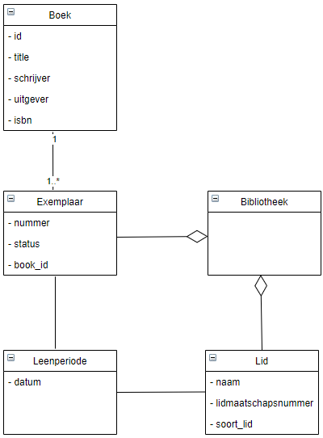
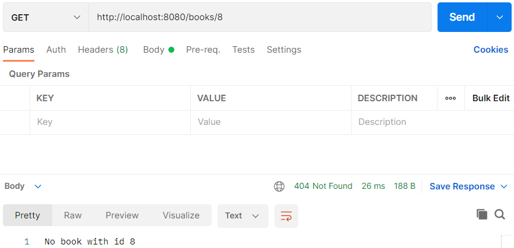

## Het idee

Er is een systeem nodig voor een bibliotheek waarin de leden worden bijgehouden. Ook de beschikbare boeken staan in het
systeem. Een lid kan een boek lenen voor 3 weken. Het systeem houdt bij welke boeken aanwezig zijn in de bibliotheek.

## Ontwerp UML

### Eerste opzet klassendiagram

1. Beschrijf de applicatie. Probeer min of meer volledig te zijn zonder al te zeer op de details in te gaan
2. Markeer alle zelfstandige naamwoorden met een kleur
3. Markeer alle werkwoorden met een andere kleur
4. De zelfstandige naamwoorden zijn kandidaten om in de applicatie classes te worden
5. De werkwoorden zijn kandidaat methoden

#### Voorbeeld tekst


De rode woorden zijn zelfstandige naamwoorden.<br/>
De groene woorden zijn de werkwoorden.


#### Idee

De zelfstandige namen voor het idee zijn als volgt.


- Systeem
- Bibliotheek
- Lid
- Boek
- Leenperiode (=weken)

Systeem is het alles overkoepelende, dat is juist wat je gaat beschrijven, dus deze gebruiken we niet in de
klassendiagram UML.

### UML: klassendiagram

Wanneer klassen iets met elkaar te maken hebben dan zet je een verbinding ertussen.

- Een bibliotheek heeft een X aantal exemplaren (aggregatie - open diamant)
- Een bibliotheek heeft een X aantal leden (aggregatie - open diamant)
- Examplaar heeft een relatie met een boek (associatie - lijn)
    - een boek kan meerdere exemplaren hebben
    - ieder exemplaar gaat over 1 boek
- Lid kan een exemplaar lenen (associatie - lijn)
- Leenperiode: het exemplaar is geleend voor een periode door een lid. Leenperiode is een soort koppeling tussen
  exemplaar en lid (associatie - lijn)



## Database Entities ORM

We gaan een nieuwe database maken in pgAdmin genaamd bieb.

Ga naar schemas > tables en rechts klik om een nieuwe tabel `books` te maken.


In de tab `columns` gaan we de kolommen zetten en slaan we hem op.


We hebben nu een tabel waar we records in kunnen zetten.


### Hibernate

Hoe verbind je van je Java Applicatie naar je Database? Springboot biedt een koppeling tussen de database en Java.

In Java heb je het over klasses, objecten etc. In een database hebben we het over tabellen. Een verbinding tussen een
klasse en een tabel is niet altijd even 1 op 1. In een klasse kun je bijvoorbeeld werken met lijsten, met een reeks, in
een database kan dit niet. In een database werk je altijd met een primary key en foreign keys en dit hoef je niet altijd
in je klasses te doen.

Aan de Java kant heb je ORM: Object Relational Mapping. Een ORM heb je nodig om de verbinding te maken.


In Springboot heet de ORM Hibernate. Hibernate is de populairste Object Relational Mapping (ORM) voor Java.

### Springboot

We gaan de klasses van het klassendiagram in Springboot maken.

We beginnen met een Spring Initializr https://start.spring.io/ project.


Open het bestand in IntelliJ.


De `pom.xml` (maven dependency manager) specificeert welke pakketten je nodig hebt.


We moeten nu specificeren hoe `@SpringBootApplication` bij Postgresql kan. De wachtwoorden moeten worden ingesteld, dat
doen we in de `application.properties` van IntelliJ. De volgende code zet je in dit bestand.

    # datasource PostgreSQL
    spring.jpa.database=postgresql
    spring.datasource.platform=postgres
    spring.datasource.url=jdbc:postgresql://localhost:5432/springboot
    spring.datasource.username=springboot
    spring.datasource.password=springboot
    spring.datasource.driver-class-name=org.postgresql.Driver
    spring.jpa.generate-ddl=true
    spring.jpa.properties.hibernate.jdbc.lob.non_contextual_creation=true
    spring.jpa.properties.hibernate.dialect= org.hibernate.dialect.PostgreSQLDialect
    
    spring.jpa.show-sql = true
    
    spring.jpa.hibernate.ddl-auto=create
    spring.datasource.initialization-mode=always

We gaan de entities maken die we in ons klassendiagram hebben gezet. We maken een nieuwe package genaamd `model` en een
nieuwe klasse genaamd `Book.java` in Java.


In `Book.java` maken we de attributen en de getters en setters.

```java
package com.danielle.library.model;

public class Book {
    private String title;
    private String writer;
    private String isbn;
    private String publisher;

    public String getTitle() {
        return title;
    }

    public void setTitle(String title) {
        this.title = title;
    }

    public String getWriter() {
        return writer;
    }

    public void setWriter(String writer) {
        this.writer = writer;
    }

    public String getIsbn() {
        return isbn;
    }

    public void setIsbn(String isbn) {
        this.isbn = isbn;
    }

    public String getPublisher() {
        return publisher;
    }

    public void setPublisher(String publisher) {
        this.publisher = publisher;
    }
}
```

Dit is wat ze noemen een POJO: Plain Old Java Object -> simpele klasse met alleen attributen en getters en setters.
Hibernate maakt gebruik van de POJO.

Om dit te integreren met Spring Boot gaan we met annotaties werken: `@Entity`.

```java
import javax.persistence.Entity;

@Entity
public class Book {
}
```

Vervolgens kunnen we van de attributen gaan zeggen, dit is een column: `@Column`.

```java
import javax.persistence.Column;
import javax.persistence.Entity;

@Entity
public class Book {

    @Column
    private String title;
    @Column
    private String writer;
    @Column
    private String isbn;
    @Column
    private String publisher;
}
```

Als laatste maken we een primary key.

```java
package com.danielle.library.model;

import javax.persistence.*;

@Entity
public class Book {
    @Id
    @GeneratedValue(strategy = GenerationType.IDENTITY)
    private long id;

    @Column
    private String title;
    @Column
    private String writer;
    @Column
    private String isbn;
    @Column
    private String publisher;

    public String getTitle() {
        return title;
    }

    public void setTitle(String title) {
        this.title = title;
    }

    public String getWriter() {
        return writer;
    }

    public void setWriter(String writer) {
        this.writer = writer;
    }

    public String getIsbn() {
        return isbn;
    }

    public void setIsbn(String isbn) {
        this.isbn = isbn;
    }

    public String getPublisher() {
        return publisher;
    }

    public void setPublisher(String publisher) {
        this.publisher = publisher;
    }
}
```

Wanneer je de `LibraryApplication` gaat runnen is het gelukt wanneer je de melding `Started LibraryApplication` krijgt.

Als je nu naar de database gaat in pgAdmin en je kijkt naar de schema's en dan tables zie je dat er ineens een `book`
staan en de 5 columns die je hebt gemaakt.


#### H2

Wanneer de connectie met postgresSQL niet werkt kun je ook H2 gebruiken. Het volgende zet je in `application.properties`
.

    # datasource H2
    spring.datasource.driverClassName=org.h2.Driver
    spring.datasource.username=sa
    spring.datasource.password=password
    spring.datasource.url=jdbc:h2:mem:testdb
    #spring.datasource.url=jdbc:h2:file:./data/testdb
    spring.datasource.hikari.connectionTimeout=20000
    spring.datasource.hikari.maximumPoolSize=5
    spring.h2.console.enabled=true
    spring.h2.console.path=/h2console/
    spring.jpa.database-platform=org.hibernate.dialect.H2Dialect
    spring.jpa.hibernate.ddl-auto=create

In de `pom.xml` zet je onder de dependency van `postgresql` de code van `h2`.

    <dependency>
       <groupId>com.h2database</groupId>
       <artifactId>h2</artifactId>
       <scope>runtime</scope>
    </dependency>

Er verschijnt een `Load Maven Changes` icoon in beeld. Deze moet je aanklikken en dan gaat IntelliJ indexen, zodat het
systeem h2 erbij heeft gezet.

Run de applicatie.

Wanneer je de database h2.Driver gebruikt, die is in-memory, dat betekend dat je het verder niet kan zien. Dit is een
path die heet h2console en wanneer je naar een browser gaat en tikt in `localhost:8080/h2console` dan krijg je een soort
database, je klikt op `connect` dan zie je je class `book` en de 5 columns staan.


#### data.sql

Wanneer de database werkt, gaan we `Book.java` vullen met een aantal zaken zodat we kunnen zien dat er data in de tabel
komt. Dit doe je door in de `resources` een nieuw textfile te maken en die noemen we `data.sql`. Dit is een `sql`
bestand waarmee we records kunnen toevoegen aan `Book.java`.

In dit bestand zet je de volgende code voor H2.

    insert into book (title) values 'Harry Potter';
    insert into book (title) values 'Swiebertje';

> > > zodra er data.sql in IntelliJ wordt gezet krijg je geen `Started BibliotheekApplication` meer te zien, alleen maar errors.

Voor postgreSQL geldt het volgende.

    insert into book (title) values ('Harry Potter');
    insert into book (title) values ('Swiebertje');

Je krijgt het volgende in IntelliJ te zien.


IntelliJ Ultimate heeft de mogelijkheid van Inspections. In de editor worden deze gebruikt om de code te onderzoeken en
suggesties te doen. Deze Inspections kunnen aan of uit worden gezet.

Bij het creëren van een .sql bestand zoals `data.sql` worden onder de volgende inspections geactiveerd:

- __SQL dialect detection__ Hiermee wordt de syntax van SQL gecontroleerd volgens een aangegeven SQL dialect.

- __No data sources configured__ IntelliJ Ultimate biedt de mogelijkheid datasources te configureren. Hartstikke leuk
  maar die optie gebruiken we niet in de springboot projecten

Je kan de inspectie meldingen die in de gele balken verschijnen negeren, maar je kunt ze ook uitzetten. In de balk zie
je een instellingen icon (een radertje) met in de pulldown menu de optie `Disable inspection`.

Als je deze weer aan wilt zetten moet dat via het hoofdmenu > preferences > editor > inspections. Daar kun je de
betreffende inspections opzoeken in de lijst en het vinkje weer aanzetten.

Run de applicatie.

> > > De applicatie draait zonder errors, maar de data wordt niet in porgreSQL gezet. Lijkt alsof er iets mis is met `data.sql`.

We gaan verder zonder het bestand `data.sql`.

## Repository

We gaan een controller maken. We maken eerste aan package genaamd `controller` en een bestand
genaamd `BookController.java`.


Via `bookRepository` gaan we naar de database. Op hetzelfde nivea als controller maak je een nieuwe package `repository`
en daarin een interface bestand genaamd `BookRepository`.


De communicatie met de database gebeurd via een repository, dus BookRepository communiceert straks met de database. Het
is een interface die op basis van een bestaande JpaRepository toegang heeft naar `book` op basis van de id wat `Long`
is. Hij vertaald in wezen Java in een stukje SQL.

_BookRepository.java_

```java
package com.danielle.bibliotheek.repository;

import com.danielle.bibliotheek.model.Book;
import org.springframework.data.jpa.repository.JpaRepository;

public interface BookRepository extends JpaRepository<Book, Long> {
}
```

We hebben een `@GetMapping` naar `/books` met een methode `getBooks`, die levert een `ResponseEntity` op en deze bestaat
uit `books` en books is een `List` naar type `Book` en om deze boven water te krijgen doen we een bookRepository en find
all `bookRepository.findAll();`. De bookRepository hebben we met `@Autowired` gedaan.

_BookController.java_

```java
package com.danielle.bibliotheek.controller;

import com.danielle.bibliotheek.model.Book;
import com.danielle.bibliotheek.repository.BookRepository;
import org.springframework.beans.factory.annotation.Autowired;
import org.springframework.http.HttpStatus;
import org.springframework.http.ResponseEntity;
import org.springframework.web.bind.annotation.GetMapping;
import org.springframework.web.bind.annotation.RestController;

import java.util.List;

@RestController
public class BookController {
    @Autowired
    private BookRepository bookRepository;

    @GetMapping(value = "/books")
    public ResponseEntity<Object> getBooks() {
        List<Book> books = bookRepository.findAll();
        return new ResponseEntity<>(books, HttpStatus.OK);
    }
}
```

Run de applicatie.

Ga naar Postman en doe een GET naar `http://localhost:8080/books`. Je krijgt een lege array `[]` te zien in de body.


Wanneer je `data.sql` bestand werkt, zie je in de Body het volgende.


In de terminal zie je allerlei opdrachten en daar staat `hibernate` tussen. Je ziet `select .... from book` staan en dit
is de sql statement die hibernate heeft gegenereerd op basis van wat hij weet van de entity. Doordat wij
de `BookRepository.java` hebben toegevoegd, die eigenlijk niks doet, maar hij weet wel dat hij Book kan ophalen met een
Long id: `JpaRepository<Book, Long>` en wanneer je deze repository gaat gebruiken je een `findAll()` kan doen die staat
in `BookController`.


### Endpoint /id

We gaan op basis van `/books` een `{id}` ophalen.

_BookController.java_

```java
package com.danielle.bibliotheek.controller;

import com.danielle.bibliotheek.model.Book;
import com.danielle.bibliotheek.repository.BookRepository;
import org.springframework.beans.factory.annotation.Autowired;
import org.springframework.http.HttpStatus;
import org.springframework.http.ResponseEntity;
import org.springframework.web.bind.annotation.GetMapping;
import org.springframework.web.bind.annotation.PathVariable;
import org.springframework.web.bind.annotation.RestController;

import java.util.List;
import java.util.Optional;

@RestController
public class BookController {
    @Autowired
    private BookRepository bookRepository;

    @GetMapping(value = "/books")
    public ResponseEntity<Object> getBooks() {
        List<Book> books = bookRepository.findAll();
        return new ResponseEntity<>(books, HttpStatus.OK);
    }

    @GetMapping(value = "/books/{id}")
    public ResponseEntity<Optional<Book>> getBook(@PathVariable("id") long id) {
        return new ResponseEntity<>(bookRepository.findById(id), HttpStatus.OK);
    }
}
```

We hebben nu een `@GetMapping` voor een specifieke `{id}`. Deze gaat naar de bookRepository and die doet
niet `findAll()` maar `findfById(id)`.

Run de applicatie.

Wanneer je in Postman `http://localhost:8080/books/2` en GET doe dan krijg je het boek "Swiebertje" in de body (wanneer
de `data.sql` werkt).


### Toevoegen boeken

Met @PostMapping voegen we boeken toe.

_BookController.java_

```java
package com.danielle.bibliotheek.controller;

import com.danielle.bibliotheek.model.Book;
import com.danielle.bibliotheek.repository.BookRepository;
import org.springframework.beans.factory.annotation.Autowired;
import org.springframework.http.HttpStatus;
import org.springframework.http.ResponseEntity;
import org.springframework.web.bind.annotation.*;

import java.util.List;
import java.util.Optional;

@RestController
public class BookController {
    @Autowired
    private BookRepository bookRepository;

    @GetMapping(value = "/books")
    public ResponseEntity<Object> getBooks() {
        List<Book> books = bookRepository.findAll();
        return new ResponseEntity<>(books, HttpStatus.OK);
    }

    @GetMapping(value = "/books/{id}")
    public ResponseEntity<Optional<Book>> getBook(@PathVariable("id") long id) {
        return new ResponseEntity<>(bookRepository.findById(id), HttpStatus.OK);
    }

    @PostMapping(value = "/books")
    public ResponseEntity<Object> createBook(@RequestBody Book book) {
        bookRepository.save(book);
        return new ResponseEntity<>("Book created", HttpStatus.CREATED);
    }
}
```

`bookRepository` is de poort en `save` het boek die we krijgen: `bookRepository.save(book);`.

Run de applicatie.

In Postman gebruik je `POST` en de url `http://localhost:8080/books/` om boeken toe te voegen.


Het toevoegen van boeken doe je in de `body` en druk je op `send`. Je krijgt ene melding `Book created`.


Wanneer je nu `GET` selecteer en de url `http://localhost:8080/books/` krijg je het boek dat je hebt toegevoegd in de
body.


Wanneer je in postgreSQL kijkt, dan staat het boek toegevoegd in de database: schemas > tables > book > rechts klikken >
view/edit data > all rows


### Delete boeken

Het verwijderen van boeken doen we met @DeleteMapping.

```java
package com.danielle.bibliotheek.controller;

import com.danielle.bibliotheek.model.Book;
import com.danielle.bibliotheek.repository.BookRepository;
import org.springframework.beans.factory.annotation.Autowired;
import org.springframework.http.HttpStatus;
import org.springframework.http.ResponseEntity;
import org.springframework.web.bind.annotation.*;

import java.util.List;
import java.util.Optional;

@RestController
public class BookController {
    @Autowired
    private BookRepository bookRepository;

    @GetMapping(value = "/books")
    public ResponseEntity<Object> getBooks() {
        List<Book> books = bookRepository.findAll();
        return new ResponseEntity<>(books, HttpStatus.OK);
    }

    @GetMapping(value = "/books/{id}")
    public ResponseEntity<Optional<Book>> getBook(@PathVariable("id") long id) {
        return new ResponseEntity<>(bookRepository.findById(id), HttpStatus.OK);
    }

    @PostMapping(value = "/books")
    public ResponseEntity<Object> createBook(@RequestBody Book book) {
        bookRepository.save(book);
        return new ResponseEntity<>("Book created", HttpStatus.CREATED);
    }

    @DeleteMapping(value = "/books/{id}")
    public ResponseEntity<Object> deleteBook(@PathVariable("id") long id) {
        bookRepository.deleteById(id);
        return new ResponseEntity<>("Book deleted", HttpStatus.OK);
    }
}
```

We voegen we data toe aan `POST` en url `http://localhost:8080/books/`.

```json
[
  {
    "title": "Demo Schrift",
    "writer": "Frummel",
    "isbn": "364957364583927",
    "publisher": null
  },
  {
    "title": "Demo Tijdschrift",
    "writer": "Freckle",
    "isbn": "92516374635404",
    "publisher": null
  },
  {
    "title": "Demo Book",
    "writer": "Frizzle",
    "isbn": "253446547384",
    "publisher": null
  }
]
```

Je hebt de volgende boeken in Postman staan.


Deze staan ook in postgreSQL.


Het deleten van een book doe je in Postman met `DELETE` en url `http://localhost:8080/books/2`.


Wanneer je alle boeken ophaalt in Postman met GET en `http://localhost:8080/books/` krijg je het volgende.


In postgreQSL is dit boek ook verdwenen.


### id toevoegen

Hierboven geeft de data de id niet terug, deze zou je handmatig kunnen toevoegen wanneer je records toevoegt in Postman.

```json
[
  {
    "id": 1,
    "title": "Demo Schrift",
    "writer": "Frummel",
    "isbn": "364957364583927",
    "publisher": null
  },
  {
    "id": 2,
    "title": "Demo Tijdschrift",
    "writer": "Freckle",
    "isbn": "92516374635404",
    "publisher": null
  },
  {
    "id": 3,
    "title": "Demo Book",
    "writer": "Frizzle",
    "isbn": "253446547384",
    "publisher": null
  }
]
```

Of je kan de getters en setters aanmaken voor de `id` in Spring Boot `Book.java`.

```java
package com.danielle.bibliotheek.model;

import javax.persistence.*;

@Entity
public class Book {
    @Id
    @GeneratedValue(strategy = GenerationType.IDENTITY)
    private long id;

    @Column
    private String title;
    @Column
    private String writer;
    @Column
    private String isbn;
    @Column
    private String publisher;

    public String getTitle() {
        return title;
    }

    public void setTitle(String title) {
        this.title = title;
    }

    public String getWriter() {
        return writer;
    }

    public void setWriter(String writer) {
        this.writer = writer;
    }

    public String getIsbn() {
        return isbn;
    }

    public void setIsbn(String isbn) {
        this.isbn = isbn;
    }

    public String getPublisher() {
        return publisher;
    }

    public void setPublisher(String publisher) {
        this.publisher = publisher;
    }

    public long getId() {
        return id;
    }

    public void setId(long id) {
        this.id = id;
    }
}
```


### Verschillende soorten repository's

Je hebt verschillende soorten repository's. Alledrie doen ze verschillende dingen, waarbij de Jpa het meeste kan en het
zwaarste is.

- JpaRepository
- PagingAndSortingRepository
- CrudRepository

We gaan een `repository method` gebruiken waarbij we willen gaan zoeken/sorteren op id.

We maken een `List` van de type `Book`. De methode noemen we `findAllOrderById()`.

_BookRepository.java_

```java
package com.danielle.bibliotheek.repository;

import com.danielle.bibliotheek.model.Book;
import org.springframework.data.jpa.repository.JpaRepository;

import java.util.List;

public interface BookRepository extends JpaRepository<Book, Long> {

    List<Book> findAllOrderById();
}
```

Dit ga je gebruiken in de `BookController.java`. In plaats van `findAll()` gebruiken we `findAllOrderById()`.

    @GetMapping(value = "/books")
    public ResponseEntity<Object> getBooks() {
      List<Book> books = bookRepository.findAllOrderById();
      return new ResponseEntity<>(books, HttpStatus.OK);
    }

Nu zal hij altijd je boeken gesorteerd weergeven.

> > > werkt niet, je moet een argument opgeven

Wanneer je de begin letter wilt gebruiken van de naam om te gaan zoeken, gebruik je `findAllByTitleOrderById` en geven
we `String` en `title` mee in de argumenten.

_BookRepository.java_

```java
package com.danielle.bibliotheek.repository;

import com.danielle.bibliotheek.model.Book;
import org.springframework.data.jpa.repository.JpaRepository;

import java.util.List;

public interface BookRepository extends JpaRepository<Book, Long> {

    List<Book> findAllByTitleOrderById(String title);
}
```

In de `BookController.java` gaan we dit toevoegen door een nieuwe `@GetMapping`.

```java
package com.danielle.bibliotheek.controller;

import com.danielle.bibliotheek.model.Book;
import com.danielle.bibliotheek.repository.BookRepository;
import org.springframework.beans.factory.annotation.Autowired;
import org.springframework.http.HttpStatus;
import org.springframework.http.ResponseEntity;
import org.springframework.web.bind.annotation.*;

import java.util.List;
import java.util.Optional;

@RestController
public class BookController {
    @Autowired
    private BookRepository bookRepository;

    @GetMapping(value = "/books")
    public ResponseEntity<Object> getBooks() {
        List<Book> books = bookRepository.findAll();
        return new ResponseEntity<>(books, HttpStatus.OK);
    }

    @GetMapping(value = "/books/title/{title}")
    public ResponseEntity<Object> getBooks(@PathVariable("title") String title) {
        List<Book> books = bookRepository.findAllByTitleOrderById(title);
        return new ResponseEntity<>(books, HttpStatus.OK);
    }

    @GetMapping(value = "/books/{id}")
    public ResponseEntity<Optional<Book>> getBook(@PathVariable("id") long id) {
        return new ResponseEntity<>(bookRepository.findById(id), HttpStatus.OK);
    }

    @PostMapping(value = "/books")
    public ResponseEntity<Object> createBook(@RequestBody Book book) {
        bookRepository.save(book);
        return new ResponseEntity<>("Book created", HttpStatus.CREATED);
    }

    @DeleteMapping(value = "/books/{id}")
    public ResponseEntity<Object> deleteBook(@PathVariable("id") long id) {
        bookRepository.deleteById(id);
        return new ResponseEntity<>("Book deleted", HttpStatus.OK);
    }
}
```

Run de applicatie.

We hebben vier boeken in Postman gezet.


Wanneer je opzoek gaat naar de titel `Book` met url `http://localhost:8080/books/title/Book` krijg je het volgende.


We gaan nu zoeken naar de eerste letter van een title met 'findAllByTitleStartingWith'. Dit pas je aan
in `BookRepository.java` en `BookController.java`.

In Postman ga je op zoek naar de boeken die beginnen met de letter B `http://localhost:8080/books/title/B`.


Je kunt verschillende query's/zoekopdrachten gebruiken, zie onderstaand overzicht.


Tip: als gebruiker weet je niet welke query's er worden ondersteund, dus dan kun je een informatie controller maken (als
soort van documentatie naar de gebruiker toe). Kijk oo naar HATEOS, die laten zien dat wanneer je iets hebt opgevraagd,
hoe je dan verder kan.

## Service

Spring Boot in een plaatje.


De Client praat via HTTPS met de Controller. De controller praat met de Service en de Service praat via de Repository
met de database en kent dan de Model.

We hebben een `BookController` en vanuit de `BookController` gaan we gelijk naar de `bookRepository`.
De `BookRepository` is in staat om de sql statements te bouwen en naar de database te sturen. Hiertussen moet een
service laag.

Een servicelaag daar zit eigenlijk de business intelligentie. De servicelaag is op de hoogte van dingen die van belang
zijn om door te geven aan de BookRepository. De BookRepository houdt zich alleen bezig met de database. De
BookController houdt zich alleen bezig met de frontend, met de API. Hiertussen moet een service zitten.

We voegen een nieuwe package toe genaamd `Service` met een nieuwe klasse genaamd `BookService.java`.


Traditioneel wordt de Service gescheiden in een Interface en in een Implementatie. In `BookService.java` zet je de
volgende code voor de Implementatie.

```java
package com.danielle.bibliotheek.service;

public class BookServiceImpl {
}
```

Voor Interface maak je een nieuw bestand aan, binnen de package genaamd `BookService.java`.


In de Service ga je definieren wat je allemaal met je boeken wilt gaat doen.

We kunnen bijvoorbeeld zeggen, we willen de volgende methodes `getAllBooks()`, `getBook()`, `getBooksTitleStartsWith()`
, `save()` en een `deleteById()`.

- De getAllBooks() geeft terug een lijst van een boek: `List<Book> getAllBooks();`
- De getBook() die geeft terug een boek: `Book getBook();`
- De getBooksTitleStartsWith() geeft een lijst ban boeken terug: `List<Book> getBooksTitleStartsWith()`
- De save() is een void want die geeft niks terug: `void save();`
- De deleteById() is een void want geeft niks terug: `void deleteById()`

_BookService.java_

```java
package com.danielle.bibliotheek.service;

import com.danielle.bibliotheek.model.Book;

import java.util.List;

public interface BookService {

    public List<Book> getAllBooks();

    public Book getBook(long id);

    public List<Book> getBooksTitleStartsWith(String title);

    public void save(Book book);

    public void deleteById(long id);
}
```

De interface hoeft alleen maar te benoemen welke methodes je allemaal hebt. Deze methodes moet je implementeren
in `BookServiceImpl`.

De @Autowired van `BookController` zet je in `BookServiceImpl`. De service praat nu met de bookRepository.

```java
package com.danielle.bibliotheek.service;

import com.danielle.bibliotheek.model.Book;
import com.danielle.bibliotheek.repository.BookRepository;
import org.springframework.beans.factory.annotation.Autowired;
import org.springframework.stereotype.Service;

import java.util.List;

@Service
public class BookServiceImpl implements BookService {
    @Autowired
    private BookRepository bookRepository;

    @Override
    public List<Book> getAllBooks() {
        return bookRepository.findAll();
    }

    @Override
    public Book getBook(long id) {
        return bookRepository.findById(id).orElse(null);
    }

    @Override
    public List<Book> getBooksTitleStartsWith(String title) {
        return bookRepository.findAllByTitleStartingWith(title);
    }

    @Override
    public void save(Book book) {
        bookRepository.save(book);
    }

    @Override
    public void deleteById(long id) {
        bookRepository.deleteById(id);
    }
}
```

Wat je in de `BookController.java` moet gaan doen, is niet praten met `bookRepository` maar praten
met `BookService.java`.

_BookController.java_

```java
package com.danielle.bibliotheek.controller;

import com.danielle.bibliotheek.model.Book;
import com.danielle.bibliotheek.service.BookService;
import org.springframework.beans.factory.annotation.Autowired;
import org.springframework.http.HttpStatus;
import org.springframework.http.ResponseEntity;
import org.springframework.web.bind.annotation.*;

import java.util.List;

@RestController
public class BookController {
    @Autowired
    private BookService bookService;

    @GetMapping(value = "/books")
    public ResponseEntity<Object> getBooks() {
        List<Book> books = bookService.getAllBooks();
        return new ResponseEntity<>(books, HttpStatus.OK);
    }

    @GetMapping(value = "/books/title/{title}")
    public ResponseEntity<Object> getBooks(@PathVariable("title") String title) {
        List<Book> books = bookService.getBooksTitleStartsWith(title);
        return new ResponseEntity<>(books, HttpStatus.OK);
    }

    @GetMapping(value = "/books/{id}")
    public ResponseEntity<Object> getBook(@PathVariable("id") long id) {
        return new ResponseEntity<>(bookService.getBook(id), HttpStatus.OK);
    }

    @PostMapping(value = "/books")
    public ResponseEntity<Object> createBook(@RequestBody Book book) {
        bookService.save(book);
        return new ResponseEntity<>("Book created", HttpStatus.CREATED);
    }

    @DeleteMapping(value = "/books/{id}")
    public ResponseEntity<Object> deleteBook(@PathVariable("id") long id) {
        bookService.deleteById(id);
        return new ResponseEntity<>("Book deleted", HttpStatus.OK);
    }
}
```

We hebben nu de bookService ertussen gezet.

In Postman en in postgreSQL kun je nu weer hetzelfde doen als hiervoor, alleen staat de servicelaag ertussen. De
servicelaag maakt het makkelijker om intelligenter dingen te doen in service.

De BookController moet niet meer zijn dan wat het nu is: die vangt de request, die doet iets naar de service en die
geeft een response met ResponseEntity. That's it.

De BookService praat met de BookRepository.

De BookRepository is niks anders dan alleen maar de query bouwen naar de database.

### Exception

Wanneer je http://localhost:8080/books/9 opvraagt, dan krijg je geen antwoord, want deze bestaat niet. De statuscode
staat echter op 200 OK, maar dit klopt niet, er moet een andere status code komen namelijk 404 NOT FOUND.

We gaan dit afvangen in `BookServiceImpl`. We gaan checken of nummer 9 bestaat. Dit kun je controleren met een
if-statement die checked of de id die je opvraagt er wel is.

```java
package com.danielle.bibliotheek.service;

import com.danielle.bibliotheek.exception.RecordNotFoundException;
import com.danielle.bibliotheek.model.Book;
import com.danielle.bibliotheek.repository.BookRepository;
import org.springframework.beans.factory.annotation.Autowired;
import org.springframework.stereotype.Service;

import java.util.List;

@Service
public class BookServiceImpl implements BookService {
    @Autowired
    private BookRepository bookRepository;

    @Override
    public List<Book> getAllBooks() {
        return bookRepository.findAll();
    }

    @Override
    public Book getBook(long id) {
        if (bookRepository.existsById(id)) {
            return bookRepository.findById(id).get();
        } else {
            throw new RecordNotFoundException("No book with id " + id);
        }
    }

    @Override
    public List<Book> getBooksTitleStartsWith(String title) {
        return bookRepository.findAllByTitleStartingWith(title);
    }

    @Override
    public void save(Book book) {
        bookRepository.save(book);
    }

    @Override
    public void deleteById(long id) {
        if (bookRepository.existsById(id)) {
            bookRepository.deleteById(id);
        } else {
            throw new RecordNotFoundException("No book with id " + id);
        }
    }
}
```

We maken een nieuwe package `exception` en daarin maken we nieuwe files `RecordNotFoundException.java`
en `NotAuthorizedException.java`.

_RecordNotFoundException.java_

```java
package com.danielle.bibliotheek.exception;

public class RecordNotFoundException extends RuntimeException {
    public RecordNotFoundException() {
        super();
    }

    public RecordNotFoundException(String message) {
        super(message);
    }
}
```

_NotAuthorizedException.java_

```java
package com.danielle.bibliotheek.exception;

public class NotAuthorizedException extends RuntimeException {

    public NotAuthorizedException() {
        super();
    }

    public NotAuthorizedException(String message) {
        super(message);
    }
}
```

In de package controller maken we een file `ExceptionController.java`.

```java
package com.danielle.bibliotheek.controller;

import com.danielle.bibliotheek.exception.NotAuthorizedException;
import com.danielle.bibliotheek.exception.RecordNotFoundException;
import org.springframework.http.HttpStatus;
import org.springframework.http.ResponseEntity;
import org.springframework.web.bind.annotation.ControllerAdvice;
import org.springframework.web.bind.annotation.ExceptionHandler;
import org.springframework.web.bind.annotation.RestController;

@RestController
@ControllerAdvice

public class ExceptionController {
    @ExceptionHandler(value = RecordNotFoundException.class)
    public ResponseEntity<Object> exception(RecordNotFoundException exception) {
        String message = exception.getMessage();
        return new ResponseEntity<>(message, HttpStatus.NOT_FOUND);
    }

    @ExceptionHandler(value = NotAuthorizedException.class)
    public ResponseEntity<Object> exception(NotAuthorizedException exception) {
        String message = exception.getMessage();
        return new ResponseEntity<>(message, HttpStatus.UNAUTHORIZED);
    }
}
```

In Postman wanneer je naar boek 8 zoekt met GET en url `http://localhost:8080/books/8`, krijg je de
melding `No book with id 8`.



## Associatie

Book is gedaan en we gaan verder met exemplaar. In de map `model` maak je een nieuwe file aan `copy,java`.

```java
package com.danielle.bibliotheek.model;

import javax.persistence.*;

@Entity
public class Copy {
    @Id
    @GeneratedValue(strategy = GenerationType.IDENTITY)
    private long id;

    @Column
    private String nr;
    @Column
    private String status;

    public long getId() {
        return id;
    }

    public void setId(long id) {
        this.id = id;
    }

    public String getNr() {
        return nr;
    }

    public void setNr(String nr) {
        this.nr = nr;
    }

    public String getStatus() {
        return status;
    }

    public void setStatus(String status) {
        this.status = status;
    }
}
```

We willen de associatie tussen Boek en Exemplaar zoals beschreven in de klassendiagram: één boek heeft meerdere
exemplaren. Dit is een one-to-many relatie.

Meestal zal het voorkomen dat in `exemplaar` een `foreign key` staat die verwijst naar `book_id`.

Deze foreign key moet je in Spring Boot zetten. We werken niet met id's, maar met `Book book; ` en we geven hem de
annotatie `@ManyToOne`.

_Copy.java_

```java
package com.danielle.bibliotheek.model;

import javax.persistence.*;

@Entity
public class Copy {
    @Id
    @GeneratedValue(strategy = GenerationType.IDENTITY)
    private long id;

    @Column
    private String nr;
    @Column
    private String status;

    @ManyToOne
    Book book;

    public long getId() {
        return id;
    }

    public void setId(long id) {
        this.id = id;
    }

    public String getNr() {
        return nr;
    }

    public void setNr(String nr) {
        this.nr = nr;
    }

    public String getStatus() {
        return status;
    }

    public void setStatus(String status) {
        this.status = status;
    }
}
```

In Book.java kun je afvragen, weet deze Book welke exemplaren er allemaal zijn. Dit kun je doen door
annotatie `OneToMany`. We hebben het dan niet over één exemplaar, maar we hebben het over een List.

```java
package com.danielle.bibliotheek.model;

import javax.persistence.*;
import java.util.List;

@Entity
public class Book {
    @Id
    @GeneratedValue(strategy = GenerationType.IDENTITY)
    private long id;

    @Column
    private String title;
    @Column
    private String writer;
    @Column
    private String isbn;
    @Column
    private String publisher;

    @OneToMany
    List<Copy> copies;

    public long getId() {
        return id;
    }

    public void setId(long id) {
        this.id = id;
    }

    public String getTitle() {
        return title;
    }

    public void setTitle(String title) {
        this.title = title;
    }

    public String getWriter() {
        return writer;
    }

    public void setWriter(String writer) {
        this.writer = writer;
    }

    public String getIsbn() {
        return isbn;
    }

    public void setIsbn(String isbn) {
        this.isbn = isbn;
    }

    public String getPublisher() {
        return publisher;
    }

    public void setPublisher(String publisher) {
        this.publisher = publisher;
    }
}
```

We hebben het nu aan elkaar gekoppeld.

Run de applicaties.

In postgreSQL zie je dat tabel `copy` erin staat, maar hij heeft ook zelf een associatie tabel gemaakt
genaamd `book_copies`.


Je hebt verschillende annotaties voor koppelingen tussen klassen.

- @OneToOne
- @OneToMany
- @ManyToOne
- @ManyToMany

## Configurerern

De `class Book` wordt bijgehouden in een tabel die heeft `books` in de database.

```java

@Entity
@Table(name = "books")
public class Book {
}
```

Een column kun je ook configureren: hoe iets in de database gaat heten.

```java

@Entity
@Table(name = "books")
public class Book {
    @Id
    @GeneratedValue(strategy = GenerationType.IDENTITY)
    private long id;

    @Column(name = "the_title")
    private String title;
    @Column(name = "the_writer")
    private String writer;
    @Column(name = "the_isbn")
    private String isbn;
    @Column(name = "the_publisher")
    private String publisher;
}
```

Nasst dat je een column een naam kan geven, kun hem ook definieren met een bepaalde lengte en eventueel of hij wel of
niet nul mag zijn.

```java

@Entity
@Table(name = "books")
public class Book {
    @Id
    @GeneratedValue(strategy = GenerationType.IDENTITY)
    private long id;

    @Column(name = "the_title", length = 255, nullable = false)
    private String title;
    @Column(name = "the_writer", length = 255, nullable = false)
    private String writer;
    @Column(name = "the_isbn", length = 255, nullable = true)
    private String isbn;
    @Column(name = "the_publisher", length = 255, nullable = true)
    private String publisher;
}
```

## AutoWired

`@Autowired` wordt gebruikt in de Controller naar de Service te wijzen en om in de Service naar de Repository te wijzen.

`@AutoWired` is een onderdeel van Spring Boot die ervoor zorgt dat er onder de motorkap koppelingen allemaal worden gelegd. Je hoeft dus niet nieuwe instanties te maken van een repository en elke keer opnieuw te moeten initialiseren. Hij weet door de AutoWired dat je dat nodig hebt en gebruikt een efficiente manier om dit te doen.

In BookController.java` gebruiken we AutoWired.

    @Autowired
    private BookService bookService;

Dit zorgt ervoor dat hij meteen `bookService` heeft geintialiseerd, zodat je deze gelijk kan gaan gebruiken in de bijvoorbeeld de @GetMapping.

Hetzelfde geldt voor `BookServiceImpl`.

    @Autowired
    private BookRepository bookRepository;

De `bookRepository` is ook helemaal klaar gemaakt om gelijk gebruikt te worden in de verschillende methodes.