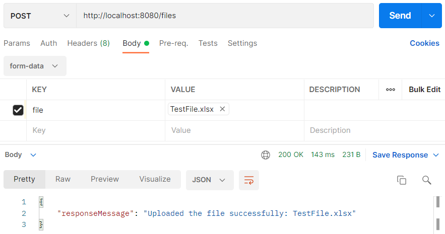
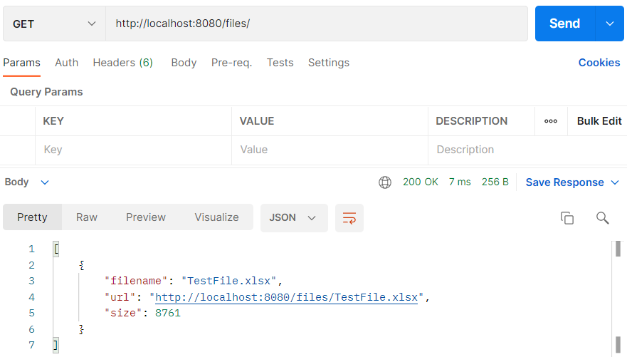

## File Upload

In dit artikel zullen we laten zien hoe je met Spring Boot een bestand kunt uploaden naar een map in het bestandssysteem. We zullen Spring MultipartFile interface gebruiken om multi-part requests naar onze Rest API af te handelen.

### Toepassing Rest uploading API

Spring Boot applicatie server zal API voorzien van de volgende endpoints:

- `/files` (GET) Lijst van geüploade bestanden ophalen
- `/files` (POST) Een enkel bestand uploaden
- `/files` (DELETE) Verwijder alle geüploade bestanden
- `/files/{filename}` (GET) Specifiek bestand downloaden

Bestanden zullen worden geüpload naar de specifieke statische map die wordt geconfigureerd in de `application.properties`.

## Code

### Initializr

Ga naar de website <a href="https://start.spring.io" target="_blank">spring.io</a>. De volgende gegevens vul je in voor
het eerste Spring Boot project.

- Project: vink aan `Maven Project`
- Language: vink aan `Java`
- Spring Boot: vink aan `2.5.5` (laatste versie)
- Project Metadata: vul informatie in over jouw project
    - Group: `nl.danielle` (identifier van de ontwikkelaar)
    - Artifact: `file_demo` (hoe heet je project)
    - Name: `file_demo` (hoe heet je project)
    - Description: `Demo project for Spring Boot`
    - Package name: maakt het systeem zelf aan
    - Packaging: vink aan `Jar`
    - Java: vink aan `11`

Klik op "add dependencies" en voeg `Spring Web` toe.

Met "generate" wordt er een bestand in jouw download map gezet. Unzip het bestand en open het in Intellij.

Klik vervolgens rechtsonder in IntelliJ op `Load`.


Ga naar File > Project Structure en zet `Project SDK` op 11. Klik op apply.

### pom.xml

Wanneer je in `pom.xml` een foutmelding krijgt, zet je de `<parent>` versie op `<version>2.4.3</version>` en wanneer je een foutmelding in de `<plugin>` krijg zet je de versie er tussen op de volgende manier: `<version>${project.parent.version}</version>`.

De pom.xml heeft de volgende structuur:

```xml
<?xml version="1.0" encoding="UTF-8"?>
<project xmlns="http://maven.apache.org/POM/4.0.0" xmlns:xsi="http://www.w3.org/2001/XMLSchema-instance"
	xsi:schemaLocation="http://maven.apache.org/POM/4.0.0 https://maven.apache.org/xsd/maven-4.0.0.xsd">
	<modelVersion>4.0.0</modelVersion>
	<parent>
		<groupId>org.springframework.boot</groupId>
		<artifactId>spring-boot-starter-parent</artifactId>
		<version>2.4.3</version>
		<relativePath/> <!-- lookup parent from repository -->
	</parent>
	<groupId>nl.danielle</groupId>
	<artifactId>file_demo</artifactId>
	<version>0.0.1-SNAPSHOT</version>
	<name>file_demo</name>
	<description>Demo project for Spring Boot</description>
	<properties>
		<java.version>11</java.version>
	</properties>
	<dependencies>
		<dependency>
			<groupId>org.springframework.boot</groupId>
			<artifactId>spring-boot-starter-web</artifactId>
		</dependency>

		<dependency>
			<groupId>org.springframework.boot</groupId>
			<artifactId>spring-boot-starter-test</artifactId>
			<scope>test</scope>
		</dependency>
	</dependencies>

	<build>
		<plugins>
			<plugin>
				<groupId>org.springframework.boot</groupId>
				<artifactId>spring-boot-maven-plugin</artifactId>
				<version>${project.parent.version}</version>
			</plugin>
		</plugins>
	</build>

</project>
```

### Service

Maak een nieuwe package aan genaamd `service` met daarin 1 bestand: `FileService.java`.

De `FileService` zal verantwoordelijk zijn voor het opslaan en downloaden van bestanden van het pad dat is opgegeven in application.properties. 

We hebben een methode geannoteerd met `@PostConstruct`, die een lege directory zal aanmaken (indien deze nog niet bestaat) bij het opstarten van de Spring Boot server.

```java
package nl.danielle.file_demo.service;

import java.io.IOException;
import java.net.MalformedURLException;
import java.nio.file.Files;
import java.nio.file.Path;
import java.nio.file.Paths;
import java.util.Collections;
import java.util.List;
import java.util.stream.Collectors;

import javax.annotation.PostConstruct;

import org.springframework.beans.factory.annotation.Value;
import org.springframework.core.io.Resource;
import org.springframework.core.io.UrlResource;
import org.springframework.stereotype.Service;
import org.springframework.util.FileSystemUtils;
import org.springframework.web.multipart.MultipartFile;

@Service
public class FileService {

    @Value("${upload.path}")
    private String uploadPath;

    @PostConstruct
    public void init() {
        try {
            Files.createDirectories(Paths.get(uploadPath));
        } catch (IOException e) {
            throw new RuntimeException("Could not create upload folder!");
        }
    }

    public void save(MultipartFile file) {
        try {
            Path root = Paths.get(uploadPath);
            if (!Files.exists(root)) {
                init();
            }
            Files.copy(file.getInputStream(), root.resolve(file.getOriginalFilename()));
        } catch (Exception e) {
            throw new RuntimeException("Could not store the file. Error: " + e.getMessage());
        }
    }

    public Resource load(String filename) {
        try {
            Path file = Paths.get(uploadPath)
                    .resolve(filename);
            Resource resource = new UrlResource(file.toUri());

            if (resource.exists() || resource.isReadable()) {
                return resource;
            } else {
                throw new RuntimeException("Could not read the file!");
            }
        } catch (MalformedURLException e) {
            throw new RuntimeException("Error: " + e.getMessage());
        }
    }

    public void deleteAll() {
        FileSystemUtils.deleteRecursively(Paths.get(uploadPath)
                .toFile());
    }

    public List<Path> loadAll() {
        try {
            Path root = Paths.get(uploadPath);
            if (Files.exists(root)) {
                return Files.walk(root, 1)
                        .filter(path -> !path.equals(root))
                        .collect(Collectors.toList());
            }

            return Collections.emptyList();
        } catch (IOException e) {
            throw new RuntimeException("Could not list the files!");
        }
    }
}
```

### Model

Maak een nieuwe package aan genaamd `model` met daarin 2 bestanden: `FileData.java` en `UploadResponseMessage.java`.

- FileData - object met velden als bestandsnaam, url (om bestand te downloaden) en grootte
- UploadResponseMessage - zal worden gebruikt om informatie terug te geven over hoe het uploadproces is verlopen

_FileData.java_

```java
package nl.danielle.file_demo.model;

public class FileData {

    private String filename;
    private String url;
    private Long size;

    public String getFilename() {
        return filename;
    }

    public void setFilename(String filename) {
        this.filename = filename;
    }

    public String getUrl() {
        return url;
    }

    public void setUrl(String url) {
        this.url = url;
    }

    public Long getSize() {
        return size;
    }

    public void setSize(Long size) {
        this.size = size;
    }
}
```

_UploadResponseMessage.java_

```java
package nl.danielle.file_demo.model;

public class UploadResponseMessage {

    private final String responseMessage;

    public UploadResponseMessage(String responseMessage) {
        this.responseMessage = responseMessage;
    }

    public String getResponseMessage() {
        return responseMessage;
    }
}
```

De klasse `UploadResponseMessage` zal worden gebruikt in `FilesController` en `RestExceptionHandler`.

### Controller

Maak een nieuwe package aan genaamd `controller` met daarin 1 bestand: `FilesController.java`.

In de controller hebben we de `FilesController` aangemaakt die verantwoordelijk is voor het doorgeven van alle POST, GET, en DELETE verzoeken aan de `/files` endpoint.

```java
package nl.danielle.file_demo.controller;

import nl.danielle.file_demo.model.FileData;
import nl.danielle.file_demo.model.UploadResponseMessage;
import nl.danielle.file_demo.service.FileService;

import java.io.IOException;
import java.nio.file.Files;
import java.nio.file.Path;
import java.util.List;
import java.util.stream.Collectors;

import org.springframework.beans.factory.annotation.Autowired;
import org.springframework.core.io.Resource;
import org.springframework.http.HttpHeaders;
import org.springframework.http.HttpStatus;
import org.springframework.http.ResponseEntity;
import org.springframework.web.bind.annotation.DeleteMapping;
import org.springframework.web.bind.annotation.GetMapping;
import org.springframework.web.bind.annotation.PathVariable;
import org.springframework.web.bind.annotation.PostMapping;
import org.springframework.web.bind.annotation.RequestMapping;
import org.springframework.web.bind.annotation.RequestParam;
import org.springframework.web.bind.annotation.ResponseBody;
import org.springframework.web.bind.annotation.RestController;
import org.springframework.web.multipart.MultipartFile;
import org.springframework.web.servlet.mvc.method.annotation.MvcUriComponentsBuilder;

@RestController
@RequestMapping("files")
public class FilesController {

    private final FileService fileService;

    @Autowired
    public FilesController(FileService fileService) {
        this.fileService = fileService;
    }

    @PostMapping
    public ResponseEntity<UploadResponseMessage> uploadFile(@RequestParam("file") MultipartFile file) {
        try {
            fileService.save(file);

            return ResponseEntity.status(HttpStatus.OK)
                    .body(new UploadResponseMessage("Uploaded the file successfully: " + file.getOriginalFilename()));
        } catch (Exception e) {
            return ResponseEntity.status(HttpStatus.EXPECTATION_FAILED)
                    .body(new UploadResponseMessage("Could not upload the file: " + file.getOriginalFilename() + "!"));
        }
    }

    @GetMapping
    public ResponseEntity<List<FileData>> getListFiles() {
        List<FileData> fileInfos = fileService.loadAll()
                .stream()
                .map(this::pathToFileData)
                .collect(Collectors.toList());

        return ResponseEntity.status(HttpStatus.OK)
                .body(fileInfos);
    }

    @DeleteMapping
    public void delete() {
        fileService.deleteAll();
    }

    private FileData pathToFileData(Path path) {
        FileData fileData = new FileData();
        String filename = path.getFileName()
                .toString();
        fileData.setFilename(filename);
        fileData.setUrl(MvcUriComponentsBuilder.fromMethodName(FilesController.class, "getFile", filename)
                .build()
                .toString());
        try {
            fileData.setSize(Files.size(path));
        } catch (IOException e) {
            e.printStackTrace();
            throw new RuntimeException("Error: " + e.getMessage());
        }

        return fileData;
    }

    @GetMapping("{filename:.+}")
    @ResponseBody
    public ResponseEntity<Resource> getFile(@PathVariable String filename) {
        Resource file = fileService.load(filename);
        return ResponseEntity.ok()
                .header(HttpHeaders.CONTENT_DISPOSITION, "attachment; filename=\"" + file.getFilename() + "\"")
                .body(file);
    }
}
```

- `@RestController` - annotatie wordt gebruikt om een Rest controller te definiëren,
- `@GetMapping`, `@PostMapping` en `@DeleteMapping` - annotatie is voor het afhandelen van HTTP GET, POST en DELETE verzoeken met specifieke klasse methoden: 
  - POST `/files` uploadFile() 
  - GET `/files` getListFiles() 
  - GET `/files/{filename:.+}` getFile() 
  - DELETE `/bestanden` verwijderen()

### Exceptions

Maak een nieuwe package aan genaamd `exceptions` met daarin 1 bestand: `RestExceptionHandler.java`.

Deze klasse is geannoteerd met `@ControllerAdvice` die verantwoordelijk is voor het afhandelen van specifieke uitzonderingen die kunnen optreden tijdens het uploaden/downloaden van bestanden. 

De `RestExceptionHandler` klasse naast de speciale annotatie moet ook `RestExceptionHandler` uitbreiden. Om de uitzondering af te handelen bij het uploaden van te grote bestanden moeten we `MaxUploadSizeExceededException` afhandelen.

```java
package nl.danielle.file_demo.exceptions;

import nl.danielle.file_demo.model.UploadResponseMessage;
import org.springframework.http.HttpStatus;
import org.springframework.http.ResponseEntity;
import org.springframework.web.bind.annotation.ControllerAdvice;
import org.springframework.web.bind.annotation.ExceptionHandler;
import org.springframework.web.multipart.MaxUploadSizeExceededException;
import org.springframework.web.servlet.mvc.method.annotation.ResponseEntityExceptionHandler;

@ControllerAdvice
public class RestExceptionHandler extends ResponseEntityExceptionHandler {

    @ExceptionHandler(MaxUploadSizeExceededException.class)
    public ResponseEntity<UploadResponseMessage> handleMaxSizeException(MaxUploadSizeExceededException exc) {
        return ResponseEntity.status(HttpStatus.EXPECTATION_FAILED)
                .body(new UploadResponseMessage("Unable to upload. File is too large!"));
    }
}
```

### Resources

Om de maximale bestandsgrootte te bepalen die kan worden geüpload, moeten we de volgende regels toevoegen aan de `application.properties`.

    upload.path=/uploads
    
    spring.servlet.multipart.max-file-size=700KB
    spring.servlet.multipart.max-request-size=700KB

- `spring.servlet.multipart.max-file-size` - de maximale bestandsgrootte voor elk verzoek 
- `spring.servlet.multipart.max-request-size` - de maximale verzoekgrootte voor een multipart/form-data.

Daarnaast hebben we de `upload.path` custom parameter toegevoegd om onze root folder te definiëren waar alle bestanden zullen worden geüpload. Deze parameter wordt gebruikt in de FileService klasse.

### Run de applicatie

#### Upload file

Ga naar Postman en gebruik url `http://localhost:8080/files` en `POST`. In de `Body` selecteer je een file bij `VALUE` en vul je de `KEY` in.

Je krijgt een `responseMessage` en status `200 OK` wanneer het gelukt is.



#### File overzicht + download

Ga naar `http://localhost:8080/files` en `GET` om te zien welke files je hebt geüpload. Kopieer de link en zet hem in een webbrowser om te downloaden.



#### Delete files

Om alle files te verwijderen ga je naar `http://localhost:8080/files` en `DELETE`.

### GitHub

De volledige code is [hier](https://github.com/danielle076/demo_fileupload) op github te vinden.