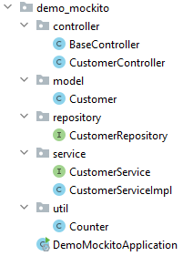

## Mockito

Meszaros gebruikt de term `Test Double` als de algemene term voor elk soort voorwerp dat wordt gebruikt in plaats van
een echt voorwerp voor testdoeleinden. De naam komt van het begrip "stuntdubbel" in films. (Een van zijn doelstellingen
was te vermijden een naam te gebruiken die reeds algemeen gebruikt werd.) Meszaros definieert vijf specifieke
soorten dubbelgangers:

- `Dummy` - objecten worden doorgegeven, maar nooit echt gebruikt. Meestal worden ze alleen gebruikt om parameterlijsten
  te vullen.
- `Fake` - objecten hebben eigenlijk werkende implementaties, maar nemen meestal een kortere weg waardoor ze niet
  geschikt zijn voor productie (een database in het geheugen is een goed voorbeeld).
- `Stubs` - geven antwoorden op oproepen die tijdens de test worden gedaan, en reageren meestal niet op iets buiten wat
  voor de test is geprogrammeerd.
- `Spies` - zijn stubs die ook informatie opnemen op basis van de manier waarop ze werden opgeroepen. Een voorbeeld
  hiervan is een e-maildienst die bijhoudt hoeveel berichten er zijn verstuurd.
- `Mocks` - dit is wat we gaan doen: je verwacht dat er iets uitkomt. De mock-object genereren wat er gebeurd, dit zijn
  objects met methodes die voorgeprogrammeerde antwoorden kunnen geven.

We gaan mocken met het pakket Mockito: een database testen.

### Behavior Driven Development

Behavior Driven Development (BDD) testen draait om "given", "when" en "then".

- `given`, initiële context
- `when`, de gebeurtenis plaatsvindt
- `then`, sommige uitkomsten garanderen

### Initializr

Ga naar de website <a href="https://start.spring.io" target="_blank">spring.io</a>. De volgende gegevens vul je in voor
het eerste Spring Boot project.

- Project: vink aan `Maven Project`
- Language: vink aan `Java`
- Spring Boot: vink aan `2.5.5` (laatste versie)
- Project Metadata: vul informatie in over jouw project
    - Group: `com.example` (identifier van de ontwikkelaar)
    - Artifact: `demo_mockito` (hoe heet je project)
    - Name: `demo_mockito` (hoe heet je project)
    - Description: `Demo project for Spring Boot`
    - Package name: maakt het systeem zelf aan
    - Packaging: vink aan `Jar`
    - Java: vink aan `11`

Klik op "add dependencies" en voeg `Spring Web`, `Spring Data JPA`, `MySQL Driver` en `PostgreSQL Driver` toe.

Met "generate" wordt er een bestand in jouw download map gezet. Unzip het bestand en open het in Intellij.

Klik vervolgens rechtsonder in IntelliJ op `Load`.


Ga naar File > Project Structure en zet `Project SDK` op 11. Klik op apply.

### pom.xml

Wanneer je in `pom.xml` een foutmelding krijgt, zet je de `<parent>` versie op `<version>2.4.3</version>` en wanneer je
een foutmelding in de `<plugin>` krijg zet je de versie er tussen op de volgende
manier: `<version>${project.parent.version}</version>`.

Om JUnit goed te laten werken moeten we JUnit 4 excluden en JUnit5 toevoegen.

De pom.xml heeft de volgende structuur:

```xml
<?xml version="1.0" encoding="UTF-8"?>
<project xmlns="http://maven.apache.org/POM/4.0.0" xmlns:xsi="http://www.w3.org/2001/XMLSchema-instance"
         xsi:schemaLocation="http://maven.apache.org/POM/4.0.0 https://maven.apache.org/xsd/maven-4.0.0.xsd">
    <modelVersion>4.0.0</modelVersion>
    <parent>
        <groupId>org.springframework.boot</groupId>
        <artifactId>spring-boot-starter-parent</artifactId>
        <version>2.4.3</version>
        <relativePath/> <!-- lookup parent from repository -->
    </parent>
    <groupId>com.example</groupId>
    <artifactId>demo_mockito</artifactId>
    <version>0.0.1-SNAPSHOT</version>
    <name>demo_mockito</name>
    <description>Demo project for Spring Boot</description>
    <properties>
        <java.version>11</java.version>
    </properties>
    <dependencies>
        <dependency>
            <groupId>org.springframework.boot</groupId>
            <artifactId>spring-boot-starter-data-jpa</artifactId>
        </dependency>
        <dependency>
            <groupId>org.springframework.boot</groupId>
            <artifactId>spring-boot-starter-web</artifactId>
        </dependency>

        <dependency>
            <groupId>mysql</groupId>
            <artifactId>mysql-connector-java</artifactId>
            <scope>runtime</scope>
        </dependency>
        <dependency>
            <groupId>org.postgresql</groupId>
            <artifactId>postgresql</artifactId>
            <scope>runtime</scope>
        </dependency>
        <dependency>
            <groupId>org.springframework.boot</groupId>
            <artifactId>spring-boot-starter-test</artifactId>
            <scope>test</scope>
            <exclusions>
                <!-- exclude junit 4 -->
                <exclusion>
                    <groupId>org.junit.vintage</groupId>
                    <artifactId>junit-vintage-engine</artifactId>
                </exclusion>
            </exclusions>
        </dependency>
        <!-- junit 5 -->
        <dependency>
            <groupId>org.junit.jupiter</groupId>
            <artifactId>junit-jupiter-engine</artifactId>
            <scope>test</scope>
        </dependency>
    </dependencies>

    <build>
        <plugins>
            <plugin>
                <groupId>org.springframework.boot</groupId>
                <artifactId>spring-boot-maven-plugin</artifactId>
                <version>${project.parent.version}</version>
            </plugin>
        </plugins>
    </build>

</project>
```

### Project

De [database](https://github.com/danielle076/demo_mockito) dat we gaan testen met Mockito bestaat uit het volgende.



### Model

In `model` zie je een aantal extra methodes die de leeftijd berekenen zoals `getAge` nu (now) en `getAge` op een
bepaalde datum (onDate). Deze maken gebruik van de lokale methode `calculateAge` die de periode berekend tussen de
birthDate en de currentDate.

```
public int getAge() {
        return getAge(LocalDate.now());
    }

    public int getAge(LocalDate onDate) {
        return calculateAge(this.dateOfBirth, onDate);
    }

    private static int calculateAge(LocalDate birthDate, LocalDate currentDate) {
        if ((birthDate != null) && (currentDate != null)) {
            return Period.between(birthDate, currentDate).getYears();
        } else {
            return 0;
        }
    }
```

We hebben twee attributen `firstName` en `lastNAme`, maar soms wil je de volledige naam hebben en dit doen we met de
methode `getFullName`.

```
    public String getFullName() {
        return this.getFirstName() + " " + this.getLastName();
    }
```

### JUnit

Voor de packages `model` en `util` gebruiken we JUnit5 om te testen.

`@BeforeEach` is een setup methode die voor iedere test wordt uitgevoerd. Deze `@BeforeEach` maakt een customer met een
naam en een geboortedatum en die gebruiken we in twee testen.

_CustomerTest.java_

```java
package com.example.demo_mockito.model;

import org.junit.jupiter.api.BeforeEach;
import org.junit.jupiter.api.Test;

import java.time.LocalDate;

import static org.junit.jupiter.api.Assertions.assertEquals;

class CustomerTest {

    private Customer customer;

    @BeforeEach
    void setUp() {
        this.customer = new Customer("Albert", "Einstein");
        this.customer.setDateOfBirth(LocalDate.of(1879, 3, 14));
    }

    @Test
    void testGetFullName() {
        String expectedFullName = "Albert Einstein";
        String actualFullName = this.customer.getFullName();
        assertEquals(expectedFullName, actualFullName);
    }

    @Test
    void testGetAge() {
        int expectedAge = 76;
        int actualAge = customer.getAge(LocalDate.of(1955, 4, 18));
        assertEquals(expectedAge, actualAge);
    }
}
```

_CounterTest.java_

```java
package com.example.demo_mockito.util;

import org.junit.jupiter.api.Test;

import static org.junit.jupiter.api.Assertions.assertEquals;

class CounterTest {

    @Test
    void simpelTest() {
        String s = "abcdefg";
        String upper = s.toUpperCase();
        assertEquals("ABCDEFG", upper);
    }

    @Test
    void simpelTest2() {
        String s = "ABCDEFG";
        String actual = s.toLowerCase();
        assertEquals("abcdefg", actual);
    }

    @Test
    void testCounter() {
        // arange
        Counter counter = new Counter();

        // act
        counter.add(10);

        // assert
        assertEquals(10, counter.getTotal());
    }


    @Test
    void testTellerAdd() {
        // given
        Counter counter = new Counter();

        counter.add(45);
        counter.add(67);
        counter.add(32);

        // when
        int actual = counter.getTotal();

        // then
        int expected = 144;
        assertEquals(expected, actual);
    }
}
```

### Mockito

De packages `controller`, `repository` en `service` testen we met Mockito.

`IntegrationTest` betekend dat je niet meer bezig bent met één element/klasse, maar een integratie van een aantal
klasses/lagen.

We importeren `Mockito` en `Mock`.

    import org.mockito.Mock;
    import org.mockito.Mockito;

We moeten de configuration van Spring Boot aanpassen: `@ContextConfiguration(classes = {DemoMockitoApplication.class}`
en verwijzen naar het project. Als we dit niet zouden doen dan maakt Spring Boot er een webservice van. Ook zeg je niet
dat het een SpringBoot application is maar een `@SpringBootTest()`.

    @SpringBootTest()
    @ContextConfiguration(classes = {DemoMockitoApplication.class})

#### Service

We doen de `@Autowired` naar de customerService.

    @Autowired
    private CustomerService customerService;

`@MockBean` zorgt ervoor dat de repository stil wordt gezet. We willen niet dat de repository naar de database gaat,
maar we willen dat hij een voorgeprogrammeerd antwoord teruggeeft.

    @MockBean
    private CustomerRepository customerRepository;

Als je een methode, bijvoorbeeld `getCustomerByLastName`, in de service doet, krijg je dan het goede antwoord. Dit doe
je door de repository te vervangen met een `@MockBean`.

_CustomerServiceImplIntegrationTest_

```java
package com.example.demo_mockito.service;

import com.example.demo_mockito.DemoMockitoApplication;
import com.example.demo_mockito.model.Customer;
import com.example.demo_mockito.repository.CustomerRepository;
import org.junit.jupiter.api.BeforeEach;
import org.junit.jupiter.api.Test;
import org.mockito.Mock;
import org.mockito.Mockito;
import org.springframework.beans.factory.annotation.Autowired;
import org.springframework.boot.test.context.SpringBootTest;
import org.springframework.boot.test.mock.mockito.MockBean;
import org.springframework.test.context.ContextConfiguration;

import static org.junit.jupiter.api.Assertions.assertEquals;
import static org.junit.jupiter.api.Assertions.assertNull;

@SpringBootTest()
@ContextConfiguration(classes = {DemoMockitoApplication.class})
public class CustomerServiceImplIntegrationTest {

    @Autowired
    private CustomerService customerService;

    @MockBean
    private CustomerRepository customerRepository;

    @Mock
    Customer customer;

    @BeforeEach
    public void setUp() {
    }

    @Test
    public void testGetCustomerByLastName() {
        customer = new Customer("Albert", "Einstein");

        Mockito
                .when(customerRepository.findByLastName(customer.getLastName()))
                .thenReturn(customer);

        String name = "Einstein";
        String expected = "Albert Einstein";

        Customer found = customerService.getCustomerByLastName(name);

        assertEquals(expected, found.getFullName());
    }

    @Test
    public void testGetCustomerByLastName2() {
        customer = new Customer("Albert", "Einstein");

        Mockito
                .doReturn(customer)
                .when(customerRepository)
                .findByLastName("Einstein");

        String name = "Einstein";
        String expected = "Albert Einstein";

        Customer found = customerService.getCustomerByLastName(name);

        assertEquals(expected, found.getFullName());
    }

    @Test
    void testGetCustomerByLastNameNotFound() {
        String name = "EinsteinXXX";

        // Setup our mock repository
        Mockito
                .doReturn(null).when(customerRepository)
                .findByLastName(name);

        // Execute the service call
        Customer found = customerService.getCustomerByLastName(name);

        // Assert the response
        assertNull(found, "Widget should not be found");
    }
}
```

Bij het testen van de service, mocken we de repository.

#### Repository

Bij de repository gebruik je `@DataJpaTest`.

We gebruiken een `entityManager` die zich voor doet als een database.

In de repository testen we of de methode `findByLastName` op basis van de laatste naam `getLastName()` geeft wat we
verwachten.

```java
package com.example.demo_mockito.repository;

import com.example.demo_mockito.DemoMockitoApplication;
import com.example.demo_mockito.model.Customer;
import org.junit.jupiter.api.Test;
import org.springframework.beans.factory.annotation.Autowired;
import org.springframework.boot.test.autoconfigure.orm.jpa.DataJpaTest;
import org.springframework.boot.test.autoconfigure.orm.jpa.TestEntityManager;
import org.springframework.test.context.ContextConfiguration;

import static org.junit.jupiter.api.Assertions.assertEquals;

@DataJpaTest
@ContextConfiguration(classes = {DemoMockitoApplication.class})
class CustomerRepositoryIntegrationTest {

    @Autowired
    private TestEntityManager entityManager;

    @Autowired
    private CustomerRepository customerRepository;

    @Test
    void testFindByLastLast() {
        // given
        Customer customer = new Customer("Albert", "Einstein");
        entityManager.persist(customer);
        entityManager.flush();

        // when
        Customer found = customerRepository.findByLastName(customer.getLastName());

        // then
        String expected = "Albert Einstein";
        String actual = found.getFullName();
        assertEquals(expected, actual);
    }
}
```

#### Controller

Bij `BaseControllerIntegrationTest.java` maak je gebruik van `@AutoConfigureMockMvc`. De hele webservice `mvc` wordt
hiermee gemocked.

_BaseControllerIntegrationTest.java_

```java
package com.example.demo_mockito.controller;

import org.junit.jupiter.api.Test;
import org.springframework.beans.factory.annotation.Autowired;
import org.springframework.boot.test.autoconfigure.web.servlet.AutoConfigureMockMvc;
import org.springframework.boot.test.context.SpringBootTest;
import org.springframework.test.web.servlet.MockMvc;

import static org.springframework.test.web.servlet.request.MockMvcRequestBuilders.get;
import static org.springframework.test.web.servlet.result.MockMvcResultMatchers.content;
import static org.springframework.test.web.servlet.result.MockMvcResultMatchers.status;

@SpringBootTest
@AutoConfigureMockMvc
class BaseControllerIntegrationTest {

    @Autowired
    private MockMvc mvc;

    @Test
    void EndpointTest() throws Exception {
        mvc.perform(get("/"))
                .andExpect(status().isOk())
                .andExpect(content().string("/customers endpoint available"));
    }
}
```

We maken bij `CustomerControllerIntegrationTest.java` een mock van de service: `private CustomerService service;`, dit betekend dat de service een voorgeprogrammeerde response terugkrijgt.

_CustomerControllerIntegrationTest.java_

```java
package com.example.demo_mockito.controller;

import com.example.demo_mockito.DemoMockitoApplication;
import com.example.demo_mockito.model.Customer;
import com.example.demo_mockito.service.CustomerService;
import org.junit.jupiter.api.Test;
import org.springframework.beans.factory.annotation.Autowired;
import org.springframework.boot.test.autoconfigure.web.servlet.WebMvcTest;
import org.springframework.boot.test.mock.mockito.MockBean;
import org.springframework.http.MediaType;
import org.springframework.test.context.ContextConfiguration;
import org.springframework.test.web.servlet.MockMvc;

import java.util.Arrays;
import java.util.List;

import static org.hamcrest.Matchers.hasSize;
import static org.hamcrest.Matchers.is;
import static org.mockito.BDDMockito.given;
import static org.springframework.test.web.servlet.request.MockMvcRequestBuilders.get;
import static org.springframework.test.web.servlet.result.MockMvcResultMatchers.jsonPath;
import static org.springframework.test.web.servlet.result.MockMvcResultMatchers.status;

@WebMvcTest
@ContextConfiguration(classes = {DemoMockitoApplication.class})
public class CustomerControllerIntegrationTest {

    @Autowired
    private MockMvc mvc;

    @MockBean
    private CustomerService service;

    @Test
    public void testEndpointCustomers() throws Exception {

        Customer customer = new Customer("Albert", "Einstein");

        List<Customer> allCustomers = Arrays.asList(customer);

        given(service.getAllCustomers()).willReturn(allCustomers);

        mvc.perform(get("/customers")
                        .contentType(MediaType.APPLICATION_JSON))
                .andExpect(status().isOk())
                .andExpect(jsonPath("$", hasSize(1)))
                .andExpect(jsonPath("$[0].lastName", is(customer.getLastName())));
    }
}
```

### Prioriteit testen

Het testen van de `service` is het belangrijkst, want hier zit alle intelligentie in. `Controller` en `repository` kun je
daarnaast testen, om een volledige coverage te hebben. `Model` en `util` zijn minder belangrijk, deze test je alleen met
JUnit.

### Mijn webservice inlog

- user: admin 
- password: p4ssw0rd