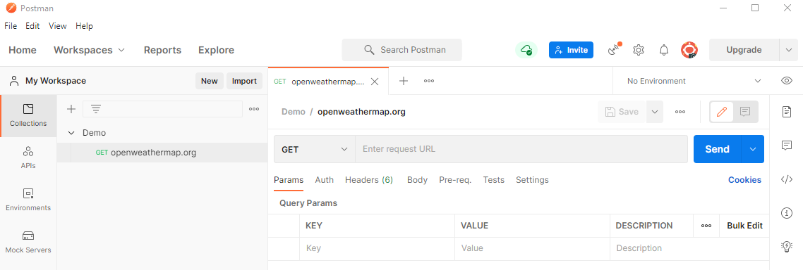
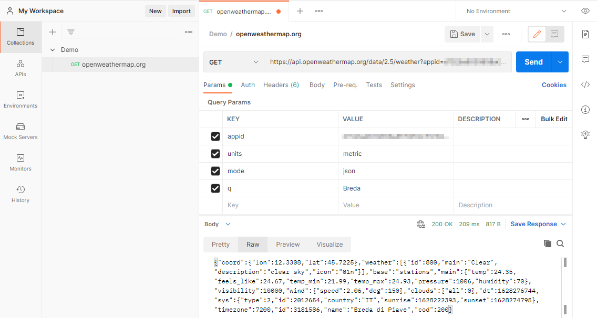
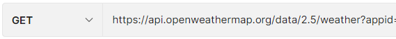
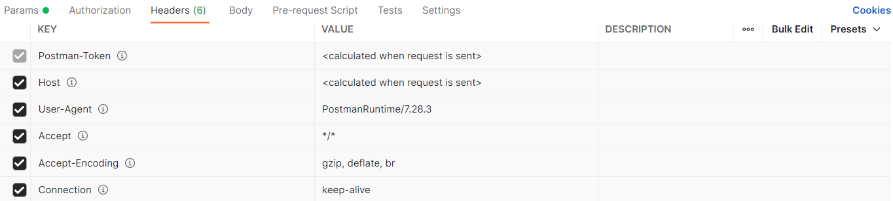
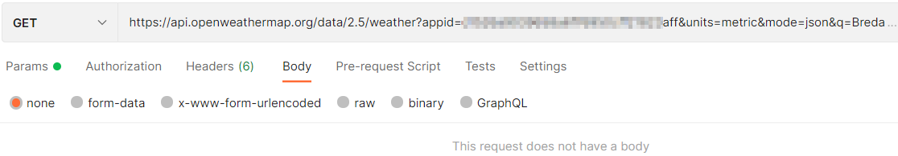
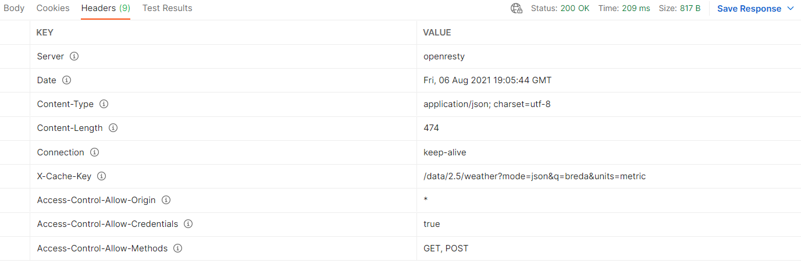
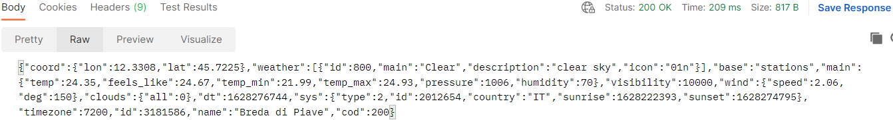

## Postman

Download Postman.

- https://www.postman.com/downloads/

### API

We gaan een API schrijven, een webservice. Dit is een voorbeeld van een API url.

- http://api.openweathermap.org/data/2.5/weather?appid='idnummerhier'aff&units=metric&mode=json&q=Breda

Een API is een manier om data op te vragen. JSON is de taal die we gebruiken, deze taal kan makkelijk om worden gezet voor de gebruiker (bijvoorbeeld de gebruiker JavaScript).

### Voorbeeld Postman

In Postman maak je een nieuwe Workspace (of je blijft in My Workspace) en daarin maak je een nieuwe collection aan met het plusje. Nadat je een nieuwe collection hebt gemaakt klik je op "add a request" en die geef je ook een naam.

In "Enter request URL" zet je de URL van de API en druk je op send.

Postman zul je veel gaan gebruiken om je web API of webservice te testen. Je zet je URL in de request URL en kijkt wat er uitkomt aan data.

### Methode HTTP request

Je hebt verschillende methodes. In het bovenstaande voorbeeld hebben we gebruik gemaakt van de `GET` method. De GET is de HTTP methode die ook gebruikt word in de browser. In dit geval geeft het een JSON terug. 

Naast `GET` ga je andere methodes gebruiken zoals `POST`, `PUT`, `PATCH` en `DELETE`. 

### Header HTTP request

In `Headers` staat extra informatie over bijvoorbeeld wie het stuurt (`user-agent`) en wat voor formaat je kan accepteren (`*/*`): je wilt bijvoorbeeld JSON terug.

Postman zet dit automatisch voor je klaar.

### Body HTTP request

In een `GET` request is de body leeg. Dit betekent dat er geen informatie wordt meegezonden anders dan de query (de query url) die we willen hebben.

Wanneer er een formulier op een website staat en na het invullen moet je op submit klikken, dan wordt de data van het formulier verstuurd naar de server (vaak met een POST methode i.p.v. GET methode). In de body staat de data die nodig is om dit te doen. Dit is een actie vanuit de frontend naar de backend.

Een voorbeeld. Je gaat inloggen op https://edhub.novi.nl/auth/login, dan zie je bij het inspecteren > network > login > headers dat de request methode een `POST` is.

### Status code HTTP response

In bovenstaand voorbeeld zie je een status code staan. Deze code geeft aan of het goed is gegaan of niet. Status code 200 betekend er is een verzoek heen en weer geweest en dit is goed gegaan.

### Header HTTP response

De HTTP response kent ook een header en hier staat extra informatie in.

### Body HTTP response

De body krijg je de JSON terug.

