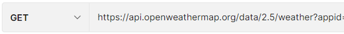
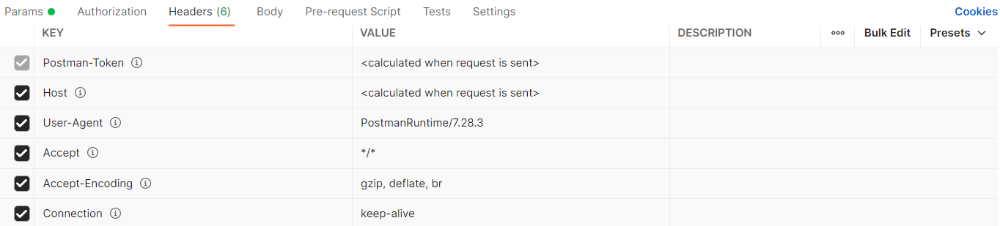
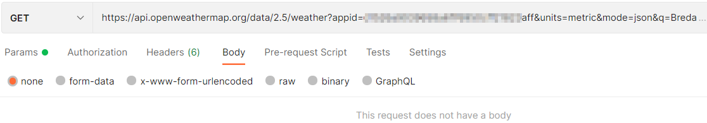
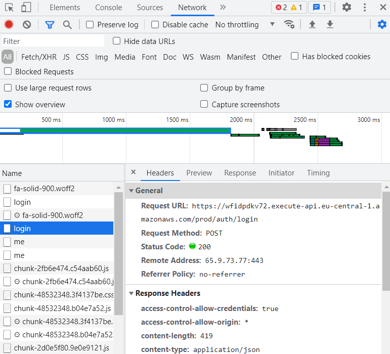
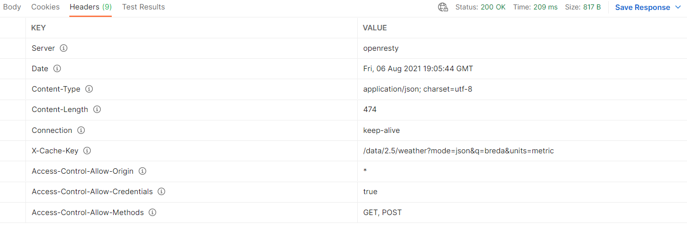
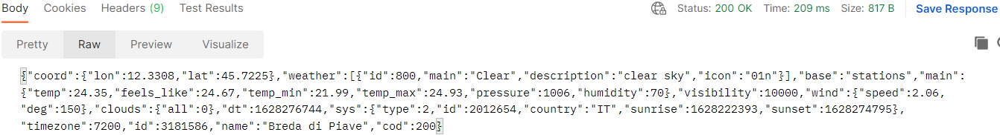

## Postman

Download Postman:

- https://www.postman.com/downloads/

### API

We gaan een API schrijven, een webservice. Dit is een voorbeeld van een API url.

- http://api.openweathermap.org/data/2.5/weather?appid='idnummerhier'aff&units=metric&mode=json&q=Breda

Een API is een manier om data op te vragen. JSON is de taal die we gebruiken, deze taal kan makkelijker om worden gezet voor de gebruiker (bijvoorbeeld JavaScript).

### Voorbeeld Postman

In Postman maak je een Workspace (of je blijft in My Workspace) en daarin maak je een nieuwe collectie aan. Nadat je een nieuwe collectie hebt gemaakt klik je op "add a request" en die geef je ook een naam.

In "Enter request URL" zet je de URL van de API en druk je op send.

Postman ga je veel gebruiken om je web API of webservice te testen. Je zet je URL in de request URL en kijkt wat er dan uitkomt aan data.

### Methode HTTP request

Je hebt verschillende methodes. In het bovenstaande voorbeeld hebben we gebruik gemaakt van de `GET` method. De GET is de HTTP methode die ook gebruikt word in de browser. In dit geval geeft het een JSON terug. 

### Header HTTP request

In de header staat extra informatie over bijvoorbeeld wie het stuurt (`user-agent`) wat voor formaat kun je accepteren (`*/*`), je wilt bijvoorbeeld JSON terug etc.

Postman zet dit automatisch voor je klaar.

### Body HTTP request

In een `GET` request is de body leeg. Dit betekend dat er geen informatie wordt meegezonden anders dan de query (de query url) die we willen hebben.

Wanneer je een formulier op een website hebt en na het invullen moet je op submit klikken, dan wordt de data van het formulier wel verstuurd naar de server (vaak met een POST ipv GET methode) en dan staat er in de body de data die nodig is om dit te doen. Dit is dus vanuit de frontend naar de backend.

Wanneer ik bijvoorbeeld inlog op https://edhub.novi.nl/auth/login, dan zie je bij het inspecteren > network > login > headers dat de request method een `POST` is.

### Status code HTTP response

De status code zie je in bovenstaand voorbeeld staan. De code geeft aan of het goed is gegaan of niet. Status code 200 betekend er is een verzoek heen en weer geweest en dit is goed gegaan.

### Header HTTP response

De HTTP response kent ook een header en hier staat extra informatie in.

### Body HTTP response

De body krijg je de JSON terug.

