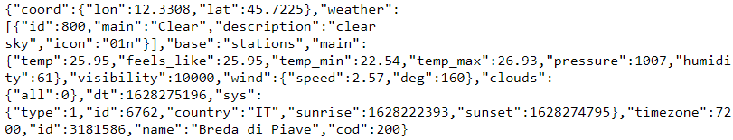
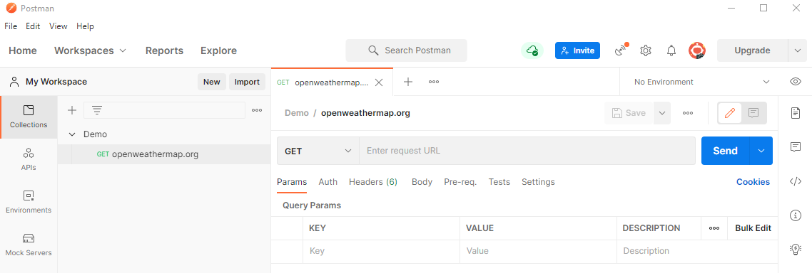
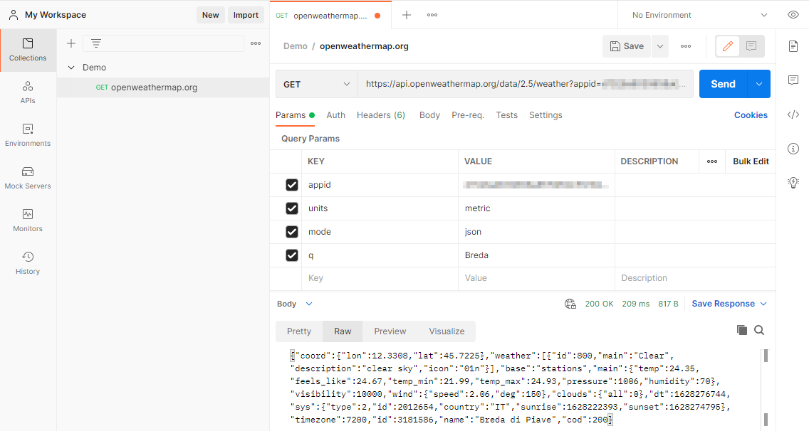

## Postman

Download Postman:

- https://www.postman.com/downloads/

### API

We gaan een API schrijven, een webservice. Dit is een voorbeeld van een API url.

- http://api.openweathermap.org/data/2.5/weather?appid='idnummerhier'aff&units=metric&mode=json&q=Breda

Een API is een manier om data op te vragen. JSON is de taal die we gebruiken, deze taal kan makkelijker om worden gezet voor de gebruiker (bijvoorbeeld JavaScript).

### Voorbeeld Postman

In Postman maak je een Workspace (of je blijft in My Workspace) en daarin maak je een nieuwe collectie aan. Nadat je een nieuwe collectie hebt gemaakt klik je op "add a request" en die geef je ook een naam.

In "Enter request URL" zet je de URL van de API en druk je op send.

Postman ga je veel gebruiken om je web API of webservice te testen. Je zet je URL in de request URL en kijkt wat er dan uitkomt aan data.
