## Project Questions

### Spring initializr

Spring initializr genereert een basis project in Java met Spring Boot.

Ga naar de website <a href="https://start.spring.io" target="_blank">spring.io</a>. De volgende gegevens vul je in voor
het eerste Spring Boot project.

- Project: vink aan `Maven Project`
- Language: vink aan `Java`
- Spring Boot: vink aan `2.5.4` (laatste versie)
- Project Metadata: vul informatie in over jouw project
    - Group: `nl.danielle` (identifier van de ontwikkelaar)
    - Artifact: `demo_springboot` (hoe heet je project)
    - Name: `demo_springboot` (hoe heet je project)
    - Description: `Demo project for Spring Boot`
    - Package name: maakt het systeem zelf aan
    - Packaging: vink aan `Jar`
    - Java: vink aan `11`

Klik op "add dependencies" en voeg `Spring Web` toe.

Met "generate" wordt er een bestand in jouw download map gezet. Unzip het bestand en open het in Intellij.

Klik vervolgens rechtsonder in IntelliJ op `Load`.


Ga naar File > Project Structure en zet `Project SDK` op 11. Klik op apply.

### Spring Boot errors


Klik op "Trust project..." in de gele balk.

Wanneer de error niet weg is klik je op File > Invalidate Caches > Invalidate and Restart.

### Annotatie @SpringBootApplication

Een Spring Boot applicatie heeft net als elke java applicatie een main klasse met daarin een main methode. Ook bij
Spring Boot is dit de startlocatie van de applicatie.

Je herkent Spring Boot aan de annotatie `@SpringBootApplication`. Dat is wat ervoor zorgt dat Spring Boot wordt
geactiveerd. Onder de motorkap gaat Spring Boot aan de gang om het project te configureren en op te starten.

```java
package com.danielle.demo_springboot;

import org.springframework.boot.SpringApplication;
import org.springframework.boot.autoconfigure.SpringBootApplication;

@SpringBootApplication
public class DemoSpringbootApplication {

    public static void main(String[] args) {
        SpringApplication.run(DemoSpringbootApplication.class, args);
    }
}
```

### Run applicatie

Run de applicatie om te testen of je geen foutmeldingen krijgt. Wanneer je de
melding `Started DemoSpringbootApplication` krijgt draait de applicatie.

Stop de applicatie.

### Server port

Standaard kiest het systeem port `8080` om mee te werken. Wanneer deze port niet beschikbaar is kun je aangeven om te
werken met een andere port.

Spring Boot werkt volgens een "convention over configuration" aanpak. Spring Boot detecteert tijdens het opstarten van
de applicatie een bestand met de naam application.properties in de
`src/main/resources` directory.

De application.properties is een bestand waarin je allerlei eigenschappen van je project kwijt kunt. Bijvoorbeeld de
settings, verbinding naar de database en een andere server port. Ga naar resources > application.properties en voer de
volgende code in.

    server.port=8081

### Hello World

We gaan een Hello World maken in `DemoSpringbootApplication.java`.

We voegen een annotatie `@RestController` toe aan de class. Daarna gaan we een nieuwe methode maken `sayHello` die een
annotatie `@GetMapping` heeft.

De `@RestController` is de ontvangst plek. Die zorgt dat de HTTP request wordt opgevangen en dat er een HTTP response
terug gaat.

Alles wat onder `@GetMapping` staat is de volledige backend. Als je de `/` meegeeft, zeg dan `Hello World`.

```java
package com.danielle.demo_springboot;

import org.springframework.boot.SpringApplication;
import org.springframework.boot.autoconfigure.SpringBootApplication;
import org.springframework.web.bind.annotation.GetMapping;
import org.springframework.web.bind.annotation.RestController;

@RestController
@SpringBootApplication
public class DemoSpringbootApplication {

    public static void main(String[] args) {
        SpringApplication.run(DemoSpringbootApplication.class, args);
    }

    @GetMapping(value = "/")
    public static String sayHello() {
        return "Hello World!";
    }
}
```

Run de applicatie.

Ga naar de browser met de volgende url: `http://localhost:8080/`. Op het beeldscherm verschijnt `Hello World!`.

### Endpoint

We maken een nieuwe `@GetMapping` met endpoint `/danielle`.

```java
package com.danielle.demo_springboot;

import org.springframework.boot.SpringApplication;
import org.springframework.boot.autoconfigure.SpringBootApplication;
import org.springframework.web.bind.annotation.GetMapping;
import org.springframework.web.bind.annotation.RestController;

@RestController
@SpringBootApplication
public class DemoSpringbootApplication {

    public static void main(String[] args) {
        SpringApplication.run(DemoSpringbootApplication.class, args);
    }

    @GetMapping(value = "/")
    public static String sayHello() {
        return "Hello World!";
    }

    @GetMapping(value = "/danielle")
    public static String sayDanielle() {
        return "Hello Danielle!";
    }
}
```

Run de applicatie.

Ga naar de browser met de volgende url: `http://localhost:8080/danielle`. Op het beeldscherm
verschijnt `Hello Danielle!`.

Dit is een webservice. In jouw eigen computer draait nu een webserver die je kan aanspreken via een url die je data
teruggeeft.

We hebben nu alles in één bestand staan, in één class: `DemoSpringbootApplication.java`, maar het is de bedoeling om
alles in packages te zetten.

### BaseController

Een webservice kan verschillende requests ontvangen en bijbehorende responses teruggeven. In eerste instantie worden de
requests opgevangen door een controller. Een controller vangt een bepaalde HTTP request op en geeft een relevante HTTP
response. Voor iedere endpoint zal er een aparte controller worden gemaakt. Al deze controllers plaatsen we in het
project in een package "controller". Zo houden we alle controllers netjes bij elkaar.

We maken een nieuwe package genaamd `controller`. In deze controller maken we een bestand aan `BaseController.java`.

Alles wat we in `DemoSpringbootApplication.java` hebben gedaan, zetten we in `BaseController.java`.


_DemoSpringbootApplication.java_

```java
package com.danielle.demo_springboot;

import org.springframework.boot.SpringApplication;
import org.springframework.boot.autoconfigure.SpringBootApplication;

@SpringBootApplication
public class DemoSpringbootApplication {

    public static void main(String[] args) {
        SpringApplication.run(DemoSpringbootApplication.class, args);
    }
}
```

_BaseController.java_

```java
package com.danielle.demo_springboot.controller;

import org.springframework.web.bind.annotation.GetMapping;
import org.springframework.web.bind.annotation.RestController;

@RestController
public class BaseController {

    @GetMapping(value = "/")
    public String sayHello() {
        return "Hello World!";
    }

    @GetMapping(value = "/danielle")
    public String sayDanielle() {
        return "Hello Danielle!";
    }
}
```

### QuestionsController.java

We maken een nieuwe controller: `QuestionsController.java`.


Meestal zijn endpoints een collection. Een collection is bijvoorbeeld een aantal vragen. Je endpoint wordt `/questions`.
Het is belangrijk de juiste naamgevingsconventie te gebruiken. Een enkele resource wordt geschreven als enkelvoud. Een
collectie van items als meervoud.

```java
package com.danielle.demo_springboot.controller;

import org.springframework.web.bind.annotation.GetMapping;
import org.springframework.web.bind.annotation.RestController;

@RestController
public class QuestionsController {

    @GetMapping(value = "/questions")  // collection
    public String getQuestions() {
        return "xxx";
    }
}
```

Wanneer je uit die collection 1 wilt hebben, dan doe je `/questions/1`.

```java
package com.danielle.demo_springboot.controller;

import org.springframework.web.bind.annotation.GetMapping;
import org.springframework.web.bind.annotation.RestController;

@RestController
public class QuestionsController {

    @GetMapping(value = "/questions")  // collection
    public String getQuestions() {
        return "xxx";
    }

    @GetMapping(value = "/questions/1")  // item
    public String getQuestion() {
        return "xxx";
    }
}
```

Als je het antwoord wilt hebben op die eerste question: `/questions/1/answer`

```java
package com.danielle.demo_springboot.controller;

import org.springframework.web.bind.annotation.GetMapping;
import org.springframework.web.bind.annotation.RestController;

@RestController
public class QuestionsController {

    @GetMapping(value = "/questions")  // collection
    public String getQuestions() {
        return "xxx";
    }

    @GetMapping(value = "/questions/1")  // item
    public String getQuestion() {
        return "xxx";
    }

    @GetMapping(value = "/questions/1/answer")  // document
    public String getAnswer() {
        return "xxx";
    }
}
```

We maken een array met vragen.

    private String[] questions = {
      "Where is Amsterdam?",
      "Where is New York?"
    };

We maken een array met antwoorden.

    private String[] answers = {
      "In the Netherlands",
      "in US of A"
    };

Om de vragen en antwoorden uit de array te krijgen gebruik je de volgende code bij `item` en document.

    @GetMapping(value = "/questions/1")  // item
    public String getQuestion() {
        return questions[0];
    }

    @GetMapping(value = "/questions/1/answer")  // document
    public String getAnswer() {
        return answers[0];
    }

```java
package com.danielle.demo_springboot.controller;

import org.springframework.web.bind.annotation.GetMapping;
import org.springframework.web.bind.annotation.RestController;

@RestController
public class QuestionsController {

    private String[] questions = {
            "Where is Amsterdam?",
            "Where is New York?"
    };

    private String[] answers = {
            "In the Netherlands",
            "in US of A"
    };

    @GetMapping(value = "/questions")  // collection
    public String getQuestions() {
        return "xxx";
    }

    @GetMapping(value = "/questions/1")  // item
    public String getQuestion() {
        return questions[0];
    }

    @GetMapping(value = "/questions/1/answer")  // document
    public String getAnswer() {
        return answers[0];
    }
}
```

Run de applicatie.

Wanneer je zoekt naar `http://localhost:8080/questions/1` in de webbrowser krijg je `Where is Amsterdam?` en wanneer
je `http://localhost:8080/questions/1/answer` krijg je `In the Netherlands`.

Door het regelen van de url met de endpoint, kun je uit de collectie verschillende questions kan halen.

De `1` is hard gecodeerd, je kan nog niet zoeken naar de `2de` vraag. Dus moet je een argument gaan meegeven. We doen
dit met `{nr}` en `@PathVariable`.

```java
package com.danielle.demo_springboot.controller;

import org.springframework.web.bind.annotation.GetMapping;
import org.springframework.web.bind.annotation.PathVariable;
import org.springframework.web.bind.annotation.RestController;

@RestController
public class QuestionsController {

    private String[] questions = {
            "Where is Amsterdam?",
            "Where is New York?"
    };

    private String[] answers = {
            "In the Netherlands",
            "in US of A"
    };

    @GetMapping(value = "/questions")  // collection
    public String getQuestions() {
        return "xxx";
    }

    @GetMapping(value = "/questions/{nr}")  // item
    public String getQuestion(@PathVariable int nr) {
        return questions[nr - 1];
    }

    @GetMapping(value = "/questions/{nr}/answer")  // document
    public String getAnswer(@PathVariable int nr) {
        return answers[nr - 1];
    }
}
```

Run de applicatie.

Wanneer je in de webbrowser url `http://localhost:8080/questions/2` opvraagt, krijg je de 2de vraag.

Als laatste hebben we endpoint `/questions`. We willen alle questions opvragen. Dit doe je met `String[]`.

```java
package com.danielle.demo_springboot.controller;

import org.springframework.web.bind.annotation.GetMapping;
import org.springframework.web.bind.annotation.PathVariable;
import org.springframework.web.bind.annotation.RestController;

@RestController
public class QuestionsController {

    private String[] questions = {
            "Where is Amsterdam?",
            "Where is New York?"
    };

    private String[] answers = {
            "In the Netherlands",
            "in US of A"
    };

    @GetMapping(value = "/questions")  // collection
    public String[] getQuestions() {
        return questions;
    }

    @GetMapping(value = "/questions/{nr}")  // item
    public String getQuestion(@PathVariable int nr) {
        return questions[nr - 1];
    }

    @GetMapping(value = "/questions/{nr}/answer")  // document
    public String getAnswer(@PathVariable int nr) {
        return answers[nr - 1];
    }
}
```

Run de applicatie.

In de webbrowser kun je de hele collectie opvragen met `http://localhost:8080/questions`. Je krijgt een array terug.


##### Gebruik static

In `DemoSpringbootApplication.java` moet het static zijn omdat het een static klasse is, in de `BaseController.java`
hoeft de static er niet in te zitten. Deze mag je weglaten (het is beter om het niet te doen).

Wanneer je static gebruikt, hoort dit bij de instantie en niet bij de klasse.

### Query String

Stel je wilt met een query string `?name=Danielle` ervoor zorgen dat het systeem zegt "Hello Danielle!".

_BaseController.java_

    @GetMapping("/name")
    public String getName(@RequestParam String name) {
      return "Hello " + name + "!";
    }

Ga naar de browser met de volgende url `http://localhost:8080/name/?name=danielle`. Hij laat "Hello Danielle!" zien.

Als de naam leeg is, hebben we een probleem. We maken een if-statement.

    @GetMapping("/name")
    public String getName(@RequestParam(required = false) String name) {
      if (name == null) {
        return "Hello you!";
      } else {
        return "Hello " + name + "!";
      }
    }

### PersoonController

We gaan een collectie maken die we kunnen aanpassen. Java arrays kunnen niet veranderd worden, die maak je een keer en
die kunnen niet meer groeien. Dus hier heb je iets anders voor nodig, namelijk een ArrayList.

We maken een nieuwe controller: `PersonController.java`.

We gaan een ArrayList van personen maken.

```java
package com.danielle.demo_springboot.controller;

import org.springframework.web.bind.annotation.RestController;

import java.util.ArrayList;
import java.util.List;

@RestController
public class PersonController {
    private static List<String> personen = new ArrayList<>();
}
```

We gaan opvragen hoe dit eruit ziet met een `@GetMapping` en endpoint `/personen`.

```java
package com.danielle.demo_springboot.controller;

import org.springframework.http.ResponseEntity;
import org.springframework.web.bind.annotation.GetMapping;
import org.springframework.web.bind.annotation.RestController;

import java.util.ArrayList;
import java.util.List;

@RestController
public class PersonController {
    private static List<String> personen = new ArrayList<>();

    @GetMapping(value = "/personen")
    public ResponseEntity getPersonen() {
        return ResponseEntity.ok(personen);
    }
}
```

We gebruiken in plaats van `String` een `ResponseEntity`, omdat hier meer informatie inzit en hij is flexibeler. In een
response zit een statuscode, een header en een body. De body is `(personen)` en de statuscode is `ok`.

Iedere response gaat vergezeld van een status code die aan de client laat weten of de request succesvol is afgehandeld.
Bij een GET request wordt er een 200 OK status code teruggegeven als de operatie is gelukt. Afhankelijk van de reden
waarom een request niet is geslaagd kan een andere status code worden teruggegeven.

Hetzelfde doen we voor een `{nr}` (of id).

```java
package com.danielle.demo_springboot.controller;

import org.springframework.http.ResponseEntity;
import org.springframework.web.bind.annotation.GetMapping;
import org.springframework.web.bind.annotation.PathVariable;
import org.springframework.web.bind.annotation.RestController;

import java.util.ArrayList;
import java.util.List;

@RestController
public class PersonController {
    private static List<String> personen = new ArrayList<>();

    @GetMapping(value = "/personen")
    public ResponseEntity getPersonen() {
        return ResponseEntity.ok(personen);
    }

    @GetMapping(value = "/personen/{nr}")
    public ResponseEntity getPerson(@PathVariable int nr) {
        return ResponseEntity.ok(personen.get(nr));
    }
}
```

`(personen.get(nr))`: de ArrayList `personen` heeft een methode `.get` en daar kun je een `nr` mee opvragen.

### @PostMapping

In de ArrayList zit nog niets, maar dat gaan we toevoegen in Postman. We maken een `@PostMapping` op de collectie, dus
op `/personen`.

```java
package com.danielle.demo_springboot.controller;

import org.springframework.http.ResponseEntity;
import org.springframework.web.bind.annotation.*;

import java.util.ArrayList;
import java.util.List;

@RestController
public class PersonController {
    private static List<String> personen = new ArrayList<>();

    @GetMapping(value = "/personen")
    public ResponseEntity getPersonen() {
        return ResponseEntity.ok(personen);
    }

    @GetMapping(value = "/personen/{nr}")
    public ResponseEntity getPerson(@PathVariable int nr) {
        return ResponseEntity.ok(personen.get(nr));
    }

    @PostMapping(value = "/personen")
    public ResponseEntity addPerson(@RequestBody String persoon) {
        personen.add(persoon);
        return ResponseEntity.ok("Toegevoegd");
    }
}
```

De methode `addPerson` heeft informatie over wat voor person je wilt meegeven, dat zit in een `@RequestBody`. Dus in de
body gaan we een String meegeven van een persoon en deze persoon moet toegevoegd worden aan een lijst en dat doe je
met `personen.add(persoon)`. Wanneer hij is toegevoegd krijg je een melding `Toegevoegd` en statuscode `ok`.

Run de applicatie.

Wanneer je in Postman zoekt naar url `http://localhost:8080/personen` met `GET` krijg je een lege array `[]`.

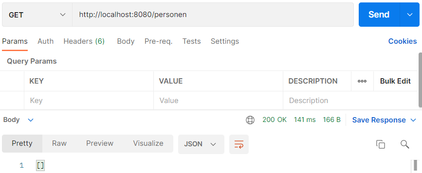

Aan personen gaan we een naam toevoegen, dit doe je in Postman met `POST` en in de body van request.

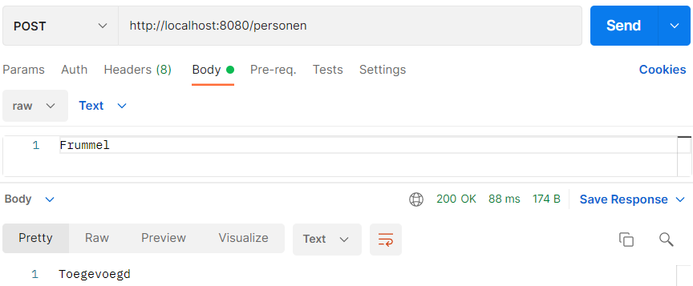

Je ziet in de body van response een melding "Toegevoegd" en je krijgt status code 200 `OK`.

Wanneer je url `http://localhost:8080/personen` met `GET` doet is de naam toegevoegd aan de array.

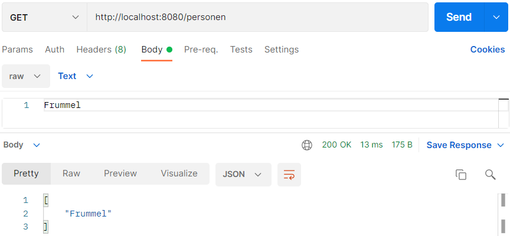

### @DeleteMapping

Bij een delete request geef je aan dat het betreffende item uit de collectie moet worden verwijderd, je hoeft
geen `data` terug te geven. In de URL wordt het nr meegegeven van het item dat moet worden verwijderd.

Met `personen.remove(nr);` verwijderen we de naam die is gelinkt aan het nummer die je verwijderd.

Bij het verwijderen wordt vaak de status `NO_CONTENT` i.p.v. `OK` gebruikt.

```java
package com.danielle.demo_springboot.controller;

import org.springframework.http.ResponseEntity;
import org.springframework.web.bind.annotation.*;

import java.util.ArrayList;
import java.util.List;

@RestController
public class PersonController {
    private static List<String> personen = new ArrayList<>();

    @GetMapping(value = "/personen")
    public ResponseEntity getPersonen() {
        return ResponseEntity.ok(personen);
    }

    @GetMapping(value = "/personen/{nr}")
    public ResponseEntity getPerson(@PathVariable int nr) {
        return ResponseEntity.ok(personen.get(nr));
    }

    @PostMapping(value = "/personen")
    public ResponseEntity addPerson(@RequestBody String persoon) {
        personen.add(persoon);
        return ResponseEntity.ok("Toegevoegd");
    }

    @DeleteMapping(value = "/personen/{nr}")
    public ResponseEntity deletePerson(@PathVariable int nr) {
        personen.remove(nr);
        return ResponseEntity.ok("Verwijderd");
    }
}
```

Run de applicatie.

We voegen een paar namen toe in Postman: Frummel, Freckle en Frizzle.

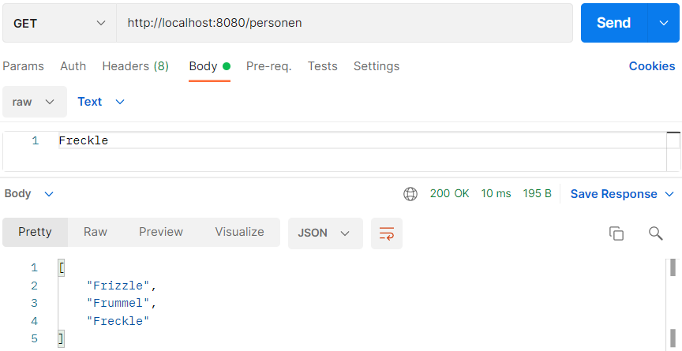

Vul url `http://localhost:8080/personen/1` in met `DELETE`.

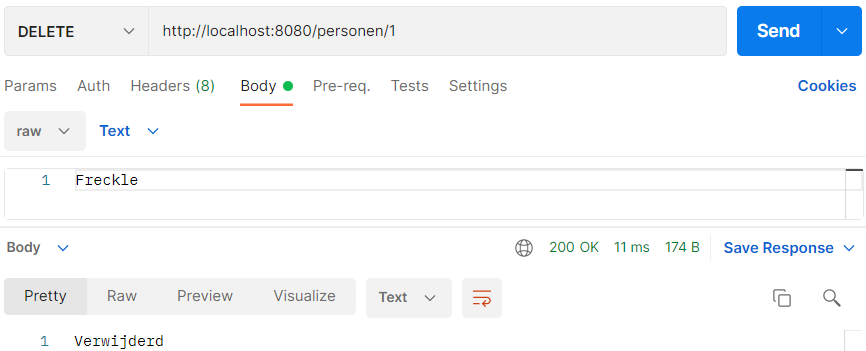

Je ziet in de body van response een melding "Verwijderd" en je krijgt status code 200 `OK`.

Wanneer je nu `GET` met url `http://localhost:8080/personen/` doet zie je dat `Frummel` is verdwenen.


### @PutMapping

Een `PUT` request wordt gebruikt om een aangegeven item te vervangen met een nieuw item. De gegevens van het nieuwe item
worden net als bij een `POST` request meegegeven in de `@RequestBody`.

```java
package com.danielle.demo_springboot.controller;

import org.springframework.http.ResponseEntity;
import org.springframework.web.bind.annotation.*;

import java.util.ArrayList;
import java.util.List;

@RestController
public class PersonController {
    private static List<String> personen = new ArrayList<>();

    @GetMapping(value = "/personen")
    public ResponseEntity getPersonen() {
        return ResponseEntity.ok(personen);
    }

    @GetMapping(value = "/personen/{nr}")
    public ResponseEntity getPerson(@PathVariable int nr) {
        return ResponseEntity.ok(personen.get(nr));
    }

    @PostMapping(value = "/personen")
    public ResponseEntity addPerson(@RequestBody String persoon) {
        personen.add(persoon);
        return ResponseEntity.ok("Toegevoegd");
    }

    @DeleteMapping(value = "/personen/{nr}")
    public ResponseEntity deletePerson(@PathVariable int nr) {
        personen.remove(nr);
        return ResponseEntity.ok("Verwijderd");
    }

    @PutMapping(value = "/personen/{nr}")
    public ResponseEntity updatePerson(@PathVariable int nr, @RequestBody String persoon) {
        personen.set(nr, persoon);
        return ResponseEntity.ok("Updated");
    }
}
```

Run applicatie.

We voegen een paar namen toe in Postman: Frummel, Freckle en Frizzle.

We bekijken met `http://localhost:8080/personen/` en `GET` welke namen in de array staan.

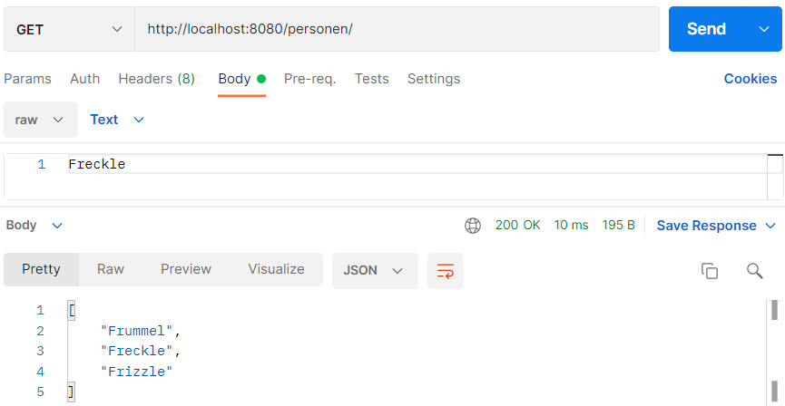

Wanneer we `PUT` gebruiken met `http://localhost:8080/personen/1` kunnen we Freckle aanpassen wat post 1 is.

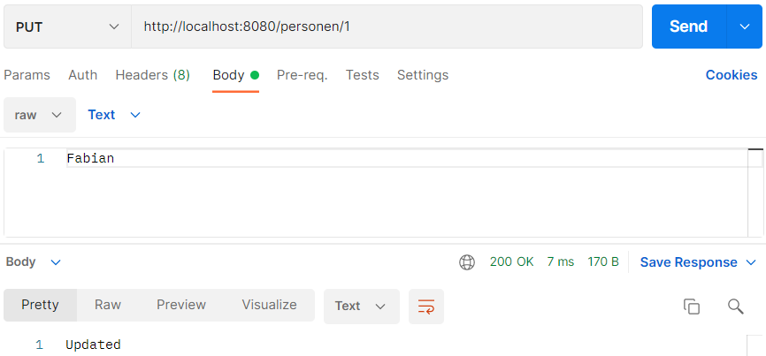

We gaan terug naar `http://localhost:8080/personen/` en `GET` en zien dat Freckle is geupdate naar Fabian.

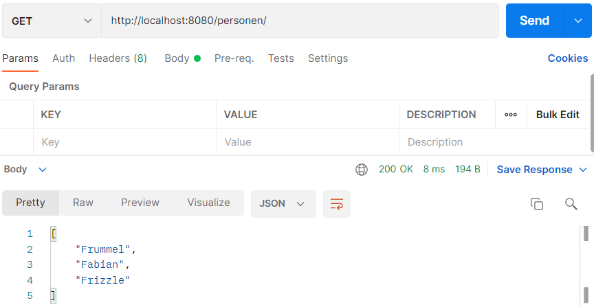

### Postman overzicht

Om overzicht te houden in Postman is het handig om voor elke methode en aparte request te hebben, zodat je niet elke
keer de url hoeft te veranderen.

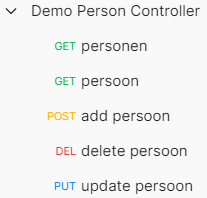

### Exception Handler

Het kan gebeuren dat een request niet slaagt. Er is bijvoorbeeld een niet bestaand id meegegeven. Wanneer je
url `http://localhost:8080/personen/9` met `GET` probeert krijg je `500 Internal Server Error`.

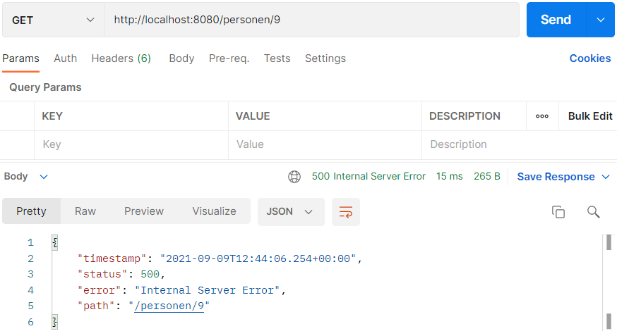

In de code van webservice kan dit worden afgevangen bijvoorbeeld door eerst te kijken of de betreffend id wel bestaat.
Zo niet, dan kan er 404 Not Found status code worden teruggegeven. Dit kunnen we doen met `try` en `catch`.

In `PersoonController.java` wordt de code van `@GetMapping {nr}` aangepast.

    @GetMapping(value = "/personen/{nr}")
    public ResponseEntity getPerson(@PathVariable int nr) {
      try {
        return ResponseEntity.ok(personen.get(nr));
      }
      catch (Exception ex){
        return ResponseEntity.badRequest().body("Persoon bestaat niet");
      }
    }

Wanneer je url `http://localhost:8080/personen/9` met `GET` probeert krijg je de melding "Persoon bestaat niet" en `400 Bad Request`.

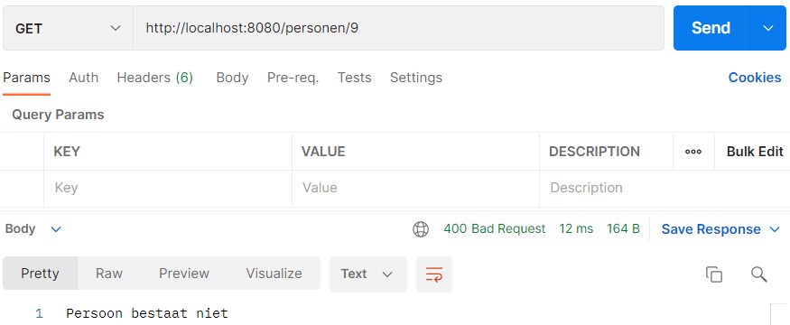

In de code kan hiervoor exceptions worden gebruikt. Het is wenselijk eigen exception klassen te definiëren. Als zich een
onwenselijke situatie voordoet dan kan een exception worden gegeneerd. Spring Boot heeft een
annotatie `@ControllerAdvice` waarmee een speciale exception controller kan worden aangegeven. Een exception eindigt in
een controller methode die als response de juiste status code teruggeeft.

We maken een nieuwe package `exception` en hierbinnen een file `RecordNotFoundException.java` met de volgende code.

```java
package com.danielle.demo_springboot.exception;

public class RecordNotFoundException extends RuntimeException {
    private static final long serialVersionUID = 1L;
}
```

Vervolgens maken we een bestand in de map controller genaamd `ExceptionController.java`.

```java
package com.danielle.demo_springboot.controller;

import com.danielle.demo_springboot.exception.RecordNotFoundException;
import org.springframework.http.ResponseEntity;
import org.springframework.web.bind.annotation.ControllerAdvice;
import org.springframework.web.bind.annotation.ExceptionHandler;
import org.springframework.web.bind.annotation.RestController;

@RestController
@ControllerAdvice
public class ExceptionController {
    @ExceptionHandler(value = RecordNotFoundException.class)
    public ResponseEntity<Object> exception(RecordNotFoundException exception) {
        return ResponseEntity.notFound().build();
    }
}
```

In de `PersonController` kun je de `try` en `catch` aanpassen met `throw`.

Je kunt dit bij alle `{nr}` paths aanpassen. De `PersonController` zie er als volgt uit.

```java
package com.danielle.demo_springboot.controller;

import com.danielle.demo_springboot.exception.RecordNotFoundException;
import org.springframework.http.ResponseEntity;
import org.springframework.web.bind.annotation.*;

import java.util.ArrayList;
import java.util.List;

@RestController
public class PersonController {
    private static List<String> personen = new ArrayList<>();

    @GetMapping(value = "/personen")
    public ResponseEntity getPersonen() {
        return ResponseEntity.ok(personen);
    }

    @GetMapping(value = "/personen/{nr}")
    public ResponseEntity getPerson(@PathVariable int nr) {
        try {
            return ResponseEntity.ok(personen.get(nr));
        } catch (Exception ex) {
            throw new RecordNotFoundException();
        }
    }

    @PostMapping(value = "/personen")
    public ResponseEntity addPerson(@RequestBody String persoon) {
        personen.add(persoon);
        return ResponseEntity.ok("Toegevoegd");
    }

    @DeleteMapping(value = "/personen/{nr}")
    public ResponseEntity deletePerson(@PathVariable int nr) {
        try {
            personen.remove(nr);
            return ResponseEntity.ok("Verwijderd");
        } catch (Exception ex) {
            throw new RecordNotFoundException();
        }
    }

    @PutMapping(value = "/personen/{nr}")
    public ResponseEntity updatePerson(@PathVariable int nr, @RequestBody String persoon) {
        try {
            personen.set(nr, persoon);
            return ResponseEntity.ok("Updated");
        } catch (Exception ex) {
            throw new RecordNotFoundException();
        }
    }
}
```

Hij gaat kijken of de gevraagde `nr` er is, bestaat hij niet dan gaat hij naar `RecordNotFoundException`.

## Github

Dit project staat op github: https://github.com/danielle076/project_questions_springboot