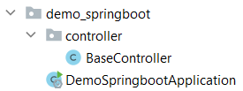
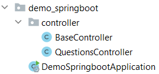
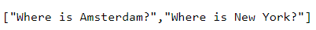

## Project Questions

### Spring initializr

Spring initializr genereert een basis project in Java met Spring Boot.

Ga naar de website <a href="https://start.spring.io" target="_blank">spring.io</a>. De volgende gegevens vul je in voor
het eerste Spring Boot project.

- Project: vink aan `Maven Project`
- Language: vink aan `Java`
- Spring Boot: vink aan `2.5.4` (laatste versie)
- Project Metadata: vul informatie in over jouw project
    - Group: `nl.danielle` (identifier van de ontwikkelaar)
    - Artifact: `demo_springboot` (hoe heet je project)
    - Name: `demo_springboot` (hoe heet je project)
    - Description: `Demo project for Spring Boot`
    - Package name: maakt het systeem zelf aan
    - Packaging: vink aan `Jar`
    - Java: vink aan `11`

Klik op "add dependencies" en voeg `Spring Web` toe.

Met "generate" wordt er een bestand in jouw download map gezet. Unzip het bestand en open het in Intellij.

Klik vervolgens rechtsonder in IntelliJ op `Load`.


Ga naar File > Project Structure en zet `Project SDK` op 11. Klik op apply.

### Spring Boot errors


Klik op "Trust project..." in de gele balk.

Wanneer de error niet weg is klik je op File > Invalidate Caches > Invalidate and Restart.

### Annotatie @SpringBootApplication

Je herkent Spring Boot aan de annotatie `@SpringBootApplication`.

```java
package com.danielle.demo_springboot;

import org.springframework.boot.SpringApplication;
import org.springframework.boot.autoconfigure.SpringBootApplication;

@SpringBootApplication
public class DemoSpringbootApplication {

    public static void main(String[] args) {
        SpringApplication.run(DemoSpringbootApplication.class, args);
    }
}
```

### Run applicatie

Run de applicatie om te testen of je geen foutmeldingen krijgt. Wanneer je de
melding `Started DemoSpringbootApplication` krijgt draait de applicatie.

Stop de applicatie.

### Server port

Standaard kiest het systeem port `8080` om mee te werken. Wanneer deze port niet beschikbaar is kun je aangeven om te
werken met een andere port.

In application.properties kun je allerlei properties instellen, waaronder de server port kiezen. Ga naar resources >
application.properties en voer de volgende code in.

    server.port=8081

### Hello World

We gaan een Hello World maken in `DemoSpringbootApplication.java`.

We voegen een annotatie `@RestController` toe aan de class. Daarna gaan we een nieuwe methode maken `sayHello` die een
annotatie `@GetMapping` heeft.

De `@RestController` is de ontvangst plek. Die zorgt dat de HTTP request wordt opgevangen en dat er een HTTP response
terug gaat.

Alles wat onder `@GetMapping` staat is de volledige backend. Als je de `/` meegeeft, zeg dan `Hello World`.

```java
package com.danielle.demo_springboot;

import org.springframework.boot.SpringApplication;
import org.springframework.boot.autoconfigure.SpringBootApplication;
import org.springframework.web.bind.annotation.GetMapping;
import org.springframework.web.bind.annotation.RestController;

@RestController
@SpringBootApplication
public class DemoSpringbootApplication {

    public static void main(String[] args) {
        SpringApplication.run(DemoSpringbootApplication.class, args);
    }

    @GetMapping(value = "/")
    public static String sayHello() {
        return "Hello World!";
    }
}
```

Run de applicatie.

Ga naar de browser met de volgende url: `http://localhost:8080/`. Op het beeldscherm verschijnt `Hello World!`.

### Endpoint

We maken een nieuwe `@GetMapping` met endpoint `/danielle`.

```java
package com.danielle.demo_springboot;

import org.springframework.boot.SpringApplication;
import org.springframework.boot.autoconfigure.SpringBootApplication;
import org.springframework.web.bind.annotation.GetMapping;
import org.springframework.web.bind.annotation.RestController;

@RestController
@SpringBootApplication
public class DemoSpringbootApplication {

    public static void main(String[] args) {
        SpringApplication.run(DemoSpringbootApplication.class, args);
    }

    @GetMapping(value = "/")
    public static String sayHello() {
        return "Hello World!";
    }

    @GetMapping(value = "/danielle")
    public static String sayDanielle() {
        return "Hello Danielle!";
    }
}
```

Run de applicatie.

Ga naar de browser met de volgende url: `http://localhost:8080/danielle`. Op het beeldscherm
verschijnt `Hello Danielle!`.

Dit is een webservice. In jouw eigen computer draait nu een webserver die je kan aanspreken via een url die je data
teruggeeft.

We hebben nu alles in één bestand staan, in één class: `DemoSpringbootApplication.java`, maar het is de bedoeling om
alles in packages te zetten.

### BaseController

We maken een nieuwe package genaamd `controller`. In deze controller maken we een bestand aan `BaseController.java`.

Alles wat we in `DemoSpringbootApplication.java` hebben gedaan, zetten we in `BaseController.java`.



_DemoSpringbootApplication.java_

```java
package com.danielle.demo_springboot;

import org.springframework.boot.SpringApplication;
import org.springframework.boot.autoconfigure.SpringBootApplication;

@SpringBootApplication
public class DemoSpringbootApplication {

    public static void main(String[] args) {
        SpringApplication.run(DemoSpringbootApplication.class, args);
    }
}
```

_BaseController.java_

```java
package com.danielle.demo_springboot.controller;

import org.springframework.web.bind.annotation.GetMapping;
import org.springframework.web.bind.annotation.RestController;

@RestController
public class BaseController {

    @GetMapping(value = "/")
    public String sayHello() {
        return "Hello World!";
    }

    @GetMapping(value = "/danielle")
    public String sayDanielle() {
        return "Hello Danielle!";
    }
}
```

### QuestionsController.java

We maken een nieuwe controller: `QuestionsController.java`.



Meestal zijn je endpoints een collection. Een collection is bijvoorbeeld een aantal vragen. Je endpoint wordt
dan `/questions` in meervoud. Dus als je meerdere vragen hebt, of meerdere klanten, dan gaat het vaak over een
collection en dan moet je het in meervoud neerzetten.

```java
package com.danielle.demo_springboot.controller;

import org.springframework.web.bind.annotation.GetMapping;
import org.springframework.web.bind.annotation.RestController;

@RestController
public class QuestionsController {

    @GetMapping(value = "/questions")  // collection
    public String getQuestions() {
        return "xxx";
    }
}
```

Wanneer je uit die collection 1 wilt hebben, dan doe je `/questions/1`.

```java
package com.danielle.demo_springboot.controller;

import org.springframework.web.bind.annotation.GetMapping;
import org.springframework.web.bind.annotation.RestController;

@RestController
public class QuestionsController {

    @GetMapping(value = "/questions")  // collection
    public String getQuestions() {
        return "xxx";
    }

    @GetMapping(value = "/questions/1")  // item
    public String getQuestion() {
        return "xxx";
    }
}
```

Als je het antwoord wilt hebben op die eerste question: `/questions/1/answer`

```java
package com.danielle.demo_springboot.controller;

import org.springframework.web.bind.annotation.GetMapping;
import org.springframework.web.bind.annotation.RestController;

@RestController
public class QuestionsController {

    @GetMapping(value = "/questions")  // collection
    public String getQuestions() {
        return "xxx";
    }

    @GetMapping(value = "/questions/1")  // item
    public String getQuestion() {
        return "xxx";
    }

    @GetMapping(value = "/questions/1/answer")  // document
    public String getAnswer() {
        return "xxx";
    }
}
```

We maken een array met vragen.

    private String[] questions = {
      "Where is Amsterdam?",
      "Where is New York?"
    };

We maken een array met antwoorden.

    private String[] answers = {
      "In the Netherlands",
      "in US of A"
    };

Om de vragen en antwoorden uit de array te krijgen gebruik je de volgende code bij `item` en document.

    @GetMapping(value = "/questions/1")  // item
    public String getQuestion() {
        return questions[0];
    }

    @GetMapping(value = "/questions/1/answer")  // document
    public String getAnswer() {
        return answers[0];
    }

```java
package com.danielle.demo_springboot.controller;

import org.springframework.web.bind.annotation.GetMapping;
import org.springframework.web.bind.annotation.RestController;

@RestController
public class QuestionsController {

    private String[] questions = {
            "Where is Amsterdam?",
            "Where is New York?"
    };

    private String[] answers = {
            "In the Netherlands",
            "in US of A"
    };

    @GetMapping(value = "/questions")  // collection
    public String getQuestions() {
        return "xxx";
    }

    @GetMapping(value = "/questions/1")  // item
    public String getQuestion() {
        return questions[0];
    }

    @GetMapping(value = "/questions/1/answer")  // document
    public String getAnswer() {
        return answers[0];
    }
}
```

Run de applicatie.

Wanneer je zoekt naar `http://localhost:8080/questions/1` in de webbrowser krijg je `Where is Amsterdam?` en wanneer
je `http://localhost:8080/questions/1/answer` krijg je `In the Netherlands`.

Door het regelen van de url met de endpoint, kun je uit de collectie verschillende questions kan halen.

De `1` is hard gecodeerd, je kan nog niet zoeken naar de `2de` vraag. Dus moet je een argument gaan meegeven. We doen
dit met `{nr}` en `@PathVariable`.

```java
package com.danielle.demo_springboot.controller;

import org.springframework.web.bind.annotation.GetMapping;
import org.springframework.web.bind.annotation.PathVariable;
import org.springframework.web.bind.annotation.RestController;

@RestController
public class QuestionsController {

    private String[] questions = {
            "Where is Amsterdam?",
            "Where is New York?"
    };

    private String[] answers = {
            "In the Netherlands",
            "in US of A"
    };

    @GetMapping(value = "/questions")  // collection
    public String getQuestions() {
        return "xxx";
    }

    @GetMapping(value = "/questions/{nr}")  // item
    public String getQuestion(@PathVariable int nr) {
        return questions[nr - 1];
    }

    @GetMapping(value = "/questions/{nr}/answer")  // document
    public String getAnswer(@PathVariable int nr) {
        return answers[nr - 1];
    }
}
```

Run de applicatie.

Wanneer je in de webbrowser url `http://localhost:8080/questions/2` opvraagt, krijg je de 2de vraag.

Als laatste hebben we endpoint `/questions`. We willen alle questions opvragen. Dit doe je met `String[]`.

```java
package com.danielle.demo_springboot.controller;

import org.springframework.web.bind.annotation.GetMapping;
import org.springframework.web.bind.annotation.PathVariable;
import org.springframework.web.bind.annotation.RestController;

@RestController
public class QuestionsController {

    private String[] questions = {
            "Where is Amsterdam?",
            "Where is New York?"
    };

    private String[] answers = {
            "In the Netherlands",
            "in US of A"
    };

    @GetMapping(value = "/questions")  // collection
    public String[] getQuestions() {
        return questions;
    }

    @GetMapping(value = "/questions/{nr}")  // item
    public String getQuestion(@PathVariable int nr) {
        return questions[nr - 1];
    }

    @GetMapping(value = "/questions/{nr}/answer")  // document
    public String getAnswer(@PathVariable int nr) {
        return answers[nr - 1];
    }
}
```

Run de applicatie.

In de webbrowser kun je de hele collectie opvragen met `http://localhost:8080/questions`. Je krijgt een array terug.



#### Gebruik static

In `DemoSpringbootApplication.java` moet het static zijn omdat het een static klasse is, in de `BaseController.java` hoeft de static er niet in te zitten. Deze mag je weglaten (het is beter om het niet te doen).