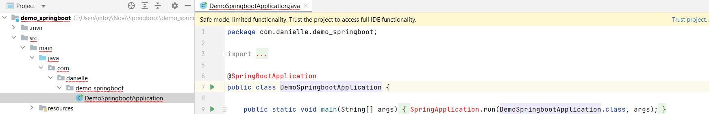

## Project Questions

### Spring initializr

Spring initializr genereert een basis project in Java met Spring Boot.

Ga naar de website <a href="https://start.spring.io" target="_blank">spring.io</a>. De volgende gegevens vul je in voor
het eerste Spring Boot project.

- Project: vink aan `Maven Project`
- Language: vink aan `Java`
- Spring Boot: vink aan `2.5.4` (laatste versie)
- Project Metadata: vul informatie in over jouw project
    - Group: `nl.danielle` (identifier van de ontwikkelaar)
    - Artifact: `demo_springboot` (hoe heet je project)
    - Name: `demo_springboot` (hoe heet je project)
    - Description: `Demo project for Spring Boot`
    - Package name: maakt het systeem zelf aan
    - Packaging: vink aan `Jar`
    - Java: vink aan `11`

Klik op "add dependencies" en voeg `Spring Web` toe.

Met "generate" wordt er een bestand in jouw download map gezet. Unzip het bestand en open het in Intellij.

Klik vervolgens rechtsonder in IntelliJ op `Load`.


Ga naar File > Project Structure en zet `Project SDK` op 11. Klik op apply.

### Spring Boot errors



Klik op "Trust project..." in de gele balk.

Wanneer de error niet weg is klik je op File > Invalidate Caches > Invalidate and Restart.

### Annotatie @SpringBootApplication

Je herkent Spring Boot aan de annotatie `@SpringBootApplication`.

```java
package com.danielle.demo_springboot;

import org.springframework.boot.SpringApplication;
import org.springframework.boot.autoconfigure.SpringBootApplication;

@SpringBootApplication
public class DemoSpringbootApplication {

    public static void main(String[] args) {
        SpringApplication.run(DemoSpringbootApplication.class, args);
    }
}
```

### Run applicatie

Run de applicatie om te testen of je geen foutmeldingen krijgt. Wanneer je de
melding `Started DemoSpringbootApplication` krijgt draait de applicatie.

Stop de applicatie.

### Server port

Standaard kiest het systeem port `8080` om mee te werken. Wanneer deze port niet beschikbaar is kun je aangeven om te
werken met een andere port.

In application.properties kun je allerlei properties instellen, waaronder de server port kiezen. Ga naar resources >
application.properties en voer de volgende code in.

    server.port=8081

### Hello World

We gaan een Hello World maken in `DemoSpringbootApplication.java`.

We voegen een annotatie `@RestController` toe aan de class. Daarna gaan we een nieuwe methode maken `sayHello` die een
annotatie `@GetMapping` heeft.

De `@RestController` is de ontvangst plek. Die zorgt dat de HTTP request wordt opgevangen en dat er een HTTP response
terug gaat.

Alles wat onder `@GetMapping` staat is de volledige backend. Als je de `/` meegeeft, zeg dan `Hello World`.

```java
package com.danielle.demo_springboot;

import org.springframework.boot.SpringApplication;
import org.springframework.boot.autoconfigure.SpringBootApplication;
import org.springframework.web.bind.annotation.GetMapping;
import org.springframework.web.bind.annotation.RestController;

@RestController
@SpringBootApplication
public class DemoSpringbootApplication {

    public static void main(String[] args) {
        SpringApplication.run(DemoSpringbootApplication.class, args);
    }

    @GetMapping(value = "/")
    public static String sayHello() {
        return "Hello World!";
    }
}
```

Run de applicatie.

Ga naar de browser met de volgende url: `http://localhost:8080/`. Op het beeldscherm verschijnt `Hello World!`.

### Endpoint

We maken een nieuwe `@GetMapping` maken met endpoint `/danielle`.

```java
package com.danielle.demo_springboot;

import org.springframework.boot.SpringApplication;
import org.springframework.boot.autoconfigure.SpringBootApplication;
import org.springframework.web.bind.annotation.GetMapping;
import org.springframework.web.bind.annotation.RestController;

@RestController
@SpringBootApplication
public class DemoSpringbootApplication {

    public static void main(String[] args) {
        SpringApplication.run(DemoSpringbootApplication.class, args);
    }

    @GetMapping(value = "/")
    public static String sayHello() {
        return "Hello World!";
    }

    @GetMapping(value = "/danielle")
    public static String sayDanielle() {
        return "Hello Danielle!";
    }
}
```

Run de applicatie.

Ga naar de browser met de volgende url: `http://localhost:8080/danielle`. Op het beeldscherm
verschijnt `Hello Danielle!`.

Dit is een webservice. In jouw eigen computer draait nu een webserver die je kan aanspreken via een url die je data teruggeeft.