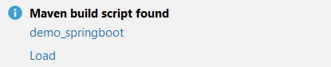
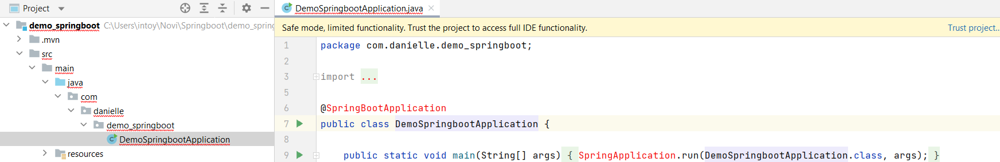
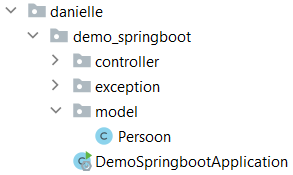
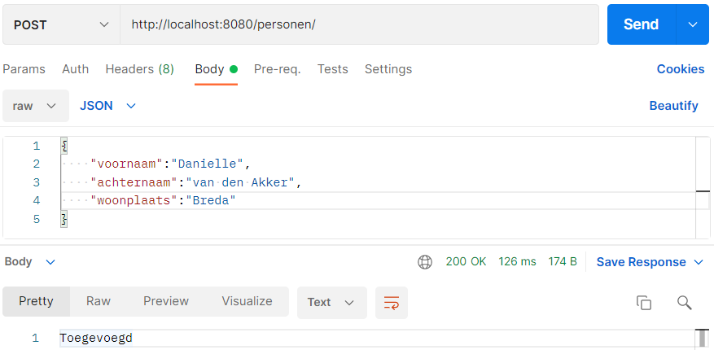
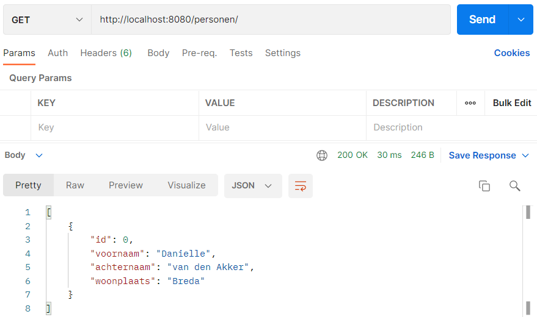
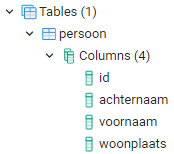
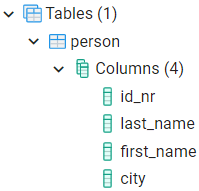
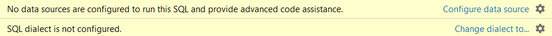
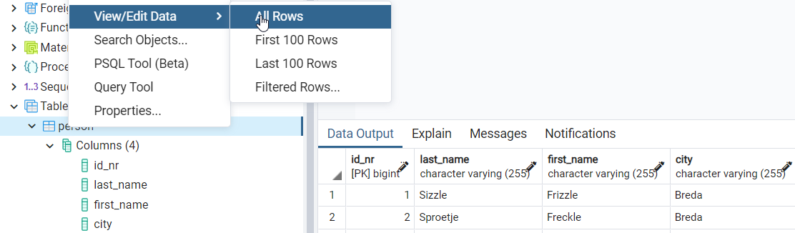
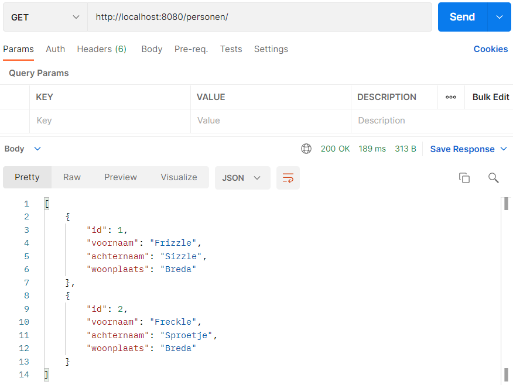

## Project Person (vervolg questions)

### Spring initializr

Spring initializr genereert een basis project in Java met Spring Boot.

Ga naar de website <a href="https://start.spring.io" target="_blank">spring.io</a>. De volgende gegevens vul je in voor
het eerste Spring Boot project.

- Project: vink aan `Maven Project`
- Language: vink aan `Java`
- Spring Boot: vink aan `2.5.4` (laatste versie)
- Project Metadata: vul informatie in over jouw project
    - Group: `nl.danielle` (identifier van de ontwikkelaar)
    - Artifact: `demo_springboot` (hoe heet je project)
    - Name: `demo_springboot` (hoe heet je project)
    - Description: `Demo project for Spring Boot`
    - Package name: maakt het systeem zelf aan
    - Packaging: vink aan `Jar`
    - Java: vink aan `11`

Klik op "add dependencies" en voeg `Spring Web` toe.

Met "generate" wordt er een bestand in jouw download map gezet. Unzip het bestand en open het in Intellij.

Klik vervolgens rechtsonder in IntelliJ op `Load`.



Ga naar File > Project Structure en zet `Project SDK` op 11. Klik op apply.

### Spring Boot errors



Klik op "Trust project..." in de gele balk.

Wanneer de error niet weg is klik je op File > Invalidate Caches > Invalidate and Restart.

### Model

De controller werkt in dit geval nog steeds op een lijst van personen, maar eigenlijk is het een lijst van Strings.

    private static List<String> personen = new ArrayList<>();

Als je persoon als klasse definieert, dan heeft zo'n persoon meerdere attributen zoals een naam, voornaam, woonplaats.

We maken een nieuwe package genaamd `model`. Model gaat java classes hebben die overeenkomen met de entity,
bijvoorbeeld `Persoon.java`.



```java
package nl.danielle.demo_springboot.model;

public class Persoon {

    public long id; // primary key

    public String voornaam;
    public String achternaam;
    public String woonplaats;

    public long getId() {
        return id;
    }

    public void setId(long id) {
        this.id = id;
    }

    public String getVoornaam() {
        return voornaam;
    }

    public void setVoornaam(String voornaam) {
        this.voornaam = voornaam;
    }

    public String getAchternaam() {
        return achternaam;
    }

    public void setAchternaam(String achternaam) {
        this.achternaam = achternaam;
    }

    public String getWoonplaats() {
        return woonplaats;
    }

    public void setWoonplaats(String woonplaats) {
        this.woonplaats = woonplaats;
    }
}

```

In `PersoonController.java` pas je de code `List<String>` aan in `List<Persoon>`. Ook pas je in deze file alles
van `String` aan naar `Persoon`.

```java
package nl.danielle.demo_springboot.controller;

import nl.danielle.demo_springboot.exception.RecordNotFoundException;
import nl.danielle.demo_springboot.model.Persoon;
import org.springframework.http.ResponseEntity;
import org.springframework.web.bind.annotation.*;

import java.util.ArrayList;
import java.util.List;

@RestController
public class PersonController {
    private static List<Persoon> personen = new ArrayList<>();

    @GetMapping(value = "/personen")
    public ResponseEntity getPersonen() {
        return ResponseEntity.ok(personen);
    }

    @GetMapping(value = "/personen/{nr}")
    public ResponseEntity getPerson(@PathVariable int nr) {
        try {
            return ResponseEntity.ok(personen.get(nr));
        } catch (Exception ex) {
            throw new RecordNotFoundException();
        }
    }

    @PostMapping(value = "/personen")
    public ResponseEntity addPerson(@RequestBody Persoon persoon) {
        personen.add(persoon);
        return ResponseEntity.ok("Toegevoegd");
    }

    @DeleteMapping(value = "/personen/{nr}")
    public ResponseEntity deletePerson(@PathVariable int nr) {
        try {
            personen.remove(nr);
            return ResponseEntity.ok("Verwijderd");
        } catch (Exception ex) {
            throw new RecordNotFoundException();
        }
    }
}
```

Run de applicatie.

Ga naar Postman met url `http://localhost:8080/personen/` en `POST`. Om een nieuw persoon toe te voegen moet je
de `body` op `raw` en `JSON` zetten.



In `GET` met url `http://localhost:8080/personen/` krijg je het volgende terug.



Je ziet dat de `id` leeg is, die werkt pas wanneer we de gegevens in de database gaan zetten.

### Database

We gaan pom.xml uitbreiden met Spring initializr (https://start.spring.io/). Voeg de dependencies `Spring Data JPA`
en `PostgreSQL Driver` toe. Klik onderaan op `explore` en kopieer de code.

    <dependency>
    <groupId>org.springframework.boot</groupId>
    <artifactId>spring-boot-starter-data-jpa</artifactId>
    </dependency>
    <dependency>
      <groupId>org.postgresql</groupId>
      <artifactId>postgresql</artifactId>
      <scope>runtime</scope>
    </dependency>

Zet deze in pom.xml.

```xml
<?xml version="1.0" encoding="UTF-8"?>
<project xmlns="http://maven.apache.org/POM/4.0.0" xmlns:xsi="http://www.w3.org/2001/XMLSchema-instance"
         xsi:schemaLocation="http://maven.apache.org/POM/4.0.0 https://maven.apache.org/xsd/maven-4.0.0.xsd">
    <modelVersion>4.0.0</modelVersion>
    <parent>
        <groupId>org.springframework.boot</groupId>
        <artifactId>spring-boot-starter-parent</artifactId>
        <version>2.5.4</version>
        <relativePath/> <!-- lookup parent from repository -->
    </parent>
    <groupId>nl.danielle</groupId>
    <artifactId>demo_springboot</artifactId>
    <version>0.0.1-SNAPSHOT</version>
    <name>demo_springboot</name>
    <description>Demo project for Spring Boot</description>
    <properties>
        <java.version>11</java.version>
    </properties>
    <dependencies>
        <dependency>
            <groupId>org.springframework.boot</groupId>
            <artifactId>spring-boot-starter-web</artifactId>
        </dependency>

        <dependency>
            <groupId>org.springframework.boot</groupId>
            <artifactId>spring-boot-starter-test</artifactId>
            <scope>test</scope>
        </dependency>
        <dependency>
            <groupId>org.springframework.boot</groupId>
            <artifactId>spring-boot-starter-data-jpa</artifactId>
        </dependency>
        <dependency>
            <groupId>org.postgresql</groupId>
            <artifactId>postgresql</artifactId>
            <scope>runtime</scope>
        </dependency>
    </dependencies>

    <build>
        <plugins>
            <plugin>
                <groupId>org.springframework.boot</groupId>
                <artifactId>spring-boot-maven-plugin</artifactId>
                <version>${project.parent.version}</version>
            </plugin>
        </plugins>
    </build>

</project>
```

We gaan naar pgAdmin (postgreSQL) en maken een nieuwe database genaamd `person`.

Vervolgens gaan we in het project naar het bestand resources > `application.properties`. De volgende code zet je hierin.

    # datasource PostgreSQL
    spring.jpa.database=postgresql
    spring.datasource.platform=postgres
    spring.datasource.url=jdbc:postgresql://localhost:5432/person
    spring.datasource.username=postgres
    spring.datasource.password=postgres123
    spring.datasource.driver-class-name=org.postgresql.Driver
    spring.jpa.generate-ddl=true
    spring.jpa.properties.hibernate.jdbc.lob.non_contextual_creation=true
    spring.jpa.properties.hibernate.dialect= org.hibernate.dialect.PostgreSQLDialect
    
    spring.jpa.show-sql = true
    
    spring.jpa.hibernate.ddl-auto=create
    spring.datasource.initialization-mode=always

- `url` is de database naam in pgAdmin
- `username` is jouw username in pgAdmin
- `password` is jouw wachtwoord in pgAdmin

We gaan terug naar de code `Persoon.java`. We willen dat deze classe als tabel in de database komt. Om dit te doen moeten we een aantal dingen aangeven. Ten eerste gaan we een `@Entity` in de code zetten. Deze zorgt ervoor dat `Persoon` gezien wordt als een entity. Vervolgens heeft de database een primary key met `@id` nodig, dat is de `public long id;`. Als laatste moet je de kolommen definiëren met `@column`.

```java
package nl.danielle.demo_springboot.model;

import javax.persistence.*;

@Entity
public class Persoon {

    @Id
    @GeneratedValue(strategy = GenerationType.IDENTITY)
    @Column
    public long id; // primary key

    @Column
    public String voornaam;
    @Column
    public String achternaam;
    @Column
    public String woonplaats;

    public long getId() {
        return id;
    }

    public void setId(long id) {
        this.id = id;
    }

    public String getVoornaam() {
        return voornaam;
    }

    public void setVoornaam(String voornaam) {
        this.voornaam = voornaam;
    }

    public String getAchternaam() {
        return achternaam;
    }

    public void setAchternaam(String achternaam) {
        this.achternaam = achternaam;
    }

    public String getWoonplaats() {
        return woonplaats;
    }

    public void setWoonplaats(String woonplaats) {
        this.woonplaats = woonplaats;
    }
}
```

Run de applicatie.

Ga naar postgreSQL en klik op de database `person`. Ga naar Schemas > Tables > klik de tabel `persoon` open. Je ziet dat we een tabel `persoon`hebben gemaakt met daarin 4 kolommen.



#### Decorateurs referentie

Je kan in Java met `@Entity(name = "person")` aangeven dat de tabel naam `person` moet zijn in de database.

```java
@Entity(name = "person")
public class Persoon {
}
```

Een column kun je ook een naam meegeven met `@Column(name = "first_name")`.

```java

@Entity(name = "person")
public class Persoon {

  @Id
  @GeneratedValue(strategy = GenerationType.IDENTITY)
  @Column(name = "id_nr")
  public long id; // primary key

  @Column(name = "first_name")
  public String voornaam;
  @Column(name = "last_name")
  public String achternaam;
  @Column(name = "city")
  public String woonplaats;
}
```



Naast dat je een column een naam kan geven, kun je hem ook definiëren met een bepaalde lengte en eventueel of hij wel of
niet nul mag zijn. Bijvoorbeeld `@Column(name = "first_name", length = 255, nullable = false)`

Bron: <a href="https://orkhan.gitbook.io/typeorm/docs/decorator-reference" target="_blank">decorator-reference</a> 

#### Bestand data.sql

Met `data.sql` gaan we data toevoegen aan de tabel in de database. Dit doe je door in de `resources` een nieuw file te maken en die noemen we `data.sql`. Dit is een `sql`
bestand waarmee we records kunnen toevoegen aan `Persoon.java`.

In dit bestand zet je de volgende code.

    INSERT INTO person (first_name, last_name, city)
    VALUES ('Frizzle', 'Sizzle', 'Breda')
    ,      ('Freckle', 'Sproetje', 'Breda');

Wanneer je IntelliJ Ultimate heb krijg je het volgende te zien.



IntelliJ Ultimate heeft de mogelijkheid van Inspections. In de editor worden deze gebruikt om de code te onderzoeken en
suggesties te doen. Deze Inspections kunnen aan of uit worden gezet.

Bij het creëren van een .sql bestand zoals `data.sql` worden onder de volgende inspections geactiveerd:

- __SQL dialect detection__ Hiermee wordt de syntax van SQL gecontroleerd volgens een aangegeven SQL dialect
- __No data sources configured__ IntelliJ Ultimate biedt de mogelijkheid datasources te configureren. Leuk maar die optie gebruiken we niet in de Spring Boot projecten

Je kan de inspectie meldingen die in de gele balken verschijnen negeren, maar je kunt ze ook uitzetten. In de balk zie
je een instellingen icon (een radertje) met in de pulldown menu de optie `Disable inspection`.

Als je deze weer aan wilt zetten moet dat via het hoofdmenu > preferences > editor > inspections. Daar kun je de
betreffende inspections opzoeken in de lijst en het vinkje weer aanzetten.

Run de applicatie.

In postgreSQL krijg je de gegevens te zien die je in de `data.sql` heb gezet via person > View/Edit Data > All Rows.



In Postman wanneer je url `http://localhost:8080/personen/` gebruikt met `GET` krijg je ook de gegevens te zien van `data.sql`.



### Repository

De communicatie met de database gebeurd via een repository, dus PersoonRepository communiceert straks met de database. Het is een interface die op basis van een bestaande CrudRepository toegang heeft naar `Persoon` op basis van de id wat `Long` is. Hij vertaald Java in SQL.

Maak een nieuwe package genaamd `repository`. In deze map maken we een nieuwe interface `PersoonRepository.java`.

```java
package nl.danielle.demo_springboot.repository;

import nl.danielle.demo_springboot.model.Persoon;
import org.springframework.data.repository.CrudRepository;

public interface PersoonRepository extends CrudRepository<Persoon, Long> {
}
```

Met `CrudRepository` heb je de beschikking tot een aantal methodes. Deze methodes verwrek je in `PersoonController.java`.

We willen van de lijst `private static List<Persoon> personen = new ArrayList<>();` geen gebruik van maken, dus maken we gebruik van een repository.

We maken gebruik van `@Autowired` en zetten de `PersoonRepository` in alle CRUD-methodes (`@PutMapping` is achterwege gelaten).

```java
package nl.danielle.demo_springboot.controller;

import nl.danielle.demo_springboot.exception.RecordNotFoundException;
import nl.danielle.demo_springboot.model.Persoon;
import nl.danielle.demo_springboot.repository.PersoonRepository;
import org.springframework.beans.factory.annotation.Autowired;
import org.springframework.http.ResponseEntity;
import org.springframework.web.bind.annotation.*;

import java.util.Optional;

@RestController
public class PersonController {

    @Autowired
    private PersoonRepository persoonRepository;

    @GetMapping(value = "/personen")
    public ResponseEntity getPersonen() {
        Iterable<Persoon> personen = persoonRepository.findAll();
        return ResponseEntity.ok(personen);
    }

    @GetMapping(value = "/personen/{nr}")
    public ResponseEntity getPerson(@PathVariable long nr) {
        try {
            Optional<Persoon> persoon = persoonRepository.findById(nr);
            return ResponseEntity.ok(persoon);
        } catch (Exception ex) {
            throw new RecordNotFoundException();
        }
    }

    @PostMapping(value = "/personen")
    public ResponseEntity addPerson(@RequestBody Persoon persoon) {
        persoonRepository.save(persoon);
        return ResponseEntity.ok("Toegevoegd");
    }

    @DeleteMapping(value = "/personen/{nr}")
    public ResponseEntity deletePerson(@PathVariable long nr) {
        try {
            persoonRepository.deleteById(nr);
            return ResponseEntity.ok("Verwijderd");
        } catch (Exception ex) {
            throw new RecordNotFoundException();
        }
    }
}
```
