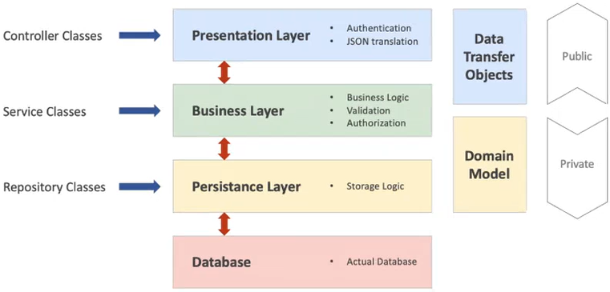

## Project Person (vervolg questions part 2)

### Service

Spring Boot werkt met lagen. Het voordeel om dit in lagen op te bouwen is dat alles een eigen logische plek krijgt.

De Controller praat met de Service, de Service praat met de Repository en de Repository zorgt voor de afhandeling naar
de Database.



De Controller houdt zich bezig met de communicatie. De Service houdt zich bezig met alles wat typisch bij de applicatie
hoort dus die is op de hoogte van welke modellen je gebruikt, de data, maar ook de regels die horen bij de applicatie.
Bijv. er wordt gevraagd naar een factuur in de Controller, die zegt prima en delegeert dit door naar de Service die een
factuur gaat bouwen, want deze is intelligent die snapt hoe dat allemaal werkt. De data die nodig is om de factuur op te
maken vraagt de Service aan de Repository. De Repository haalt de data uit de Database en geeft het terug aan de
Service.

#### Het project

We pakken het laatste project erbij: https://github.com/danielle076/project_questions2_springboot en gaan verder met de
service laag tussen de controller en de repository te zetten.

We voegen een nieuwe package toe genaamd `service` met een nieuwe interface genaamd `PersoonService.java` en een
klasse `PersoonServiceImpl.java`. Traditioneel wordt de Service gescheiden in een Interface en in een Implementatie.

In de Service ga je definiëren wat je allemaal met je persoon wilt gaat doen. We kunnen bijvoorbeeld zeggen, we willen
de volgende methodes `findAll()`, `findById()`, `save()`, `deleteById()` en een `findByLastname()`.

- De `findAll()` geeft terug een lijst van een persoon: `Iterable<Persoon> findAll();`
- De `findById()` die geeft terug een persoon met dat id: `findById(long nr)`
- De `save()` is een void want die geeft niks terug: `void save();`
- De `deleteById()` is een void want geeft niks terug: `void deleteById()`
- De `findByLastname()` geeft terug een persoon met die achternaam: `Iterable<Persoon> findByLastname(String lastname);`

_PersoonService.java_

```java
package nl.danielle.demo_springboot.service;

import nl.danielle.demo_springboot.model.Persoon;

public interface PersoonService {

    Iterable<Persoon> findAll();

    public Persoon findById(long nr);

    void save(Persoon persoon);

    void deleteById(long nr);

    Iterable<Persoon> findByLastname(String lastname);
}
```

De laatste methode bestaat nog niet, dus die maken we in `PersoonRepository.java`.

```java
package nl.danielle.demo_springboot.repository;

import nl.danielle.demo_springboot.model.Persoon;
import org.springframework.data.repository.CrudRepository;

public interface PersoonRepository extends CrudRepository<Persoon, Long> {

    Iterable<Persoon> findByLastname(String lastname);
}
```

De `PersoonService` interface hoeft alleen maar te benoemen welke methodes je allemaal hebt. Deze methodes moet je
implementeren in `PersoonServiceImpl`.

_PersoonServiceImpl_

```java
package nl.danielle.demo_springboot.service;

import nl.danielle.demo_springboot.exception.RecordNotFoundException;
import nl.danielle.demo_springboot.model.Persoon;
import nl.danielle.demo_springboot.repository.PersoonRepository;
import org.springframework.beans.factory.annotation.Autowired;
import org.springframework.stereotype.Service;

import java.util.Optional;

@Service
public class PersoonServiceImpl implements PersoonService {

    @Autowired
    private PersoonRepository persoonRepository;

    @Override
    public Iterable<Persoon> findAll() {
        Iterable<Persoon> personen = persoonRepository.findAll();
        return personen;
    }

    @Override
    public Persoon findById(long nr) {
        Optional<Persoon> persoon = persoonRepository.findById(nr);
        if (persoon.isPresent()) {
            return persoon.get();
        } else {
            throw new RecordNotFoundException("Persoon with id " + nr + " not found");
        }
    }

    @Override
    public void save(Persoon persoon) {
        persoonRepository.save(persoon);
    }

    @Override
    public void deleteById(long nr) {
        try {
            persoonRepository.deleteById(nr);
        } catch (IndexOutOfBoundsException ex) {
            System.out.println(ex);
            throw new RecordNotFoundException();
        }
    }

    @Override
    public Iterable<Persoon> findByLastname(String lastname) {
        return persoonRepository.findByLastname(lastname);
    }
}
```

De files `RecordNotFoundException.java` en `ExceptionController.java` pas je aan, zodat er een bericht verzonden kan
worden wanneer de gebruiker een exception tegenkomt.

_RecordNotFoundException.java_

```java
package nl.danielle.demo_springboot.exception;

public class RecordNotFoundException extends RuntimeException {
    private static final long serialVersionUID = 1L;

    public RecordNotFoundException(String message) {
        super(message);
    }

    public RecordNotFoundException() {
        super("Record not found.");
    }
}
```

_ExceptionController.java_

```java
package nl.danielle.demo_springboot.controller;

import nl.danielle.demo_springboot.exception.RecordNotFoundException;
import org.springframework.http.HttpStatus;
import org.springframework.http.ResponseEntity;
import org.springframework.web.bind.annotation.ControllerAdvice;
import org.springframework.web.bind.annotation.ExceptionHandler;
import org.springframework.web.bind.annotation.RestController;

@RestController
@ControllerAdvice
public class ExceptionController {

    @ExceptionHandler(value = RecordNotFoundException.class)
    public ResponseEntity<Object> exception(RecordNotFoundException exception) {
        return new ResponseEntity<>(exception.getMessage(), HttpStatus.NOT_FOUND);
    }
}
```

De `PersonController` verwijst naar de `persoonRepository`. Dit moet vervangen worden in `persoonService`.

    @GetMapping(value = "/personen")
    public ResponseEntity getPersonen() {
        Iterable<Persoon> personen = persoonRepository.findAll();
        return ResponseEntity.ok(personen);
    }

_PersonController.java_

```java
package nl.danielle.demo_springboot.controller;

import nl.danielle.demo_springboot.model.Persoon;
import nl.danielle.demo_springboot.service.PersoonService;
import org.springframework.beans.factory.annotation.Autowired;
import org.springframework.http.ResponseEntity;
import org.springframework.web.bind.annotation.*;

@RestController
public class PersonController {

    @Autowired
    private PersoonService persoonService;

    @GetMapping(value = "/personen")
    public ResponseEntity getPersonen(@RequestParam("achternaam") String achternaam) {
        Iterable<Persoon> personen;
        if (achternaam.isEmpty()) {
            personen = persoonService.findAll();
        } else {
            personen = persoonService.findByLastname(achternaam);
        }
        return ResponseEntity.ok(personen);
    }

//    @GetMapping(value = "/personen")
//    public ResponseEntity getPersonen() {
//        Iterable<Persoon> personen = persoonService.findAll();
//        return ResponseEntity.ok(personen);
//    }

    @GetMapping(value = "/personen/{nr}")
    public ResponseEntity getPersoon(@PathVariable long nr) {
        Persoon persoon = persoonService.findById(nr);
        return ResponseEntity.ok(persoon);
    }

    @PostMapping(value = "/personen")
    public ResponseEntity addPersoon(@RequestBody Persoon persoon) {
        persoonService.save(persoon);
        return ResponseEntity.ok("Toegevoegd");
    }

    @DeleteMapping(value = "/personen/{nr}")
    public ResponseEntity deletePersoon(@PathVariable long nr) {
        persoonService.deleteById(nr);
        return ResponseEntity.ok("Verwijderd");
    }
}
```


### @PutMapping

We gaan `@PutMapping` toevoegen. Dit heeft gevolgen voor de volgende files.

_PersonController.java_

```java
package nl.danielle.demo_springboot.controller;

import nl.danielle.demo_springboot.model.Persoon;
import nl.danielle.demo_springboot.service.PersoonService;
import org.springframework.beans.factory.annotation.Autowired;
import org.springframework.http.ResponseEntity;
import org.springframework.web.bind.annotation.*;

@RestController
public class PersonController {

    @Autowired
    private PersoonService persoonService;

    @GetMapping(value = "/personen")
    public ResponseEntity getPersonen(@RequestParam("achternaam") String achternaam) {
        Iterable<Persoon> personen;
        if (achternaam.isEmpty()) {
            personen = persoonService.findAll();
        } else {
            personen = persoonService.findByLastname(achternaam);
        }
        return ResponseEntity.ok(personen);
    }

//    @GetMapping(value = "/personen")
//    public ResponseEntity getPersonen() {
//        Iterable<Persoon> personen = persoonService.findAll();
//        return ResponseEntity.ok(personen);
//    }

    @GetMapping(value = "/personen/{nr}")
    public ResponseEntity getPersoon(@PathVariable long nr) {
        Persoon persoon = persoonService.findById(nr);
        return ResponseEntity.ok(persoon);
    }

    @PostMapping(value = "/personen")
    public ResponseEntity addPersoon(@RequestBody Persoon persoon) {
        persoonService.save(persoon);
        return ResponseEntity.ok("Toegevoegd");
    }

    @DeleteMapping(value = "/personen/{nr}")
    public ResponseEntity deletePersoon(@PathVariable long nr) {
        persoonService.deleteById(nr);
        return ResponseEntity.ok("Verwijderd");
    }

    @PutMapping(value = "/personen/{nr}")
    public ResponseEntity<Object> updatePersoon(@PathVariable long nr, @RequestBody Persoon persoon) {
        persoonService.updatePersoon(nr, persoon);
        return ResponseEntity.ok("Aangepast");
    }
}
```

_PersoonService_

```java
package nl.danielle.demo_springboot.service;

import nl.danielle.demo_springboot.model.Persoon;

public interface PersoonService {

    Iterable<Persoon> findAll();
    public Persoon findById(long nr);
    void save(Persoon persoon);
    void deleteById(long nr);
    Iterable<Persoon> findByLastname(String lastname);
    public abstract void updatePersoon(long id, Persoon person);
}
```

De methode `updatePersoon` is toegevoegd.

_PersoonServiceImpl.java_

```java
package nl.danielle.demo_springboot.service;

import nl.danielle.demo_springboot.exception.RecordNotFoundException;
import nl.danielle.demo_springboot.model.Persoon;
import nl.danielle.demo_springboot.repository.PersoonRepository;
import org.springframework.beans.factory.annotation.Autowired;
import org.springframework.stereotype.Service;

import java.util.Optional;

@Service
public class PersoonServiceImpl implements PersoonService {

    @Autowired
    private PersoonRepository persoonRepository;

    @Override
    public Iterable<Persoon> findAll() {
        Iterable<Persoon> personen = persoonRepository.findAll();
        return personen;
    }

    @Override
    public Persoon findById(long nr) {
        Optional<Persoon> persoon = persoonRepository.findById(nr);
        if (persoon.isPresent()) {
            return persoon.get();
        } else {
            throw new RecordNotFoundException("Persoon with id " + nr + " not found");
        }
    }

    @Override
    public void save(Persoon persoon) {
        persoonRepository.save(persoon);
    }

    @Override
    public void deleteById(long nr) {
        try {
            persoonRepository.deleteById(nr);
        } catch (IndexOutOfBoundsException ex) {
            System.out.println(ex);
            throw new RecordNotFoundException();
        }
    }

    @Override
    public Iterable<Persoon> findByLastname(String lastname) {
        return persoonRepository.findByLastname(lastname);
    }

    @Override
    public void updatePersoon(long nr, Persoon persoon) {
        if (!persoonRepository.existsById(nr)) throw new RecordNotFoundException();
        Persoon existingPersoon = persoonRepository.findById(nr).get();
        existingPersoon.setVoornaam(persoon.getVoornaam());
        existingPersoon.setAchternaam(persoon.getAchternaam());
        existingPersoon.setWoonplaats(persoon.getWoonplaats());
        persoonRepository.save(existingPersoon);
    }
}
```

De methode `updatePersoon` is toegevoegd. De gegevens voor `existingPersoon` haal je uit `Persoon.java`.

Run de applicatie.