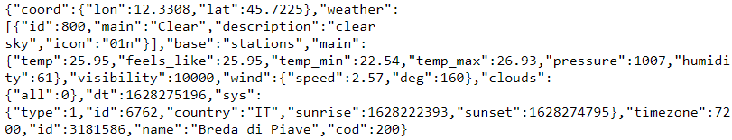

## Spring Boot

Je gebruikt Spring Boot als webframework om je websites te beheren die in Java zijn geschreven. Spring Boot is een pakket dat draait bovenop Java.

In deze training gaan we niet een website bouwen, maar een webservice maken. De bedoeling is dat voor je eindopdracht een API/WebService bouwt.

### Bronnen

- <a href="https://www.baeldung.com/" target="_blank">baeldung.com</a>
- <a href="https://www.youtube.com/watch?v=9SGDpanrc8U" target="_blank">youtube spring boot tutorial</a>
- <a href="https://spring.io/" target="_blank">spring.io</a>
- <a href="https://www.tutorialspoint.com/spring_boot/index.htm" target="_blank">tutorialspoint.com</a>
- <a href="https://www.javatpoint.com/spring-boot-tutorial" target="_blank">javatpoint.com</a>
- <a href="https://zetcode.com/all/#springboot" target="_blank">zetcode.com</a>

### Restful WebService

Een webservice wordt ook wel API (Application Programming Interface) genoemd.

Bij een webservice ontvangt de client geen HTML met CSS en JavaScript. In plaats daarvan worden gegevens ontvangen: data. Dit is een voorbeeld van een WebService url.

- http://api.openweathermap.org/data/2.5/weather?appid='idnummerhier'aff&units=metric&mode=json&q=Breda

Het volgende geeft hij terug.

In plaats van HTML worden de gegevens bij een webservice in een daarvoor geschikte formaat naar de client verstuurd. Meestal is dit XML of JSON. JSON is de taal die we gaan gebruiken. Deze taal is gangbaar voor bijvoorbeeld JavaScript om mee samen te werken op de Frontend.

Leer meer over Restful WebService [hier](restful_api.md).

### Postman

Postman is een vervanging voor het werken met de browser. Dit is de standaard tool om je WebService/API te maken, te delen, te testen en te documenteren. Dit wordt gedaan door gebruikers in staat te stellen eenvoudige en complexe HTTP/s-verzoeken te maken en op te slaan, en ook hun antwoorden te lezen. Het resultaat: efficiënter en minder eentonig werk.

Lees [hier](postman.md) meer over hoe je met Postman moet werken.

### Getting started: eerste Spring Boot applicatie

Om een Spring Boot applicatie te maken hebben je het volgende nodig.

- IDE IntelliJ
- JDK version >= 11
- Spring Boot Initializer
- Maven
    - pom.xml
- Project Structure
- Spring Boot Application
    - @SpringBootApplication

[Hier](springboot.md) kun je je eerste Spring Boot applicatie stap voor stap maken.

### Project bibliotheek

De theorie over Spring Boot, Postman en Database is in praktijk toegepast met het project [bibliotheek](bibliotheek.md). Het project voor de IDE vindt je [hier](https://github.com/danielle076/library_springboot).

### Spring Boot uitgelegd stap voor stap

Spring Boot wordt aan de hand van een aantal voorbeelden stap voor stap uitgelegd.

In [deel 1](questions.md) komen de volgende onderwerpen ter sprake.

- Spring initializr
- Hello World
- Controller
- @GetMapping
- @PostMapping
- @DeleteMapping
- @PutMapping
- Postman
- Exception

In [deel 2](questions.md) worden de volgende onderwerpen besproken.

- Model
- Database
- Decorateurs referentie
- Repository

In [deel 3](questions.md) komt het volgende aan bod.

- Service
- @PutMapping

### Security uitgelegd in 8 stappen

- [Stap 1](security.md): Security project starten
- [stap 2](security_pt2.md)
- [stap 3](security_pt3.md)
- [stap 4](security_pt4.md)
- [stap 5](security_pt5.md)
- [stap 6](security_pt6.md)
- [stap 7](security_pt7.md)
- [stap 8](security_pt8.md)