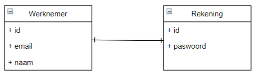
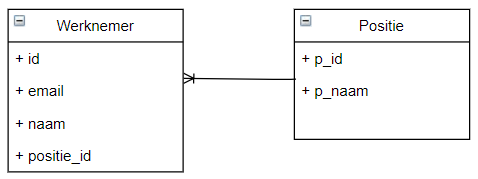
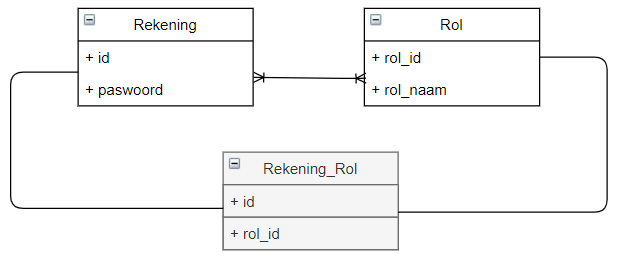

## Relaties Spring Boot

Je hebt verschillende annotaties voor relaties tussen klassen.

- `@OneToOne`
- `@OneToMany`
- `@ManyToOne`
- `@ManyToMany`

###  @OneToOne

Een-op-een relatie is een toestand waarbij gegevens in een tabel alleen een relatie hebben met een gegeven in een andere tabel.



Een werknemer heeft maar één rekening en vice versa.

_Employee.java_

```java
@Entity
@Table(name = "employee")
public class Employee {
    @Id
    @GeneratedValue(strategy = GenerationType.IDENTITY)
    private int id;

    private String name;
    private String email;

// constructors, getters, setters
}
```

_Account.java_

```java
@Entity
@Table(name = "account")
public class Account {

    @Id
    private int id;

    private String password;

    @OneToOne
    @JoinColumn(name = "id", referencedColumnName = "id")
    private Employee employee;
// constructors, getters, setters
}
```

### @OneToMany en @ManyToOne

Een veel-op-één-relatie is er wanneer één entiteit (typisch een kolom of een reeks kolommen) waarden bevat die verwijzen naar een andere entiteit (een kolom of reeks kolommen) die unieke waarden heeft.

Een één-op-veel relatie komt voor in database ontwerp wanneer een entiteit een meervoudige relatie heeft met een andere entiteit.



Eén positie kan veel werknemers hebben, maar elke werknemer kan maar voor één positie werken.

_Employee.java_

```java
@Entity
@Table(name = "employee")
public class Employee {
    @Id
    @GeneratedValue(strategy = GenerationType.IDENTITY)
    private int id;

    private String name;
    private String email;
    @ManyToOne(optional = false)
    @JoinColumn(name = "position_id", nullable = false,
        referencedColumnName = "p_id")
    private Position position;
// constructors, getters, setters
}
```

_Position.java_

```java
@Entity
@Table(name = "position")
public class Position {
    @Id
    @GeneratedValue(strategy = GenerationType.IDENTITY)
    private int p_id;
    private String p_name;
    @OneToMany(mappedBy = "position", cascade = CascadeType.ALL)
    private List<Employee> employee;
// constructors, getters, setters
}
```

### @ManyToMany

Een veel-op-veel relatie is een relatie die in beide richtingen een meervoudige waarde heeft.



Een account kan meer dan één rol hebben, en een rol kan meer dan één account hebben.

_Account.java_

```java
@Entity
@Table(name = "account")
public class Account {
    @Id
    private int id;

    private String password;
    @ManyToMany(cascade = CascadeType.ALL, fetch = FetchType.EAGER)
    @JoinTable(name = "account_role",
        joinColumns = @JoinColumn(name = "id", referencedColumnName        = "id"),
        inverseJoinColumns = @JoinColumn(name = "role_id", referencedColumnName = "role_id"))
    private List<Role> role;
// constructors, getters, setters
}
```

_Role.java_

```java
@Entity
@Table(name = "role")
public class Role {
    @Id
    @GeneratedValue(strategy = GenerationType.IDENTITY)
    private int role_id;

    private String role_name;
    @ManyToMany(mappedBy = "role")
    private List<Account> account;
// constructors, getters, setters
}
```


## Relaties Database

- Java: Onderlinge verhoudingen tussen objecten
- Database: Verhoudingen tussen entiteiten


- Java: Has-a relaties en is-a relaties
- Database: Alleen has-relaties


- Java: Relaties worden gemaakt met instantie variabelen
- Database: Maken gebruik van Foreign Keys en koppeltabellen

### Relaties in Java

In Java heb je twee soorten relaties:

- Has-a, bijvoorbeeld een klant heeft een adres, een liefhebber heeft een duif
- Is-a, bijvoorbeeld een hond is een dier, een auto is een vehicle (vaak overerving van abstracte klasses of interface)

_Voorbeeld 1 tot 1 - Java_

Stel je hebt een klasse `Person` en die heeft een adres en dat adres moet hij hebben als je hem aanmaakt. Als variabele zet je `private Address address` en bij de constructor geef je specifiek het adres mee tussen `()`. Je dwingt dus af dat Person alleen aangemaakt worden met dat adres.

```java
public class Person {
    private Address address;
    
    public Person(Address address) {
        this.address = address;
    }
    // Getters & Setters weggelaten
}
```

_Voorbeeld 1 tot n_

Dit is een relatie 1 of meer. Een `Company` kan 1 of meerdere werknemers hebben. Dit houd je bij in een `List<Person>`. Op het moment dat een Company aangemaakt wordt, wordt een lijst met employees aangemaakt: `public Company(List<Person> employees)` en opgeslagen in `private List<Person> employees;`. Met de `addEmployee` kun je employees 1 voor 1 toevoegen.

```java
public class Company {
    private List<Person> employees;
    
    public Company(List<Person> employees) {
        this.employees = employees;
    }
    public void addEmployee(Person employee) {
        employees.add(employee);
    }
}
```

_Voorbeeld n tot n_

De meer tot meer relatie. In Java is dit heel raar, dus gaan we niet te diep op in. In dit voorbeeld kan een `Person` voor een `Company` werken, maar dit kunnen 1 of meerdere bedrijven zijn. En een bedrijf heeft 1 of meerdere employees in dienst. Dus je kan bij de `Person` klasse een lijst bijhouden met bedrijven waarvoor hij werkt en in de `Company` klasse een lijst met employees die voor het bedrijf werkt.

```java
public class Company {
    private List<Person> employees;
}
public class Person {
    private List<Company> companies;
}
```

### Kardinaliteit in Java

- 0 tot 1 relatie, iemand heeft bijvoorbeeld 0 of 1 adres, dus nooit 2, 3 of 5
- 1 tot 1 relatie, iemand heeft altijd een adres
- 0 tot N relatie, 0 tot meer kan bijvoorbeeld zijn iemand heeft 0 of meer kinderen
- 1 tot N relatie, 1 of meer kan bijvoorbeeld zijn een bedrijf heeft 1 of meer werknemers
- N tot N relatie, meer of meer is bijvoorbeeld een hond kan meerdere baasjes hebben en een baasje kan meerdere honden hebben

Standaard 0, 1 of oneindig! Je kan ook zeggen dat iets 1 tot 5 relatie kan zijn, bijvoorbeeld iemand kan max 5 adressen hebben.

### Kardinaliteit in Database

- 0 tot 1 relatie
- 1 tot 1 relatie
- 0 tot N relatie
- 1 tot N relatie
- N tot N relatie

Altijd 0, 1 of oneindig. In een database model zeggen we nooit dat iets een 1 tot 5 relatie kan hebben.

### Compositie & aggregatie

De diamantjes die ingekleurd of niet ingekleurd zijn.

- Aggregatie: geen eigenaarschap.
- Aggregatie: objecten kunnen los van elkaar bestaan
- Compositie: wanneer het object met eigenaarschap wordt verwijderd, verdwijnen de relatie-objecten ook

Stel je hebt een klasse Person en een klasse Adres en je verwijderd de klasse Person, heeft het dan nut om de klasse Adres te laten bestaan. Heeft het wel nut om klasse Adres the laten bestaan dat hij niet verwijderd hoeft te worden dan heb je een aggregatie. Moet Adres verwijdert worden als Person klasse verwijderd wordt dan heb je een compositie.


## Relaties Java

Associative relationships: association is a relation of one class to another class, various forms:
- Association
- Aggregation
- Composition

### Association

Associations are relationships between classes.

Association in Java is a connection or relation between two separate classes that are set up through their objects. Association relationship indicates how objects know each other and how they are using each other's functionality. It can be one-to-one, one-to-many, many-to-one and many-to-many.

Example: <br/>
A Student takes a Course <br/>
A Course is provided by a Teacher

### Aggregation

A special kind of association (relationship).

It represents a "part of" relationship.

Example:<br/>
A Wheel is part of a Car

Aggregation implies a relationship in which the child can exist independently of the parent.

Example: Car (parent) and Wheel (child). Remove the car and the wheel still exists.

### Composition

A special type of aggregation where parts are destroyed when the whole is destroyed.

Example:<br/>
A Room is part of a House

Composition implies a relationship in which the child cannot exist independently of the parent.

Example: House (parent) and Room (child). A room does not exist independently of a house.