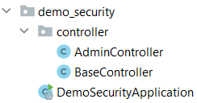
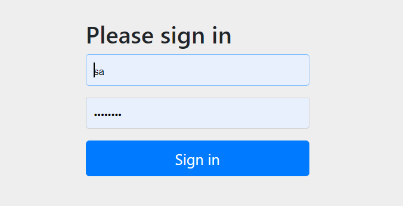

## Security project starten

Security gaat over het gebruik van Authentication en Authorization.

Authentication betekend dat je wilt weten wie er achter de knoppen zit. Dus welke user/gebruiker ben je.

Wanneer je eenmaal weet wie de user is kun je bepalen wat die persoon mag zien met Authorization. Dus waar heeft die
persoon toegang toe.

### Initializr

Ga naar de website <a href="https://start.spring.io" target="_blank">spring.io</a>. De volgende gegevens vul je in voor
het eerste Spring Boot project.

- Project: vink aan `Maven Project`
- Language: vink aan `Java`
- Spring Boot: vink aan `2.5.5` (laatste versie)
- Project Metadata: vul informatie in over jouw project
    - Group: `nl.danielle` (identifier van de ontwikkelaar)
    - Artifact: `security_demo` (hoe heet je project)
    - Name: `security_demo` (hoe heet je project)
    - Description: `Demo project for Spring Boot`
    - Package name: maakt het systeem zelf aan
    - Packaging: vink aan `Jar`
    - Java: vink aan `11`

Klik op "add dependencies" en voeg `Spring Web`, `Spring Data JPA`, `PostgreSQL Driver` en `Spring Security` toe.

Met "generate" wordt er een bestand in jouw download map gezet. Unzip het bestand en open het in Intellij.

Klik vervolgens rechtsonder in IntelliJ op `Load`.


Ga naar File > Project Structure en zet `Project SDK` op 11. Klik op apply.

### Spring Boot errors

Wanneer je in `pom.xml` een foutmelding krijgt, zet je de `<parent>` versie op `<version>2.4.3</version>` en wanneer je een foutmelding in de `<plugin>` krijg zet je de versie er tussen op de volgende manier: `<version>${project.parent.version}</version>`.

Het bestand `pom.xml` ziet er als volgt uit.

```xml
<?xml version="1.0" encoding="UTF-8"?>
<project xmlns="http://maven.apache.org/POM/4.0.0" xmlns:xsi="http://www.w3.org/2001/XMLSchema-instance"
         xsi:schemaLocation="http://maven.apache.org/POM/4.0.0 https://maven.apache.org/xsd/maven-4.0.0.xsd">
    <modelVersion>4.0.0</modelVersion>
    <parent>
        <groupId>org.springframework.boot</groupId>
        <artifactId>spring-boot-starter-parent</artifactId>
        <version>2.4.3</version>
        <relativePath/> <!-- lookup parent from repository -->
    </parent>
    <groupId>nl.danielle</groupId>
    <artifactId>security_demo</artifactId>
    <version>0.0.1-SNAPSHOT</version>
    <name>security_demo</name>
    <description>Demo project for Spring Boot</description>
    <properties>
        <java.version>11</java.version>
    </properties>
    <dependencies>
        <dependency>
            <groupId>org.springframework.boot</groupId>
            <artifactId>spring-boot-starter-data-jpa</artifactId>
        </dependency>
        <dependency>
            <groupId>org.springframework.boot</groupId>
            <artifactId>spring-boot-starter-security</artifactId>
        </dependency>
        <dependency>
            <groupId>org.springframework.boot</groupId>
            <artifactId>spring-boot-starter-web</artifactId>
        </dependency>

        <dependency>
            <groupId>org.postgresql</groupId>
            <artifactId>postgresql</artifactId>
            <scope>runtime</scope>
        </dependency>
        <dependency>
            <groupId>org.springframework.boot</groupId>
            <artifactId>spring-boot-starter-test</artifactId>
            <scope>test</scope>
        </dependency>
        <dependency>
            <groupId>org.springframework.security</groupId>
            <artifactId>spring-security-test</artifactId>
            <scope>test</scope>
        </dependency>
    </dependencies>

    <build>
        <plugins>
            <plugin>
                <groupId>org.springframework.boot</groupId>
                <artifactId>spring-boot-maven-plugin</artifactId>
                <version>${project.parent.version}</version>
            </plugin>
        </plugins>
    </build>

</project>
```

In het bestand `SecurityDemoApplication.java` krijg je de volgende melding.


Klik op "Trust project..." in de gele balk.

Wanneer de error niet weg is klik je op File > Invalidate Caches > Invalidate and Restart.

### application.properties

    # datasource PostgreSQl
    spring.datasource.platform=postgres
    spring.datasource.url=jdbc:postgresql://localhost:5432/security_demo
    spring.datasource.username=postgres
    spring.datasource.password=postgres123
    spring.datasource.driver-class-name=org.postgresql.Driver
    
    # jpa
    spring.jpa.database=postgresql
    spring.jpa.show-sql=true
    
    # generate schema dll to create tables
    spring.jpa.generate-ddl=true
    spring.jpa.hibernate.ddl-auto=create
    spring.datasource.initialization-mode=always
    
    # database initialization with data.sql after hibernate
    spring.jpa.defer-datasource-initialization=true
    
    # hibernate
    spring.jpa.properties.hibernate.dialect=org.hibernate.dialect.PostgreSQLDialect
    
    # Fix Postgres JPA Error (Method org.postgresql.jdbc.PgConnection.createClob() is not yet implemented).
    spring.jpa.properties.hibernate.jdbc.lob.non_contextual_creation=true

- `spring.datasource.url` is de database naam in pgAdmin
- `spring.datasource.username` is jouw username in pgAdmin
- `spring.datasource.password` is jouw wachtwoord in pgAdmin

### Controller

Maak een nieuwe package aan in je project genaamd `controller` en daarin een file `BaseController.java`. Daarnaast maken
we een andere file `AdminController.java` waar alleen de admin in mag.



_BaseController.java_

```java
package nl.danielle.security_demo.controller;

import org.springframework.http.HttpStatus;
import org.springframework.http.ResponseEntity;
import org.springframework.web.bind.annotation.GetMapping;
import org.springframework.web.bind.annotation.RestController;

@RestController
public class BaseController {

  @GetMapping(value = "/info")
  public ResponseEntity<Object> getInfo() {
    return new ResponseEntity<>("/info endpoint available", HttpStatus.OK);
  }
}
```

_AdminController.java_

```java
package nl.danielle.security_demo.controller;

import org.springframework.http.HttpStatus;
import org.springframework.http.ResponseEntity;
import org.springframework.web.bind.annotation.GetMapping;
import org.springframework.web.bind.annotation.RestController;

@RestController
public class AdminController {

    @GetMapping(value = "/admin")
    public ResponseEntity<Object> getAdmin() {
        return new ResponseEntity<>("/admin endpoint available for ADMIN only!", HttpStatus.OK);
    }
}
```

Run de applicatie.

Ga in de webbrowser naar `http://localhost:8080/info`. De link verandert naar `http://localhost:8080/login` en je krijgt
het volgende scherm te zien.



Deze login pagina is automatisch gegenereert door Spring Boot. Je kan nog niet inloggen, want we hebben geen users
gedefinieert.
