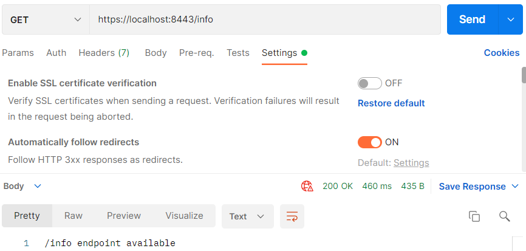
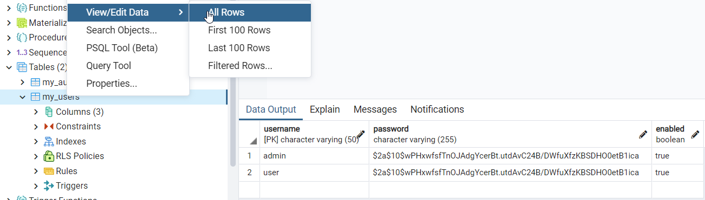
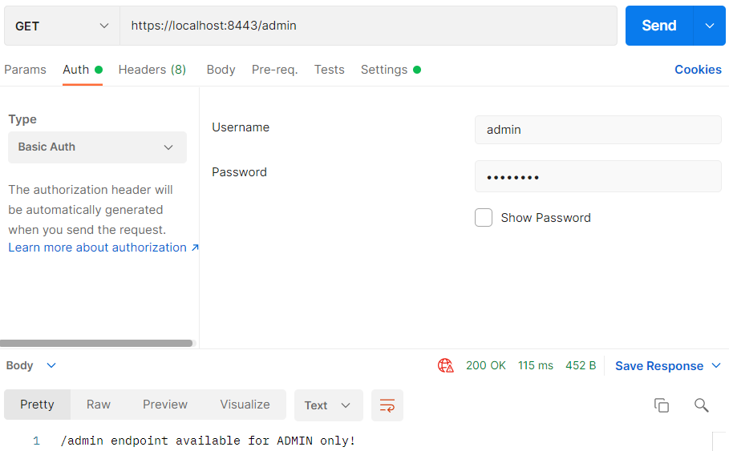
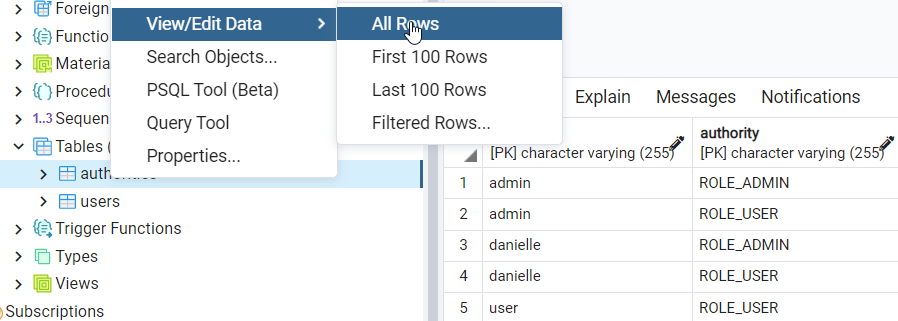
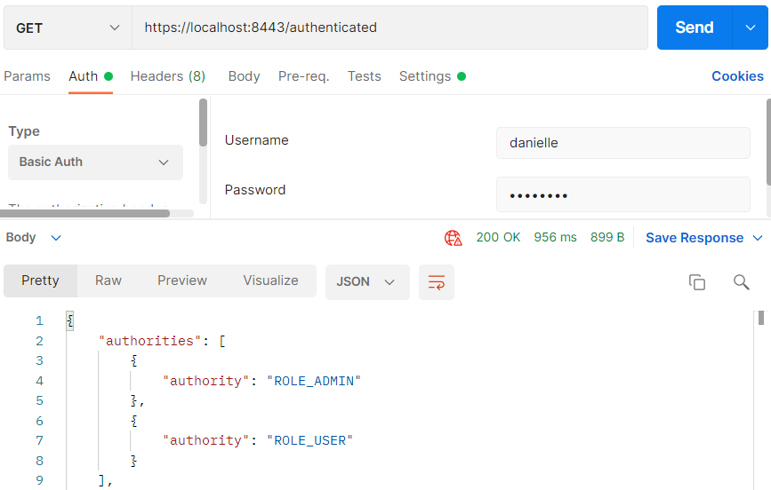

## Security

Security gaat in eerste instantie over het gebruik van Authentication en Authorization.

Authentication betekend dat je wilt weten wie er achter de knoppen zit. Dus welke user/gebruiker ben je.

Wanneer je eenmaal weet wie de user is kun je bepalen wat die persoon mag zien met Authorization. Dus waar heeft die
persoon toegang toe.

### Initializr

Ga naar de website <a href="https://start.spring.io" target="_blank">spring.io</a>. De volgende gegevens vul je in voor
het eerste Spring Boot project.

- Project: vink aan `Maven Project`
- Language: vink aan `Java`
- Spring Boot: vink aan `2.5.4` (laatste versie)
- Project Metadata: vul informatie in over jouw project
    - Group: `nl.danielle` (identifier van de ontwikkelaar)
    - Artifact: `demo_security` (hoe heet je project)
    - Name: `demo_security` (hoe heet je project)
    - Description: `Demo project for Spring Boot`
    - Package name: maakt het systeem zelf aan
    - Packaging: vink aan `Jar`
    - Java: vink aan `11`

Klik op "add dependencies" en voeg `Spring Web`, `Spring Data JPA`, `PostgreSQL Driver` en `Spring Security` toe.

Met "generate" wordt er een bestand in jouw download map gezet. Unzip het bestand en open het in Intellij.

Klik vervolgens rechtsonder in IntelliJ op `Load`.


Ga naar File > Project Structure en zet `Project SDK` op 11. Klik op apply.

### application.properties

    # datasource PostgreSQl
    spring.jpa.database=postgresql
    spring.datasource.platform=postgres
    
    spring.datasource.url=jdbc:postgresql://localhost:5432/demo_security
    spring.datasource.username=postgres
    spring.datasource.password=postgres123
    spring.datasource.driver-class-name=org.postgresql.Driver
    
    spring.jpa.generate-ddl=true
    spring.jpa.properties.hibernate.jdbc.lob.non_contextual_creation=true
    spring.jpa.properties.hibernate.dialect= org.hibernate.dialect.PostgreSQLDialect
    
    spring.jpa.show-sql = true
    
    spring.jpa.hibernate.ddl-auto=create
    spring.datasource.initialization-mode=always

- `url` is de database naam in pgAdmin
- `username` is jouw username in pgAdmin
- `password` is jouw wachtwoord in pgAdmin

Zet de versie in de pom.xml op `<version>2.4.3</version>`.

### Controller

Maak een nieuwe package aan in je project genaamd `controller` en daarin een file `BaseController.java`. Daarnaast maken
we een andere file `AdminController.java` waar alleen de admin in mag.


_BaseController.java_

```java
package nl.danielle.demo_security.controller;

import org.springframework.http.HttpStatus;
import org.springframework.http.ResponseEntity;
import org.springframework.web.bind.annotation.GetMapping;
import org.springframework.web.bind.annotation.RestController;

@RestController
public class BaseController {

    @GetMapping(value = "/info")
    public ResponseEntity<Object> getInfo() {
        return new ResponseEntity<>("/info endpoint available", HttpStatus.OK);
    }
}
```

_AdminController.java_

```java
package nl.danielle.demo_security.controller;

import org.springframework.http.HttpStatus;
import org.springframework.http.ResponseEntity;
import org.springframework.web.bind.annotation.GetMapping;
import org.springframework.web.bind.annotation.RestController;

@RestController
public class AdminController {

    @GetMapping(value = "/admin")
    public ResponseEntity<Object> getAdmin() {
        return new ResponseEntity<>("/admin endpoint available for ADMIN only!", HttpStatus.OK);
    }
}
```

Run de applicatie.

Ga in de webbrowser naar `http://localhost:8080/info`. De link verandert naar `http://localhost:8080/login` en je krijgt
het volgende scherm te zien.


Deze login pagina is automatisch gegenereert door Spring Boot. Je kan nog niet inloggen, want we hebben geen users
gedefinieert.

### Configureren

Maak een nieuwe package aan `config` met daarin de file `SpringSecurityConfig.java`


De `SpringSecurityConfig.java` wordt een plek waarbij we de security configuratie van Spring Boot gaan configureren.

We beginnen met de decorators van Spring Boot die aangeven dat de classe `SpringSecurityConfig` over `@Configuration`
gaat en met name over de `@EnableWebSecurity`. Daarnaast is `SpringSecurityConfig` een subklasse van de
default `WebSecurityConfigurerAdapter`.

```java
package nl.danielle.demo_security.config;

import org.springframework.context.annotation.Configuration;
import org.springframework.security.config.annotation.web.configuration.EnableWebSecurity;
import org.springframework.security.config.annotation.web.configuration.WebSecurityConfigurerAdapter;

@Configuration
@EnableWebSecurity
public class SpringSecurityConfig extends WebSecurityConfigurerAdapter {
}
```

In de `WebSecurityConfigurerAdapter` moeten een aantal dingen staan. We hebben twee methodes genaamd `configure`. Deze
methodes zitten al in de `WebSecurityConfigurerAdapter` en we gaan dit in onze eigen classe `SpringSecurityConfig`
herdefinieren.

We beginnen met de default.

```java
package nl.danielle.demo_security.config;

import org.springframework.context.annotation.Configuration;
import org.springframework.security.config.annotation.authentication.builders.AuthenticationManagerBuilder;
import org.springframework.security.config.annotation.web.builders.HttpSecurity;
import org.springframework.security.config.annotation.web.configuration.EnableWebSecurity;
import org.springframework.security.config.annotation.web.configuration.WebSecurityConfigurerAdapter;

@Configuration
@EnableWebSecurity
public class SpringSecurityConfig extends WebSecurityConfigurerAdapter {

    @Override
    protected void configure(AuthenticationManagerBuilder auth) throws Exception {

    }

    @Override
    protected void configure(HttpSecurity http) throws Exception {

        http
                .httpBasic()
                .and()
                .authorizeRequests()
                .anyRequest().permitAll()
                .and()
                .csrf().disable()
                .formLogin().disable();
    }
}
```

In de `http configure` gaan we de _Basic authentication_ aanzetten. Dat is een manier om authentication te doen, dus om
user en wachtwoord te geven. Op dit moment staat de default aan en met `.anyRequest().permitAll()` dus hij vraagt niet
om een wachtwoord, iedereen mag binnenkomen.

Run de applicatie.

Ga in de webbrowser naar `http://localhost:8080/info`. Je hoeft nu niet in te loggen, je krijgt gelijk de pagina te zien
met de tekst "/info endpoint available".

We gaan users en rollen definiëren in de `auth configure`.

```java
package nl.danielle.demo_security.config;

import org.springframework.context.annotation.Configuration;
import org.springframework.security.config.annotation.authentication.builders.AuthenticationManagerBuilder;
import org.springframework.security.config.annotation.web.builders.HttpSecurity;
import org.springframework.security.config.annotation.web.configuration.EnableWebSecurity;
import org.springframework.security.config.annotation.web.configuration.WebSecurityConfigurerAdapter;

@Configuration
@EnableWebSecurity
public class SpringSecurityConfig extends WebSecurityConfigurerAdapter {

    @Override
    protected void configure(AuthenticationManagerBuilder auth) throws Exception {

        auth.inMemoryAuthentication()
                .withUser("user").password("{noop}password").roles("USER")
                .and()
                .withUser("admin").password("{noop}password").roles("USER", "ADMIN");
    }

    @Override
    protected void configure(HttpSecurity http) throws Exception {

        http
                // HTTP Basic authentication
                .httpBasic()
                .and()
                .authorizeRequests()
                .anyRequest().permitAll()
                .and()
                .csrf().disable()
                .formLogin().disable();
    }
}
```

De rollen kunnen we gebruiken om toegang te geven tot endpoints.

Met `.antMatchers("/admin/**").hasRole("ADMIN")` geven we de rol `ADMIN` toegang tot `/admin/**`.

```java
package nl.danielle.demo_security.config;

import org.springframework.context.annotation.Configuration;
import org.springframework.security.config.annotation.authentication.builders.AuthenticationManagerBuilder;
import org.springframework.security.config.annotation.web.builders.HttpSecurity;
import org.springframework.security.config.annotation.web.configuration.EnableWebSecurity;
import org.springframework.security.config.annotation.web.configuration.WebSecurityConfigurerAdapter;

@Configuration
@EnableWebSecurity
public class SpringSecurityConfig extends WebSecurityConfigurerAdapter {

    @Override
    protected void configure(AuthenticationManagerBuilder auth) throws Exception {

        auth.inMemoryAuthentication()
                .withUser("user").password("{noop}password").roles("USER")
                .and()
                .withUser("admin").password("{noop}password").roles("USER", "ADMIN");
    }

    @Override
    protected void configure(HttpSecurity http) throws Exception {

        http
                // HTTP Basic authentication
                .httpBasic()
                .and()
                .authorizeRequests()
                .antMatchers("/admin/**").hasRole("ADMIN")
                .anyRequest().permitAll()
                .and()
                .csrf().disable()
                .formLogin().disable();
    }
}
```

Run de applicatie.

Ga in de webbrowser naar `http://localhost:8080/info`. Dit werkt, want je hebt niet aangegeven dat de admin hier voor
hoeft in te loggen. Wanneer je naar `http://localhost:8080/admin` gaat, dan moet je inloggen.


Inloggen doe je met gebruikersnaam `admin` en wachtwoord `password`.

Je komt op de admin pagina met de tekst "/admin endpoint available for ADMIN only!".

### Postman

Vul de url `http://localhost:8080/admin` in, ga naar authorization en klik op `Basic Auth`.


Vul de username en password in en druk op send.


### HTTPS

Het grote nadeel van basic authentication is dat alles openbaar is. Gebruik daarom geen http, maar https.

_Maak een zelfondertekend certificaat_

Voer in IntelliJ terminal of de opdrachtprompt de volgende commando uit:

    keytool -genkey -keyalg RSA -alias certificate -keystore certificate.jks -storepass password -validity 365 -keysize 4096 -storetype pkcs12

Beantwoord de vragen.

Er is een nieuw bestand in gemaakt `certificate.jks`. Zet dit bestand in de map `resources`.


_Toevoegen aan applicatie-eigenschappen_

    server.ssl.key-store=classpath:certificate.jks
    server.ssl.key-store-type=pkcs12
    server.ssl.key-store-password=password
    server.ssl.key-password=password
    server.ssl.key-alias=certificate
    server.port=8443

_Postman_

In Postman gebruik je de url `https://localhost:8443/info`. Zorg ervoor dat je bij de settings het zelfondertekende
certificaat toestaat.



## Security met aangepaste gebruikers tabel

Het nadeel van bovenstaande code in `SpringSecurityConfig.java` is dat we de users hard hebben geprogrammeerd. Dit
noemen ze ook de `inMemoryAuthentication`. Wat we eigenlijk willen is een user tabel in onze database, waarbij we users
kunnen toevoegen, verwijderen, rollen kunnen geven en wachtwoorden kunnen opslaan.

We maken een nieuw IntelliJ project in de Initializr.

Maak een nieuwe map aan `controller` met daarin 4 bestanden: `AdminController.java`, `AuthenticatedController.java`
, `BaseController.java` en `CustomersController.java`

_AdminController.java_

```java
package nl.danielle.demo_second_security.controller;

import org.springframework.http.HttpStatus;
import org.springframework.http.ResponseEntity;
import org.springframework.validation.annotation.Validated;
import org.springframework.web.bind.annotation.RequestMapping;
import org.springframework.web.bind.annotation.RestController;

@RestController
public class AdminController {

    @RequestMapping(value = "/admin")
    public ResponseEntity<Object> getMessage() {
        return new ResponseEntity<>("SECURED REST endpoint: /admin", HttpStatus.OK);
    }
}
```

_AuthenticatedController.java_

```java
package nl.danielle.demo_second_security.controller;

import org.springframework.http.ResponseEntity;
import org.springframework.security.core.Authentication;
import org.springframework.web.bind.annotation.GetMapping;
import org.springframework.web.bind.annotation.RequestMapping;
import org.springframework.web.bind.annotation.RestController;

import java.security.Principal;

@RestController
@RequestMapping(value = "/authenticated")
public class AuthenticatedController {

    @GetMapping(value = "")
    public ResponseEntity<Object> authenticated(Authentication authentication, Principal principal) {
        return ResponseEntity.ok().body(principal);
    }
}
```

_BaseController.java_

```java
package nl.danielle.demo_second_security.controller;

import org.springframework.http.HttpStatus;
import org.springframework.web.bind.annotation.RequestMapping;
import org.springframework.web.bind.annotation.ResponseStatus;
import org.springframework.web.bind.annotation.RestController;

@RestController
public class BaseController {

    @RequestMapping(value = "/")
    @ResponseStatus(HttpStatus.OK)
    public String hello() {
        return "Hello World";
    }
}
```

_CustomersController.java_

```java
package nl.danielle.demo_second_security.controller;

import org.springframework.http.HttpStatus;
import org.springframework.http.ResponseEntity;
import org.springframework.validation.annotation.Validated;
import org.springframework.web.bind.annotation.RequestMapping;
import org.springframework.web.bind.annotation.RestController;

@RestController
public class CustomersController {

    @RequestMapping(value = "/customers")
    public ResponseEntity<Object> getMessage() {
        return new ResponseEntity<>("SECURED REST endpoint: /customers", HttpStatus.OK);
    }
}
```

Maak een map `config` aan met een bestand `SpringSecurityConfig.java`.

```java
package nl.danielle.demo_second_security.config;

import org.springframework.beans.factory.annotation.Autowired;
import org.springframework.context.annotation.Bean;
import org.springframework.context.annotation.Configuration;
import org.springframework.http.HttpMethod;
import org.springframework.security.config.annotation.authentication.builders.AuthenticationManagerBuilder;
import org.springframework.security.config.annotation.web.builders.HttpSecurity;
import org.springframework.security.config.annotation.web.configuration.EnableWebSecurity;
import org.springframework.security.config.annotation.web.configuration.WebSecurityConfigurerAdapter;
import org.springframework.security.crypto.bcrypt.BCryptPasswordEncoder;
import org.springframework.security.crypto.password.PasswordEncoder;

import javax.sql.DataSource;

@Configuration
@EnableWebSecurity
public class SpringSecurityConfig extends WebSecurityConfigurerAdapter {

    @Autowired
    private DataSource dataSource;

    @Autowired
    public void configureGlobal(AuthenticationManagerBuilder auth) throws Exception {

        auth.jdbcAuthentication().dataSource(dataSource)
                .usersByUsernameQuery("SELECT username, password, enabled FROM my_users WHERE username=?")
                .authoritiesByUsernameQuery("SELECT username, authority FROM my_authorities AS a WHERE username=?");
    }

    @Bean
    public PasswordEncoder passwordEncoder() {
        return new BCryptPasswordEncoder();
    }

    // Secure the endpoins with HTTP Basic authentication
    @Override
    protected void configure(HttpSecurity http) throws Exception {

        http
                //HTTP Basic authentication
                .httpBasic()
                .and()
                .authorizeRequests()
                .antMatchers(HttpMethod.GET, "/customers/**").hasRole("USER")
                .antMatchers(HttpMethod.GET, "/admin/**").hasRole("ADMIN")
                .antMatchers(HttpMethod.GET, "/authenticated/**").authenticated()
                .anyRequest().permitAll()
                .and()
                .csrf().disable()
                .formLogin().disable();
    }
}
```

Een `jdbcAuthentication` werkt op basis van een query naar een database (datasource).

    @Autowired
    public void configureGlobal(AuthenticationManagerBuilder auth) throws Exception
    {    
      auth.jdbcAuthentication().dataSource(dataSource)
        .usersByUsernameQuery("SELECT username, password, enabled FROM my_users WHERE username=?")
        .authoritiesByUsernameQuery("SELECT username, authority FROM my_authorities AS a WHERE username=?");    
    }

- We moeten de volgende tabellen krijgen: `my_users` en `my_authorities`.
- We kunnen zoeken op `username`
- Bij `my_users` krijgen we op basis van `username` een `username`, `password`, `enabled` terug
- Bij `my_authorities` krijgen we op basis van `username` de `username` en `authority` (de rol) terug

De endpoints die we hebben zijn: `/customers`, `/admin `en `/authenticated`.

Bij de `.antMatchers` zie je `HttpMethod.GET` staan. Dit hoef je niet te specificeren, dat mag je weglaten, dan geldt
het voor alle HTTP methods. Je kunt specificeren dat bijvoorbeeld als je ingelogd ben, dat je mag veranderen.

`"/authenticated/**").authenticated()` is hetzelfde als `hasRole` maar is voor iedere user die is ingelogd.

In `schema.sql` creeër je de tabellen voor in de database.

```sql
drop index if exists ix_auth_username;
drop table if exists my_authorities;
drop table if exists my_users;

create table my_users
(
    username varchar(50)  not null,
    password varchar(255) not null,
    enabled  boolean      not null,
    primary key (username)
);

create table my_authorities
(
    username  varchar(50) not null,
    authority varchar(50) not null,
    primary key (username, authority),
    foreign key (username) references my_users (username)
);

create unique index ix_auth_username on my_authorities (username, authority);
```

In `data.sql` voegen we records toe.

```sql
INSERT INTO my_users (username, password, enabled)
VALUES ('user', '$2a$10$wPHxwfsfTnOJAdgYcerBt.utdAvC24B/DWfuXfzKBSDHO0etB1ica', TRUE);
INSERT INTO my_users (username, password, enabled)
VALUES ('admin', '$2a$10$wPHxwfsfTnOJAdgYcerBt.utdAvC24B/DWfuXfzKBSDHO0etB1ica', TRUE);

INSERT INTO my_authorities (username, authority)
VALUES ('user', 'ROLE_USER');
INSERT INTO my_authorities (username, authority)
VALUES ('admin', 'ROLE_USER');
INSERT INTO my_authorities (username, authority)
VALUES ('admin', 'ROLE_ADMIN');
```

Run de applicatie.

Ga naar PostgreSQL en kijk in de tabel `demo_second_security`.

De applicatie heeft twee tabellen gemaakt: `my_users` en `my_authorities`


Bij `my_users` staan de twee users die je hebt gemaakt er ook in.



Bij `my_authorities` staan de rollen van de users erin.


Ga naar Postman en vul de url `http://localhost:8080/admin` in met als username `user`.


Je krijgt een status code `403 forbidden`.

Doe hetzelfde maar dan met user `admin`.



##### Authenticated

Authenticated in `SpringSecurityConfig.java` gaat naar de endoint `/authenticated`, die in
de `AuthenticatedController.java` zit.

```java
package nl.danielle.demo_second_security.controller;

import org.springframework.http.ResponseEntity;
import org.springframework.security.core.Authentication;
import org.springframework.web.bind.annotation.GetMapping;
import org.springframework.web.bind.annotation.RequestMapping;
import org.springframework.web.bind.annotation.RestController;

import java.security.Principal;

@RestController
@RequestMapping(value = "/authenticated")
public class AuthenticatedController {

    @GetMapping(value = "")
    public ResponseEntity<Object> authenticated(Authentication authentication, Principal principal) {
        return ResponseEntity.ok().body(principal);
    }
}
```

In plaats van een paramater hebben we een argument staan: `Authentication authentication, Principal principal`.
Principal geeft weer met wat voor credentials je bent ingelogd. De credentials geef je gelijk terug in de
body: `body(principal)`.

Wanneer je in Postman de volgende url zet: `http://localhost:8080/authenticated`. Je krijgt de gegevens van `admin`
terug. Je ziet bijvoorbeeld bij de authorities dat `admin` zowel de rol als admin heeft als user.


Hetzelfde kun je doen wanneer je als `user` bent ingelogd.

Deze gegevens zijn een soort weergave van de interne gegevens die hij heeft van een user. Dat noemen ze de principal.

## Security met gebruikerstabel

We willen geen vaste tabel zoals `my_users` en `my_authorities`.

We maken een nieuw IntelliJ project in de Initializr.

Maak een nieuwe package aan genaamd `controller` en hierin de volgende bestanden: `AdminController.java`
, `AuthenticatedController.java`, `BaseController.java` en `CustomersController.java`.

_AdminController.java_

```java
package nl.danielle.demo_third_security.controller;

import org.springframework.http.HttpStatus;
import org.springframework.http.ResponseEntity;
import org.springframework.web.bind.annotation.GetMapping;
import org.springframework.web.bind.annotation.RequestMapping;
import org.springframework.web.bind.annotation.RestController;

@RestController
@RequestMapping(value = "/admin")
public class AdminController {

    @GetMapping(value = "")
    public ResponseEntity<Object> getMessage() {
        return new ResponseEntity<>("SECURED REST endpoint: /admin", HttpStatus.OK);
    }
}
```

_AuthenticatedController.java_

```java
package nl.danielle.demo_third_security.controller;

import org.springframework.http.ResponseEntity;
import org.springframework.security.core.Authentication;
import org.springframework.web.bind.annotation.GetMapping;
import org.springframework.web.bind.annotation.RequestMapping;
import org.springframework.web.bind.annotation.RestController;

import java.security.Principal;

@RestController
@RequestMapping(value = "/authenticated")
public class AuthenticatedController {

    @GetMapping(value = "")
    public ResponseEntity<Object> authenticated(Authentication authentication, Principal principal) {
        return ResponseEntity.ok().body(principal);
    }
}
```

_BaseController.java_

```java
package nl.danielle.demo_third_security.controller;

import org.springframework.web.bind.annotation.GetMapping;
import org.springframework.web.bind.annotation.RestController;

@RestController
public class BaseController {

    @GetMapping(value = "/")
    public String hello() {
        return "Hello World";
    }
}
```

_CustomersController.java_

```java
package nl.danielle.demo_third_security.controller;

import org.springframework.http.HttpStatus;
import org.springframework.http.ResponseEntity;
import org.springframework.web.bind.annotation.GetMapping;
import org.springframework.web.bind.annotation.RequestMapping;
import org.springframework.web.bind.annotation.RestController;

@RestController
@RequestMapping(value = "/customers")
public class CustomersController {

    @GetMapping(value = "")
    public ResponseEntity<Object> getMessage() {
        return new ResponseEntity<>("SECURED REST endpoint: /customers", HttpStatus.OK);
    }
}
```

Maak een nieuwe package aan genaamd `config` en hierin het volgende bestand: `SpringSecurityConfig.java`.

```java
package nl.danielle.demo_third_security.config;

import org.springframework.beans.factory.annotation.Autowired;
import org.springframework.context.annotation.Bean;
import org.springframework.context.annotation.Configuration;
import org.springframework.http.HttpMethod;
import org.springframework.security.config.annotation.authentication.builders.AuthenticationManagerBuilder;
import org.springframework.security.config.annotation.web.builders.HttpSecurity;
import org.springframework.security.config.annotation.web.configuration.EnableWebSecurity;
import org.springframework.security.config.annotation.web.configuration.WebSecurityConfigurerAdapter;
import org.springframework.security.crypto.bcrypt.BCryptPasswordEncoder;
import org.springframework.security.crypto.password.PasswordEncoder;

import javax.sql.DataSource;

@Configuration
@EnableWebSecurity
public class SpringSecurityConfig extends WebSecurityConfigurerAdapter {

    @Autowired
    private DataSource dataSource;

    @Autowired
    public void configureGlobal(AuthenticationManagerBuilder auth) throws Exception {

        auth.jdbcAuthentication().dataSource(dataSource);
    }

    @Bean
    public PasswordEncoder passwordEncoder() {
        return new BCryptPasswordEncoder();
    }

    // Secure the endpoints with HTTP Basic authentication
    @Override
    protected void configure(HttpSecurity http) throws Exception {

        http
                //HTTP Basic authentication
                .httpBasic()
                .and()
                .authorizeRequests()
                .antMatchers(HttpMethod.GET, "/customers/**").hasRole("USER")
                .antMatchers(HttpMethod.GET, "/admin/**").hasRole("ADMIN")
                .antMatchers(HttpMethod.GET, "/authenticated/**").authenticated()
                .anyRequest().permitAll()
                .and()
                .csrf().disable()
                .formLogin().disable();
    }
}
```

We hebben de query's (my_users en my_authorities) eruit gelaten en verwijzen nu naar de datasource met de
jdbc `auth.jdbcAuthentication().dataSource(dataSource);`

Omdat we nu een tabel maken die `'User` en `Authority` heten, gaat `jdbc` de query's volledig automatisch doen.

Maak een nieuwe package aan genaamd `model` en hierin de volgende bestanden: `Authority.java` en `User.java`.

_Authority.java_

```java
package nl.danielle.demo_third_security.model;

import javax.persistence.*;
import java.io.Serializable;

@Entity
@Table(name = "authorities")
public class Authority implements Serializable {

    @Id
    @Column(nullable = false)
    private String username;

    @Id
    @Column(nullable = false)
    private String authority;

    public String getUsername() {
        return username;
    }

    public void setUsername(String username) {
        this.username = username;
    }

    public String getAuthority() {
        return authority;
    }

    public void setAuthority(String authority) {
        this.authority = authority;
    }
}
```

_User.java_

```java
package nl.danielle.demo_third_security.model;

import javax.persistence.*;

@Entity
@Table(name = "users")
public class User {

    @Id
    @Column(nullable = false, unique = true)
    private String username;

    @Column(nullable = false, length = 255)
    private String password;

    @Column(nullable = false)
    private boolean enabled;

    public String getUsername() {
        return username;
    }

    public void setUsername(String username) {
        this.username = username;
    }

    public String getPassword() {
        return password;
    }

    public void setPassword(String password) {
        this.password = password;
    }

    public boolean isEnabled() {
        return enabled;
    }

    public void setEnabled(boolean enabled) {
        this.enabled = enabled;
    }
}

```

In de `resources` map heb je de volgende bestanden met bijbehorende code: `application.properties` en `data.sql`. Schema hebben we niet meer nodig.

_application.properties_

    # datasource Postgres
    spring.jpa.database=postgresql
    spring.datasource.platform=postgres
    spring.datasource.url=jdbc:postgresql://localhost:5432/demo_third_security
    spring.datasource.username=postgres
    spring.datasource.password=postgres123
    spring.datasource.driver-class-name=org.postgresql.Driver
    spring.datasource.initialization-mode=always
    spring.jpa.generate-ddl=true
    spring.jpa.hibernate.ddl-auto=create-drop
    spring.jpa.properties.hibernate.jdbc.lob.non_contextual_creation=true
    
    spring.jpa.properties.hibernate.dialect= org.hibernate.dialect.PostgreSQLDialect

_data.sql_

```sql
INSERT INTO users (username, password, enabled)
VALUES ('user', '$2a$10$wPHxwfsfTnOJAdgYcerBt.utdAvC24B/DWfuXfzKBSDHO0etB1ica', TRUE);
INSERT INTO users (username, password, enabled)
VALUES ('admin', '$2a$10$wPHxwfsfTnOJAdgYcerBt.utdAvC24B/DWfuXfzKBSDHO0etB1ica', TRUE);
INSERT INTO users (username, password, enabled)
VALUES ('peter', '$2a$10$wPHxwfsfTnOJAdgYcerBt.utdAvC24B/DWfuXfzKBSDHO0etB1ica', TRUE);

INSERT INTO authorities (username, authority)
VALUES ('user', 'ROLE_USER');
INSERT INTO authorities (username, authority)
VALUES ('admin', 'ROLE_USER');
INSERT INTO authorities (username, authority)
VALUES ('admin', 'ROLE_ADMIN');
INSERT INTO authorities (username, authority)
VALUES ('peter', 'ROLE_USER');
INSERT INTO authorities (username, authority)
VALUES ('peter', 'ROLE_ADMIN');
```

Het wachtwoord wat je ziet staan, is een encrypted wachtwoord. We hebben dit in code in de data.sql staan maar het is een encryptie. Spring Boot kent allerlei encrypties.

In `SpringSecurityConfig.java` zie je de volgende code staan.

    @Bean
    public PasswordEncoder passwordEncoder() {
      return new BCryptPasswordEncoder();
    }

Dit is de encoder die gebruikt word om de wachtwoorden te encoden. De `BCryptPasswordEncoder` vereist een bepaalde hoeveelheid rekenwerk.

Hoe weet je dat de code `$2a$10$wPHxwfsfTnOJAdgYcerBt.utdAvC24B/DWfuXfzKBSDHO0etB1ica` bij het wachtwoord `password` hoort? Daar zijn websites voor: https://www.browserling.com/tools/bcrypt. Wanneer je het wachtwoord `password` intikt krijg je `$2a$10$in7p/8vt5wmfqmo8xD5QHumpRPSuB2tEQ4oeWX5bL.cGi5GOqr7XW`.

Run de applicatie.

In postgreSQL zie je de tabellen `authorities` en `users` staan.




In Postman ga je naar url `http://localhost:8080/authenticated` en logt in als `peter`, `admin` of `user`.



De url's `http://localhost:8080/`, `http://localhost:8080/customers` en `http://localhost:8080/admin` kun je testen met de rollen `peter`, `admin` of `user` met wachtwoord `password`. Dit zijn alle endpoints die je in de `controller`heb gedefinieerd.

## Security met gebruikersentiteit


Maak een nieuwe package aan genaamd `service` en hierin de volgende bestanden: `MyUserDetailsService.java`
en `MyUserPrincipal.java`.

_MyUserDetailsService.java_

```java

```

_MyUserPrincipal.java_

```java

```

