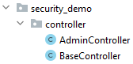
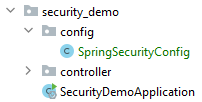

## Security

Security gaat in eerste instantie over het gebruik van Authentication en Authorization.

Authentication betekend dat je wilt weten wie er achter de knoppen zit. Dus welke user/gebruiker ben je.

Wanneer je eenmaal weet wie de user is kun je bepalen wat die persoon mag zien met Authorization. Dus waar heeft die
persoon toegang toe.

### Initializr

Ga naar de website <a href="https://start.spring.io" target="_blank">spring.io</a>. De volgende gegevens vul je in voor
het eerste Spring Boot project.

- Project: vink aan `Maven Project`
- Language: vink aan `Java`
- Spring Boot: vink aan `2.5.4` (laatste versie)
- Project Metadata: vul informatie in over jouw project
    - Group: `nl.danielle` (identifier van de ontwikkelaar)
    - Artifact: `demo_security` (hoe heet je project)
    - Name: `demo_security` (hoe heet je project)
    - Description: `Demo project for Spring Boot`
    - Package name: maakt het systeem zelf aan
    - Packaging: vink aan `Jar`
    - Java: vink aan `11`

Klik op "add dependencies" en voeg `Spring Web`, `Spring Data JPA`, `PostgreSQL Driver` en `Spring Security` toe.

Met "generate" wordt er een bestand in jouw download map gezet. Unzip het bestand en open het in Intellij.

Klik vervolgens rechtsonder in IntelliJ op `Load`.


Ga naar File > Project Structure en zet `Project SDK` op 11. Klik op apply.

### application.properties

    # datasource PostgreSQl
    spring.jpa.database=postgresql
    spring.datasource.platform=postgres
    
    spring.datasource.url=jdbc:postgresql://localhost:5432/demo_security
    spring.datasource.username=postgres
    spring.datasource.password=postgres123
    spring.datasource.driver-class-name=org.postgresql.Driver
    
    spring.jpa.generate-ddl=true
    spring.jpa.properties.hibernate.jdbc.lob.non_contextual_creation=true
    spring.jpa.properties.hibernate.dialect= org.hibernate.dialect.PostgreSQLDialect
    
    spring.jpa.show-sql = true
    
    spring.jpa.hibernate.ddl-auto=create
    spring.datasource.initialization-mode=always

- `url` is de database naam in pgAdmin
- `username` is jouw username in pgAdmin
- `password` is jouw wachtwoord in pgAdmin

Zet de versie in de pom.xml op `<version>2.4.3</version>`.

### Controller

Maak een nieuwe package aan in je project genaamd `controller` en daarin een file `BaseController.java`. Daarnaast maken
we een andere file `AdminController.java` waar alleen de admin in mag.



_BaseController.java_

```java
package nl.danielle.demo_security.controller;

import org.springframework.http.HttpStatus;
import org.springframework.http.ResponseEntity;
import org.springframework.web.bind.annotation.GetMapping;
import org.springframework.web.bind.annotation.RestController;

@RestController
public class BaseController {

    @GetMapping(value = "/info")
    public ResponseEntity<Object> getInfo() {
        return new ResponseEntity<>("/info endpoint available", HttpStatus.OK);
    }
}
```

_AdminController.java_

```java
package nl.danielle.demo_security.controller;

import org.springframework.http.HttpStatus;
import org.springframework.http.ResponseEntity;
import org.springframework.web.bind.annotation.GetMapping;
import org.springframework.web.bind.annotation.RestController;

@RestController
public class AdminController {

    @GetMapping(value = "/admin")
    public ResponseEntity<Object> getAdmin() {
        return new ResponseEntity<>("/admin endpoint available for ADMIN only!", HttpStatus.OK);
    }
}
```

Run de applicatie.

Ga in de webbrowser naar `http://localhost:8080/info`. De link verandert naar `http://localhost:8080/login` en je krijgt het volgende scherm te zien.


Deze login pagina is automatisch gegenereert door Spring Boot. Je kan nog niet inloggen, want we hebben geen users gedefinieert. 

### Configureren

Maak een nieuwe package aan `config` met daarin de file `SpringSecurityConfig.java`

