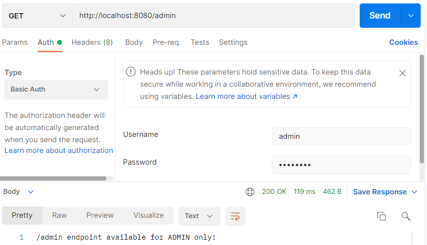

### Configureren

Maak een nieuwe package aan `config` met daarin de file `SpringSecurityConfig.java`


De `SpringSecurityConfig.java` wordt een plek waarbij we de security configuratie van Spring Boot gaan configureren.

We beginnen met de decorators van Spring Boot die aangeven dat de classe `SpringSecurityConfig` over `@Configuration`
gaat en met name over de `@EnableWebSecurity`. Daarnaast is `SpringSecurityConfig` een subklasse van de
default `WebSecurityConfigurerAdapter`.

```java
package nl.danielle.demo_security.config;

import org.springframework.context.annotation.Configuration;
import org.springframework.security.config.annotation.web.configuration.EnableWebSecurity;
import org.springframework.security.config.annotation.web.configuration.WebSecurityConfigurerAdapter;

@Configuration
@EnableWebSecurity
public class SpringSecurityConfig extends WebSecurityConfigurerAdapter {
}
```

In de `WebSecurityConfigurerAdapter` moeten een aantal dingen staan. We hebben twee methodes genaamd `configure`. Deze
methodes zitten al in de `WebSecurityConfigurerAdapter` en we gaan dit in onze eigen classe `SpringSecurityConfig`
herdefinieren.

We beginnen met de default.

```java
package nl.danielle.demo_security.config;

import org.springframework.context.annotation.Configuration;
import org.springframework.security.config.annotation.authentication.builders.AuthenticationManagerBuilder;
import org.springframework.security.config.annotation.web.builders.HttpSecurity;
import org.springframework.security.config.annotation.web.configuration.EnableWebSecurity;
import org.springframework.security.config.annotation.web.configuration.WebSecurityConfigurerAdapter;

@Configuration
@EnableWebSecurity
public class SpringSecurityConfig extends WebSecurityConfigurerAdapter {

    @Override
    protected void configure(AuthenticationManagerBuilder auth) throws Exception {

    }

    @Override
    protected void configure(HttpSecurity http) throws Exception {

        http
                .httpBasic()
                .and()
                .authorizeRequests()
                .anyRequest().permitAll()
                .and()
                .csrf().disable()
                .formLogin().disable();
    }
}
```

In de `http configure` gaan we de _Basic authentication_ aanzetten. Dat is een manier om authentication te doen, dus om
user en wachtwoord te geven. Op dit moment staat de default aan en met `.anyRequest().permitAll()` dus hij vraagt niet
om een wachtwoord, iedereen mag binnenkomen.

Run de applicatie.

Ga in de webbrowser naar `http://localhost:8080/info`. Je hoeft nu niet in te loggen, je krijgt gelijk de pagina te zien
met de tekst "/info endpoint available".

We gaan users en rollen definiëren in de `auth configure`.

```java
package nl.danielle.demo_security.config;

import org.springframework.context.annotation.Configuration;
import org.springframework.security.config.annotation.authentication.builders.AuthenticationManagerBuilder;
import org.springframework.security.config.annotation.web.builders.HttpSecurity;
import org.springframework.security.config.annotation.web.configuration.EnableWebSecurity;
import org.springframework.security.config.annotation.web.configuration.WebSecurityConfigurerAdapter;

@Configuration
@EnableWebSecurity
public class SpringSecurityConfig extends WebSecurityConfigurerAdapter {

    @Override
    protected void configure(AuthenticationManagerBuilder auth) throws Exception {

        auth.inMemoryAuthentication()
                .withUser("user").password("{noop}password").roles("USER")
                .and()
                .withUser("admin").password("{noop}password").roles("USER", "ADMIN");
    }

    @Override
    protected void configure(HttpSecurity http) throws Exception {

        http
                // HTTP Basic authentication
                .httpBasic()
                .and()
                .authorizeRequests()
                .anyRequest().permitAll()
                .and()
                .csrf().disable()
                .formLogin().disable();
    }
}
```

De rollen kunnen we gebruiken om toegang te geven tot endpoints.

Met `.antMatchers("/admin/**").hasRole("ADMIN")` geven we de rol `ADMIN` toegang tot `/admin/**`.

```java
package nl.danielle.demo_security.config;

import org.springframework.context.annotation.Configuration;
import org.springframework.security.config.annotation.authentication.builders.AuthenticationManagerBuilder;
import org.springframework.security.config.annotation.web.builders.HttpSecurity;
import org.springframework.security.config.annotation.web.configuration.EnableWebSecurity;
import org.springframework.security.config.annotation.web.configuration.WebSecurityConfigurerAdapter;

@Configuration
@EnableWebSecurity
public class SpringSecurityConfig extends WebSecurityConfigurerAdapter {

    @Override
    protected void configure(AuthenticationManagerBuilder auth) throws Exception {

        auth.inMemoryAuthentication()
                .withUser("user").password("{noop}password").roles("USER")
                .and()
                .withUser("admin").password("{noop}password").roles("USER", "ADMIN");
    }

    @Override
    protected void configure(HttpSecurity http) throws Exception {

        http
                // HTTP Basic authentication
                .httpBasic()
                .and()
                .authorizeRequests()
                .antMatchers("/admin/**").hasRole("ADMIN")
                .anyRequest().permitAll()
                .and()
                .csrf().disable()
                .formLogin().disable();
    }
}
```

Run de applicatie.

Ga in de webbrowser naar `http://localhost:8080/info`. Dit werkt, want je hebt niet aangegeven dat de admin hier voor
hoeft in te loggen. Wanneer je naar `http://localhost:8080/admin` gaat, dan moet je inloggen.


Inloggen doe je met gebruikersnaam `admin` en wachtwoord `password`.

Je komt op de admin pagina met de tekst "/admin endpoint available for ADMIN only!".

### Postman

Vul de url `http://localhost:8080/admin` in, ga naar authorization en klik op `Basic Auth`.


Vul de username en password in en druk op send.


