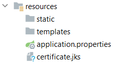
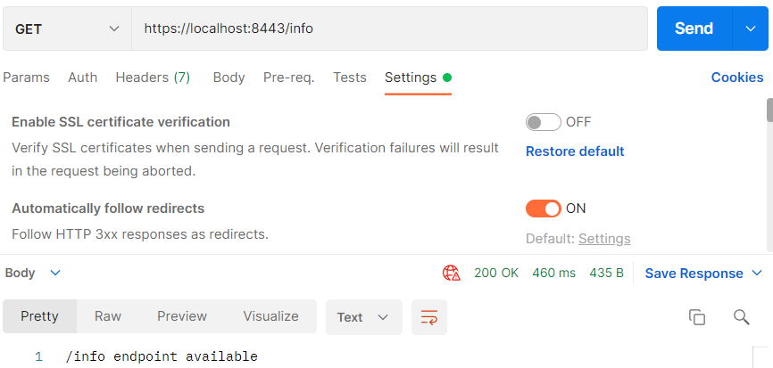

## HTTPS

Het grote nadeel van basic authentication is dat alles openbaar is. Gebruik daarom geen http, maar https.

_Maak een zelfondertekend certificaat_

Voer in IntelliJ terminal of de opdrachtprompt de volgende commando uit:

    keytool -genkey -keyalg RSA -alias certificate -keystore certificate.jks -storepass password -validity 365 -keysize 4096 -storetype pkcs12

Beantwoord de vragen.

Er is een nieuw bestand in gemaakt `certificate.jks`. Zet dit bestand in de map `resources`.

_Toevoegen aan applicatie-eigenschappen_

    server.ssl.key-store=classpath:certificate.jks
    server.ssl.key-store-type=pkcs12
    server.ssl.key-store-password=password
    server.ssl.key-password=password
    server.ssl.key-alias=certificate
    server.port=8443

_Postman_

In Postman gebruik je de url `https://localhost:8443/info`. Zorg ervoor dat je bij de settings het zelfondertekende
certificaat toestaat.

