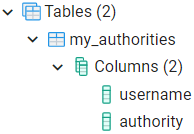
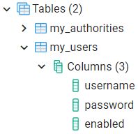
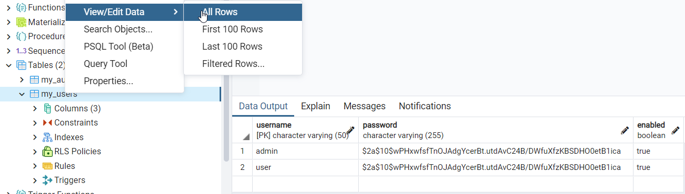
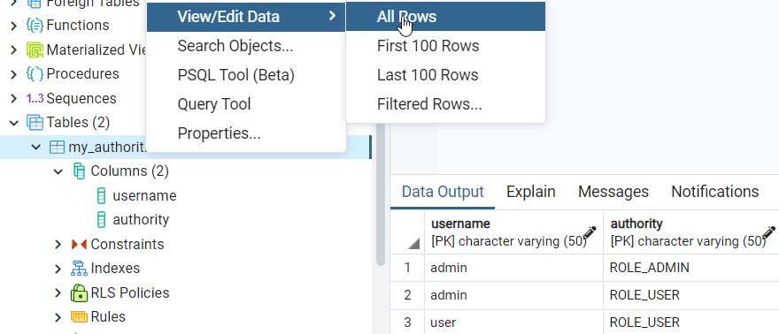
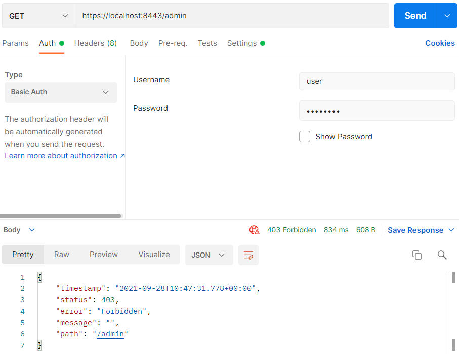
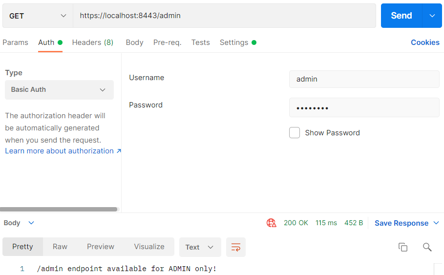

## Security met aangepaste gebruikers tabel

Het nadeel van voorgaande code in `SpringSecurityConfig.java` is dat we de users hard hebben geprogrammeerd. Dit
noemen ze `inMemoryAuthentication`. Wat we eigenlijk willen is een user tabel in onze database, waarbij we users
kunnen toevoegen, verwijderen, rollen kunnen geven en wachtwoorden kunnen opslaan.

### Controller

In de map `controller` hebben we 4 bestanden: `AdminController.java`, `BaseController.java`, `AuthenticatedController.java` en `CustomersController.java`

_AuthenticatedController.java_

```java
package nl.danielle.security_demo.controller;

import org.springframework.http.ResponseEntity;
import org.springframework.security.core.Authentication;
import org.springframework.web.bind.annotation.GetMapping;
import org.springframework.web.bind.annotation.RequestMapping;
import org.springframework.web.bind.annotation.RestController;

import java.security.Principal;

@RestController
@RequestMapping(value = "/authenticated")
public class AuthenticatedController {

    @GetMapping(value = "")
    public ResponseEntity<Object> authenticated(Authentication authentication, Principal principal) {
        return ResponseEntity.ok().body(principal);
    }
}
```

_CustomersController.java_

```java
package nl.danielle.security_demo.controller;

import org.springframework.http.HttpStatus;
import org.springframework.http.ResponseEntity;
import org.springframework.web.bind.annotation.GetMapping;
import org.springframework.web.bind.annotation.RestController;

@RestController
public class CustomersController {

    @GetMapping(value = "/customers")
    public ResponseEntity<Object> getMessage() {
        return new ResponseEntity<>("SECURED REST endpoint: /customers", HttpStatus.OK);
    }
}
```

### Config

In de map `config` staat het bestand `SpringSecurityConfig.java`.

```java
package nl.danielle.security_demo.config;

import org.springframework.beans.factory.annotation.Autowired;
import org.springframework.context.annotation.Bean;
import org.springframework.context.annotation.Configuration;
import org.springframework.http.HttpMethod;
import org.springframework.security.config.annotation.authentication.builders.AuthenticationManagerBuilder;
import org.springframework.security.config.annotation.web.builders.HttpSecurity;
import org.springframework.security.config.annotation.web.configuration.EnableWebSecurity;
import org.springframework.security.config.annotation.web.configuration.WebSecurityConfigurerAdapter;
import org.springframework.security.crypto.bcrypt.BCryptPasswordEncoder;
import org.springframework.security.crypto.password.PasswordEncoder;

import javax.sql.DataSource;

@Configuration
@EnableWebSecurity
public class SpringSecurityConfig extends WebSecurityConfigurerAdapter {

    @Autowired
    private DataSource dataSource;

    @Autowired
    public void configureGlobal(AuthenticationManagerBuilder auth) throws Exception {

        auth.jdbcAuthentication().dataSource(dataSource)
                .usersByUsernameQuery("SELECT username, password, enabled FROM my_users WHERE username=?")
                .authoritiesByUsernameQuery("SELECT username, authority FROM my_authorities AS a WHERE username=?");
    }

    @Bean
    public PasswordEncoder passwordEncoder() {
        return new BCryptPasswordEncoder();
    }

    // Secure the endpoins with HTTP Basic authentication
    @Override
    protected void configure(HttpSecurity http) throws Exception {

        http
                //HTTP Basic authentication
                .httpBasic()
                .and()
                .authorizeRequests()
                .antMatchers(HttpMethod.GET, "/customers/**").hasRole("USER")
                .antMatchers(HttpMethod.GET, "/admin/**").hasRole("ADMIN")
                .antMatchers(HttpMethod.GET, "/authenticated/**").authenticated()
                .anyRequest().permitAll()
                .and()
                .csrf().disable()
                .formLogin().disable();
    }
}
```

Een `jdbcAuthentication` werkt op basis van een query naar een database (datasource).

    @Autowired
    public void configureGlobal(AuthenticationManagerBuilder auth) throws Exception
    {    
      auth.jdbcAuthentication().dataSource(dataSource)
        .usersByUsernameQuery("SELECT username, password, enabled FROM my_users WHERE username=?")
        .authoritiesByUsernameQuery("SELECT username, authority FROM my_authorities AS a WHERE username=?");    
    }

- We moeten de volgende tabellen krijgen: `my_users` en `my_authorities`.
- We kunnen zoeken op `username`
- Bij `my_users` krijgen we op basis van `username` een `username`, `password` en `enabled` terug
- Bij `my_authorities` krijgen we op basis van `username` de `username` en `authority` (de rol) terug

De endpoints die we hebben zijn: `/customers`, `/admin `en `/authenticated`.

Bij de `.antMatchers` zie je `HttpMethod.GET` staan. Dit hoef je niet te specificeren, dat mag je weglaten, dan geldt
het voor alle HTTP methods en niet alleen `GET`. Je kunt specificeren dat bijvoorbeeld als je ingelogd bent, dat je mag veranderen.

`"/authenticated/**").authenticated()` is hetzelfde als `hasRole` maar is voor iedere user die is ingelogd.

### Resources

Maak een nieuw bestand aan in resources genaamd `schema.sql`. In `schema.sql` creëer je de tabellen voor in de database.

```sql
drop index if exists ix_auth_username;
drop table if exists my_authorities;
drop table if exists my_users;

create table my_users
(
    username varchar(50)  not null,
    password varchar(255) not null,
    enabled  boolean      not null,
    primary key (username)
);

create table my_authorities
(
    username  varchar(50) not null,
    authority varchar(50) not null,
    primary key (username, authority),
    foreign key (username) references my_users (username)
);

create unique index ix_auth_username on my_authorities (username, authority);
```

Maak een nieuw bestand aan in resources genaamd `data.sql`. In `data.sql` voegen we records toe.

```sql
INSERT INTO my_users (username, password, enabled)
VALUES ('user', '$2a$10$wPHxwfsfTnOJAdgYcerBt.utdAvC24B/DWfuXfzKBSDHO0etB1ica', TRUE);
INSERT INTO my_users (username, password, enabled)
VALUES ('admin', '$2a$10$wPHxwfsfTnOJAdgYcerBt.utdAvC24B/DWfuXfzKBSDHO0etB1ica', TRUE);

INSERT INTO my_authorities (username, authority)
VALUES ('user', 'ROLE_USER');
INSERT INTO my_authorities (username, authority)
VALUES ('admin', 'ROLE_USER');
INSERT INTO my_authorities (username, authority)
VALUES ('admin', 'ROLE_ADMIN');
```

### Run de applicatie

Ga naar PostgreSQL en kijk in de tabel `security_demo`.

De applicatie heeft twee tabellen gemaakt: `my_authorities` en `my_users`.





Bij `my_users` staan de twee users die je hebt gemaakt er ook in.



Bij `my_authorities` staan de rollen van de users erin.



Ga naar Postman en vul de url `https://localhost:8443/admin` in met als username `user` en wachtwoord `password`.



Je krijgt een status code `403 forbidden`.

Doe hetzelfde met user `admin`.



### Authenticated

Authenticated in `SpringSecurityConfig.java` gaat naar de endoint `/authenticated`, die in
de `AuthenticatedController.java` zit.

```java
package nl.danielle.security_demo.controller;

import org.springframework.http.ResponseEntity;
import org.springframework.security.core.Authentication;
import org.springframework.web.bind.annotation.GetMapping;
import org.springframework.web.bind.annotation.RequestMapping;
import org.springframework.web.bind.annotation.RestController;

import java.security.Principal;

@RestController
@RequestMapping(value = "/authenticated")
public class AuthenticatedController {

    @GetMapping(value = "")
    public ResponseEntity<Object> authenticated(Authentication authentication, Principal principal) {
        return ResponseEntity.ok().body(principal);
    }
}
```

In plaats van een paramater hebben we een argument staan: `Authentication authentication, Principal principal`.
Principal geeft weer met wat voor credentials je bent ingelogd. De credentials geef je gelijk terug in de
body: `body(principal)`.

Wanneer je in Postman de volgende url zet: `https://localhost:8443/authenticated`. Je krijgt de gegevens van `admin`
terug. Je ziet bijvoorbeeld bij de authorities dat `admin` zowel de rol als admin heeft als user.


Hetzelfde kun je doen wanneer je als `user` bent ingelogd.

Deze gegevens zijn een weergave van de interne gegevens die het systeem heeft van een user. Dat noemen ze de `principal`.

### GitHub

De volledige code is [hier](https://github.com/danielle076/demo_security/tree/pt4) op github te vinden.