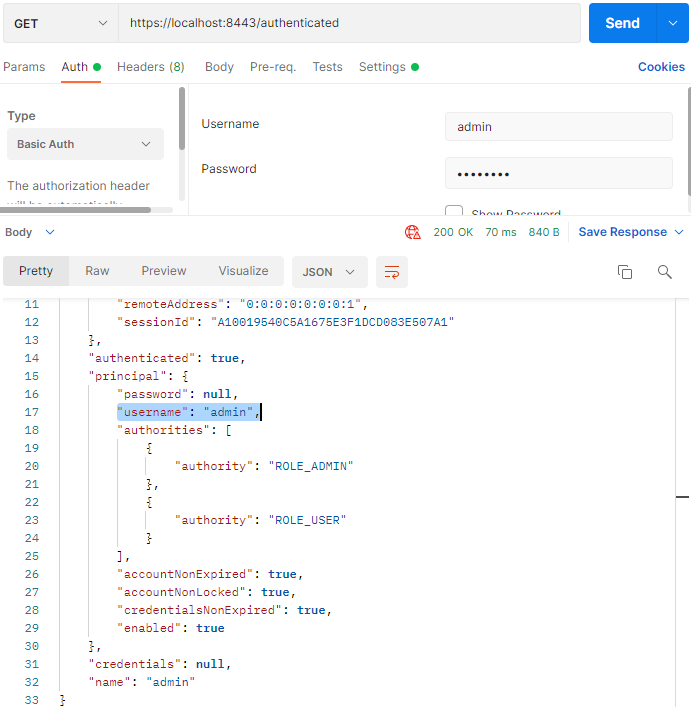
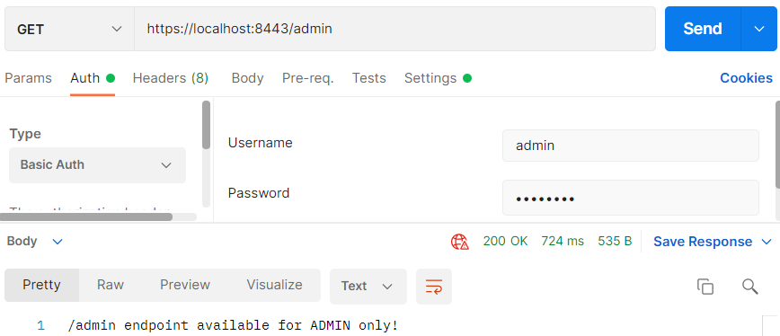

## Security met aangepaste gebruikers tabel

Het nadeel van bovenstaande code in `SpringSecurityConfig.java` is dat we de users hard hebben geprogrammeerd. Dit
noemen ze ook de `inMemoryAuthentication`. Wat we eigenlijk willen is een user tabel in onze database, waarbij we users
kunnen toevoegen, verwijderen, rollen kunnen geven en wachtwoorden kunnen opslaan.

We maken een nieuw IntelliJ project in de Initializr.

Maak een nieuwe map aan `controller` met daarin 4 bestanden: `AdminController.java`, `AuthenticatedController.java`
, `BaseController.java` en `CustomersController.java`

_AdminController.java_

```java
package nl.danielle.demo_second_security.controller;

import org.springframework.http.HttpStatus;
import org.springframework.http.ResponseEntity;
import org.springframework.validation.annotation.Validated;
import org.springframework.web.bind.annotation.RequestMapping;
import org.springframework.web.bind.annotation.RestController;

@RestController
public class AdminController {

    @RequestMapping(value = "/admin")
    public ResponseEntity<Object> getMessage() {
        return new ResponseEntity<>("SECURED REST endpoint: /admin", HttpStatus.OK);
    }
}
```

_AuthenticatedController.java_

```java
package nl.danielle.demo_second_security.controller;

import org.springframework.http.ResponseEntity;
import org.springframework.security.core.Authentication;
import org.springframework.web.bind.annotation.GetMapping;
import org.springframework.web.bind.annotation.RequestMapping;
import org.springframework.web.bind.annotation.RestController;

import java.security.Principal;

@RestController
@RequestMapping(value = "/authenticated")
public class AuthenticatedController {

    @GetMapping(value = "")
    public ResponseEntity<Object> authenticated(Authentication authentication, Principal principal) {
        return ResponseEntity.ok().body(principal);
    }
}
```

_BaseController.java_

```java
package nl.danielle.demo_second_security.controller;

import org.springframework.http.HttpStatus;
import org.springframework.web.bind.annotation.RequestMapping;
import org.springframework.web.bind.annotation.ResponseStatus;
import org.springframework.web.bind.annotation.RestController;

@RestController
public class BaseController {

    @RequestMapping(value = "/")
    @ResponseStatus(HttpStatus.OK)
    public String hello() {
        return "Hello World";
    }
}
```

_CustomersController.java_

```java
package nl.danielle.demo_second_security.controller;

import org.springframework.http.HttpStatus;
import org.springframework.http.ResponseEntity;
import org.springframework.validation.annotation.Validated;
import org.springframework.web.bind.annotation.RequestMapping;
import org.springframework.web.bind.annotation.RestController;

@RestController
public class CustomersController {

    @RequestMapping(value = "/customers")
    public ResponseEntity<Object> getMessage() {
        return new ResponseEntity<>("SECURED REST endpoint: /customers", HttpStatus.OK);
    }
}
```

Maak een map `config` aan met een bestand `SpringSecurityConfig.java`.

```java
package nl.danielle.demo_second_security.config;

import org.springframework.beans.factory.annotation.Autowired;
import org.springframework.context.annotation.Bean;
import org.springframework.context.annotation.Configuration;
import org.springframework.http.HttpMethod;
import org.springframework.security.config.annotation.authentication.builders.AuthenticationManagerBuilder;
import org.springframework.security.config.annotation.web.builders.HttpSecurity;
import org.springframework.security.config.annotation.web.configuration.EnableWebSecurity;
import org.springframework.security.config.annotation.web.configuration.WebSecurityConfigurerAdapter;
import org.springframework.security.crypto.bcrypt.BCryptPasswordEncoder;
import org.springframework.security.crypto.password.PasswordEncoder;

import javax.sql.DataSource;

@Configuration
@EnableWebSecurity
public class SpringSecurityConfig extends WebSecurityConfigurerAdapter {

    @Autowired
    private DataSource dataSource;

    @Autowired
    public void configureGlobal(AuthenticationManagerBuilder auth) throws Exception {

        auth.jdbcAuthentication().dataSource(dataSource)
                .usersByUsernameQuery("SELECT username, password, enabled FROM my_users WHERE username=?")
                .authoritiesByUsernameQuery("SELECT username, authority FROM my_authorities AS a WHERE username=?");
    }

    @Bean
    public PasswordEncoder passwordEncoder() {
        return new BCryptPasswordEncoder();
    }

    // Secure the endpoins with HTTP Basic authentication
    @Override
    protected void configure(HttpSecurity http) throws Exception {

        http
                //HTTP Basic authentication
                .httpBasic()
                .and()
                .authorizeRequests()
                .antMatchers(HttpMethod.GET, "/customers/**").hasRole("USER")
                .antMatchers(HttpMethod.GET, "/admin/**").hasRole("ADMIN")
                .antMatchers(HttpMethod.GET, "/authenticated/**").authenticated()
                .anyRequest().permitAll()
                .and()
                .csrf().disable()
                .formLogin().disable();
    }
}
```

Een `jdbcAuthentication` werkt op basis van een query naar een database (datasource).

    @Autowired
    public void configureGlobal(AuthenticationManagerBuilder auth) throws Exception
    {    
      auth.jdbcAuthentication().dataSource(dataSource)
        .usersByUsernameQuery("SELECT username, password, enabled FROM my_users WHERE username=?")
        .authoritiesByUsernameQuery("SELECT username, authority FROM my_authorities AS a WHERE username=?");    
    }

- We moeten de volgende tabellen krijgen: `my_users` en `my_authorities`.
- We kunnen zoeken op `username`
- Bij `my_users` krijgen we op basis van `username` een `username`, `password`, `enabled` terug
- Bij `my_authorities` krijgen we op basis van `username` de `username` en `authority` (de rol) terug

De endpoints die we hebben zijn: `/customers`, `/admin `en `/authenticated`.

Bij de `.antMatchers` zie je `HttpMethod.GET` staan. Dit hoef je niet te specificeren, dat mag je weglaten, dan geldt
het voor alle HTTP methods. Je kunt specificeren dat bijvoorbeeld als je ingelogd ben, dat je mag veranderen.

`"/authenticated/**").authenticated()` is hetzelfde als `hasRole` maar is voor iedere user die is ingelogd.

In `schema.sql` creeër je de tabellen voor in de database.

```sql
drop index if exists ix_auth_username;
drop table if exists my_authorities;
drop table if exists my_users;

create table my_users
(
    username varchar(50)  not null,
    password varchar(255) not null,
    enabled  boolean      not null,
    primary key (username)
);

create table my_authorities
(
    username  varchar(50) not null,
    authority varchar(50) not null,
    primary key (username, authority),
    foreign key (username) references my_users (username)
);

create unique index ix_auth_username on my_authorities (username, authority);
```

In `data.sql` voegen we records toe.

```sql
INSERT INTO my_users (username, password, enabled)
VALUES ('user', '$2a$10$wPHxwfsfTnOJAdgYcerBt.utdAvC24B/DWfuXfzKBSDHO0etB1ica', TRUE);
INSERT INTO my_users (username, password, enabled)
VALUES ('admin', '$2a$10$wPHxwfsfTnOJAdgYcerBt.utdAvC24B/DWfuXfzKBSDHO0etB1ica', TRUE);

INSERT INTO my_authorities (username, authority)
VALUES ('user', 'ROLE_USER');
INSERT INTO my_authorities (username, authority)
VALUES ('admin', 'ROLE_USER');
INSERT INTO my_authorities (username, authority)
VALUES ('admin', 'ROLE_ADMIN');
```

Run de applicatie.

Ga naar PostgreSQL en kijk in de tabel `demo_second_security`.

De applicatie heeft twee tabellen gemaakt: `my_users` en `my_authorities`


Bij `my_users` staan de twee users die je hebt gemaakt er ook in.


Bij `my_authorities` staan de rollen van de users erin.


Ga naar Postman en vul de url `http://localhost:8080/admin` in met als username `user`.


Je krijgt een status code `403 forbidden`.

Doe hetzelfde maar dan met user `admin`.


##### Authenticated

Authenticated in `SpringSecurityConfig.java` gaat naar de endoint `/authenticated`, die in
de `AuthenticatedController.java` zit.

```java
package nl.danielle.demo_second_security.controller;

import org.springframework.http.ResponseEntity;
import org.springframework.security.core.Authentication;
import org.springframework.web.bind.annotation.GetMapping;
import org.springframework.web.bind.annotation.RequestMapping;
import org.springframework.web.bind.annotation.RestController;

import java.security.Principal;

@RestController
@RequestMapping(value = "/authenticated")
public class AuthenticatedController {

    @GetMapping(value = "")
    public ResponseEntity<Object> authenticated(Authentication authentication, Principal principal) {
        return ResponseEntity.ok().body(principal);
    }
}
```

In plaats van een paramater hebben we een argument staan: `Authentication authentication, Principal principal`.
Principal geeft weer met wat voor credentials je bent ingelogd. De credentials geef je gelijk terug in de
body: `body(principal)`.

Wanneer je in Postman de volgende url zet: `http://localhost:8080/authenticated`. Je krijgt de gegevens van `admin`
terug. Je ziet bijvoorbeeld bij de authorities dat `admin` zowel de rol als admin heeft als user.



Hetzelfde kun je doen wanneer je als `user` bent ingelogd.

Deze gegevens zijn een soort weergave van de interne gegevens die hij heeft van een user. Dat noemen ze de principal.

## Security met gebruikerstabel

We willen geen vaste tabel zoals `my_users` en `my_authorities`.

We maken een nieuw IntelliJ project in de Initializr.

Maak een nieuwe package aan genaamd `controller` en hierin de volgende bestanden: `AdminController.java`
, `AuthenticatedController.java`, `BaseController.java` en `CustomersController.java`.

_AdminController.java_

```java
package nl.danielle.demo_third_security.controller;

import org.springframework.http.HttpStatus;
import org.springframework.http.ResponseEntity;
import org.springframework.web.bind.annotation.GetMapping;
import org.springframework.web.bind.annotation.RequestMapping;
import org.springframework.web.bind.annotation.RestController;

@RestController
@RequestMapping(value = "/admin")
public class AdminController {

    @GetMapping(value = "")
    public ResponseEntity<Object> getMessage() {
        return new ResponseEntity<>("SECURED REST endpoint: /admin", HttpStatus.OK);
    }
}
```

_AuthenticatedController.java_

```java
package nl.danielle.demo_third_security.controller;

import org.springframework.http.ResponseEntity;
import org.springframework.security.core.Authentication;
import org.springframework.web.bind.annotation.GetMapping;
import org.springframework.web.bind.annotation.RequestMapping;
import org.springframework.web.bind.annotation.RestController;

import java.security.Principal;

@RestController
@RequestMapping(value = "/authenticated")
public class AuthenticatedController {

    @GetMapping(value = "")
    public ResponseEntity<Object> authenticated(Authentication authentication, Principal principal) {
        return ResponseEntity.ok().body(principal);
    }
}
```

_BaseController.java_

```java
package nl.danielle.demo_third_security.controller;

import org.springframework.web.bind.annotation.GetMapping;
import org.springframework.web.bind.annotation.RestController;

@RestController
public class BaseController {

    @GetMapping(value = "/")
    public String hello() {
        return "Hello World";
    }
}
```

_CustomersController.java_

```java
package nl.danielle.demo_third_security.controller;

import org.springframework.http.HttpStatus;
import org.springframework.http.ResponseEntity;
import org.springframework.web.bind.annotation.GetMapping;
import org.springframework.web.bind.annotation.RequestMapping;
import org.springframework.web.bind.annotation.RestController;

@RestController
@RequestMapping(value = "/customers")
public class CustomersController {

    @GetMapping(value = "")
    public ResponseEntity<Object> getMessage() {
        return new ResponseEntity<>("SECURED REST endpoint: /customers", HttpStatus.OK);
    }
}
```

Maak een nieuwe package aan genaamd `config` en hierin het volgende bestand: `SpringSecurityConfig.java`.

```java
package nl.danielle.demo_third_security.config;

import org.springframework.beans.factory.annotation.Autowired;
import org.springframework.context.annotation.Bean;
import org.springframework.context.annotation.Configuration;
import org.springframework.http.HttpMethod;
import org.springframework.security.config.annotation.authentication.builders.AuthenticationManagerBuilder;
import org.springframework.security.config.annotation.web.builders.HttpSecurity;
import org.springframework.security.config.annotation.web.configuration.EnableWebSecurity;
import org.springframework.security.config.annotation.web.configuration.WebSecurityConfigurerAdapter;
import org.springframework.security.crypto.bcrypt.BCryptPasswordEncoder;
import org.springframework.security.crypto.password.PasswordEncoder;

import javax.sql.DataSource;

@Configuration
@EnableWebSecurity
public class SpringSecurityConfig extends WebSecurityConfigurerAdapter {

    @Autowired
    private DataSource dataSource;

    @Autowired
    public void configureGlobal(AuthenticationManagerBuilder auth) throws Exception {

        auth.jdbcAuthentication().dataSource(dataSource);
    }

    @Bean
    public PasswordEncoder passwordEncoder() {
        return new BCryptPasswordEncoder();
    }

    // Secure the endpoints with HTTP Basic authentication
    @Override
    protected void configure(HttpSecurity http) throws Exception {

        http
                //HTTP Basic authentication
                .httpBasic()
                .and()
                .authorizeRequests()
                .antMatchers(HttpMethod.GET, "/customers/**").hasRole("USER")
                .antMatchers(HttpMethod.GET, "/admin/**").hasRole("ADMIN")
                .antMatchers(HttpMethod.GET, "/authenticated/**").authenticated()
                .anyRequest().permitAll()
                .and()
                .csrf().disable()
                .formLogin().disable();
    }
}
```

We hebben de query's (my_users en my_authorities) eruit gelaten en verwijzen nu naar de datasource met de
jdbc `auth.jdbcAuthentication().dataSource(dataSource);`

Omdat we nu een tabel maken die `'User` en `Authority` heten, gaat `jdbc` de query's volledig automatisch doen.

Maak een nieuwe package aan genaamd `model` en hierin de volgende bestanden: `Authority.java` en `User.java`.

_Authority.java_

```java
package nl.danielle.demo_third_security.model;

import javax.persistence.*;
import java.io.Serializable;

@Entity
@Table(name = "authorities")
public class Authority implements Serializable {

    @Id
    @Column(nullable = false)
    private String username;

    @Id
    @Column(nullable = false)
    private String authority;

    public String getUsername() {
        return username;
    }

    public void setUsername(String username) {
        this.username = username;
    }

    public String getAuthority() {
        return authority;
    }

    public void setAuthority(String authority) {
        this.authority = authority;
    }
}
```

_User.java_

```java
package nl.danielle.demo_third_security.model;

import javax.persistence.*;

@Entity
@Table(name = "users")
public class User {

    @Id
    @Column(nullable = false, unique = true)
    private String username;

    @Column(nullable = false, length = 255)
    private String password;

    @Column(nullable = false)
    private boolean enabled;

    public String getUsername() {
        return username;
    }

    public void setUsername(String username) {
        this.username = username;
    }

    public String getPassword() {
        return password;
    }

    public void setPassword(String password) {
        this.password = password;
    }

    public boolean isEnabled() {
        return enabled;
    }

    public void setEnabled(boolean enabled) {
        this.enabled = enabled;
    }
}

```

In de `resources` map heb je de volgende bestanden met bijbehorende code: `application.properties` en `data.sql`. Schema
hebben we niet meer nodig.

_application.properties_

    # datasource Postgres
    spring.jpa.database=postgresql
    spring.datasource.platform=postgres
    spring.datasource.url=jdbc:postgresql://localhost:5432/demo_third_security
    spring.datasource.username=postgres
    spring.datasource.password=postgres123
    spring.datasource.driver-class-name=org.postgresql.Driver
    spring.datasource.initialization-mode=always
    spring.jpa.generate-ddl=true
    spring.jpa.hibernate.ddl-auto=create-drop
    spring.jpa.properties.hibernate.jdbc.lob.non_contextual_creation=true
    
    spring.jpa.properties.hibernate.dialect= org.hibernate.dialect.PostgreSQLDialect

_data.sql_

```sql
INSERT INTO users (username, password, enabled)
VALUES ('user', '$2a$10$wPHxwfsfTnOJAdgYcerBt.utdAvC24B/DWfuXfzKBSDHO0etB1ica', TRUE);
INSERT INTO users (username, password, enabled)
VALUES ('admin', '$2a$10$wPHxwfsfTnOJAdgYcerBt.utdAvC24B/DWfuXfzKBSDHO0etB1ica', TRUE);
INSERT INTO users (username, password, enabled)
VALUES ('peter', '$2a$10$wPHxwfsfTnOJAdgYcerBt.utdAvC24B/DWfuXfzKBSDHO0etB1ica', TRUE);

INSERT INTO authorities (username, authority)
VALUES ('user', 'ROLE_USER');
INSERT INTO authorities (username, authority)
VALUES ('admin', 'ROLE_USER');
INSERT INTO authorities (username, authority)
VALUES ('admin', 'ROLE_ADMIN');
INSERT INTO authorities (username, authority)
VALUES ('peter', 'ROLE_USER');
INSERT INTO authorities (username, authority)
VALUES ('peter', 'ROLE_ADMIN');
```

Het wachtwoord wat je ziet staan, is een encrypted wachtwoord. We hebben dit in code in de data.sql staan maar het is
een encryptie. Spring Boot kent allerlei encrypties.

In `SpringSecurityConfig.java` zie je de volgende code staan.

    @Bean
    public PasswordEncoder passwordEncoder() {
      return new BCryptPasswordEncoder();
    }

Dit is de encoder die gebruikt word om de wachtwoorden te encoden. De `BCryptPasswordEncoder` vereist een bepaalde
hoeveelheid rekenwerk.

Hoe weet je dat de code `$2a$10$wPHxwfsfTnOJAdgYcerBt.utdAvC24B/DWfuXfzKBSDHO0etB1ica` bij het wachtwoord `password`
hoort? Daar zijn websites voor: https://www.browserling.com/tools/bcrypt. Wanneer je het wachtwoord `password` intikt
krijg je `$2a$10$in7p/8vt5wmfqmo8xD5QHumpRPSuB2tEQ4oeWX5bL.cGi5GOqr7XW`.

Run de applicatie.

In postgreSQL zie je de tabellen `authorities` en `users` staan.


In Postman ga je naar url `http://localhost:8080/authenticated` en logt in als `peter`, `admin` of `user`.


De url's `http://localhost:8080/`, `http://localhost:8080/customers` en `http://localhost:8080/admin` kun je testen met
de rollen `peter`, `admin` of `user` met wachtwoord `password`. Dit zijn alle endpoints die je in de `controller`heb
gedefinieerd.

## Security met gebruikersentiteit -- niet behandeld

> > > Het verschil zit hem in de application.properties. Is niet getest.

We maken een nieuw IntelliJ project in de Initializr.

Maak een nieuwe package aan genaamd `controller` en hierin de volgende bestanden: `AdminController.java`
, `AuthenticatedController.java`, `BaseController.java` en `CustomersController.java`.

_AdminController.java_

```java
package nl.danielle.demo_fourth_security.controller;

import org.springframework.http.HttpStatus;
import org.springframework.http.ResponseEntity;
import org.springframework.web.bind.annotation.GetMapping;
import org.springframework.web.bind.annotation.RequestMapping;
import org.springframework.web.bind.annotation.RestController;

@RestController
@RequestMapping(value = "/admin")
public class AdminController {

    @GetMapping(value = "")
    public ResponseEntity<Object> getMessage() {
        return new ResponseEntity<>("SECURED REST endpoint: /admin", HttpStatus.OK);
    }
}
```

_AuthenticatedController.java_

```java
package nl.danielle.demo_fourth_security.controller;

import org.springframework.http.ResponseEntity;
import org.springframework.security.core.Authentication;
import org.springframework.web.bind.annotation.GetMapping;
import org.springframework.web.bind.annotation.RequestMapping;
import org.springframework.web.bind.annotation.RestController;

import java.security.Principal;

@RestController
@RequestMapping(value = "/authenticated")
public class AuthenticatedController {

    @GetMapping(value = "")
    public ResponseEntity<Object> authenticated(Authentication authentication, Principal principal) {
        return ResponseEntity.ok().body(principal);
    }
}
```

_BaseController.java_

```java
package nl.danielle.demo_fourth_security.controller;

import org.springframework.web.bind.annotation.GetMapping;
import org.springframework.web.bind.annotation.RestController;

@RestController
public class BaseController {

    @GetMapping(value = "/")
    public String hello() {
        return "Hello World";
    }
}
```

_CustomersController.java_

```java
package nl.danielle.demo_fourth_security.controller;

import org.springframework.http.HttpStatus;
import org.springframework.http.ResponseEntity;
import org.springframework.web.bind.annotation.GetMapping;
import org.springframework.web.bind.annotation.RequestMapping;
import org.springframework.web.bind.annotation.RestController;

@RestController
@RequestMapping(value = "/customers")
public class CustomersController {

    @GetMapping(value = "")
    public ResponseEntity<Object> getMessage() {
        return new ResponseEntity<>("SECURED REST endpoint: /customers", HttpStatus.OK);
    }
}
```

Maak een nieuwe package aan genaamd `config` en hierin het volgende bestand: `SpringSecurityConfig.java`.

```java
package nl.danielle.demo_fourth_security.config;

import org.springframework.beans.factory.annotation.Autowired;
import org.springframework.context.annotation.Bean;
import org.springframework.context.annotation.Configuration;
import org.springframework.http.HttpMethod;
import org.springframework.security.config.annotation.authentication.builders.AuthenticationManagerBuilder;
import org.springframework.security.config.annotation.web.builders.HttpSecurity;
import org.springframework.security.config.annotation.web.configuration.EnableWebSecurity;
import org.springframework.security.config.annotation.web.configuration.WebSecurityConfigurerAdapter;
import org.springframework.security.crypto.bcrypt.BCryptPasswordEncoder;
import org.springframework.security.crypto.password.PasswordEncoder;

import javax.sql.DataSource;

@Configuration
@EnableWebSecurity
public class SpringSecurityConfig extends WebSecurityConfigurerAdapter {

    @Autowired
    private DataSource dataSource;

    @Autowired
    public void configureGlobal(AuthenticationManagerBuilder auth) throws Exception {

        auth.jdbcAuthentication().dataSource(dataSource);

    }

    @Bean
    public PasswordEncoder passwordEncoder() {
        return new BCryptPasswordEncoder();
    }

    // Secure the endpoints with HTTP Basic authentication
    @Override
    protected void configure(HttpSecurity http) throws Exception {

        http
                //HTTP Basic authentication
                .httpBasic()
                .and()
                .authorizeRequests()
                .antMatchers(HttpMethod.GET, "/customers/**").hasRole("USER")
                .antMatchers(HttpMethod.GET, "/admin/**").hasRole("ADMIN")
                .antMatchers(HttpMethod.GET, "/authenticated/**").authenticated()
                .anyRequest().permitAll()
                .and()
                .csrf().disable()
                .formLogin().disable();

        // add this line to use H2 web console
        http.headers().frameOptions().disable();
    }
}
```

Maak een nieuwe package aan genaamd `model` en hierin de volgende bestanden: `Authority.java` en `User.java`.

_Authority.java_

```java
package nl.danielle.demo_fourth_security.model;

import javax.persistence.*;
import java.io.Serializable;

@Entity
@Table(name = "authorities")
public class Authority implements Serializable {

    @Id
    @Column(nullable = false)
    private String username;

    @Id
    @Column(nullable = false)
    private String authority;

    public String getUsername() {
        return username;
    }

    public void setUsername(String username) {
        this.username = username;
    }

    public String getAuthority() {
        return authority;
    }

    public void setAuthority(String authority) {
        this.authority = authority;
    }
}
```

_User.java_

```java
package nl.danielle.demo_fourth_security.model;

import javax.persistence.*;

@Entity
@Table(name = "users")
public class User {

    @Id
    @Column(nullable = false, unique = true)
    private String username;

    @Column(nullable = false, length = 255)
    private String password;

    @Column(nullable = false)
    private boolean enabled;

    public String getUsername() {
        return username;
    }

    public void setUsername(String username) {
        this.username = username;
    }

    public String getPassword() {
        return password;
    }

    public void setPassword(String password) {
        this.password = password;
    }

    public boolean isEnabled() {
        return enabled;
    }

    public void setEnabled(boolean enabled) {
        this.enabled = enabled;
    }
}

```

In de `resources` map heb je de volgende bestanden met bijbehorende code: `application.properties`
, `application-dev.properties`, `application-prod.properties` en `data.sql`.

_application.properties_

    spring.application.name=spring_data_jpa
    
    spring.profiles.active=prod
    ## or
    #spring.profiles.active=dev

_application-dev.properties_

    # datasource H2
    spring.datasource.hikari.connectionTimeout=20000
    spring.datasource.hikari.maximumPoolSize=5
    spring.datasource.url=jdbc:h2:mem:testdb
    #spring.datasource.url=jdbc:h2:file:./data/testdb
    spring.datasource.driverClassName=org.h2.Driver
    spring.datasource.username=sa
    spring.datasource.password=password
    spring.h2.console.enabled=true
    #spring.h2.console.path=/h2-console
    #spring.h2.console.settings.web-allow-others=true
    #spring.jpa.properties.hibernate.hbm2ddl.auto=none
    spring.jpa.database-platform=org.hibernate.dialect.H2Dialect

_application-prod.properties_

    ## datasource MySQL
    #spring.datasource.platform=mysql
    #spring.datasource.url=jdbc:mysql://${MYSQL_HOST:localhost}:3306/demo?useTimezone=true&serverTimezone=UTC
    #spring.datasource.username=root
    #spring.datasource.password=root
    #
    ## data initialization with schema.sql and data.sql
    #spring.jpa.hibernate.ddl-auto=update
    #spring.datasource.initialization-mode=always
    #
    #spring.profiles.active=mysql
    
    # datasource Postgres
    spring.jpa.database=postgresql
    spring.datasource.platform=postgres
    spring.datasource.url=jdbc:postgresql://localhost:5432/demo_fourth_security
    spring.datasource.username=postgres
    spring.datasource.password=postgres123
    spring.datasource.driver-class-name=org.postgresql.Driver
    spring.datasource.initialization-mode=always
    spring.jpa.generate-ddl=true
    spring.jpa.hibernate.ddl-auto=create-drop
    spring.jpa.properties.hibernate.jdbc.lob.non_contextual_creation=true
    
    spring.jpa.properties.hibernate.dialect= org.hibernate.dialect.PostgreSQLDialect

_data.sql_

```sql
INSERT INTO users (username, password, enabled)
VALUES ('user', '$2a$10$wPHxwfsfTnOJAdgYcerBt.utdAvC24B/DWfuXfzKBSDHO0etB1ica', TRUE);
INSERT INTO users (username, password, enabled)
VALUES ('admin', '$2a$10$wPHxwfsfTnOJAdgYcerBt.utdAvC24B/DWfuXfzKBSDHO0etB1ica', TRUE);
INSERT INTO users (username, password, enabled)
VALUES ('peter', '$2a$10$wPHxwfsfTnOJAdgYcerBt.utdAvC24B/DWfuXfzKBSDHO0etB1ica', TRUE);

INSERT INTO authorities (username, authority)
VALUES ('user', 'ROLE_USER');
INSERT INTO authorities (username, authority)
VALUES ('admin', 'ROLE_USER');
INSERT INTO authorities (username, authority)
VALUES ('admin', 'ROLE_ADMIN');
INSERT INTO authorities (username, authority)
VALUES ('peter', 'ROLE_USER');
INSERT INTO authorities (username, authority)
VALUES ('peter', 'ROLE_ADMIN');
```

## Security met gebruikersservice

We maken een nieuw IntelliJ project in de Initializr.

Maak een nieuwe map aan `controller` met daarin 5 bestanden: `AdminController.java`, `AuthenticatedController.java`
, `BaseController.java`, `ExceptionController.java` en `UserController.java`.

_AdminController.java_

```java
package nl.danielle.demo_fifth_security.controller;

import org.springframework.http.HttpStatus;
import org.springframework.http.ResponseEntity;
import org.springframework.web.bind.annotation.GetMapping;
import org.springframework.web.bind.annotation.RequestMapping;
import org.springframework.web.bind.annotation.RestController;

@RestController
@RequestMapping(value = "/admin")
public class AdminController {

    @GetMapping(value = "")
    public ResponseEntity<Object> getMessage() {
        return new ResponseEntity<>("SECURED REST endpoint: /admin", HttpStatus.OK);
    }
}
```

_AuthenticatedController.java_

```java
package nl.danielle.demo_fifth_security.controller;

import org.springframework.http.ResponseEntity;
import org.springframework.security.core.Authentication;
import org.springframework.web.bind.annotation.GetMapping;
import org.springframework.web.bind.annotation.RequestMapping;
import org.springframework.web.bind.annotation.RestController;

import java.security.Principal;

@RestController
@RequestMapping(value = "/authenticated")
public class AuthenticatedController {

    @GetMapping(value = "")
    public ResponseEntity<Object> authenticated(Authentication authentication, Principal principal) {
        return ResponseEntity.ok().body(principal);
    }
}
```

_BaseController.java_

```java
package nl.danielle.demo_fifth_security.controller;

import org.springframework.web.bind.annotation.GetMapping;
import org.springframework.web.bind.annotation.RestController;

@RestController
public class BaseController {

    @GetMapping(value = "/")
    public String hello() {
        return "Hello World";
    }
}
```

_ExceptionController.java_

```java
package nl.danielle.demo_fifth_security.controller;

import nl.danielle.demo_fifth_security.exceptions.BadRequestException;
import nl.danielle.demo_fifth_security.exceptions.RecordNotFoundException;
import nl.danielle.demo_fifth_security.exceptions.UsernameNotFoundException;

import org.springframework.http.ResponseEntity;
import org.springframework.web.bind.annotation.ControllerAdvice;
import org.springframework.web.bind.annotation.ExceptionHandler;
import org.springframework.web.bind.annotation.RestController;

@RestController
@ControllerAdvice
public class ExceptionController {

    @ExceptionHandler(value = RecordNotFoundException.class)
    public ResponseEntity<Object> exception(RecordNotFoundException exception) {
        return ResponseEntity.notFound().build();
    }

    @ExceptionHandler(value = BadRequestException.class)
    public ResponseEntity<Object> exception(BadRequestException exception) {
        return ResponseEntity.badRequest().build();
    }

    @ExceptionHandler(value = UsernameNotFoundException.class)
    public ResponseEntity<Object> exception(UsernameNotFoundException exception) {
        return ResponseEntity.badRequest().build();
    }
}
```

_UserController.java_

```java
package nl.danielle.demo_fifth_security.controller;

import nl.danielle.demo_fifth_security.exceptions.BadRequestException;
import nl.danielle.demo_fifth_security.model.User;
import nl.danielle.demo_fifth_security.service.UserService;
import org.springframework.beans.factory.annotation.Autowired;
import org.springframework.http.ResponseEntity;
import org.springframework.web.bind.annotation.*;
import org.springframework.web.servlet.support.ServletUriComponentsBuilder;

import java.net.URI;
import java.util.Map;

@RestController
@RequestMapping(value = "/users")
public class UserController {

    @Autowired
    private UserService userService;

    @GetMapping(value = "")
    public ResponseEntity<Object> getUsers() {
        return ResponseEntity.ok().body(userService.getUsers());
    }

    @GetMapping(value = "/{username}")
    public ResponseEntity<Object> getUser(@PathVariable("username") String username) {
        return ResponseEntity.ok().body(userService.getUser(username));
    }

    @PostMapping(value = "")
    public ResponseEntity<Object> createUser(@RequestBody User user) {
        String newUsername = userService.createUser(user);

        URI location = ServletUriComponentsBuilder.fromCurrentRequest().path("/{username}")
                .buildAndExpand(newUsername).toUri();

        return ResponseEntity.created(location).build();
    }

    @PutMapping(value = "/{username}")
    public ResponseEntity<Object> updateUser(@PathVariable("username") String username, @RequestBody User user) {
        userService.updateUser(username, user);
        return ResponseEntity.noContent().build();
    }

    @DeleteMapping(value = "/{username}")
    public ResponseEntity<Object> deleteUser(@PathVariable("username") String username) {
        userService.deleteUser(username);
        return ResponseEntity.noContent().build();
    }

    @GetMapping(value = "/{username}/authorities")
    public ResponseEntity<Object> getUserAuthorities(@PathVariable("username") String username) {
        return ResponseEntity.ok().body(userService.getAuthorities(username));
    }

    @PostMapping(value = "/{username}/authorities")
    public ResponseEntity<Object> addUserAuthority(@PathVariable("username") String username, @RequestBody Map<String, Object> fields) {
        try {
            String authorityName = (String) fields.get("authority");
            userService.addAuthority(username, authorityName);
            return ResponseEntity.noContent().build();
        } catch (Exception ex) {
            throw new BadRequestException();
        }
    }

    // http://users/peter/authorities/ROLE_ADMIN
    @DeleteMapping(value = "/{username}/authorities/{authority}")
    public ResponseEntity<Object> deleteUserAuthority(@PathVariable("username") String username, @PathVariable("authority") String authority) {
        userService.removeAuthority(username, authority);
        return ResponseEntity.noContent().build();
    }
}
```

Met endpoint `/user` kun je nu zeggen, ik wil alle users `""` of ik wil een bepaalde user `/{username}`. Verder
is `createUser`, `updateUser` en `deletUser` mogelijk. En je kan ook opvragen welke `authorities` een user heeft. Dus
het is nu mogelijk om users zelf aan te maken.

Deze `UserController` maakt contact met `userService`. De `userService` heeft alle methoden om al die query's aan te
vragen.

Maak een nieuwe map aan `config` met daarin 2 bestanden: `CustomUserDetailsService.java` en `SpringSecurityConfig.java`.

_CustomUserDetailsService.java_

```java
package nl.danielle.demo_fifth_security.config;

import nl.danielle.demo_fifth_security.model.Authority;
import nl.danielle.demo_fifth_security.model.User;
import nl.danielle.demo_fifth_security.service.UserService;
import org.springframework.beans.factory.annotation.Autowired;
import org.springframework.security.core.GrantedAuthority;
import org.springframework.security.core.authority.SimpleGrantedAuthority;
import org.springframework.security.core.userdetails.UserDetails;
import org.springframework.security.core.userdetails.UserDetailsService;
import org.springframework.security.core.userdetails.UsernameNotFoundException;
import org.springframework.stereotype.Service;

import java.util.ArrayList;
import java.util.List;
import java.util.Optional;
import java.util.Set;

@Service
public class CustomUserDetailsService implements UserDetailsService {

    @Autowired
    private UserService userService;

//    @Autowired
//    private AuthorityService authorityService;

    @Override
    public UserDetails loadUserByUsername(String username) {
        Optional<User> user = userService.getUser(username);
        if (user == null) {
            throw new UsernameNotFoundException(username);
        }

        String password = user.get().getPassword();

        Set<Authority> authorities = user.get().getAuthorities();

        List<GrantedAuthority> grantedAuthorities = new ArrayList<>();
        for (Authority authority : authorities) {
            grantedAuthorities.add(new SimpleGrantedAuthority(authority.getAuthority()));
        }

        return new org.springframework.security.core.userdetails.User(username, password, grantedAuthorities);
    }
}
```

_SpringSecurityConfig.java_

```java
package nl.danielle.demo_fifth_security.config;

import org.springframework.beans.factory.annotation.Autowired;
import org.springframework.context.annotation.Bean;
import org.springframework.context.annotation.Configuration;
import org.springframework.http.HttpMethod;
import org.springframework.security.config.annotation.authentication.builders.AuthenticationManagerBuilder;
import org.springframework.security.config.annotation.web.builders.HttpSecurity;
import org.springframework.security.config.annotation.web.configuration.EnableWebSecurity;
import org.springframework.security.config.annotation.web.configuration.WebSecurityConfigurerAdapter;
import org.springframework.security.crypto.bcrypt.BCryptPasswordEncoder;
import org.springframework.security.crypto.password.PasswordEncoder;

@Configuration
@EnableWebSecurity
public class SpringSecurityConfig extends WebSecurityConfigurerAdapter {

    @Autowired
    public CustomUserDetailsService customUserDetailsService;

    @Autowired
    public void configureGlobal(AuthenticationManagerBuilder auth) throws Exception {
        auth.userDetailsService(customUserDetailsService);
    }

    @Bean
    public PasswordEncoder passwordEncoder() {
        return new BCryptPasswordEncoder();
    }

    // Secure the endpoints with HTTP Basic authentication
    @Override
    protected void configure(HttpSecurity http) throws Exception {

        http
                //HTTP Basic authentication
                .httpBasic()
                .and()
                .authorizeRequests()
                .antMatchers(HttpMethod.GET, "/customers/**").hasRole("USER")
                .antMatchers(HttpMethod.GET, "/admin/**").hasRole("ADMIN")
                .antMatchers(HttpMethod.GET, "/users/**").hasRole("ADMIN")
                .antMatchers(HttpMethod.GET, "/authenticated/**").authenticated()
                .anyRequest().permitAll()
                .and()
                .csrf().disable()
                .formLogin().disable();
    }
}
```

De config is anders vergeleken met de vorige versie. De `jdbcAuthentication` is `userDetailsService` geworden. Spring
Boot heeft een user service, dat is een classe die je kan gebruiken en hier willen we deze aanpassen en dat zie je
in `customUserDetailsService.java`.

De `customUserDetailsService.java` is gebaseerd op basis van
de `UserDetailsService`: `public class CustomUserDetailsService implements UserDetailsService`. Het gaat om één
methode `loadUserByUsername` en die maakt gebruik van onze `userService`.

Maak een nieuwe map aan `exceptions` met daarin 3 bestanden: `BadRequestException.java`, `RecordNotFoundException.java`
en `UsernameNotFoundException.java`.

_BadRequestException.java_

```java
package nl.danielle.demo_fifth_security.exceptions;

public class BadRequestException extends RuntimeException {
    private static final long serialVersionUID = 1L;
}
```

_RecordNotFoundException.java_

```java
package nl.danielle.demo_fifth_security.exceptions;

public class RecordNotFoundException extends RuntimeException {
    private static final long serialVersionUID = 1L;
}
```

_UsernameNotFoundException.java_

```java
package nl.danielle.demo_fifth_security.exceptions;

public class UsernameNotFoundException extends RuntimeException {
    private static final long serialVersionUID = 1L;

    public UsernameNotFoundException(String username) {
        super("Cannot find user " + username);
    }
}
```

Maak een nieuwe map aan `model` met daarin 3 bestanden: `Authority.java`, `AuthorityKey.java` en `User.java`.

_Authority.java_

```java
package nl.danielle.demo_fifth_security.model;

import javax.persistence.*;
import java.io.Serializable;

@Entity
@IdClass(AuthorityKey.class)
@Table(name = "authorities")
public class Authority implements Serializable {

    @Id
    @Column(nullable = false)
    private String username;

    @Id
    @Column(nullable = false)
    private String authority;

    public Authority() {
    }

    public Authority(String username, String authority) {
        this.username = username;
        this.authority = authority;
    }

    public String getUsername() {
        return username;
    }

    public void setUsername(String username) {
        this.username = username;
    }

    public String getAuthority() {
        return authority;
    }

    public void setAuthority(String authority) {
        this.authority = authority;
    }
}
```

_AuthorityKey.java_

```java
package nl.danielle.demo_fifth_security.model;

import java.io.Serializable;
import java.util.Objects;

public class AuthorityKey implements Serializable {
    private String username;
    private String authority;

    @Override
    public boolean equals(Object o) {
        if (this == o) return true;
        if (o == null || getClass() != o.getClass()) return false;
        AuthorityKey that = (AuthorityKey) o;
        return username.equals(that.username) &&
                authority.equals(that.authority);
    }

    @Override
    public int hashCode() {
        return Objects.hash(username, authority);
    }
}
```

_User.java_

```java
package nl.danielle.demo_fifth_security.model;

import javax.persistence.*;
import java.util.HashSet;
import java.util.Set;

@Entity
@Table(name = "users")
public class User {

    @Id
    @Column(nullable = false, unique = true)
    private String username;

    @Column(nullable = false, length = 255)
    private String password;

    @Column(nullable = false)
    private boolean enabled = true;

    @Column
    private String apikey;

    @Column
    private String email;

    @OneToMany(
            targetEntity = Authority.class,
            mappedBy = "username",
            cascade = CascadeType.ALL,
            orphanRemoval = true,
            fetch = FetchType.EAGER)
    private Set<Authority> authorities = new HashSet<>();


    public String getUsername() {
        return username;
    }

    public void setUsername(String username) {
        this.username = username;
    }

    public String getPassword() {
        return password;
    }

    public void setPassword(String password) {
        this.password = password;
    }

    public boolean isEnabled() {
        return enabled;
    }

    public void setEnabled(boolean enabled) {
        this.enabled = enabled;
    }

    public String getApikey() {
        return apikey;
    }

    public void setApikey(String apikey) {
        this.apikey = apikey;
    }

    public String getEmail() {
        return email;
    }

    public void setEmail(String email) {
        this.email = email;
    }

    public Set<Authority> getAuthorities() {
        return authorities;
    }

    public void addAuthority(Authority authority) {
        this.authorities.add(authority);
    }

    public void removeAuthority(Authority authority) {
        this.authorities.remove(authority);
    }
}
```

Maak een nieuwe map aan `repository` met daarin 1 interface: `UserRepository`.

```java
package nl.danielle.demo_fifth_security.repository;

import nl.danielle.demo_fifth_security.model.User;

import org.springframework.data.jpa.repository.JpaRepository;

public interface UserRepository extends JpaRepository<User, String> {
}
```

De Repository is een JpaRepository. Deze doet niet zoveel. Daar zitten de `getById` en `findAll` in.

Maak een nieuwe map aan `service` met daarin 2 bestanden: `UserService.java`
en `UserServiceImpl.java`.

_UserService.java_

```java
package nl.danielle.demo_fifth_security.service;

import nl.danielle.demo_fifth_security.model.Authority;
import nl.danielle.demo_fifth_security.model.User;

import java.util.Collection;
import java.util.Optional;
import java.util.Set;

public interface UserService {

    public abstract String createUser(User user);

    public abstract void updateUser(String username, User user);

    public abstract void deleteUser(String username);

    public abstract Collection<User> getUsers();

    public abstract Optional<User> getUser(String username);

    public abstract boolean userExists(String username);

    public abstract Set<Authority> getAuthorities(String username);

    public abstract void addAuthority(String username, String authority);

    public abstract void removeAuthority(String username, String authority);
}
```

_UserServiceImpl.java_

```java
package nl.danielle.demo_fifth_security.service;

import nl.danielle.demo_fifth_security.exceptions.RecordNotFoundException;
import nl.danielle.demo_fifth_security.exceptions.UsernameNotFoundException;
import nl.danielle.demo_fifth_security.model.Authority;
import nl.danielle.demo_fifth_security.model.User;
import nl.danielle.demo_fifth_security.repository.UserRepository;
import nl.danielle.demo_fifth_security.utils.RandomStringGenerator;
import org.springframework.beans.factory.annotation.Autowired;
import org.springframework.stereotype.Service;

import java.util.Collection;
import java.util.Optional;
import java.util.Set;

@Service
public class UserServiceImpl implements UserService {

    @Autowired
    private UserRepository userRepository;

    @Override
    public Collection<User> getUsers() {
        return userRepository.findAll();
    }

    @Override
    public Optional<User> getUser(String username) {
        return userRepository.findById(username);
    }

    @Override
    public boolean userExists(String username) {
        return userRepository.existsById(username);
    }

    @Override
    public String createUser(User user) {
        String randomString = RandomStringGenerator.generateAlphaNumeric(20);
        user.setApikey(randomString);
        User newUser = userRepository.save(user);
        return newUser.getUsername();
    }

    @Override
    public void deleteUser(String username) {
        userRepository.deleteById(username);
    }

    @Override
    public void updateUser(String username, User newUser) {
        if (!userRepository.existsById(username)) throw new RecordNotFoundException();
        User user = userRepository.findById(username).get();
        user.setPassword(newUser.getPassword());
        user.setEmail(newUser.getEmail());
        user.setApikey(newUser.getApikey());
        userRepository.save(user);
    }

    @Override
    public Set<Authority> getAuthorities(String username) {
        if (!userRepository.existsById(username)) throw new UsernameNotFoundException(username);
        User user = userRepository.findById(username).get();
        return user.getAuthorities();
    }

    @Override
    public void addAuthority(String username, String authority) {
        if (!userRepository.existsById(username)) throw new UsernameNotFoundException(username);
        User user = userRepository.findById(username).get();
        user.addAuthority(new Authority(username, authority));
        userRepository.save(user);
    }

    @Override
    public void removeAuthority(String username, String authority) {
        if (!userRepository.existsById(username)) throw new UsernameNotFoundException(username);
        User user = userRepository.findById(username).get();
        Authority authorityToRemove = user.getAuthorities().stream().filter((a) -> a.getAuthority().equalsIgnoreCase(authority)).findAny().get();
        user.removeAuthority(authorityToRemove);
        userRepository.save(user);
    }
}
```

Je hebt een Service, die kan `getUser` doen, `userExists`, `createUser`, `deleteUser` en `updateUser`.

Maak een nieuwe map aan `utils` met daarin 1 bestand: `RandomStringGenerator.java`.

```java
package nl.danielle.demo_fifth_security.utils;

import java.util.Random;

public class RandomStringGenerator {

    public static String generateAlphaNumeric(int length) {
        int leftLimit = 48; // numeral '0'
        int rightLimit = 122; // letter 'z'
        int targetStringLength = 10;
        Random random = new Random();

        String generatedString = random.ints(leftLimit, rightLimit + 1)
                .filter(i -> (i <= 57 || i >= 65) && (i <= 90 || i >= 97))
                .limit(length)
                .collect(StringBuilder::new, StringBuilder::appendCodePoint, StringBuilder::append)
                .toString();

        return generatedString;
    }
}
```

Run de applicatie.

We gaan naar Postman en vullen de volgende url in `http://localhost:8080/admin` met `GET`.



We gaan naar de users met `http://localhost:8080/users` en `GET`. Die laat de 3 users zien: `user`, `admin` en `peter`
met alle gegevens en rollen.

Wanneer je naar `http://localhost:8080/users/peter` gaat met `GET` krijg je van één user alle gegevens.

We gaan een user `danielle` toevoegen met `http://localhost:8080/users` en `POST`.


We gaan naar postgreSQL en kijken in de user tabel. Je ziet dat de nieuwe user is toegevoegd.


We gaan user `peter` verwijderen in Postman met url `http://localhost:8080/users/peter` en `DELETE`.


In postgreSQL is de user verdwenen.


De nieuwe user `danielle` mag niet de `users` zien met url `http://localhost:8080/users` en `GET`.


Wel mag de nieuwe user `http://localhost:8080/` en `http://localhost:8080/authenticated` zien.

We gaan met `PUT` het emailadres toevoegen bij user `admin` en url `http://localhost:8080/users/admin`.


In postgreSQL zie je dat het e-mailadres is toegevoegd aan de tabel bij de user `admin`.


## Security met JWT

Een JWT token is een ge-encrypt String van 50 karakters.

Je gaat eerst van de Client naar de Server met een wachtwoord. De Server geeft terug een JWT token, vanaf dit moment heb je aan de Client kant een token. Deze kun je gebruiken om een volgend verzoek te doen om de JWT token in de Header op te nemen. De Server (Spring Boot) kijkt naar de JWT token,  aan de hand daarvan weet hij welke user daarbij hoort en weet hij of je wel of niet de resource mag zien. Dit gebeurt maar één keer. De token wordt aan de Client kant opgeslagen en daarna kun je alle verzoeken met behulp van de token gaan afhandelen. Je hoeft nooit meer username of wachtwoord te versturen.


Er is een manier om een JWT token te genereren, dat gebeurd in een aantal stappen.


Zodra de token is gemaakt, kun je deze gaan gebruiken.


We maken een nieuw IntelliJ project in de Initializr. Je voegt hier een extra dependency aan toe genaamd io.jsonwebtoken. De `pom.xml` ziet er als volgt uit.

```xml
<?xml version="1.0" encoding="UTF-8"?>
<project xmlns="http://maven.apache.org/POM/4.0.0" xmlns:xsi="http://www.w3.org/2001/XMLSchema-instance"
         xsi:schemaLocation="http://maven.apache.org/POM/4.0.0 https://maven.apache.org/xsd/maven-4.0.0.xsd">
    <modelVersion>4.0.0</modelVersion>
    <parent>
        <groupId>org.springframework.boot</groupId>
        <artifactId>spring-boot-starter-parent</artifactId>
        <version>2.4.3</version>
        <relativePath/> <!-- lookup parent from repository -->
    </parent>
    <groupId>nl.danielle</groupId>
    <artifactId>demo_sixth_security</artifactId>
    <version>0.0.1-SNAPSHOT</version>
    <name>demo_sixth_security</name>
    <description>Demo project for Spring Boot</description>
    <properties>
        <java.version>11</java.version>
    </properties>
    <dependencies>
        <dependency>
            <groupId>org.springframework.boot</groupId>
            <artifactId>spring-boot-starter-data-jpa</artifactId>
        </dependency>
        <dependency>
            <groupId>org.springframework.boot</groupId>
            <artifactId>spring-boot-starter-security</artifactId>
        </dependency>
        <dependency>
            <groupId>org.springframework.boot</groupId>
            <artifactId>spring-boot-starter-web</artifactId>
        </dependency>
        <dependency>
            <groupId>io.jsonwebtoken</groupId>
            <artifactId>jjwt</artifactId>
            <version>0.9.1</version>
        </dependency>
        <dependency>
            <groupId>org.postgresql</groupId>
            <artifactId>postgresql</artifactId>
            <scope>runtime</scope>
        </dependency>
        <dependency>
            <groupId>org.springframework.boot</groupId>
            <artifactId>spring-boot-starter-test</artifactId>
            <scope>test</scope>
        </dependency>
        <dependency>
            <groupId>org.springframework.security</groupId>
            <artifactId>spring-security-test</artifactId>
            <scope>test</scope>
        </dependency>
    </dependencies>
    <build>
        <plugins>
            <plugin>
                <groupId>org.springframework.boot</groupId>
                <artifactId>spring-boot-maven-plugin</artifactId>
                <version>${project.parent.version}</version>
            </plugin>
        </plugins>
    </build>
</project>
```

Maak een nieuwe package aan genaamd `controller` met daarin 5 bestanden: `AdminController.java`, `AuthenticatedController.java`
, `BaseController.java`, `CustomersController.java`, `ExceptionController.java` en `UserController.java`.

_AdminController.java_

```java
package nl.danielle.demo_sixth_security.controller;

import org.springframework.http.HttpStatus;
import org.springframework.http.ResponseEntity;
import org.springframework.web.bind.annotation.GetMapping;
import org.springframework.web.bind.annotation.RequestMapping;
import org.springframework.web.bind.annotation.RestController;

@RestController
@RequestMapping(value = "/admin")
public class AdminController {

    @GetMapping(value = "")
    public ResponseEntity<Object> getMessage() {
        return new ResponseEntity<>("SECURED REST endpoint: /admin", HttpStatus.OK);
    }
}
```

_AuthenticatedController.java_

```java
package nl.danielle.demo_sixth_security.controller;

import nl.danielle.demo_sixth_security.payload.AuthenticationRequest;
import nl.danielle.demo_sixth_security.payload.AuthenticationResponse;
import nl.danielle.demo_sixth_security.service.CustomUserDetailsService;
import nl.danielle.demo_sixth_security.utils.JwtUtil;
import org.springframework.beans.factory.annotation.Autowired;
import org.springframework.http.ResponseEntity;
import org.springframework.security.authentication.AuthenticationManager;
import org.springframework.security.authentication.BadCredentialsException;
import org.springframework.security.authentication.UsernamePasswordAuthenticationToken;
import org.springframework.security.core.Authentication;
import org.springframework.security.core.userdetails.UserDetails;
import org.springframework.web.bind.annotation.GetMapping;
import org.springframework.web.bind.annotation.PostMapping;
import org.springframework.web.bind.annotation.RequestBody;
import org.springframework.web.bind.annotation.RestController;

import java.security.Principal;

@RestController
public class AuthenticationController {

  @Autowired
  private AuthenticationManager authenticationManager;

  @Autowired
  private CustomUserDetailsService userDetailsService;

  @Autowired
  JwtUtil jwtUtl;

  @GetMapping(value = "/authenticated")
  public ResponseEntity<Object> authenticated(Authentication authentication, Principal principal) {
    return ResponseEntity.ok().body(principal);
  }

  @PostMapping(value = "/authenticate")
  public ResponseEntity<?> createAuthenticationToken(@RequestBody AuthenticationRequest authenticationRequest) throws Exception {

    String username = authenticationRequest.getUsername();
    String password = authenticationRequest.getPassword();

    try {
      authenticationManager.authenticate(
              new UsernamePasswordAuthenticationToken(username, password)
      );
    } catch (BadCredentialsException ex) {
      throw new Exception("Incorrect username or password", ex);
    }

    final UserDetails userDetails = userDetailsService
            .loadUserByUsername(username);

    final String jwt = jwtUtl.generateToken(userDetails);

    return ResponseEntity.ok(new AuthenticationResponse(jwt));
  }
}
```

_BaseController.java_

```java
package nl.danielle.demo_sixth_security.controller;

import org.springframework.web.bind.annotation.GetMapping;
import org.springframework.web.bind.annotation.RestController;

@RestController
public class BaseController {

    @GetMapping(value = "/")
    public String hello() {
        return "Hello World";
    }
}
```

_CustomersController.java_

```java
package nl.danielle.demo_sixth_security.controller;

import org.springframework.http.HttpStatus;
import org.springframework.http.ResponseEntity;
import org.springframework.web.bind.annotation.GetMapping;
import org.springframework.web.bind.annotation.RequestMapping;
import org.springframework.web.bind.annotation.RestController;

@RestController
@RequestMapping(value = "/customers")
public class CustomersController {

    @GetMapping(value = "")
    public ResponseEntity<Object> getMessage() {
        return new ResponseEntity<>("SECURED REST endpoint: /customers", HttpStatus.OK);
    }
}
```

_ExceptionController.java_

```java
package nl.danielle.demo_sixth_security.controller;

import nl.danielle.demo_sixth_security.exceptions.BadRequestException;
import nl.danielle.demo_sixth_security.exceptions.RecordNotFoundException;
import nl.danielle.demo_sixth_security.exceptions.UsernameNotFoundException;
import org.springframework.http.ResponseEntity;
import org.springframework.web.bind.annotation.ControllerAdvice;
import org.springframework.web.bind.annotation.ExceptionHandler;
import org.springframework.web.bind.annotation.RestController;

@RestController
@ControllerAdvice
public class ExceptionController {

    @ExceptionHandler(value = RecordNotFoundException.class)
    public ResponseEntity<Object> exception(RecordNotFoundException exception) {
        return ResponseEntity.notFound().build();
    }

    @ExceptionHandler(value = BadRequestException.class)
    public ResponseEntity<Object> exception(BadRequestException exception) {
        return ResponseEntity.badRequest().build();
    }

    @ExceptionHandler(value = UsernameNotFoundException.class)
    public ResponseEntity<Object> exception(UsernameNotFoundException exception) {
        return ResponseEntity.badRequest().build();
    }
}
```

_UserController.java_

```java
package nl.danielle.demo_sixth_security.controller;

import nl.danielle.demo_sixth_security.exceptions.BadRequestException;
import nl.danielle.demo_sixth_security.model.User;
import nl.danielle.demo_sixth_security.service.UserService;
import org.springframework.beans.factory.annotation.Autowired;
import org.springframework.http.ResponseEntity;
import org.springframework.web.bind.annotation.*;
import org.springframework.web.servlet.support.ServletUriComponentsBuilder;

import java.net.URI;
import java.util.Map;

@RestController
@RequestMapping(value = "/users")
public class UserController {

    @Autowired
    private UserService userService;

    @GetMapping(value = "")
    public ResponseEntity<Object> getUsers() {
        return ResponseEntity.ok().body(userService.getUsers());
    }

    @GetMapping(value = "/{username}")
    public ResponseEntity<Object> getUser(@PathVariable("username") String username) {
        return ResponseEntity.ok().body(userService.getUser(username));
    }

    @PostMapping(value = "")
    public ResponseEntity<Object> createKlant(@RequestBody User user) {
        String newUsername = userService.createUser(user);

        URI location = ServletUriComponentsBuilder.fromCurrentRequest().path("/{username}")
                .buildAndExpand(newUsername).toUri();

        return ResponseEntity.created(location).build();
    }

    @PutMapping(value = "/{username}")
    public ResponseEntity<Object> updateKlant(@PathVariable("username") String username, @RequestBody User user) {
        userService.updateUser(username, user);
        return ResponseEntity.noContent().build();
    }

    @DeleteMapping(value = "/{username}")
    public ResponseEntity<Object> deleteKlant(@PathVariable("username") String username) {
        userService.deleteUser(username);
        return ResponseEntity.noContent().build();
    }

    @GetMapping(value = "/{username}/authorities")
    public ResponseEntity<Object> getUserAuthorities(@PathVariable("username") String username) {
        return ResponseEntity.ok().body(userService.getAuthorities(username));
    }

    @PostMapping(value = "/{username}/authorities")
    public ResponseEntity<Object> addUserAuthority(@PathVariable("username") String username, @RequestBody Map<String, Object> fields) {
        try {
            String authorityName = (String) fields.get("authority");
            userService.addAuthority(username, authorityName);
            return ResponseEntity.noContent().build();
        }
        catch (Exception ex) {
            throw new BadRequestException();
        }
    }

    @DeleteMapping(value = "/{username}/authorities/{authority}")
    public ResponseEntity<Object> deleteUserAuthority(@PathVariable("username") String username, @PathVariable("authority") String authority) {
        userService.removeAuthority(username, authority);
        return ResponseEntity.noContent().build();
    }
}
```

Maak een nieuwe package aan genaamd `model` met daarin 3 bestanden: `Authority.java`, `AuthorityKey.java` en `User.java`.

_Authority.java_

```java
package nl.danielle.demo_sixth_security.model;

import javax.persistence.*;
import java.io.Serializable;

@Entity
@IdClass(nl.danielle.demo_sixth_security.model.AuthorityKey.class)
@Table(name = "authorities")
public class Authority implements Serializable {

    @Id
    @Column(nullable = false)
    private String username;

    @Id
    @Column(nullable = false)
    private String authority;

    public Authority() {
    }

    public Authority(String username, String authority) {
        this.username = username;
        this.authority = authority;
    }

    public String getUsername() {
        return username;
    }

    public void setUsername(String username) {
        this.username = username;
    }

    public String getAuthority() {
        return authority;
    }

    public void setAuthority(String authority) {
        this.authority = authority;
    }
}
```

Je ziet dat er twee kolommen zijn die samen de `id` vormen, een combinatie van `username` en `authority` dit is de primary key.

Je hebt een aparte `@IdClass` en dit is de `AuthorityKey`.

_AuthorityKey.java_

```java
package nl.danielle.demo_sixth_security.model;

import java.io.Serializable;

public class AuthorityKey implements Serializable {
    private String username;
    private String authority;
}
```

De `AuthorityKey` is niks anders dan een combinatie van `username` en `authority` en daar maakt hij een String van op basis van de Serializable.

In `UserRepository.java` komt deze String terug.

_User.java_

```java
package nl.danielle.demo_sixth_security.model;

import javax.persistence.*;
import java.util.HashSet;
import java.util.Set;

@Entity
@Table(name = "users")
public class User {

    @Id
    @Column(nullable = false, unique = true)
    private String username;

    @Column(nullable = false, length = 255)
    private String password;

    @Column(nullable = false)
    private boolean enabled = true;

    @Column
    private String apikey;

    @Column
    private String email;

    @OneToMany(
            targetEntity = nl.danielle.demo_sixth_security.model.Authority.class,
            mappedBy = "username",
            cascade = CascadeType.ALL,
            orphanRemoval = true,
            fetch = FetchType.EAGER)
    private Set<nl.danielle.demo_sixth_security.model.Authority> authorities = new HashSet<>();

    public String getUsername() {
        return username;
    }

    public void setUsername(String username) {
        this.username = username;
    }

    public String getPassword() {
        return password;
    }

    public void setPassword(String password) {
        this.password = password;
    }

    public boolean isEnabled() {
        return enabled;
    }

    public void setEnabled(boolean enabled) {
        this.enabled = enabled;
    }

    public String getApikey() {
        return apikey;
    }

    public void setApikey(String apikey) {
        this.apikey = apikey;
    }

    public String getEmail() {
        return email;
    }

    public void setEmail(String email) {
        this.email = email;
    }

    public Set<Authority> getAuthorities() {
        return authorities;
    }

    public void addAuthority(Authority authority) {
        this.authorities.add(authority);
    }

    public void removeAuthority(Authority authority) {
        this.authorities.remove(authority);
    }
}
```

Maak een nieuwe package aan genaamd `exceptions` met daarin 3 bestanden: `BadRequestException.java`, `RecordNotFoundException.java` en `UsernameNotFoundException.java`.

_BadRequestException.java_

```java
package nl.danielle.demo_sixth_security.exceptions;

public class BadRequestException extends RuntimeException {
    private static final long serialVersionUID = 1L;
}
```

_RecordNotFoundException.java_

```java
package nl.danielle.demo_sixth_security.exceptions;

public class RecordNotFoundException extends RuntimeException {
    private static final long serialVersionUID = 1L;
}
```

_UsernameNotFoundException.java_

```java
package nl.danielle.demo_sixth_security.exceptions;

public class UsernameNotFoundException extends RuntimeException {
    private static final long serialVersionUID = 1L;

    public UsernameNotFoundException(String username) {
        super("Cannot find user " + username);
    }
}
```

Maak een nieuwe package aan genaamd `repository` met daarin 1 interface: `UserRepository.java`.

_UserRepository.java_

```java
package nl.danielle.demo_sixth_security.repository;

import nl.danielle.demo_sixth_security.model.User;
import org.springframework.data.jpa.repository.JpaRepository;

public interface UserRepository extends JpaRepository<User, String> {
}
```

Maak een nieuwe package aan genaamd `service` met daarin 3 bestanden: `CustomUserDetailsService.java`, `UserService.java` en `UserServiceImpl.java`.

_CustomUserDetailsService.java_

```java
package nl.danielle.demo_sixth_security.service;

import nl.danielle.demo_sixth_security.model.Authority;
import nl.danielle.demo_sixth_security.model.User;
import org.springframework.beans.factory.annotation.Autowired;
import org.springframework.security.core.GrantedAuthority;
import org.springframework.security.core.authority.SimpleGrantedAuthority;
import org.springframework.security.core.userdetails.UserDetails;
import org.springframework.security.core.userdetails.UserDetailsService;
import org.springframework.security.core.userdetails.UsernameNotFoundException;
import org.springframework.stereotype.Service;
import java.util.ArrayList;
import java.util.List;
import java.util.Optional;
import java.util.Set;

@Service
public class CustomUserDetailsService implements UserDetailsService {

    @Autowired
    private UserService userService;

    @Override
    public UserDetails loadUserByUsername(String username) {
        Optional<User> user = userService.getUser(username);
        if (user == null) {
            throw new UsernameNotFoundException(username);
        }

        String password = user.get().getPassword();

        Set<Authority> authorities = user.get().getAuthorities();
        List<GrantedAuthority> grantedAuthorities = new ArrayList<>();
        for (Authority authority: authorities) {
            grantedAuthorities.add(new SimpleGrantedAuthority(authority.getAuthority()));
        }

        return new org.springframework.security.core.userdetails.User(username, password, grantedAuthorities);
    }
}
```

_UserService.java_

```java
package nl.danielle.demo_sixth_security.service;

import nl.danielle.demo_sixth_security.model.Authority;
import nl.danielle.demo_sixth_security.model.User;

import java.util.Collection;
import java.util.Optional;
import java.util.Set;

public interface UserService {

    public abstract String createUser(User user);

    public abstract void updateUser(String username, User user);

    public abstract void deleteUser(String username);

    public abstract Collection<User> getUsers();

    public abstract Optional<User> getUser(String username);

    public abstract boolean userExists(String username);

    public abstract Set<Authority> getAuthorities(String username);

    public abstract void addAuthority(String username, String authority);

    public abstract void removeAuthority(String username, String authority);
}
```

_UserServiceImpl.java_

```java
package nl.danielle.demo_sixth_security.service;

import nl.danielle.demo_sixth_security.exceptions.RecordNotFoundException;
import nl.danielle.demo_sixth_security.exceptions.UsernameNotFoundException;
import nl.danielle.demo_sixth_security.model.Authority;
import nl.danielle.demo_sixth_security.model.User;
import nl.danielle.demo_sixth_security.repository.UserRepository;
import nl.danielle.demo_sixth_security.utils.RandomStringGenerator;
import org.springframework.beans.factory.annotation.Autowired;
import org.springframework.stereotype.Service;

import java.util.Collection;
import java.util.Optional;
import java.util.Set;

@Service
public class UserServiceImpl implements nl.danielle.demo_sixth_security.service.UserService {

    @Autowired
    private UserRepository userRepository;

    @Override
    public Collection<User> getUsers() {
        return userRepository.findAll();
    }

    @Override
    public Optional<User> getUser(String username) {
        return userRepository.findById(username);
    }

    @Override
    public boolean userExists(String username) {
        return userRepository.existsById(username);
    }

    @Override
    public String createUser(User user) {
        String randomString = RandomStringGenerator.generateAlphaNumeric(20);
        user.setApikey(randomString);
        User newUser = userRepository.save(user);
        return newUser.getUsername();
    }

    @Override
    public void deleteUser(String username) {
        userRepository.deleteById(username);
    }

    @Override
    public void updateUser(String username, User newUser) {
        if (!userRepository.existsById(username)) throw new RecordNotFoundException();
        User user = userRepository.findById(username).get();
        user.setPassword(newUser.getPassword());
        userRepository.save(user);
    }

    @Override
    public Set<Authority> getAuthorities(String username) {
        if (!userRepository.existsById(username)) throw new UsernameNotFoundException(username);
        User user = userRepository.findById(username).get();
        return user.getAuthorities();
    }

    @Override
    public void addAuthority(String username, String authority) {
        if (!userRepository.existsById(username)) throw new UsernameNotFoundException(username);
        User user = userRepository.findById(username).get();
        user.addAuthority(new Authority(username, authority));
        userRepository.save(user);
    }

    @Override
    public void removeAuthority(String username, String authority) {
        if (!userRepository.existsById(username)) throw new UsernameNotFoundException(username);
        User user = userRepository.findById(username).get();
        Authority authorityToRemove = user.getAuthorities().stream().filter((a) -> a.getAuthority().equalsIgnoreCase(authority)).findAny().get();
        user.removeAuthority(authorityToRemove);
        userRepository.save(user);
    }
}
```

Maak een nieuwe package aan genaamd `config` met daarin 1 bestand: `SpringSecurityConfig.java`.

_SpringSecurityConfig.java_

```java
package nl.danielle.demo_sixth_security.config;

import nl.danielle.demo_sixth_security.filter.JwtRequestFilter;
import nl.danielle.demo_sixth_security.service.CustomUserDetailsService;

import org.springframework.beans.factory.annotation.Autowired;
import org.springframework.context.annotation.Bean;
import org.springframework.context.annotation.Configuration;
import org.springframework.security.authentication.AuthenticationManager;
import org.springframework.security.config.annotation.authentication.builders.AuthenticationManagerBuilder;
import org.springframework.security.config.annotation.web.builders.HttpSecurity;
import org.springframework.security.config.annotation.web.configuration.EnableWebSecurity;
import org.springframework.security.config.annotation.web.configuration.WebSecurityConfigurerAdapter;
import org.springframework.security.config.http.SessionCreationPolicy;
import org.springframework.security.crypto.bcrypt.BCryptPasswordEncoder;
import org.springframework.security.crypto.password.PasswordEncoder;
import org.springframework.security.web.authentication.UsernamePasswordAuthenticationFilter;

@Configuration
@EnableWebSecurity
public class SpringSecurityConfig extends WebSecurityConfigurerAdapter {

    @Autowired
    public CustomUserDetailsService customUserDetailsService;

    @Autowired
    private JwtRequestFilter jwtRequestFilter;

    @Autowired
    public void configureGlobal(AuthenticationManagerBuilder auth) throws Exception {
        auth.userDetailsService(customUserDetailsService);
    }

    @Override
    @Bean
    public AuthenticationManager authenticationManagerBean() throws Exception {
        return super.authenticationManagerBean();
    }

    @Bean
    public PasswordEncoder passwordEncoder() {
        return new BCryptPasswordEncoder();
    }

    @Override
    protected void configure(HttpSecurity http) throws Exception {

        //JWT token authentication
        http
                .csrf().disable()
                .authorizeRequests()
                .antMatchers("/customers/**").hasRole("USER")
                .antMatchers("/admin/**").hasRole("ADMIN")
                .antMatchers("/users/**").hasRole("ADMIN")
                .antMatchers("/authenticated").authenticated()
                .antMatchers("/authenticate").permitAll()
                .anyRequest().permitAll()
                .and()
                .sessionManagement()
                .sessionCreationPolicy(SessionCreationPolicy.STATELESS);
        http.addFilterBefore(jwtRequestFilter, UsernamePasswordAuthenticationFilter.class);
    }
}
```

Naast dat we gebruik maken van `customUserDetailsService`, de `passwordEncoder` en de verschillende rechten in de `http configure`, is er ook een `AuthenticationManager` met een `jwtRequestFilter`.

Wat er gebeurd op het moment dat je een HTTP Request doet naar Spring Boot, dan gaat hij een hele keten aan stappen afronden (FilterChain). Uiteindelijk komt hij bij de `@RestController`, dus de plek waar je je controllers heb gedefinieerd. De stappen die hij doorloopt zijn allemaal `Filters`. Een `Filter` beoordeelt of hij wel of niet door mag. Als hij door mag dan gaat hij door naar de volgende `Filter`. Gaat het ergens fout dan wordt de keten doorbroken en komt hij nooit bij de `Controller`.


Werken met een JWT is op basis van een filter en deze filter moet geïmplementeerd worden.

Maak een nieuwe package aan genaamd `filter` met daarin 1 bestand: `JwtRequestFilter.java`.

_JwtRequestFilter.java_

```java
package nl.danielle.demo_sixth_security.filter;

import nl.danielle.demo_sixth_security.service.CustomUserDetailsService;

import nl.danielle.demo_sixth_security.utils.JwtUtil;
import org.springframework.beans.factory.annotation.Autowired;
import org.springframework.security.authentication.UsernamePasswordAuthenticationToken;
import org.springframework.security.core.context.SecurityContextHolder;
import org.springframework.security.core.userdetails.UserDetails;
import org.springframework.security.web.authentication.WebAuthenticationDetailsSource;
import org.springframework.stereotype.Component;
import org.springframework.web.filter.OncePerRequestFilter;

import javax.servlet.FilterChain;
import javax.servlet.ServletException;
import javax.servlet.http.HttpServletRequest;
import javax.servlet.http.HttpServletResponse;
import java.io.IOException;

@Component
public class JwtRequestFilter extends OncePerRequestFilter {

  @Autowired
  private CustomUserDetailsService userDetailsService;

  @Autowired
  private JwtUtil jwtUtil;

  @Override
  protected void doFilterInternal(HttpServletRequest request, HttpServletResponse response, FilterChain filterChain) throws ServletException, IOException {

    final String authorizationHeader = request.getHeader("Authorization");

    String username = null;
    String jwt = null;

    if (authorizationHeader != null && authorizationHeader.startsWith("Bearer ")) {
      jwt = authorizationHeader.substring(7);
      username = jwtUtil.extractUsername(jwt);
    }

    if (username != null && SecurityContextHolder.getContext().getAuthentication() == null) {
      UserDetails userDetails = this.userDetailsService.loadUserByUsername(username);

      if (jwtUtil.validateToken(jwt, userDetails)) {

        UsernamePasswordAuthenticationToken usernamePasswordAuthenticationToken = new UsernamePasswordAuthenticationToken(
                userDetails, null, userDetails.getAuthorities()
        );
        usernamePasswordAuthenticationToken.setDetails(new WebAuthenticationDetailsSource().buildDetails(request));
        SecurityContextHolder.getContext().setAuthentication(usernamePasswordAuthenticationToken);
      }
    }
    filterChain.doFilter(request, response);
  }
}
```

De `JwtRequestFilter` is een subklasse van de `OncePerRequestFilter`.

Er wordt gebruik gemaakt van de `userDetailsService` en is verbonden met de `jwtUtil`.

Maak een nieuwe package aan genaamd `payload` met daarin 2 bestanden: `AuthenticationRequest.java` en `AuthenticationResponse.java`.

_AuthenticationRequest.java_

```java
package nl.danielle.demo_sixth_security.payload;

public class AuthenticationRequest {

  private String username;
  private String password;

  public AuthenticationRequest() {
  }
  public AuthenticationRequest(String username, String password) {
    this.username = username;
    this.password = password;
  }

  public String getUsername() {
    return username;
  }
  public void setUsername(String username) {
    this.username = username;
  }
  public String getPassword() {
    return password;
  }
  public void setPassword(String password) {
    this.password = password;
  }
}
```

_AuthenticationResponse.java_

```java
package nl.danielle.demo_sixth_security.payload;

public class AuthenticationResponse {

  private final String jwt;

  public AuthenticationResponse(String jwt) {
    this.jwt = jwt;
  }

  public String getJwt() {
    return jwt;
  }
}
```

Maak een nieuwe package aan genaamd `utils` met daarin 2 bestanden: `JwtUtil.java` en `RandomStringGenerator.java`.

_JwtUtil.java_

```java
package nl.danielle.demo_sixth_security.utils;

import io.jsonwebtoken.Claims;
import io.jsonwebtoken.Jwts;
import io.jsonwebtoken.SignatureAlgorithm;
import org.springframework.context.annotation.Bean;
import org.springframework.security.core.userdetails.UserDetails;
import org.springframework.stereotype.Service;

import java.util.Date;
import java.util.HashMap;
import java.util.Map;
import java.util.function.Function;

@Service
public class JwtUtil {

    private final static String SECRET_KEY = "secret";

    public String extractUsername(String token) {
        return extractClaim(token, Claims::getSubject);
    }

    private Date extractExpiration(String token) {
        return extractClaim(token, Claims::getExpiration);
    }

    private <T> T extractClaim(String token, Function<Claims, T> claimsResolver) {
        final Claims claims = extractAllClaims(token);
        return claimsResolver.apply(claims);
    }

    private Claims extractAllClaims(String token) {
        return Jwts.parser().setSigningKey(SECRET_KEY).parseClaimsJws(token).getBody();
    }

    private Boolean isTokenExpired(String token) {
        return extractExpiration(token).before(new Date());
    }

    public String generateToken(UserDetails userDetails) {
        Map<String, Object> claims = new HashMap<>();
        return createToken(claims, userDetails.getUsername());
    }

    private String createToken(Map<String, Object> claims, String subject) {
        return Jwts.builder()
                .setClaims(claims)
                .setSubject(subject)
                .setIssuedAt(new Date(System.currentTimeMillis()))
                .setExpiration(new Date(System.currentTimeMillis() + 1000 * 60 * 60 * 24 * 10))
                .signWith(SignatureAlgorithm.HS256, SECRET_KEY)
                .compact();
    }

    public Boolean validateToken(String token, UserDetails userDetails) {
        final String username = extractUsername(token);
        return username.equals(userDetails.getUsername()) && !isTokenExpired(token);
    }
}
```

De `jwtUtil` is een utility die een aantal dingen kan doen met een JWT token. Zoals bijvoorbeeld uit de `String token` de username eruit halen.

_RandomStringGenerator.java_

```java
package nl.danielle.demo_sixth_security.utils;

import java.util.Random;

public class RandomStringGenerator {

    public static String generateAlphaNumeric(int length) {
        int leftLimit = 48; // numeral '0'
        int rightLimit = 122; // letter 'z'
        int targetStringLength = 10;
        Random random = new Random();

        String generatedString = random.ints(leftLimit, rightLimit + 1)
                .filter(i -> (i <= 57 || i >= 65) && (i <= 90 || i >= 97))
                .limit(length)
                .collect(StringBuilder::new, StringBuilder::appendCodePoint, StringBuilder::append)
                .toString();

        return generatedString;
    }
}
```

In de resources map heb je de volgende bestanden met bijbehorende code: `application.properties` en `data.sql`.

    spring.jpa.database=postgresql
    spring.datasource.platform=postgres
    spring.datasource.url=jdbc:postgresql://localhost:5432/demo_sixth_security
    spring.datasource.username=postgres
    spring.datasource.password=postgres123
    spring.datasource.driver-class-name=org.postgresql.Driver
    spring.datasource.initialization-mode=always
    spring.jpa.generate-ddl=true
    spring.jpa.hibernate.ddl-auto=create-drop
    spring.jpa.properties.hibernate.jdbc.lob.non_contextual_creation=true
    
    spring.jpa.properties.hibernate.dialect= org.hibernate.dialect.PostgreSQLDialect

```sql
INSERT INTO users (username, password, enabled) VALUES ('user', '$2a$10$wPHxwfsfTnOJAdgYcerBt.utdAvC24B/DWfuXfzKBSDHO0etB1ica', TRUE);
INSERT INTO users (username, password, enabled) VALUES ('admin', '$2a$10$wPHxwfsfTnOJAdgYcerBt.utdAvC24B/DWfuXfzKBSDHO0etB1ica', TRUE);
INSERT INTO users (username, password, enabled) VALUES ('peter', '$2a$10$wPHxwfsfTnOJAdgYcerBt.utdAvC24B/DWfuXfzKBSDHO0etB1ica', TRUE);

INSERT INTO authorities (username, authority) VALUES ('user', 'ROLE_USER');
INSERT INTO authorities (username, authority) VALUES ('admin', 'ROLE_USER');
INSERT INTO authorities (username, authority) VALUES ('admin', 'ROLE_ADMIN');
INSERT INTO authorities (username, authority) VALUES ('peter', 'ROLE_USER');
INSERT INTO authorities (username, authority) VALUES ('peter', 'ROLE_ADMIN');
```

Run de applicatie.

Ga in Postman naar url `http://localhost:8080/customers`, authorization `Basic Auth`, username `admin` en `GET`.


Dit mag hij niet meer doen, want we hebben ingesteld dat er een JWT token verwacht word.

We gaan de token ophalen. Hiervoor is de endpoint `/authenticate` die in `AuthenticationController.java` staat.

In Postman gaan we naar `POST`, `http://localhost:8080/authenticate`, `Basic Auth` en login `admin`. In de body moeten we een Username en een Password meegeven.


We hebben een JWT token gegenereert. We maken nu geen gebruik meer van de `Basic Auth`, maar van een `Bearer Token`. De token die je hebt teruggekregen zet je in het veld Token.


Je bent nu niet meer bezig met username en wachtwoord, maar door de token weet hij wel dat je `admin` ben. De token heeft hij in de header opgeslagen.


Ga naar url `http://localhost:8080/admin` en `GET`. Je hebt nu toegang gekregen via de token.

