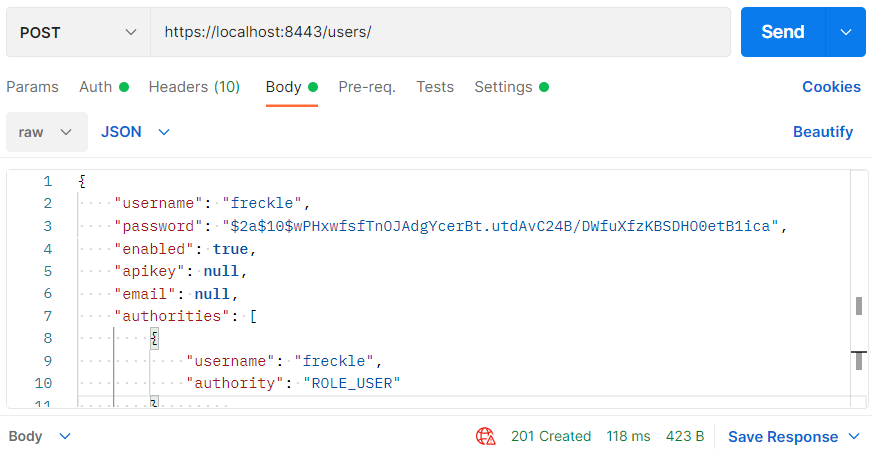
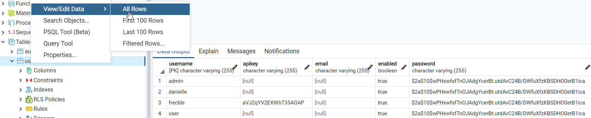
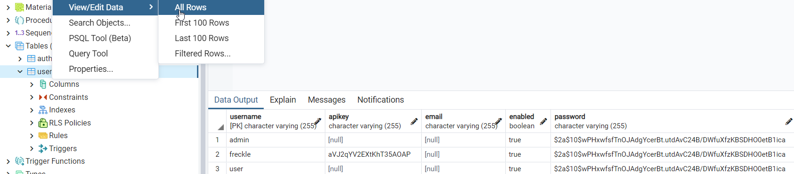
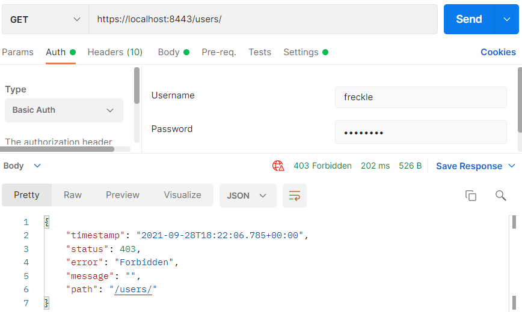
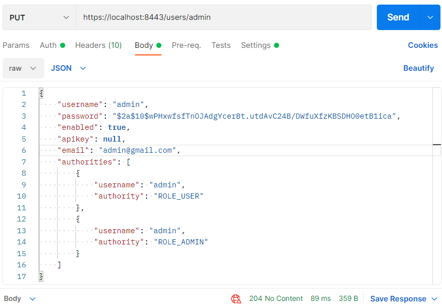
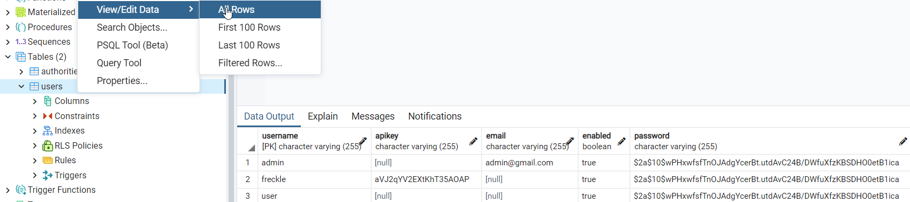

## Security met gebruikersservice

We maken een nieuw IntelliJ project in de Initializr.

Maak een nieuwe map aan `controller` met daarin 5 bestanden: `AdminController.java`, `AuthenticatedController.java`
, `BaseController.java`, `ExceptionController.java` en `UserController.java`.

_AdminController.java_

```java
package nl.danielle.demo_fifth_security.controller;

import org.springframework.http.HttpStatus;
import org.springframework.http.ResponseEntity;
import org.springframework.web.bind.annotation.GetMapping;
import org.springframework.web.bind.annotation.RequestMapping;
import org.springframework.web.bind.annotation.RestController;

@RestController
@RequestMapping(value = "/admin")
public class AdminController {

    @GetMapping(value = "")
    public ResponseEntity<Object> getMessage() {
        return new ResponseEntity<>("SECURED REST endpoint: /admin", HttpStatus.OK);
    }
}
```

_AuthenticatedController.java_

```java
package nl.danielle.demo_fifth_security.controller;

import org.springframework.http.ResponseEntity;
import org.springframework.security.core.Authentication;
import org.springframework.web.bind.annotation.GetMapping;
import org.springframework.web.bind.annotation.RequestMapping;
import org.springframework.web.bind.annotation.RestController;

import java.security.Principal;

@RestController
@RequestMapping(value = "/authenticated")
public class AuthenticatedController {

    @GetMapping(value = "")
    public ResponseEntity<Object> authenticated(Authentication authentication, Principal principal) {
        return ResponseEntity.ok().body(principal);
    }
}
```

_BaseController.java_

```java
package nl.danielle.demo_fifth_security.controller;

import org.springframework.web.bind.annotation.GetMapping;
import org.springframework.web.bind.annotation.RestController;

@RestController
public class BaseController {

    @GetMapping(value = "/")
    public String hello() {
        return "Hello World";
    }
}
```

_ExceptionController.java_

```java
package nl.danielle.demo_fifth_security.controller;

import nl.danielle.demo_fifth_security.exceptions.BadRequestException;
import nl.danielle.demo_fifth_security.exceptions.RecordNotFoundException;
import nl.danielle.demo_fifth_security.exceptions.UsernameNotFoundException;

import org.springframework.http.ResponseEntity;
import org.springframework.web.bind.annotation.ControllerAdvice;
import org.springframework.web.bind.annotation.ExceptionHandler;
import org.springframework.web.bind.annotation.RestController;

@RestController
@ControllerAdvice
public class ExceptionController {

    @ExceptionHandler(value = RecordNotFoundException.class)
    public ResponseEntity<Object> exception(RecordNotFoundException exception) {
        return ResponseEntity.notFound().build();
    }

    @ExceptionHandler(value = BadRequestException.class)
    public ResponseEntity<Object> exception(BadRequestException exception) {
        return ResponseEntity.badRequest().build();
    }

    @ExceptionHandler(value = UsernameNotFoundException.class)
    public ResponseEntity<Object> exception(UsernameNotFoundException exception) {
        return ResponseEntity.badRequest().build();
    }
}
```

_UserController.java_

```java
package nl.danielle.demo_fifth_security.controller;

import nl.danielle.demo_fifth_security.exceptions.BadRequestException;
import nl.danielle.demo_fifth_security.model.User;
import nl.danielle.demo_fifth_security.service.UserService;
import org.springframework.beans.factory.annotation.Autowired;
import org.springframework.http.ResponseEntity;
import org.springframework.web.bind.annotation.*;
import org.springframework.web.servlet.support.ServletUriComponentsBuilder;

import java.net.URI;
import java.util.Map;

@RestController
@RequestMapping(value = "/users")
public class UserController {

    @Autowired
    private UserService userService;

    @GetMapping(value = "")
    public ResponseEntity<Object> getUsers() {
        return ResponseEntity.ok().body(userService.getUsers());
    }

    @GetMapping(value = "/{username}")
    public ResponseEntity<Object> getUser(@PathVariable("username") String username) {
        return ResponseEntity.ok().body(userService.getUser(username));
    }

    @PostMapping(value = "")
    public ResponseEntity<Object> createUser(@RequestBody User user) {
        String newUsername = userService.createUser(user);

        URI location = ServletUriComponentsBuilder.fromCurrentRequest().path("/{username}")
                .buildAndExpand(newUsername).toUri();

        return ResponseEntity.created(location).build();
    }

    @PutMapping(value = "/{username}")
    public ResponseEntity<Object> updateUser(@PathVariable("username") String username, @RequestBody User user) {
        userService.updateUser(username, user);
        return ResponseEntity.noContent().build();
    }

    @DeleteMapping(value = "/{username}")
    public ResponseEntity<Object> deleteUser(@PathVariable("username") String username) {
        userService.deleteUser(username);
        return ResponseEntity.noContent().build();
    }

    @GetMapping(value = "/{username}/authorities")
    public ResponseEntity<Object> getUserAuthorities(@PathVariable("username") String username) {
        return ResponseEntity.ok().body(userService.getAuthorities(username));
    }

    @PostMapping(value = "/{username}/authorities")
    public ResponseEntity<Object> addUserAuthority(@PathVariable("username") String username, @RequestBody Map<String, Object> fields) {
        try {
            String authorityName = (String) fields.get("authority");
            userService.addAuthority(username, authorityName);
            return ResponseEntity.noContent().build();
        } catch (Exception ex) {
            throw new BadRequestException();
        }
    }

    // http://users/peter/authorities/ROLE_ADMIN
    @DeleteMapping(value = "/{username}/authorities/{authority}")
    public ResponseEntity<Object> deleteUserAuthority(@PathVariable("username") String username, @PathVariable("authority") String authority) {
        userService.removeAuthority(username, authority);
        return ResponseEntity.noContent().build();
    }
}
```

Met endpoint `/user` kun je nu zeggen, ik wil alle users `""` of ik wil een bepaalde user `/{username}`. Verder
is `createUser`, `updateUser` en `deletUser` mogelijk. En je kan ook opvragen welke `authorities` een user heeft. Dus
het is nu mogelijk om users zelf aan te maken.

Deze `UserController` maakt contact met `userService`. De `userService` heeft alle methoden om al die query's aan te
vragen.

Maak een nieuwe map aan `config` met daarin 2 bestanden: `CustomUserDetailsService.java` en `SpringSecurityConfig.java`.

_CustomUserDetailsService.java_

```java
package nl.danielle.demo_fifth_security.config;

import nl.danielle.demo_fifth_security.model.Authority;
import nl.danielle.demo_fifth_security.model.User;
import nl.danielle.demo_fifth_security.service.UserService;
import org.springframework.beans.factory.annotation.Autowired;
import org.springframework.security.core.GrantedAuthority;
import org.springframework.security.core.authority.SimpleGrantedAuthority;
import org.springframework.security.core.userdetails.UserDetails;
import org.springframework.security.core.userdetails.UserDetailsService;
import org.springframework.security.core.userdetails.UsernameNotFoundException;
import org.springframework.stereotype.Service;

import java.util.ArrayList;
import java.util.List;
import java.util.Optional;
import java.util.Set;

@Service
public class CustomUserDetailsService implements UserDetailsService {

    @Autowired
    private UserService userService;

//    @Autowired
//    private AuthorityService authorityService;

    @Override
    public UserDetails loadUserByUsername(String username) {
        Optional<User> user = userService.getUser(username);
        if (user == null) {
            throw new UsernameNotFoundException(username);
        }

        String password = user.get().getPassword();

        Set<Authority> authorities = user.get().getAuthorities();

        List<GrantedAuthority> grantedAuthorities = new ArrayList<>();
        for (Authority authority : authorities) {
            grantedAuthorities.add(new SimpleGrantedAuthority(authority.getAuthority()));
        }

        return new org.springframework.security.core.userdetails.User(username, password, grantedAuthorities);
    }
}
```

_SpringSecurityConfig.java_

```java
package nl.danielle.demo_fifth_security.config;

import org.springframework.beans.factory.annotation.Autowired;
import org.springframework.context.annotation.Bean;
import org.springframework.context.annotation.Configuration;
import org.springframework.http.HttpMethod;
import org.springframework.security.config.annotation.authentication.builders.AuthenticationManagerBuilder;
import org.springframework.security.config.annotation.web.builders.HttpSecurity;
import org.springframework.security.config.annotation.web.configuration.EnableWebSecurity;
import org.springframework.security.config.annotation.web.configuration.WebSecurityConfigurerAdapter;
import org.springframework.security.crypto.bcrypt.BCryptPasswordEncoder;
import org.springframework.security.crypto.password.PasswordEncoder;

@Configuration
@EnableWebSecurity
public class SpringSecurityConfig extends WebSecurityConfigurerAdapter {

    @Autowired
    public CustomUserDetailsService customUserDetailsService;

    @Autowired
    public void configureGlobal(AuthenticationManagerBuilder auth) throws Exception {
        auth.userDetailsService(customUserDetailsService);
    }

    @Bean
    public PasswordEncoder passwordEncoder() {
        return new BCryptPasswordEncoder();
    }

    // Secure the endpoints with HTTP Basic authentication
    @Override
    protected void configure(HttpSecurity http) throws Exception {

        http
                //HTTP Basic authentication
                .httpBasic()
                .and()
                .authorizeRequests()
                .antMatchers(HttpMethod.GET, "/customers/**").hasRole("USER")
                .antMatchers(HttpMethod.GET, "/admin/**").hasRole("ADMIN")
                .antMatchers(HttpMethod.GET, "/users/**").hasRole("ADMIN")
                .antMatchers(HttpMethod.GET, "/authenticated/**").authenticated()
                .anyRequest().permitAll()
                .and()
                .csrf().disable()
                .formLogin().disable();
    }
}
```

De config is anders vergeleken met de vorige versie. De `jdbcAuthentication` is `userDetailsService` geworden. Spring
Boot heeft een user service, dat is een classe die je kan gebruiken en hier willen we deze aanpassen en dat zie je
in `customUserDetailsService.java`.

De `customUserDetailsService.java` is gebaseerd op basis van
de `UserDetailsService`: `public class CustomUserDetailsService implements UserDetailsService`. Het gaat om één
methode `loadUserByUsername` en die maakt gebruik van onze `userService`.

Maak een nieuwe map aan `exceptions` met daarin 3 bestanden: `BadRequestException.java`, `RecordNotFoundException.java`
en `UsernameNotFoundException.java`.

_BadRequestException.java_

```java
package nl.danielle.demo_fifth_security.exceptions;

public class BadRequestException extends RuntimeException {
    private static final long serialVersionUID = 1L;
}
```

_RecordNotFoundException.java_

```java
package nl.danielle.demo_fifth_security.exceptions;

public class RecordNotFoundException extends RuntimeException {
    private static final long serialVersionUID = 1L;
}
```

_UsernameNotFoundException.java_

```java
package nl.danielle.demo_fifth_security.exceptions;

public class UsernameNotFoundException extends RuntimeException {
    private static final long serialVersionUID = 1L;

    public UsernameNotFoundException(String username) {
        super("Cannot find user " + username);
    }
}
```

Maak een nieuwe map aan `model` met daarin 3 bestanden: `Authority.java`, `AuthorityKey.java` en `User.java`.

_Authority.java_

```java
package nl.danielle.demo_fifth_security.model;

import javax.persistence.*;
import java.io.Serializable;

@Entity
@IdClass(AuthorityKey.class)
@Table(name = "authorities")
public class Authority implements Serializable {

    @Id
    @Column(nullable = false)
    private String username;

    @Id
    @Column(nullable = false)
    private String authority;

    public Authority() {
    }

    public Authority(String username, String authority) {
        this.username = username;
        this.authority = authority;
    }

    public String getUsername() {
        return username;
    }

    public void setUsername(String username) {
        this.username = username;
    }

    public String getAuthority() {
        return authority;
    }

    public void setAuthority(String authority) {
        this.authority = authority;
    }
}
```

_AuthorityKey.java_

```java
package nl.danielle.demo_fifth_security.model;

import java.io.Serializable;
import java.util.Objects;

public class AuthorityKey implements Serializable {
    private String username;
    private String authority;

    @Override
    public boolean equals(Object o) {
        if (this == o) return true;
        if (o == null || getClass() != o.getClass()) return false;
        AuthorityKey that = (AuthorityKey) o;
        return username.equals(that.username) &&
                authority.equals(that.authority);
    }

    @Override
    public int hashCode() {
        return Objects.hash(username, authority);
    }
}
```

_User.java_

```java
package nl.danielle.demo_fifth_security.model;

import javax.persistence.*;
import java.util.HashSet;
import java.util.Set;

@Entity
@Table(name = "users")
public class User {

    @Id
    @Column(nullable = false, unique = true)
    private String username;

    @Column(nullable = false, length = 255)
    private String password;

    @Column(nullable = false)
    private boolean enabled = true;

    @Column
    private String apikey;

    @Column
    private String email;

    @OneToMany(
            targetEntity = Authority.class,
            mappedBy = "username",
            cascade = CascadeType.ALL,
            orphanRemoval = true,
            fetch = FetchType.EAGER)
    private Set<Authority> authorities = new HashSet<>();


    public String getUsername() {
        return username;
    }

    public void setUsername(String username) {
        this.username = username;
    }

    public String getPassword() {
        return password;
    }

    public void setPassword(String password) {
        this.password = password;
    }

    public boolean isEnabled() {
        return enabled;
    }

    public void setEnabled(boolean enabled) {
        this.enabled = enabled;
    }

    public String getApikey() {
        return apikey;
    }

    public void setApikey(String apikey) {
        this.apikey = apikey;
    }

    public String getEmail() {
        return email;
    }

    public void setEmail(String email) {
        this.email = email;
    }

    public Set<Authority> getAuthorities() {
        return authorities;
    }

    public void addAuthority(Authority authority) {
        this.authorities.add(authority);
    }

    public void removeAuthority(Authority authority) {
        this.authorities.remove(authority);
    }
}
```

Maak een nieuwe map aan `repository` met daarin 1 interface: `UserRepository`.

```java
package nl.danielle.demo_fifth_security.repository;

import nl.danielle.demo_fifth_security.model.User;

import org.springframework.data.jpa.repository.JpaRepository;

public interface UserRepository extends JpaRepository<User, String> {
}
```

De Repository is een JpaRepository. Deze doet niet zoveel. Daar zitten de `getById` en `findAll` in.

Maak een nieuwe map aan `service` met daarin 2 bestanden: `UserService.java`
en `UserServiceImpl.java`.

_UserService.java_

```java
package nl.danielle.demo_fifth_security.service;

import nl.danielle.demo_fifth_security.model.Authority;
import nl.danielle.demo_fifth_security.model.User;

import java.util.Collection;
import java.util.Optional;
import java.util.Set;

public interface UserService {

    public abstract String createUser(User user);

    public abstract void updateUser(String username, User user);

    public abstract void deleteUser(String username);

    public abstract Collection<User> getUsers();

    public abstract Optional<User> getUser(String username);

    public abstract boolean userExists(String username);

    public abstract Set<Authority> getAuthorities(String username);

    public abstract void addAuthority(String username, String authority);

    public abstract void removeAuthority(String username, String authority);
}
```

_UserServiceImpl.java_

```java
package nl.danielle.demo_fifth_security.service;

import nl.danielle.demo_fifth_security.exceptions.RecordNotFoundException;
import nl.danielle.demo_fifth_security.exceptions.UsernameNotFoundException;
import nl.danielle.demo_fifth_security.model.Authority;
import nl.danielle.demo_fifth_security.model.User;
import nl.danielle.demo_fifth_security.repository.UserRepository;
import nl.danielle.demo_fifth_security.utils.RandomStringGenerator;
import org.springframework.beans.factory.annotation.Autowired;
import org.springframework.stereotype.Service;

import java.util.Collection;
import java.util.Optional;
import java.util.Set;

@Service
public class UserServiceImpl implements UserService {

    @Autowired
    private UserRepository userRepository;

    @Override
    public Collection<User> getUsers() {
        return userRepository.findAll();
    }

    @Override
    public Optional<User> getUser(String username) {
        return userRepository.findById(username);
    }

    @Override
    public boolean userExists(String username) {
        return userRepository.existsById(username);
    }

    @Override
    public String createUser(User user) {
        String randomString = RandomStringGenerator.generateAlphaNumeric(20);
        user.setApikey(randomString);
        User newUser = userRepository.save(user);
        return newUser.getUsername();
    }

    @Override
    public void deleteUser(String username) {
        userRepository.deleteById(username);
    }

    @Override
    public void updateUser(String username, User newUser) {
        if (!userRepository.existsById(username)) throw new RecordNotFoundException();
        User user = userRepository.findById(username).get();
        user.setPassword(newUser.getPassword());
        user.setEmail(newUser.getEmail());
        user.setApikey(newUser.getApikey());
        userRepository.save(user);
    }

    @Override
    public Set<Authority> getAuthorities(String username) {
        if (!userRepository.existsById(username)) throw new UsernameNotFoundException(username);
        User user = userRepository.findById(username).get();
        return user.getAuthorities();
    }

    @Override
    public void addAuthority(String username, String authority) {
        if (!userRepository.existsById(username)) throw new UsernameNotFoundException(username);
        User user = userRepository.findById(username).get();
        user.addAuthority(new Authority(username, authority));
        userRepository.save(user);
    }

    @Override
    public void removeAuthority(String username, String authority) {
        if (!userRepository.existsById(username)) throw new UsernameNotFoundException(username);
        User user = userRepository.findById(username).get();
        Authority authorityToRemove = user.getAuthorities().stream().filter((a) -> a.getAuthority().equalsIgnoreCase(authority)).findAny().get();
        user.removeAuthority(authorityToRemove);
        userRepository.save(user);
    }
}
```

Je hebt een Service, die kan `getUser` doen, `userExists`, `createUser`, `deleteUser` en `updateUser`.

Maak een nieuwe map aan `utils` met daarin 1 bestand: `RandomStringGenerator.java`.

```java
package nl.danielle.demo_fifth_security.utils;

import java.util.Random;

public class RandomStringGenerator {

    public static String generateAlphaNumeric(int length) {
        int leftLimit = 48; // numeral '0'
        int rightLimit = 122; // letter 'z'
        int targetStringLength = 10;
        Random random = new Random();

        String generatedString = random.ints(leftLimit, rightLimit + 1)
                .filter(i -> (i <= 57 || i >= 65) && (i <= 90 || i >= 97))
                .limit(length)
                .collect(StringBuilder::new, StringBuilder::appendCodePoint, StringBuilder::append)
                .toString();

        return generatedString;
    }
}
```

Run de applicatie.

### Postman

We gaan naar Postman en vullen de volgende url in `http://localhost:8080/admin` met `GET`.


We gaan naar de users met `http://localhost:8080/users` en `GET`. Die laat de 3 users zien: `user`, `admin` en `peter`
met alle gegevens en rollen.

Wanneer je naar `http://localhost:8080/users/peter` gaat met `GET` krijg je van één user alle gegevens.

We gaan een user `danielle` toevoegen met `http://localhost:8080/users` en `POST`.



We gaan naar postgreSQL en kijken in de user tabel. Je ziet dat de nieuwe user is toegevoegd.



We gaan user `peter` verwijderen in Postman met url `http://localhost:8080/users/peter` en `DELETE`.


In postgreSQL is de user verdwenen.



De nieuwe user `danielle` mag niet de `users` zien met url `http://localhost:8080/users` en `GET`.



Wel mag de nieuwe user `http://localhost:8080/` en `http://localhost:8080/authenticated` zien.

We gaan met `PUT` het emailadres toevoegen bij user `admin` en url `http://localhost:8080/users/admin`.



In postgreSQL zie je dat het e-mailadres is toegevoegd aan de tabel bij de user `admin`.


