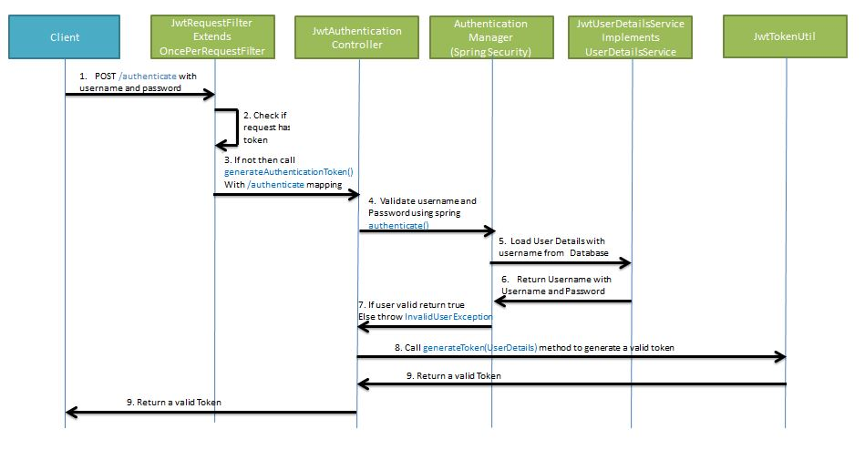
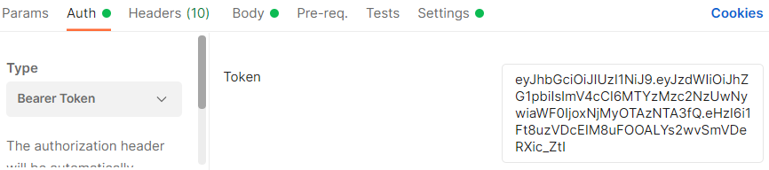
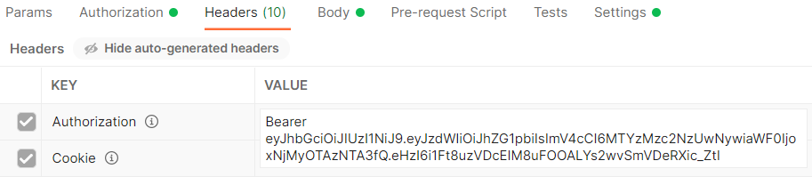
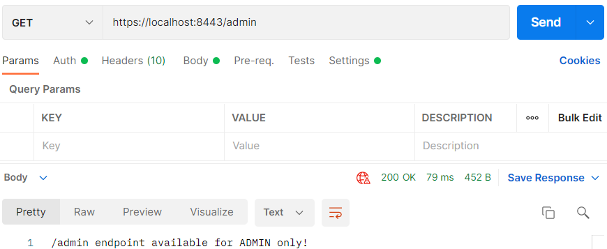

## Security met JWT

Een JWT token is een ge-encrypt String van 50 karakters.

Je gaat eerst van de Client naar de Server met een wachtwoord. De Server geeft terug een JWT token, vanaf dit moment heb je aan de Client kant een token. Deze kun je gebruiken om een volgend verzoek te doen om de JWT token in de Header op te nemen. De Server (Spring Boot) kijkt naar de JWT token,  aan de hand daarvan weet hij welke user daarbij hoort en weet hij of je wel of niet de resource mag zien. Dit gebeurt maar één keer. De token wordt aan de Client kant opgeslagen en daarna kun je alle verzoeken met behulp van de token gaan afhandelen. Je hoeft nooit meer username of wachtwoord te versturen.


Er is een manier om een JWT token te genereren, dat gebeurd in een aantal stappen.



Zodra de token is gemaakt, kun je deze gaan gebruiken.


### pom.xml

Aan de `pom.xml` voeg je een extra dependency toe genaamd `io.jsonwebtoken`. 

```xml
<?xml version="1.0" encoding="UTF-8"?>
<project xmlns="http://maven.apache.org/POM/4.0.0" xmlns:xsi="http://www.w3.org/2001/XMLSchema-instance"
         xsi:schemaLocation="http://maven.apache.org/POM/4.0.0 https://maven.apache.org/xsd/maven-4.0.0.xsd">
    <modelVersion>4.0.0</modelVersion>
    <parent>
        <groupId>org.springframework.boot</groupId>
        <artifactId>spring-boot-starter-parent</artifactId>
        <version>2.4.3</version>
        <relativePath/> <!-- lookup parent from repository -->
    </parent>
    <groupId>nl.danielle</groupId>
    <artifactId>security_demo</artifactId>
    <version>0.0.1-SNAPSHOT</version>
    <name>security_demo</name>
    <description>Demo project for Spring Boot</description>
    <properties>
        <java.version>11</java.version>
    </properties>
    <dependencies>
        <dependency>
            <groupId>org.springframework.boot</groupId>
            <artifactId>spring-boot-starter-data-jpa</artifactId>
        </dependency>
        <dependency>
            <groupId>org.springframework.boot</groupId>
            <artifactId>spring-boot-starter-security</artifactId>
        </dependency>
        <dependency>
            <groupId>org.springframework.boot</groupId>
            <artifactId>spring-boot-starter-web</artifactId>
        </dependency>
        <dependency>
            <groupId>io.jsonwebtoken</groupId>
            <artifactId>jjwt</artifactId>
            <version>0.9.1</version>
        </dependency>
        <dependency>
            <groupId>org.postgresql</groupId>
            <artifactId>postgresql</artifactId>
            <scope>runtime</scope>
        </dependency>
        <dependency>
            <groupId>org.springframework.boot</groupId>
            <artifactId>spring-boot-starter-test</artifactId>
            <scope>test</scope>
        </dependency>
        <dependency>
            <groupId>org.springframework.security</groupId>
            <artifactId>spring-security-test</artifactId>
            <scope>test</scope>
        </dependency>
    </dependencies>

    <build>
        <plugins>
            <plugin>
                <groupId>org.springframework.boot</groupId>
                <artifactId>spring-boot-maven-plugin</artifactId>
                <version>${project.parent.version}</version>
            </plugin>
        </plugins>
    </build>

</project>
```

### Controller

In de map `controller` hebben we 6 bestanden: `AdminController.java`, `AuthenticatedController.java` , `BaseController.java`, `CustomersController.java`, `ExceptionController.java` en `UserController.java`.

_AuthenticatedController.java_

```java
package nl.danielle.security_demo.controller;

import nl.danielle.security_demo.payload.AuthenticationRequest;
import nl.danielle.security_demo.payload.AuthenticationResponse;
import nl.danielle.security_demo.service.CustomUserDetailsService;
import nl.danielle.security_demo.utils.JwtUtil;
import org.springframework.beans.factory.annotation.Autowired;
import org.springframework.http.ResponseEntity;
import org.springframework.security.authentication.AuthenticationManager;
import org.springframework.security.authentication.BadCredentialsException;
import org.springframework.security.authentication.UsernamePasswordAuthenticationToken;
import org.springframework.security.core.Authentication;
import org.springframework.security.core.userdetails.UserDetails;
import org.springframework.web.bind.annotation.GetMapping;
import org.springframework.web.bind.annotation.PostMapping;
import org.springframework.web.bind.annotation.RequestBody;
import org.springframework.web.bind.annotation.RestController;

import java.security.Principal;

@RestController
public class AuthenticatedController {

    @Autowired
    private AuthenticationManager authenticationManager;

    @Autowired
    private CustomUserDetailsService userDetailsService;

    @Autowired
    JwtUtil jwtUtl;

    @GetMapping(value = "/authenticated")
    public ResponseEntity<Object> authenticated(Authentication authentication, Principal principal) {
        return ResponseEntity.ok().body(principal);
    }

    @PostMapping(value = "/authenticate")
    public ResponseEntity<?> createAuthenticationToken(@RequestBody AuthenticationRequest authenticationRequest) throws Exception {

        String username = authenticationRequest.getUsername();
        String password = authenticationRequest.getPassword();

        try {
            authenticationManager.authenticate(
                    new UsernamePasswordAuthenticationToken(username, password)
            );
        } catch (BadCredentialsException ex) {
            throw new Exception("Incorrect username or password", ex);
        }

        final UserDetails userDetails = userDetailsService
                .loadUserByUsername(username);

        final String jwt = jwtUtl.generateToken(userDetails);

        return ResponseEntity.ok(new AuthenticationResponse(jwt));
    }
}
```

### Model

In package `model` staan 3 bestanden: `Authority.java`, `AuthorityKey.java` en `User.java`.

_Authority.java_

```java
package nl.danielle.security_demo.model;

import javax.persistence.*;
import java.io.Serializable;

@Entity
@IdClass(nl.danielle.demo_sixth_security.model.AuthorityKey.class)
@Table(name = "authorities")
public class Authority implements Serializable {

    @Id
    @Column(nullable = false)
    private String username;

    @Id
    @Column(nullable = false)
    private String authority;

    public Authority() {
    }

    public Authority(String username, String authority) {
        this.username = username;
        this.authority = authority;
    }

    public String getUsername() {
        return username;
    }

    public void setUsername(String username) {
        this.username = username;
    }

    public String getAuthority() {
        return authority;
    }

    public void setAuthority(String authority) {
        this.authority = authority;
    }
}
```

Er zijn twee kolommen die samen de `id` vormen, een combinatie van `username` en `authority`. Dit is de primary key.

Je hebt een aparte `@IdClass` en dit is de `AuthorityKey`.

_AuthorityKey.java_

```java
package nl.danielle.security_demo.model;

import java.io.Serializable;

public class AuthorityKey implements Serializable {
    private String username;
    private String authority;
}
```

De `AuthorityKey` is niks anders dan een combinatie van `username` en `authority` en daar maakt hij een String van op basis van de `Serializable`.

In `UserRepository.java` komt deze String terug.

_User.java_

```java
package nl.danielle.security_demo.model;

import javax.persistence.*;
import java.util.HashSet;
import java.util.Set;

@Entity
@Table(name = "users")
public class User {

    @Id
    @Column(nullable = false, unique = true)
    private String username;

    @Column(nullable = false, length = 255)
    private String password;

    @Column(nullable = false)
    private boolean enabled = true;

    @Column
    private String apikey;

    @Column
    private String email;

    @OneToMany(
            targetEntity = nl.danielle.demo_sixth_security.model.Authority.class,
            mappedBy = "username",
            cascade = CascadeType.ALL,
            orphanRemoval = true,
            fetch = FetchType.EAGER)
    private Set<nl.danielle.demo_sixth_security.model.Authority> authorities = new HashSet<>();

    public String getUsername() {
        return username;
    }

    public void setUsername(String username) {
        this.username = username;
    }

    public String getPassword() {
        return password;
    }

    public void setPassword(String password) {
        this.password = password;
    }

    public boolean isEnabled() {
        return enabled;
    }

    public void setEnabled(boolean enabled) {
        this.enabled = enabled;
    }

    public String getApikey() {
        return apikey;
    }

    public void setApikey(String apikey) {
        this.apikey = apikey;
    }

    public String getEmail() {
        return email;
    }

    public void setEmail(String email) {
        this.email = email;
    }

    public Set<Authority> getAuthorities() {
        return authorities;
    }

    public void addAuthority(Authority authority) {
        this.authorities.add(authority);
    }

    public void removeAuthority(Authority authority) {
        this.authorities.remove(authority);
    }
}
```

### Exceptions

We hebben een package genaamd `exceptions` met daarin 3 bestanden: `BadRequestException.java`, `RecordNotFoundException.java` en `UsernameNotFoundException.java`.

### Repository

In de package `repository` zit 1 interface: `UserRepository.java`.

### Service

De package `service` heeft 3 bestanden: `CustomUserDetailsService.java`, `UserService.java` en `UserServiceImpl.java`.

_CustomUserDetailsService.java_

```java
package nl.danielle.security_demo.service;

import nl.danielle.security_demo.model.Authority;
import nl.danielle.security_demo.model.User;
import org.springframework.beans.factory.annotation.Autowired;
import org.springframework.security.core.GrantedAuthority;
import org.springframework.security.core.authority.SimpleGrantedAuthority;
import org.springframework.security.core.userdetails.UserDetails;
import org.springframework.security.core.userdetails.UserDetailsService;
import org.springframework.security.core.userdetails.UsernameNotFoundException;
import org.springframework.stereotype.Service;

import java.util.ArrayList;
import java.util.List;
import java.util.Optional;
import java.util.Set;

@Service
public class CustomUserDetailsService implements UserDetailsService {

    @Autowired
    private UserService userService;

    @Override
    public UserDetails loadUserByUsername(String username) {
        Optional<User> user = userService.getUser(username);
        if (user == null) {
            throw new UsernameNotFoundException(username);
        }

        String password = user.get().getPassword();

        Set<Authority> authorities = user.get().getAuthorities();
        List<GrantedAuthority> grantedAuthorities = new ArrayList<>();
        for (Authority authority : authorities) {
            grantedAuthorities.add(new SimpleGrantedAuthority(authority.getAuthority()));
        }

        return new org.springframework.security.core.userdetails.User(username, password, grantedAuthorities);
    }
}
```

_UserServiceImpl.java_

```java
package nl.danielle.security_demo.service;

import nl.danielle.security_demo.exceptions.RecordNotFoundException;
import nl.danielle.security_demo.exceptions.UsernameNotFoundException;
import nl.danielle.security_demo.model.Authority;
import nl.danielle.security_demo.model.User;
import nl.danielle.security_demo.repository.UserRepository;
import nl.danielle.security_demo.utils.RandomStringGenerator;
import org.springframework.beans.factory.annotation.Autowired;
import org.springframework.stereotype.Service;

import java.util.Collection;
import java.util.Optional;
import java.util.Set;

@Service
public class UserServiceImpl implements nl.danielle.security_demo.service.UserService {

    @Autowired
    private UserRepository userRepository;

    @Override
    public Collection<User> getUsers() {
        return userRepository.findAll();
    }

    @Override
    public Optional<User> getUser(String username) {
        return userRepository.findById(username);
    }

    @Override
    public boolean userExists(String username) {
        return userRepository.existsById(username);
    }

    @Override
    public String createUser(User user) {
        String randomString = RandomStringGenerator.generateAlphaNumeric(20);
        user.setApikey(randomString);
        User newUser = userRepository.save(user);
        return newUser.getUsername();
    }

    @Override
    public void deleteUser(String username) {
        userRepository.deleteById(username);
    }

    @Override
    public void updateUser(String username, User newUser) {
        if (!userRepository.existsById(username)) throw new RecordNotFoundException();
        User user = userRepository.findById(username).get();
        user.setPassword(newUser.getPassword());
        userRepository.save(user);
    }

    @Override
    public Set<Authority> getAuthorities(String username) {
        if (!userRepository.existsById(username)) throw new UsernameNotFoundException(username);
        User user = userRepository.findById(username).get();
        return user.getAuthorities();
    }

    @Override
    public void addAuthority(String username, String authority) {
        if (!userRepository.existsById(username)) throw new UsernameNotFoundException(username);
        User user = userRepository.findById(username).get();
        user.addAuthority(new Authority(username, authority));
        userRepository.save(user);
    }

    @Override
    public void removeAuthority(String username, String authority) {
        if (!userRepository.existsById(username)) throw new UsernameNotFoundException(username);
        User user = userRepository.findById(username).get();
        Authority authorityToRemove = user.getAuthorities().stream().filter((a) -> a.getAuthority().equalsIgnoreCase(authority)).findAny().get();
        user.removeAuthority(authorityToRemove);
        userRepository.save(user);
    }
}
```

### Config

In de package genaamd `config` zit 1 bestand: `SpringSecurityConfig.java`.

_SpringSecurityConfig.java_

```java
package nl.danielle.security_demo.config;

import nl.danielle.security_demo.filter.JwtRequestFilter;
import nl.danielle.security_demo.service.CustomUserDetailsService;

import org.springframework.beans.factory.annotation.Autowired;
import org.springframework.context.annotation.Bean;
import org.springframework.context.annotation.Configuration;
import org.springframework.security.authentication.AuthenticationManager;
import org.springframework.security.config.annotation.authentication.builders.AuthenticationManagerBuilder;
import org.springframework.security.config.annotation.web.builders.HttpSecurity;
import org.springframework.security.config.annotation.web.configuration.EnableWebSecurity;
import org.springframework.security.config.annotation.web.configuration.WebSecurityConfigurerAdapter;
import org.springframework.security.config.http.SessionCreationPolicy;
import org.springframework.security.crypto.bcrypt.BCryptPasswordEncoder;
import org.springframework.security.crypto.password.PasswordEncoder;
import org.springframework.security.web.authentication.UsernamePasswordAuthenticationFilter;

@Configuration
@EnableWebSecurity
public class SpringSecurityConfig extends WebSecurityConfigurerAdapter {

    @Autowired
    public CustomUserDetailsService customUserDetailsService;

    @Autowired
    private JwtRequestFilter jwtRequestFilter;

    @Autowired
    public void configureGlobal(AuthenticationManagerBuilder auth) throws Exception {
        auth.userDetailsService(customUserDetailsService);
    }

    @Override
    @Bean
    public AuthenticationManager authenticationManagerBean() throws Exception {
        return super.authenticationManagerBean();
    }

    @Bean
    public PasswordEncoder passwordEncoder() {
        return new BCryptPasswordEncoder();
    }

    @Override
    protected void configure(HttpSecurity http) throws Exception {

        //JWT token authentication
        http
                .csrf().disable()
                .authorizeRequests()
                .antMatchers("/customers/**").hasRole("USER")
                .antMatchers("/admin/**").hasRole("ADMIN")
                .antMatchers("/users/**").hasRole("ADMIN")
                .antMatchers("/authenticated").authenticated()
                .antMatchers("/authenticate").permitAll()
                .anyRequest().permitAll()
                .and()
                .sessionManagement()
                .sessionCreationPolicy(SessionCreationPolicy.STATELESS);
        http.addFilterBefore(jwtRequestFilter, UsernamePasswordAuthenticationFilter.class);
    }
}
```

Naast dat we gebruik maken van `customUserDetailsService`, de `passwordEncoder` en de verschillende rechten in de `http configure`, is er ook een `AuthenticationManager` met een `jwtRequestFilter`.

Op het moment dat je een HTTP Request doet naar Spring Boot, gaat hij een hele keten aan stappen afronden (FilterChain). Uiteindelijk komt hij bij de `@RestController`, de plek waar je de controllers hebt gedefinieerd. De stappen die hij doorloopt zijn allemaal `Filters`. Een `Filter` beoordeelt of hij wel of niet door mag. Als hij door mag dan gaat hij door naar de volgende `Filter`. Gaat het ergens fout dan wordt de keten doorbroken en komt hij nooit bij de `Controller`.


### Filter

Werken met een JWT is op basis van een filter en deze filter moet geïmplementeerd worden.

Maak een nieuwe package aan genaamd `filter` met daarin 1 bestand: `JwtRequestFilter.java`.

_JwtRequestFilter.java_

```java
package nl.danielle.security_demo.filter;

import nl.danielle.security_demo.service.CustomUserDetailsService;
import nl.danielle.security_demo.utils.JwtUtil;
import org.springframework.beans.factory.annotation.Autowired;
import org.springframework.security.authentication.UsernamePasswordAuthenticationToken;
import org.springframework.security.core.context.SecurityContextHolder;
import org.springframework.security.core.userdetails.UserDetails;
import org.springframework.security.web.authentication.WebAuthenticationDetailsSource;
import org.springframework.stereotype.Component;
import org.springframework.web.filter.OncePerRequestFilter;

import javax.servlet.FilterChain;
import javax.servlet.ServletException;
import javax.servlet.http.HttpServletRequest;
import javax.servlet.http.HttpServletResponse;
import java.io.IOException;

@Component
public class JwtRequestFilter extends OncePerRequestFilter {

    @Autowired
    private CustomUserDetailsService userDetailsService;

    @Autowired
    private JwtUtil jwtUtil;

    @Override
    protected void doFilterInternal(HttpServletRequest request, HttpServletResponse response, FilterChain filterChain) throws ServletException, IOException {

        final String authorizationHeader = request.getHeader("Authorization");

        String username = null;
        String jwt = null;

        if (authorizationHeader != null && authorizationHeader.startsWith("Bearer ")) {
            jwt = authorizationHeader.substring(7);
            username = jwtUtil.extractUsername(jwt);
        }

        if (username != null && SecurityContextHolder.getContext().getAuthentication() == null) {
            UserDetails userDetails = this.userDetailsService.loadUserByUsername(username);

            if (jwtUtil.validateToken(jwt, userDetails)) {

                UsernamePasswordAuthenticationToken usernamePasswordAuthenticationToken = new UsernamePasswordAuthenticationToken(
                        userDetails, null, userDetails.getAuthorities()
                );
                usernamePasswordAuthenticationToken.setDetails(new WebAuthenticationDetailsSource().buildDetails(request));
                SecurityContextHolder.getContext().setAuthentication(usernamePasswordAuthenticationToken);
            }
        }
        filterChain.doFilter(request, response);
    }
}
```

De `JwtRequestFilter` is een subklasse van de `OncePerRequestFilter`.

Er wordt gebruik gemaakt van de `userDetailsService` en is verbonden met de `jwtUtil`.

### Payload

Maak een nieuwe package aan genaamd `payload` met daarin 2 bestanden: `AuthenticationRequest.java` en `AuthenticationResponse.java`.

_AuthenticationRequest.java_

```java
package nl.danielle.security_demo.payload;

public class AuthenticationRequest {

  private String username;
  private String password;

  public AuthenticationRequest() {
  }
  public AuthenticationRequest(String username, String password) {
    this.username = username;
    this.password = password;
  }

  public String getUsername() {
    return username;
  }
  public void setUsername(String username) {
    this.username = username;
  }
  public String getPassword() {
    return password;
  }
  public void setPassword(String password) {
    this.password = password;
  }
}
```

_AuthenticationResponse.java_

```java
package nl.danielle.security_demo.payload;

public class AuthenticationResponse {

  private final String jwt;

  public AuthenticationResponse(String jwt) {
    this.jwt = jwt;
  }

  public String getJwt() {
    return jwt;
  }
}
```

### Utils

In de package `utils` staan 2 bestanden: `JwtUtil.java` en `RandomStringGenerator.java`.

_JwtUtil.java_

```java
package nl.danielle.security_demo.utils;

import io.jsonwebtoken.Claims;
import io.jsonwebtoken.Jwts;
import io.jsonwebtoken.SignatureAlgorithm;
import org.springframework.context.annotation.Bean;
import org.springframework.security.core.userdetails.UserDetails;
import org.springframework.stereotype.Service;

import java.util.Date;
import java.util.HashMap;
import java.util.Map;
import java.util.function.Function;

@Service
public class JwtUtil {

    private final static String SECRET_KEY = "secret";

    public String extractUsername(String token) {
        return extractClaim(token, Claims::getSubject);
    }

    private Date extractExpiration(String token) {
        return extractClaim(token, Claims::getExpiration);
    }

    private <T> T extractClaim(String token, Function<Claims, T> claimsResolver) {
        final Claims claims = extractAllClaims(token);
        return claimsResolver.apply(claims);
    }

    private Claims extractAllClaims(String token) {
        return Jwts.parser().setSigningKey(SECRET_KEY).parseClaimsJws(token).getBody();
    }

    private Boolean isTokenExpired(String token) {
        return extractExpiration(token).before(new Date());
    }

    public String generateToken(UserDetails userDetails) {
        Map<String, Object> claims = new HashMap<>();
        return createToken(claims, userDetails.getUsername());
    }

    private String createToken(Map<String, Object> claims, String subject) {
        return Jwts.builder()
                .setClaims(claims)
                .setSubject(subject)
                .setIssuedAt(new Date(System.currentTimeMillis()))
                .setExpiration(new Date(System.currentTimeMillis() + 1000 * 60 * 60 * 24 * 10))
                .signWith(SignatureAlgorithm.HS256, SECRET_KEY)
                .compact();
    }

    public Boolean validateToken(String token, UserDetails userDetails) {
        final String username = extractUsername(token);
        return username.equals(userDetails.getUsername()) && !isTokenExpired(token);
    }
}
```

De `jwtUtil` is een utility die een aantal dingen kan doen met een JWT token. Zoals bijvoorbeeld uit de `String token` de username eruit halen.

### Run de applicatie

Ga in Postman naar url `https://localhost:8443/customers`, authorization `Basic Auth`, username `admin` en `GET`.


Je krijgt een `403 Forbidden` terug, want we hebben ingesteld dat er een JWT token verwacht word.

We gaan de token ophalen. Hiervoor is de endpoint `/authenticate` die in `AuthenticationController.java` staat.

In Postman gaan we naar `POST`, `https://localhost:8443/authenticate`, `Basic Auth` en login `admin`. In de body moeten we een Username en een Password meegeven.


We hebben een JWT token gegenereert. We maken geen gebruik meer van de `Basic Auth`, maar van een `Bearer Token`. De token die je hebt teruggekregen zet je in het veld Token.



We zijn niet meer bezig met username en wachtwoord, maar door de token weet hij wel dat je `admin` ben. De token heeft hij in de header opgeslagen.



Ga naar url `https://localhost:8443/admin` en `GET`. Je hebt toegang gekregen via de token.



### GitHub

De volledige code is [hier](https://github.com/danielle076/demo_security/tree/pt7) op github te vinden.