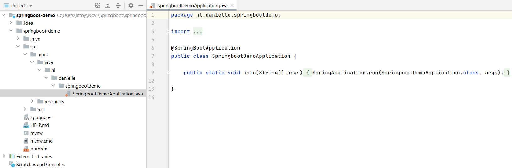
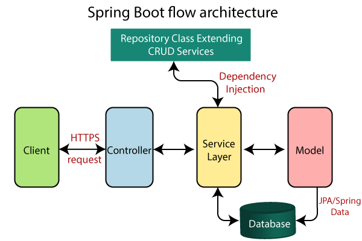
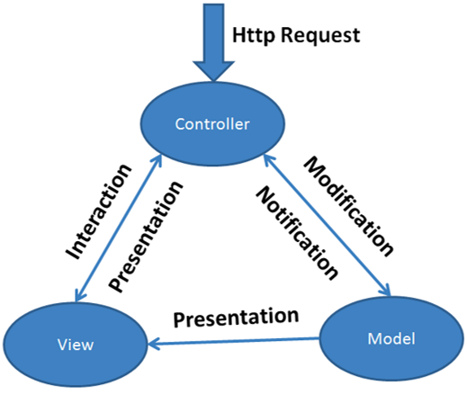
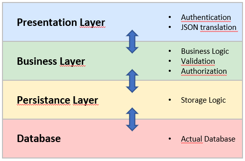

## Springboot

Een van Spring Boot's meest krachtige eigenschappen is zijn auto-configuratie. Deze magie is de sleutel tot de conventie-over-configuratie aanpak die een enorme boost in productiviteit heeft gebracht voor Java ontwikkelaars. 

### Spring initializer

Spring Boot voorziet in een aantal starters die ons toelaten jars toe te voegen in het classpath. Spring Boot ingebouwde starters maken ontwikkeling makkelijker en sneller. Spring Boot Starters zijn de dependency descriptors.

- https://start.spring.io

Spring initializer genereert een basis project in Java met Springboot.

- Project: Maven Project
- Language: Java
- Spring Boot: 2.5.3
- Project Metadata: vul informatie in over jouw project
    - Group: nl.danielle (identifier van de ontwikkelaar)
    - Artifact: springboot-demo (hoe heet je project)
    - Name: springboot-demo (hoe heet je project)
    - Description: Demo project for Spring Boot
    - Package name: maakt het systeem zelf aan
    - Packaging: Jar
    - Java: 8
    
Klik op "Add dependencies" en voeg `Spring Web` toe. 

Met "generate" wordt er een bestand in jouw download map gezet. Unzip het bestand en open het in Intellij.



### Maven

Apache Maven is een softwareprojectbeheer- en -begripstool gebaseerd op het concept van een projectobjectmodel (POM).

De file `pom.xml` geeft allerlei informatie die hij nodig heeft.

```xml
<?xml version="1.0" encoding="UTF-8"?>
<project xmlns="http://maven.apache.org/POM/4.0.0" xmlns:xsi="http://www.w3.org/2001/XMLSchema-instance"
	xsi:schemaLocation="http://maven.apache.org/POM/4.0.0 https://maven.apache.org/xsd/maven-4.0.0.xsd">
	<modelVersion>4.0.0</modelVersion>
	<parent>
		<groupId>org.springframework.boot</groupId>
		<artifactId>spring-boot-starter-parent</artifactId>
		<version>2.5.3</version>
		<relativePath/> <!-- lookup parent from repository -->
	</parent>
	<groupId>nl.danielle</groupId>
	<artifactId>springboot-demo</artifactId>
	<version>0.0.1-SNAPSHOT</version>
	<name>springboot-demo</name>
	<description>Demo project for Spring Boot</description>
	<properties>
		<java.version>1.8</java.version>
	</properties>
	<dependencies>
		<dependency>
			<groupId>org.springframework.boot</groupId>
			<artifactId>spring-boot-starter-web</artifactId>
		</dependency>

		<dependency>
			<groupId>org.springframework.boot</groupId>
			<artifactId>spring-boot-starter-test</artifactId>
			<scope>test</scope>
		</dependency>
	</dependencies>

	<build>
		<plugins>
			<plugin>
				<groupId>org.springframework.boot</groupId>
				<artifactId>spring-boot-maven-plugin</artifactId>
			</plugin>
		</plugins>
	</build>

</project>
```

### Springboot applicatie

Je herkent SpringBoot aan de annotatie @SpringBootApplication

```java
@SpringBootApplication
public class MyApplication {

   public static void main(String[] args) {
      SpringApplication.run(MyApplication.class, args);
   }
}
```

### Springboot Flow architectuur



- https://www.javatpoint.com/spring-boot-architecture

### Springboot helpers

- tomcat: webserver
- hibernate: ORM
- jackson: object ↔ json
- hikari: datasource, db connection object pool

### Web framework

- HTTP Request & Response
- Routing
- ORM – Object Relational Mapping
- Templating

### MVC

- Model
- View
- Controller



- https://www.javatpoint.com/spring-boot-tutorial
- http://zetcode.com/all/#springboot

### Springboot layers



### Controller

- @RestController

- Mapping: @GetMapping, @PutMapping, @PostMapping, @DeleteMapping

```java
@SpringBootApplication
@RestController
public class HelloWorldApplication {

    public static void main(String[] args) {
        SpringApplication.run(HelloWorldApplication.class, args);
    }

    @GetMapping("/")
    public String say_hello() {
        return "Hello world!!!";
    }
}
```

### ResponseEntity

- Automatic translation to JSON (by Jackson)
- HttpStatus

```java
@RestController
public class CustomersController {

    @RequestMapping(value = "/")
    public String hello() {
        return "Hello World";
    }

    @RequestMapping(value = "/message")
    public ResponseEntity<Object> getMessage() {
        return new ResponseEntity<>("REST endpoint: /message", HttpStatus.OK);
    }
}
```

### RequestMapping

- Request method
- URI path
- URI path variables

```java
@RestController
public class CustomersController {
   @RequestMapping(value = "/customers")
    public ResponseEntity<Object> getCustomers() {
        return new ResponseEntity<>(data, HttpStatus.OK);
    }

   @RequestMapping(value = "/customers/{id}")
    public ResponseEntity<Object> getCustomer(@PathVariable("id") int id) {
        return new ResponseEntity<>(data, HttpStatus.OK);
    }
}
```

### Exceptions

- Custom Exceptions => extend RuntimeException
- Throw exceptions
- Exception Controller

```java
public class RecordNotFoundException extends RuntimeException {
    private static final long serialVersionUID = 1L;
}
```

```java
@RestController
@ControllerAdvice
public class ExceptionController {
    @ExceptionHandler(value = RecordNotFoundException.class)
    public ResponseEntity<Object> exception(RecordNotFoundException exception) {
        return ResponseEntity.notFound().build();
    }
}
```