## Springboot

### Spring initializer

Spring Boot voorziet in een aantal starters die ons toelaten jars toe te voegen in het classpath. Spring Boot ingebouwde starters maken ontwikkeling makkelijker en sneller. Spring Boot Starters zijn de dependency descriptors.

- https://start.spring.io

Spring initializer genereert een basis project in Java met Springboot.

- Project: Maven Project
- Language: Java
- Spring Boot: 2.5.3
- Project Metadata: vul informatie in over jouw project
    - Group: nl.danielle (identifier van de ontwikkelaar)
    - Artifact: springboot-demo (hoe heet je project)
    - Name: springboot-demo (hoe heet je project)
    - Description: Demo project for Spring Boot
    - Package name: maakt het systeem zelf aan
    - Packaging: Jar
    - Java: 8
    
Klik op "Add dependencies" en voeg `Spring Web` toe. 

Met "generate" wordt er een bestand in jouw download map gezet. Unzip het bestand en open het in Intellij.


### Maven

Apache Maven is een softwareprojectbeheer- en -begripstool gebaseerd op het concept van een projectobjectmodel (POM).

De file `pom.xml` geeft allerlei informatie die hij nodig heeft.

```xml
<?xml version="1.0" encoding="UTF-8"?>
<project xmlns="http://maven.apache.org/POM/4.0.0" xmlns:xsi="http://www.w3.org/2001/XMLSchema-instance"
	xsi:schemaLocation="http://maven.apache.org/POM/4.0.0 https://maven.apache.org/xsd/maven-4.0.0.xsd">
	<modelVersion>4.0.0</modelVersion>
	<parent>
		<groupId>org.springframework.boot</groupId>
		<artifactId>spring-boot-starter-parent</artifactId>
		<version>2.5.3</version>
		<relativePath/> <!-- lookup parent from repository -->
	</parent>
	<groupId>nl.danielle</groupId>
	<artifactId>springboot-demo</artifactId>
	<version>0.0.1-SNAPSHOT</version>
	<name>springboot-demo</name>
	<description>Demo project for Spring Boot</description>
	<properties>
		<java.version>1.8</java.version>
	</properties>
	<dependencies>
		<dependency>
			<groupId>org.springframework.boot</groupId>
			<artifactId>spring-boot-starter-web</artifactId>
		</dependency>

		<dependency>
			<groupId>org.springframework.boot</groupId>
			<artifactId>spring-boot-starter-test</artifactId>
			<scope>test</scope>
		</dependency>
	</dependencies>

	<build>
		<plugins>
			<plugin>
				<groupId>org.springframework.boot</groupId>
				<artifactId>spring-boot-maven-plugin</artifactId>
			</plugin>
		</plugins>
	</build>

</project>
```

### Springboot applicatie

Je herkent SpringBoot aan de annotatie @SpringBootApplication

```java
package nl.danielle.springbootdemo;

import org.springframework.boot.SpringApplication;
import org.springframework.boot.autoconfigure.SpringBootApplication;

@SpringBootApplication
public class SpringbootDemoApplication {

  public static void main(String[] args) {
    SpringApplication.run(SpringbootDemoApplication.class, args);
  }
}
```

### Controller

We gaan een RestController maken. Deze herken je aan `@RestController`. Door een annotatie toe te voegen maakt hij van de klasse iets anders, in dit geval een Controller. Je hoeft verder geen configuraties te doen.

Een RestController heeft een mapping nodig. We gebruiken hier een `@GetMapping`. Andere mappings zijn: `@PutMapping`, `@PostMapping` en `@DeleteMapping`.

```java
package nl.danielle.springbootdemo;

import org.springframework.boot.SpringApplication;
import org.springframework.boot.autoconfigure.SpringBootApplication;
import org.springframework.web.bind.annotation.GetMapping;
import org.springframework.web.bind.annotation.RestController;

@SpringBootApplication
@RestController
public class SpringbootDemoApplication {

  public static void main(String[] args) {
    SpringApplication.run(SpringbootDemoApplication.class, args);
  }

  @GetMapping(value = "/")
  public String getDemo() {
    return "Hello World!";
  }
}
```

Wat gebeurd er? Als het pad `/` is dan gaat hij de String methode `getDemo` uitvoeren.

Run main applicatie en wanneer je een melding krijgt "Started SpringbootDemoApplication" dan is het goed gegaan.

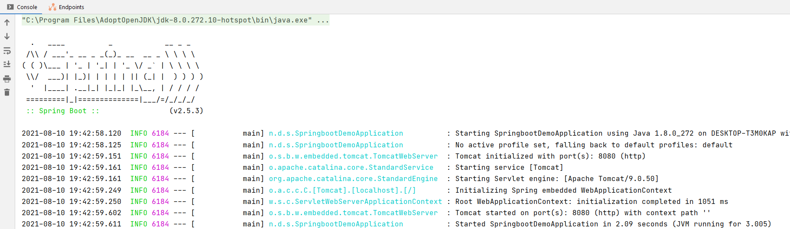

TomCat (de webserver) heeft de applicatie gestart op port 8080: `Tomcat started on port(s): 8080 (http) with context path ''`. Wanneer je in de webbrowser de volgende url zet `http://localhost:8080/` krijg je `Hello World!` in beeld te zien.

Gefeliciteerd, we hebben nu onze eerste API geschreven.

Met stoppen kun je de server stoppen.

We gaan een andere mapping/endpoint maken, genaamd `/danielle`.

```java
package nl.danielle.springbootdemo;

import org.springframework.boot.SpringApplication;
import org.springframework.boot.autoconfigure.SpringBootApplication;
import org.springframework.web.bind.annotation.GetMapping;
import org.springframework.web.bind.annotation.RestController;

@SpringBootApplication
@RestController
public class SpringbootDemoApplication {

    public static void main(String[] args) {
        SpringApplication.run(SpringbootDemoApplication.class, args);
    }

    @GetMapping(value = "/")
    public String getDemo() {
        return "Hello World!";
    }

    @GetMapping(value = "/danielle")
    public String getDanielle() {
        return "Hoi, mijn naam is Danielle";
    }
}
```

Wanneer je main runt en de server opent in de webbrowser met de link `http://localhost:8080/danielle`, krijg je "Hoi, mijn naam is Danielle".

Je kan deze url ook in postman zetten, zo kun je de endpoints (het adres na /) testen.

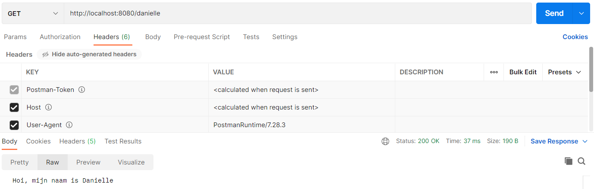

### Project structuur

Het project en de structuur hiervan komt er in de loop van deze cursus als volgt uit te zien.

```
▽ project
	▽ src
		▽ main
			▽ java
				▽ group
					▷ config
					▷ controller
					▷ exception
					▷ model
					▷ repository
					▷ service
					▷ util
					   Application.java
				 ▽ resources
					   application.properties
	 	▽ test
			▽ java
				▽ group
					test classes
	pom.xml
```
	
Alles wat je onder `group` ziet staan zijn verschillende packages. Bijvoorbeeld de `controller` package. Dit is een plek waar de controllers zich vinden.
	
Maak een nieuwe package aan in je project genaamd `controller`.

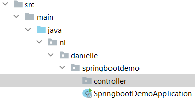

Binnen deze package maak je een nieuwe java class genaamd `BaseController`. Het idee is dat onder deze package de verschillende controllers komen te staan, zoals bijvoorbeeld klanten controller, een user controller etc, dus allerlei toegang tot je applicatie.

_SpringbootDemoApplication.java_

```java
package nl.danielle.springbootdemo;

import org.springframework.boot.SpringApplication;
import org.springframework.boot.autoconfigure.SpringBootApplication;

@SpringBootApplication
public class SpringbootDemoApplication {

  public static void main(String[] args) {
    SpringApplication.run(SpringbootDemoApplication.class, args);
  }
}
```

_BaseController.java_

```java
package nl.danielle.springbootdemo.controller;

import org.springframework.web.bind.annotation.GetMapping;
import org.springframework.web.bind.annotation.RestController;

@RestController
public class BaseController {

    @GetMapping(value = "/")
    public String getDemo() {
        return "Hello World!";
    }

    @GetMapping(value = "/danielle")
    public String getDanielle() {
        return "Hoi, mijn naam is Danielle";
    }
}
```


### ResponseEntity

We maken een nieuwe controller genaamd `ClientsController.java`. Hierin gaan we clients ophalen met behulp van een List.

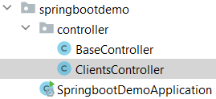

```java
package nl.danielle.springbootdemo.controller;

import org.springframework.http.HttpStatus;
import org.springframework.http.ResponseEntity;
import org.springframework.web.bind.annotation.GetMapping;
import org.springframework.web.bind.annotation.RestController;

import java.util.ArrayList;
import java.util.List;

@RestController
public class ClientsController {

    @GetMapping(value = "/clients")
    public ResponseEntity<Object> getClients() {
        
        List<String> data = new ArrayList<>();
        data.add("Freckle");
        data.add("Frummel");
        data.add("Frizzle");

    return new ResponseEntity<Object>(data, HttpStatus.OK);
    }
}
```

Wanneer je dit runt in Postman krijg je het volgende.


Een ResponseEntity bouwt een status code, header en body: `esponseEntity<Object>(data, HttpStatus.OK)`. De data kom in de body en de statuscode kun je kiezen.

Wat heel magisch is, is dat we een List hadden, dat we de List `data` hebben meegegeven als argument en dat de ResponseEntity daar zelf JSON van heeft gemaakt (met behulp van de helper jackson).

### Instance variabele

Wanneer je meerdere methodes hebt die met dezelfde data werken dan moet je de data niet als een local variabele doen maar als een instance variabele doen binnen de klasse, dus passen we de code aan.

```java
package nl.danielle.springbootdemo.controller;

import org.springframework.http.HttpStatus;
import org.springframework.http.ResponseEntity;
import org.springframework.web.bind.annotation.GetMapping;
import org.springframework.web.bind.annotation.RestController;

import java.util.HashMap;
import java.util.Map;

@RestController
public class ClientsController {

    Map<Long, String> data = new HashMap<>();

    // constructor
    ClientsController() {
        this.data.put(1L, "Freckle");
        this.data.put(2L, "Frummel");
        this.data.put(3L, "Frizzle");
    }

    @GetMapping(value = "/clients")
    public ResponseEntity<Object> getClients() {
        return new ResponseEntity<Object>(this.data.values(), HttpStatus.OK);
    }
}
```

### Ophalen id

We gaan één client ophalen. Dit doe je door `{id}` toe te voegen aan je pad. De id moet opgehaald worden en dat doe je met `@PathVariable("id") Long id`.

```java
package nl.danielle.springbootdemo.controller;

import org.springframework.http.HttpStatus;
import org.springframework.http.ResponseEntity;
import org.springframework.web.bind.annotation.GetMapping;
import org.springframework.web.bind.annotation.PathVariable;
import org.springframework.web.bind.annotation.RestController;

import java.util.HashMap;
import java.util.Map;

@RestController
public class ClientsController {

    Map<Long, String> data = new HashMap<>();

    ClientsController() {
        this.data.put(1L, "Freckle");
        this.data.put(2L, "Frummel");
        this.data.put(3L, "Frizzle");
    }

    @GetMapping(value = "/clients/{id}")
    public ResponseEntity<Object> getClient(@PathVariable("id") Long id) {
        return new ResponseEntity<Object>(this.data.get(id), HttpStatus.OK);
    }
}
```

Wanneer je de URL `http://localhost:8080/clients/2` in Postman zet krijg je het volgende terug.

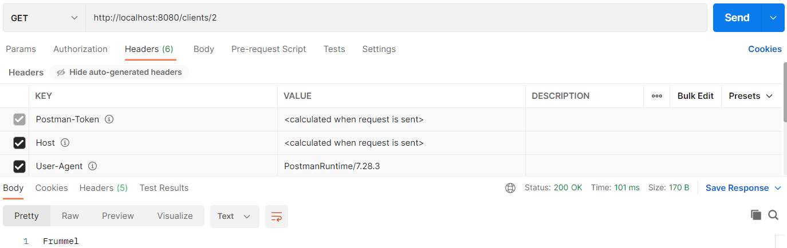

### Verwijderen

In plaats van een GetMapping wordt het DeleteMapping.

Wanneer je `remove gebruikt`, dan hoef je geen `data` terug te geven. We vullen nu in "Record deleted". Bij het verwijderen wordt vaak `HttpStatus.NO_CONTENT` ipv `HttpStatus.OK` gebruikt. 

```java
package nl.danielle.springbootdemo.controller;

import org.springframework.http.HttpStatus;
import org.springframework.http.ResponseEntity;
import org.springframework.web.bind.annotation.GetMapping;
import org.springframework.web.bind.annotation.DeleteMapping;
import org.springframework.web.bind.annotation.PathVariable;
import org.springframework.web.bind.annotation.RestController;

import java.util.HashMap;
import java.util.Map;

@RestController
public class ClientsController {

    Map<Long, String> data = new HashMap<>();

    ClientsController() {
        this.data.put(1L, "Freckle");
        this.data.put(2L, "Frummel");
        this.data.put(3L, "Frizzle");
    }

    @GetMapping(value = "/clients")
    public ResponseEntity<Object> getClients() {
        return new ResponseEntity<Object>(this.data.values(), HttpStatus.OK);
    }

    @DeleteMapping(value = "/clients/{id}")
    public ResponseEntity<Object> deleteClient(@PathVariable("id") Long id) {
        this.data.remove(id);
        return new ResponseEntity<Object>("Record deleted", HttpStatus.NO_CONTENT);
    }
}
```

Run eerst `http://localhost:8080/clients` in Postman.


Dan runnen we `http://localhost:8080/clients/3` in Postman.


Vervolgens runnen we weer `http://localhost:8080/clients` in Postman.

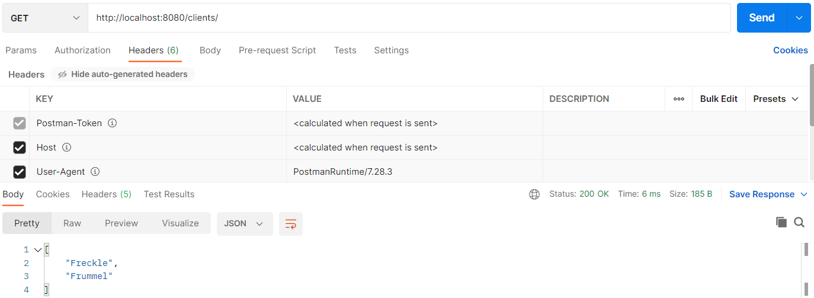

### Post

We gebruiken PostMapping. PostMapping creates een nieuw gegeven.

Een naam meegeven doe je in de Body van Postman. Met `@RequestBody String clientName` zorg je ervoor dat je een naam kan toevoegen.

`long maxID = this.data.keySet().stream().max(Comparator.comparing(Long::valueOf)).get();` betekend het volgende: je zet een Set om in een Stream, van die Stream wil je een max hebben en dat vergelijkt hij door value te doen en uiteindelijk wil je dat hebben met een .get (niet zelf verzinnen: google is your friend). Het resultaat is dat je de hoogste id hebt die in de keys zit, ook wanneer deze uitelkaar gaat lopen (wanneer je gegevens verwijderd zal hij hem niet opvullen maar aanvullen).

```java
package nl.danielle.springbootdemo.controller;

import org.springframework.http.HttpStatus;
import org.springframework.http.ResponseEntity;
import org.springframework.web.bind.annotation.*;

import java.util.Comparator;
import java.util.HashMap;
import java.util.Map;

@RestController
public class ClientsController {

    Map<Long, String> data = new HashMap<>();

    ClientsController() {
        this.data.put(1L, "Freckle");
        this.data.put(2L, "Frummel");
        this.data.put(3L, "Frizzle");
    }

    @GetMapping(value = "/clients")
    public ResponseEntity<Object> getClients() {
        return new ResponseEntity<Object>(this.data.values(), HttpStatus.OK);
    }

    @PostMapping(value = "/clients")
    public ResponseEntity<Object> addClient(@RequestBody String clientName) {
        long maxID = this.data.keySet().stream().max(Comparator.comparing(Long::valueOf)).get();
        this.data.put(maxID + 1, clientName);
        return new ResponseEntity<Object>("Record created", HttpStatus.NO_CONTENT);
    }
}
```

We beginnen met `http://localhost:8080/clients/` in Postman.


Vervolgens gebruiken we `POST` en voegen we Fabian toe aan de body.


Wanneer we weer GET gebruiken met `http://localhost:8080/clients/` krijgen we de toevoeging te zien.


### Put

We gaan de naam updaten met PUT.

```java
package nl.danielle.springbootdemo.controller;

import org.springframework.http.HttpStatus;
import org.springframework.http.ResponseEntity;
import org.springframework.web.bind.annotation.*;

import java.util.Comparator;
import java.util.HashMap;
import java.util.Map;

@RestController
public class ClientsController {

    Map<Long, String> data = new HashMap<>();

    ClientsController() {
        this.data.put(1L, "Freckle");
        this.data.put(2L, "Frummel");
        this.data.put(3L, "Frizzle");
    }

    @GetMapping(value = "/clients")
    public ResponseEntity<Object> getClients() {
        return new ResponseEntity<Object>(this.data.values(), HttpStatus.OK);
    }

    @GetMapping(value = "/clients/{id}")
    public ResponseEntity<Object> getClient(@PathVariable("id") Long id) {
        return new ResponseEntity<Object>(this.data.get(id), HttpStatus.OK);
    }

    @DeleteMapping(value = "/clients/{id}")
    public ResponseEntity<Object> deleteClient(@PathVariable("id") Long id) {
        this.data.remove(id);
        return new ResponseEntity<Object>("Record deleted", HttpStatus.NO_CONTENT);
    }

    @PostMapping(value = "/clients")
    public ResponseEntity<Object> addClient(@RequestBody String clientName) {
        long maxID = this.data.keySet().stream().max(Comparator.comparing(Long::valueOf)).get();
        this.data.put(maxID + 1, clientName);
        return new ResponseEntity<Object>("Record created", HttpStatus.NO_CONTENT);
    }

    @PutMapping(value = "/clients/{id}")
    public ResponseEntity<Object> updateClient(@PathVariable("id") Long id, @RequestBody String clientName) {
        this.data.put(id, clientName);
        return new ResponseEntity<Object>("Record updated", HttpStatus.OK);
    }
}
```

We beginnen met `http://localhost:8080/clients/` in Postman.

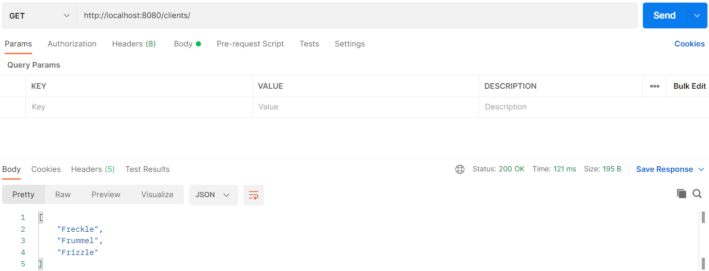

Vervolgens gebruiken we `POST` en voegen we Fabian toe aan de body.


Wanneer we weer PUT gebruiken met `http://localhost:8080/clients/` kunnen we Fabian aanpassen wat post 4 is.

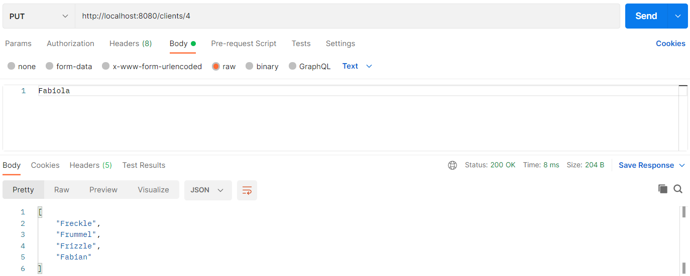

We eindigen weer met GET en de url `http://localhost:8080/clients/` om te zien of Fabian veranderd is in Fabiola.

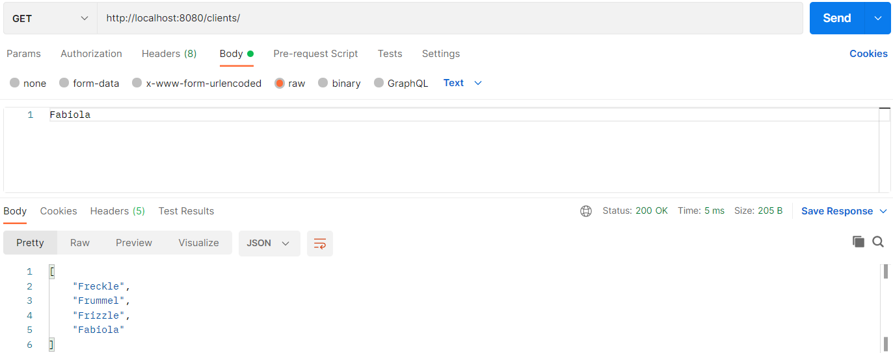


### RequestMapping

- Request method
- URI path
- URI path variables

```java
@RestController
public class CustomersController {
   @RequestMapping(value = "/customers")
    public ResponseEntity<Object> getCustomers() {
        return new ResponseEntity<>(data, HttpStatus.OK);
    }

   @RequestMapping(value = "/customers/{id}")
    public ResponseEntity<Object> getCustomer(@PathVariable("id") int id) {
        return new ResponseEntity<>(data, HttpStatus.OK);
    }
}
```

### Exceptions

- Custom Exceptions => extend RuntimeException
- Throw exceptions
- Exception Controller

```java
public class RecordNotFoundException extends RuntimeException {
    private static final long serialVersionUID = 1L;
}
```

```java
@RestController
@ControllerAdvice
public class ExceptionController {
    @ExceptionHandler(value = RecordNotFoundException.class)
    public ResponseEntity<Object> exception(RecordNotFoundException exception) {
        return ResponseEntity.notFound().build();
    }
}
```


### Springboot Flow architectuur

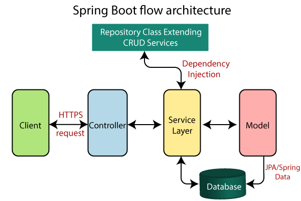

- https://www.javatpoint.com/spring-boot-architecture

### Springboot helpers

- tomcat (webserver): zorgt ervoor dat hij op localhost 8080 gaat reageren
- hibernate: ORM
- jackson (object ↔ json): kan objecten vertalen in JSON
- hikari: datasource, db connection object pool

### Web framework

- HTTP Request & Response
- Routing
- ORM – Object Relational Mapping
- Templating

### MVC

- Model
- View
- Controller

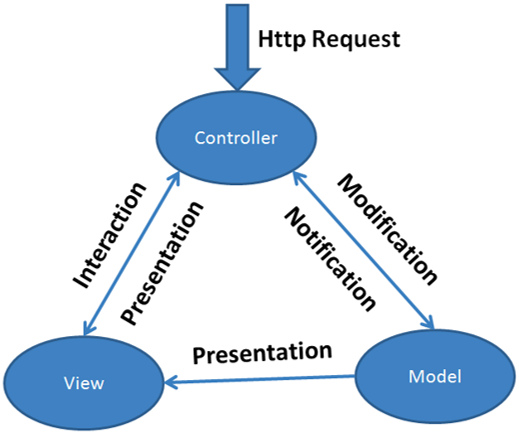

- https://www.javatpoint.com/spring-boot-tutorial
- http://zetcode.com/all/#springboot

### Springboot layers

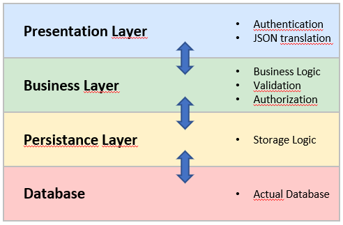

