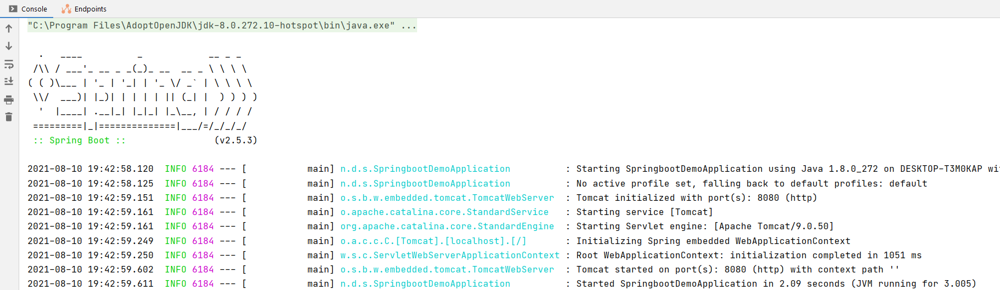
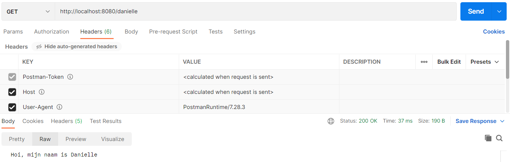
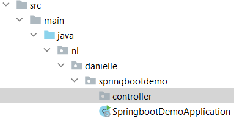
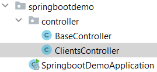

## Springboot

### Spring initializer

Spring Boot voorziet in een aantal starters die ons toelaten jars toe te voegen in het classpath. Spring Boot ingebouwde starters maken ontwikkeling makkelijker en sneller. Spring Boot Starters zijn de dependency descriptors.

- https://start.spring.io

Spring initializer genereert een basis project in Java met Springboot.

- Project: Maven Project
- Language: Java
- Spring Boot: 2.5.3
- Project Metadata: vul informatie in over jouw project
    - Group: nl.danielle (identifier van de ontwikkelaar)
    - Artifact: springboot-demo (hoe heet je project)
    - Name: springboot-demo (hoe heet je project)
    - Description: Demo project for Spring Boot
    - Package name: maakt het systeem zelf aan
    - Packaging: Jar
    - Java: 8
    
Klik op "Add dependencies" en voeg `Spring Web` toe. 

Met "generate" wordt er een bestand in jouw download map gezet. Unzip het bestand en open het in Intellij.


### Maven

Apache Maven is een softwareprojectbeheer- en -begripstool gebaseerd op het concept van een projectobjectmodel (POM).

De file `pom.xml` geeft allerlei informatie die hij nodig heeft.

```xml
<?xml version="1.0" encoding="UTF-8"?>
<project xmlns="http://maven.apache.org/POM/4.0.0" xmlns:xsi="http://www.w3.org/2001/XMLSchema-instance"
	xsi:schemaLocation="http://maven.apache.org/POM/4.0.0 https://maven.apache.org/xsd/maven-4.0.0.xsd">
	<modelVersion>4.0.0</modelVersion>
	<parent>
		<groupId>org.springframework.boot</groupId>
		<artifactId>spring-boot-starter-parent</artifactId>
		<version>2.5.3</version>
		<relativePath/> <!-- lookup parent from repository -->
	</parent>
	<groupId>nl.danielle</groupId>
	<artifactId>springboot-demo</artifactId>
	<version>0.0.1-SNAPSHOT</version>
	<name>springboot-demo</name>
	<description>Demo project for Spring Boot</description>
	<properties>
		<java.version>1.8</java.version>
	</properties>
	<dependencies>
		<dependency>
			<groupId>org.springframework.boot</groupId>
			<artifactId>spring-boot-starter-web</artifactId>
		</dependency>

		<dependency>
			<groupId>org.springframework.boot</groupId>
			<artifactId>spring-boot-starter-test</artifactId>
			<scope>test</scope>
		</dependency>
	</dependencies>

	<build>
		<plugins>
			<plugin>
				<groupId>org.springframework.boot</groupId>
				<artifactId>spring-boot-maven-plugin</artifactId>
			</plugin>
		</plugins>
	</build>

</project>
```

### Springboot applicatie

Je herkent SpringBoot aan de annotatie @SpringBootApplication

```java
package nl.danielle.springbootdemo;

import org.springframework.boot.SpringApplication;
import org.springframework.boot.autoconfigure.SpringBootApplication;

@SpringBootApplication
public class SpringbootDemoApplication {

  public static void main(String[] args) {
    SpringApplication.run(SpringbootDemoApplication.class, args);
  }
}
```

### Controller

We gaan een RestController maken. Deze herken je aan `@RestController`. Door een annotatie toe te voegen maakt hij van de klasse iets anders, in dit geval een Controller. Je hoeft verder geen configuraties te doen.

Een RestController heeft een mapping nodig. We gebruiken hier een `@GetMapping`. Andere mappings zijn: `@PutMapping`, `@PostMapping` en `@DeleteMapping`.

```java
package nl.danielle.springbootdemo;

import org.springframework.boot.SpringApplication;
import org.springframework.boot.autoconfigure.SpringBootApplication;
import org.springframework.web.bind.annotation.GetMapping;
import org.springframework.web.bind.annotation.RestController;

@SpringBootApplication
@RestController
public class SpringbootDemoApplication {

  public static void main(String[] args) {
    SpringApplication.run(SpringbootDemoApplication.class, args);
  }

  @GetMapping(value = "/")
  public String getDemo() {
    return "Hello World!";
  }
}
```

Wat gebeurd er? Als het pad `/` is dan gaat hij de String methode `getDemo` uitvoeren.

Run main applicatie en wanneer je een melding krijgt "Started SpringbootDemoApplication" dan is het goed gegaan.



TomCat (de webserver) heeft de applicatie gestart op port 8080: `Tomcat started on port(s): 8080 (http) with context path ''`. Wanneer je in de webbrowser de volgende url zet `http://localhost:8080/` krijg je `Hello World!` in beeld te zien.

Gefeliciteerd, we hebben nu onze eerste API geschreven.

Met stoppen kun je de server stoppen.

We gaan een andere mapping/endpoint maken, genaamd `/danielle`.

```java
package nl.danielle.springbootdemo;

import org.springframework.boot.SpringApplication;
import org.springframework.boot.autoconfigure.SpringBootApplication;
import org.springframework.web.bind.annotation.GetMapping;
import org.springframework.web.bind.annotation.RestController;

@SpringBootApplication
@RestController
public class SpringbootDemoApplication {

    public static void main(String[] args) {
        SpringApplication.run(SpringbootDemoApplication.class, args);
    }

    @GetMapping(value = "/")
    public String getDemo() {
        return "Hello World!";
    }

    @GetMapping(value = "/danielle")
    public String getDanielle() {
        return "Hoi, mijn naam is Danielle";
    }
}
```

Wanneer je main runt en de server opent in de webbrowser met de link `http://localhost:8080/danielle`, krijg je "Hoi, mijn naam is Danielle".

Je kan deze url ook in postman zetten, zo kun je de endpoints (het adres na /) testen.



### Project structuur

Het project en de structuur hiervan komt er in de loop van deze cursus als volgt uit te zien.

```
▽ project
	▽ src
		▽ main
			▽ java
				▽ group
					▷ config
					▷ controller
					▷ exception
					▷ model
					▷ repository
					▷ service
					▷ util
					   Application.java
				 ▽ resources
					   application.properties
	 	▽ test
			▽ java
				▽ group
					test classes
	pom.xml
```
	
Alles wat je onder `group` ziet staan zijn verschillende packages. Bijvoorbeeld de `controller` package. Dit is een plek waar de controllers zich vinden.
	
Maak een nieuwe package aan in je project genaamd `controller`.



Binnen deze package maak je een nieuwe java class genaamd `BaseController`. Het idee is dat onder deze package de verschillende controllers komen te staan, zoals bijvoorbeeld klanten controller, een user controller etc, dus allerlei toegang tot je applicatie.

_SpringbootDemoApplication.java_

```java
package nl.danielle.springbootdemo;

import org.springframework.boot.SpringApplication;
import org.springframework.boot.autoconfigure.SpringBootApplication;

@SpringBootApplication
public class SpringbootDemoApplication {

  public static void main(String[] args) {
    SpringApplication.run(SpringbootDemoApplication.class, args);
  }
}
```

_BaseController.java_

```java
package nl.danielle.springbootdemo.controller;

import org.springframework.web.bind.annotation.GetMapping;
import org.springframework.web.bind.annotation.RestController;

@RestController
public class BaseController {

    @GetMapping(value = "/")
    public String getDemo() {
        return "Hello World!";
    }

    @GetMapping(value = "/danielle")
    public String getDanielle() {
        return "Hoi, mijn naam is Danielle";
    }
}
```

We maken een nieuwe controller genaamd `ClientsController.java`. Hierin gaan we clients ophalen met behulp van een List.



```java
package nl.danielle.springbootdemo.controller;

import org.springframework.http.HttpStatus;
import org.springframework.http.ResponseEntity;
import org.springframework.web.bind.annotation.GetMapping;
import org.springframework.web.bind.annotation.RestController;

import java.util.ArrayList;
import java.util.List;

@RestController
public class ClientsController {

    @GetMapping(value = "/clients")
    public ResponseEntity<Object> getClients() {
        
        List<String> data = new ArrayList<>();
        data.add("Freckle");
        data.add("Frummel");
        data.add("Frizzle");

    return new ResponseEntity<Object>(data, HttpStatus.OK);
    }
}
```

Wanneer je dit runt in Postman krijg je het volgende.


### ResponseEntity

- Automatic translation to JSON (by Jackson)
- HttpStatus

```java
@RestController
public class CustomersController {

    @RequestMapping(value = "/")
    public String hello() {
        return "Hello World";
    }

    @RequestMapping(value = "/message")
    public ResponseEntity<Object> getMessage() {
        return new ResponseEntity<>("REST endpoint: /message", HttpStatus.OK);
    }
}
```

### RequestMapping

- Request method
- URI path
- URI path variables

```java
@RestController
public class CustomersController {
   @RequestMapping(value = "/customers")
    public ResponseEntity<Object> getCustomers() {
        return new ResponseEntity<>(data, HttpStatus.OK);
    }

   @RequestMapping(value = "/customers/{id}")
    public ResponseEntity<Object> getCustomer(@PathVariable("id") int id) {
        return new ResponseEntity<>(data, HttpStatus.OK);
    }
}
```

### Exceptions

- Custom Exceptions => extend RuntimeException
- Throw exceptions
- Exception Controller

```java
public class RecordNotFoundException extends RuntimeException {
    private static final long serialVersionUID = 1L;
}
```

```java
@RestController
@ControllerAdvice
public class ExceptionController {
    @ExceptionHandler(value = RecordNotFoundException.class)
    public ResponseEntity<Object> exception(RecordNotFoundException exception) {
        return ResponseEntity.notFound().build();
    }
}
```


### Springboot Flow architectuur


- https://www.javatpoint.com/spring-boot-architecture

### Springboot helpers

- tomcat: webserver
- hibernate: ORM
- jackson: object ↔ json
- hikari: datasource, db connection object pool

### Web framework

- HTTP Request & Response
- Routing
- ORM – Object Relational Mapping
- Templating

### MVC

- Model
- View
- Controller


- https://www.javatpoint.com/spring-boot-tutorial
- http://zetcode.com/all/#springboot

### Springboot layers


