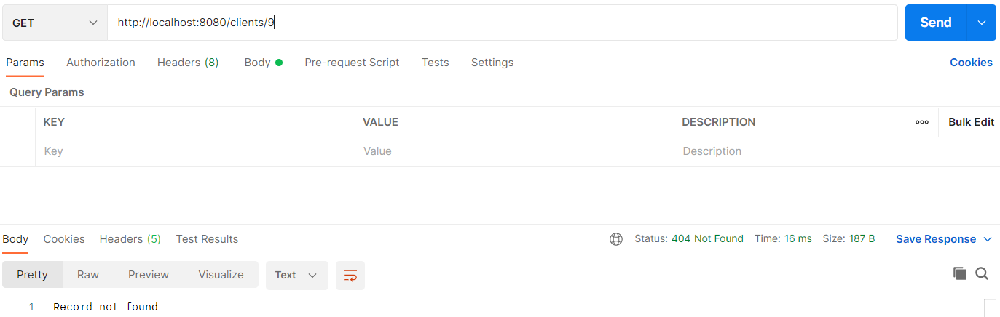

## Spring Boot

### Spring initializr

Spring initializr genereert een basis project in Java met Spring Boot.

Ga naar de website <a href="https://start.spring.io" target="_blank">spring.io</a>. De volgende gegevens vul je in voor het eerste Spring Boot project.

- Project: vink aan `Maven Project`
- Language: vink aan `Java`
- Spring Boot: vink aan `2.5.4` (laatste versie)
- Project Metadata: vul informatie in over jouw project
    - Group: `nl.danielle` (identifier van de ontwikkelaar)
    - Artifact: `demo_springboot` (hoe heet je project)
    - Name: `demo_springboot` (hoe heet je project)
    - Description: `Demo project for Spring Boot`
    - Package name: maakt het systeem zelf aan
    - Packaging: vink aan `Jar`
    - Java: vink aan `11`
    
Klik op "add dependencies" en voeg `Spring Web` toe. 

Met "generate" wordt er een bestand in jouw download map gezet. Unzip het bestand en open het in Intellij.

Klik vervolgens rechtsonder in IntelliJ op `Load`.


Ga naar File > Project Structure en zet `Project SDK` op 11. Klik op apply.

### Spring Boot errors


Klik op "Trust project..." in de gele balk.

Wanneer de error niet weg is klik je op File > Invalidate Caches > Invalidate and Restart.

### Maven

Apache Maven is een softwareprojectbeheer- en -begripstool gebaseerd op het concept van een projectobjectmodel (POM).

De file `pom.xml` geeft allerlei informatie die het project nodig heeft.

```xml
<?xml version="1.0" encoding="UTF-8"?>
<project xmlns="http://maven.apache.org/POM/4.0.0" xmlns:xsi="http://www.w3.org/2001/XMLSchema-instance"
         xsi:schemaLocation="http://maven.apache.org/POM/4.0.0 https://maven.apache.org/xsd/maven-4.0.0.xsd">
  <modelVersion>4.0.0</modelVersion>
  <parent>
    <groupId>org.springframework.boot</groupId>
    <artifactId>spring-boot-starter-parent</artifactId>
    <version>2.5.4</version>
    <relativePath/> <!-- lookup parent from repository -->
  </parent>
  <groupId>com.danielle</groupId>
  <artifactId>demo_springboot</artifactId>
  <version>0.0.1-SNAPSHOT</version>
  <name>demo_springboot</name>
  <description>Demo project for Spring Boot</description>
  <properties>
    <java.version>11</java.version>
  </properties>
  <dependencies>
    <dependency>
      <groupId>org.springframework.boot</groupId>
      <artifactId>spring-boot-starter-web</artifactId>
    </dependency>

    <dependency>
      <groupId>org.springframework.boot</groupId>
      <artifactId>spring-boot-starter-test</artifactId>
      <scope>test</scope>
    </dependency>
  </dependencies>

  <build>
    <plugins>
      <plugin>
        <groupId>org.springframework.boot</groupId>
        <artifactId>spring-boot-maven-plugin</artifactId>
      </plugin>
    </plugins>
  </build>

</project>
```

### Annotatie @SpringBootApplication

Je herkent Spring Boot aan de annotatie `@SpringBootApplication`.

```java
package nl.danielle.springbootdemo;

import org.springframework.boot.SpringApplication;
import org.springframework.boot.autoconfigure.SpringBootApplication;

@SpringBootApplication
public class SpringbootDemoApplication {

  public static void main(String[] args) {
    SpringApplication.run(SpringbootDemoApplication.class, args);
  }
}
```

### Andere port kiezen

Standaard kiest het systeem port `8080` om mee te werken. Wanneer deze port niet beschikbaar is kun je aangeven om te werken met een andere port.

De application.properties is een bestand waarin je allerlei eigenschappen van je project kwijt kunt. Bijvoorbeeld de settings, verbinding naar de database en een andere server port. Ga naar resources > application.properties en voer de volgende code in.

    server.port=8081

### GetMapping

We gaan een RestController maken in `SpringbootDemoApplication.java`. Deze herken je aan `@RestController`. Door een annotatie toe te voegen maakt hij van de klasse iets anders, in dit geval een `Controller`. Je hoeft verder geen configuraties te doen, dit doet Spring Boot voor jou.

Een RestController heeft een mapping nodig. We gebruiken hier een `@GetMapping`. Andere mappings zijn: `@PutMapping`, `@PostMapping` en `@DeleteMapping`.

```java
package nl.danielle.springbootdemo;

import org.springframework.boot.SpringApplication;
import org.springframework.boot.autoconfigure.SpringBootApplication;
import org.springframework.web.bind.annotation.GetMapping;
import org.springframework.web.bind.annotation.RestController;

@SpringBootApplication
@RestController
public class SpringbootDemoApplication {

  public static void main(String[] args) {
    SpringApplication.run(SpringbootDemoApplication.class, args);
  }

  @GetMapping(value = "/")
  public String getDemo() {
    return "Hello World!";
  }
}
```

Als het path `/` is dan laat hij de tekst "Hello World!" zien. Hij voert dus de String methode `getDemo` uit.

Run de applicatie en wanneer je een melding krijgt `Started SpringbootDemoApplication` dan is het goed gegaan.


TomCat (de webserver) heeft de applicatie gestart op port 8080: `Tomcat started on port(s): 8080 (http) with context path ''`. Wanneer je in de webbrowser de volgende url zet `http://localhost:8080/` krijg je `Hello World!` in beeld te zien.

Gefeliciteerd, we hebben nu onze eerste API geschreven.

Met stoppen kun je de server stoppen.

We gaan een andere mapping/endpoint maken, genaamd `/danielle`.

```java
package nl.danielle.springbootdemo;

import org.springframework.boot.SpringApplication;
import org.springframework.boot.autoconfigure.SpringBootApplication;
import org.springframework.web.bind.annotation.GetMapping;
import org.springframework.web.bind.annotation.RestController;

@SpringBootApplication
@RestController
public class SpringbootDemoApplication {

    public static void main(String[] args) {
        SpringApplication.run(SpringbootDemoApplication.class, args);
    }

    @GetMapping(value = "/")
    public String getDemo() {
        return "Hello World!";
    }

    @GetMapping(value = "/danielle")
    public String getDanielle() {
        return "Hoi, mijn naam is Danielle";
    }
}
```

Wanneer je de applicatie runt en de server opent in de webbrowser met de link `http://localhost:8080/danielle`, krijg je `Hoi, mijn naam is Danielle`.

Je kan deze url ook in Postman zetten. Op dez manier kun je de endpoints (het adres na /) testen.


### Project structuur

Het project en de structuur komt in de loop van deze cursus als volgt eruit te zien.

```
▽ project
	▽ src
		▽ main
			▽ java
				▽ group
					▷ config
					▷ controller
					▷ exception
					▷ model
					▷ repository
					▷ service
					▷ util
					   Application.java
				 ▽ resources
					   application.properties
	 	▽ test
			▽ java
				▽ group
					test classes
	pom.xml
```
	
Alles wat je onder `group` ziet staan zijn verschillende packages. Bijvoorbeeld de `controller` package. Dit is een plek waar de controllers zich vinden.

### BaseController
	
Maak een nieuwe package aan in je project genaamd `controller`.


Binnen deze package maak je een nieuwe controller genaamd `BaseController.java`. Het idee is dat onder deze package de verschillende controllers komen te staan, zoals bijvoorbeeld klanten controller, een user controller etc. Dus allerlei toegang tot je applicatie.

_SpringbootDemoApplication.java_

```java
package nl.danielle.springbootdemo;

import org.springframework.boot.SpringApplication;
import org.springframework.boot.autoconfigure.SpringBootApplication;

@SpringBootApplication
public class SpringbootDemoApplication {

  public static void main(String[] args) {
    SpringApplication.run(SpringbootDemoApplication.class, args);
  }
}
```

_BaseController.java_

```java
package nl.danielle.springbootdemo.controller;

import org.springframework.web.bind.annotation.GetMapping;
import org.springframework.web.bind.annotation.RestController;

@RestController
public class BaseController {

    @GetMapping(value = "/")
    public String getDemo() {
        return "Hello World!";
    }

    @GetMapping(value = "/danielle")
    public String getDanielle() {
        return "Hoi, mijn naam is Danielle";
    }
}
```

### ClientsController

We maken een nieuwe controller genaamd `ClientsController.java`. Hierin gaan we clients ophalen met behulp van een List.


```java
package nl.danielle.springbootdemo.controller;

import org.springframework.http.HttpStatus;
import org.springframework.http.ResponseEntity;
import org.springframework.web.bind.annotation.GetMapping;
import org.springframework.web.bind.annotation.RestController;

import java.util.ArrayList;
import java.util.List;

@RestController
public class ClientsController {

    @GetMapping(value = "/clients")
    public ResponseEntity<Object> getClients() {
        
        List<String> data = new ArrayList<>();
        data.add("Freckle");
        data.add("Frummel");
        data.add("Frizzle");

    return new ResponseEntity<Object>(data, HttpStatus.OK);
    }
}
```

Wanneer je dit runt in Postman krijg je het volgende.


Een `ResponseEntity` vertegenwoordigt het volledige HTTP response: status code, headers, en body: `ResponseEntity<Object>(data, HttpStatus.OK)`. De data kom in de body en de statuscode kun je kiezen.

Wat heel magisch is, is dat we een List hebben, dat we de List `data` hebben meegegeven als argument en dat de ResponseEntity daar zelf JSON van heeft gemaakt (met behulp van de helper jackson).

### Instance variabele

Wanneer je meerdere methodes hebt die met dezelfde data willen gaan werken dan moet je de data niet als een local variabele doen maar als een instance variabele, dus passen we de code aan.

```java
package nl.danielle.springbootdemo.controller;

import org.springframework.http.HttpStatus;
import org.springframework.http.ResponseEntity;
import org.springframework.web.bind.annotation.GetMapping;
import org.springframework.web.bind.annotation.RestController;

import java.util.HashMap;
import java.util.Map;

@RestController
public class ClientsController {

    Map<Long, String> data = new HashMap<>();

    // constructor
    ClientsController() {
        this.data.put(1L, "Freckle");
        this.data.put(2L, "Frummel");
        this.data.put(3L, "Frizzle");
    }

    @GetMapping(value = "/clients")
    public ResponseEntity<Object> getClients() {
        return new ResponseEntity<Object>(this.data.values(), HttpStatus.OK);
    }
}
```

### GetMapping: één id ophalen

We gaan één client ophalen. Dit doe je door `{id}` toe te voegen aan je path. De id moet opgehaald worden en dat doe je met `@PathVariable("id") Long id`.

```java
package nl.danielle.springbootdemo.controller;

import org.springframework.http.HttpStatus;
import org.springframework.http.ResponseEntity;
import org.springframework.web.bind.annotation.GetMapping;
import org.springframework.web.bind.annotation.PathVariable;
import org.springframework.web.bind.annotation.RestController;

import java.util.HashMap;
import java.util.Map;

@RestController
public class ClientsController {

    Map<Long, String> data = new HashMap<>();

    ClientsController() {
        this.data.put(1L, "Freckle");
        this.data.put(2L, "Frummel");
        this.data.put(3L, "Frizzle");
    }

    @GetMapping(value = "/clients/{id}")
    public ResponseEntity<Object> getClient(@PathVariable("id") Long id) {
        return new ResponseEntity<Object>(this.data.get(id), HttpStatus.OK);
    }
}
```

Wanneer je de URL `http://localhost:8080/clients/2` in Postman zet krijg je het volgende terug.


### DeleteMapping

Wanneer je `remove gebruikt`, dan hoef je geen `data` terug te geven. We vullen nu in "Record deleted". Bij het verwijderen wordt vaak `HttpStatus.NO_CONTENT` i.p.v. `HttpStatus.OK` gebruikt. 

```java
package nl.danielle.springbootdemo.controller;

import org.springframework.http.HttpStatus;
import org.springframework.http.ResponseEntity;
import org.springframework.web.bind.annotation.GetMapping;
import org.springframework.web.bind.annotation.DeleteMapping;
import org.springframework.web.bind.annotation.PathVariable;
import org.springframework.web.bind.annotation.RestController;

import java.util.HashMap;
import java.util.Map;

@RestController
public class ClientsController {

    Map<Long, String> data = new HashMap<>();

    ClientsController() {
        this.data.put(1L, "Freckle");
        this.data.put(2L, "Frummel");
        this.data.put(3L, "Frizzle");
    }

    @GetMapping(value = "/clients")
    public ResponseEntity<Object> getClients() {
        return new ResponseEntity<Object>(this.data.values(), HttpStatus.OK);
    }

    @DeleteMapping(value = "/clients/{id}")
    public ResponseEntity<Object> deleteClient(@PathVariable("id") Long id) {
        this.data.remove(id);
        return new ResponseEntity<Object>("Record deleted", HttpStatus.NO_CONTENT);
    }
}
```

Run eerst `http://localhost:8080/clients` in Postman met `GET`.


Dan runnen we `http://localhost:8080/clients/3` in Postman met `DELETE`.


Vervolgens runnen we weer `http://localhost:8080/clients` in Postman met `GET`.


### PostMapping

PostMapping creëert een nieuw gegeven.

Een naam meegeven doe je in de Body van Postman. Met `@RequestBody String clientName` zorg je ervoor dat je een naam kan toevoegen.

`long maxID = this.data.keySet().stream().max(Comparator.comparing(Long::valueOf)).get();` betekend het volgende: je zet een Set om in een Stream, van die Stream wil je een max hebben en dat vergelijkt hij door value te doen en uiteindelijk wil je dat hebben met een .get (niet zelf verzinnen: google is your friend). Het resultaat is dat je de hoogste id hebt die in de keys zit, ook wanneer deze uitelkaar gaat lopen (wanneer je gegevens verwijderd, zal hij hem niet opvullen maar aanvullen).

```java
package nl.danielle.springbootdemo.controller;

import org.springframework.http.HttpStatus;
import org.springframework.http.ResponseEntity;
import org.springframework.web.bind.annotation.*;

import java.util.Comparator;
import java.util.HashMap;
import java.util.Map;

@RestController
public class ClientsController {

    Map<Long, String> data = new HashMap<>();

    ClientsController() {
        this.data.put(1L, "Freckle");
        this.data.put(2L, "Frummel");
        this.data.put(3L, "Frizzle");
    }

    @GetMapping(value = "/clients")
    public ResponseEntity<Object> getClients() {
        return new ResponseEntity<Object>(this.data.values(), HttpStatus.OK);
    }

    @PostMapping(value = "/clients")
    public ResponseEntity<Object> addClient(@RequestBody String clientName) {
        long maxID = this.data.keySet().stream().max(Comparator.comparing(Long::valueOf)).get();
        this.data.put(maxID + 1, clientName);
        return new ResponseEntity<Object>("Record created", HttpStatus.NO_CONTENT);
    }
}
```

We beginnen met `http://localhost:8080/clients/` en `GET` in Postman.


Vervolgens gebruiken we `POST` en voegen we Fabian toe aan de body.


Wanneer we weer `GET` gebruiken met `http://localhost:8080/clients/` krijgen we de toevoeging te zien.


### PutMapping

We gaan de naam updaten met PUT.

```java
package nl.danielle.springbootdemo.controller;

import org.springframework.http.HttpStatus;
import org.springframework.http.ResponseEntity;
import org.springframework.web.bind.annotation.*;

import java.util.Comparator;
import java.util.HashMap;
import java.util.Map;

@RestController
public class ClientsController {

    Map<Long, String> data = new HashMap<>();

    ClientsController() {
        this.data.put(1L, "Freckle");
        this.data.put(2L, "Frummel");
        this.data.put(3L, "Frizzle");
    }

    @GetMapping(value = "/clients")
    public ResponseEntity<Object> getClients() {
        return new ResponseEntity<Object>(this.data.values(), HttpStatus.OK);
    }

    @GetMapping(value = "/clients/{id}")
    public ResponseEntity<Object> getClient(@PathVariable("id") Long id) {
        return new ResponseEntity<Object>(this.data.get(id), HttpStatus.OK);
    }

    @DeleteMapping(value = "/clients/{id}")
    public ResponseEntity<Object> deleteClient(@PathVariable("id") Long id) {
        this.data.remove(id);
        return new ResponseEntity<Object>("Record deleted", HttpStatus.NO_CONTENT);
    }

    @PostMapping(value = "/clients")
    public ResponseEntity<Object> addClient(@RequestBody String clientName) {
        long maxID = this.data.keySet().stream().max(Comparator.comparing(Long::valueOf)).get();
        this.data.put(maxID + 1, clientName);
        return new ResponseEntity<Object>("Record created", HttpStatus.NO_CONTENT);
    }

    @PutMapping(value = "/clients/{id}")
    public ResponseEntity<Object> updateClient(@PathVariable("id") Long id, @RequestBody String clientName) {
        this.data.put(id, clientName);
        return new ResponseEntity<Object>("Record updated", HttpStatus.OK);
    }
}
```

We beginnen met `http://localhost:8080/clients/` en `GET` in Postman.


Vervolgens gebruiken we `POST` en voegen we Fabian toe aan de body.


Wanneer we weer `PUT` gebruiken met `http://localhost:8080/clients/` kunnen we Fabian aanpassen wat post 4 is.


We eindigen weer met `GET` en de url `http://localhost:8080/clients/` om te zien of Fabian veranderd is in Fabiola.


### Blauwdruk controllers

```java
package nl.danielle.springbootdemo.controller;

import org.springframework.http.HttpStatus;
import org.springframework.http.ResponseEntity;
import org.springframework.web.bind.annotation.*;

import java.util.Comparator;
import java.util.HashMap;
import java.util.Map;

@RestController
public class ClientsController {

    Map<Long, String> data = new HashMap<>();

    ClientsController() {
        this.data.put(1L, "Freckle");
        this.data.put(2L, "Frummel");
        this.data.put(3L, "Frizzle");
    }

    @GetMapping(value = "/clients")
    public ResponseEntity<Object> getClients() {
        return new ResponseEntity<Object>(this.data.values(), HttpStatus.OK);
    }

    @GetMapping(value = "/clients/{id}")
    public ResponseEntity<Object> getClient(@PathVariable("id") Long id) {
        return new ResponseEntity<Object>(this.data.get(id), HttpStatus.OK);
    }

    @DeleteMapping(value = "/clients/{id}")
    public ResponseEntity<Object> deleteClient(@PathVariable("id") Long id) {
        this.data.remove(id);
        return new ResponseEntity<Object>("Record deleted", HttpStatus.NO_CONTENT);
    }

    @PostMapping(value = "/clients")
    public ResponseEntity<Object> addClient(@RequestBody String clientName) {
        long maxID = this.data.keySet().stream().max(Comparator.comparing(Long::valueOf)).get();
        this.data.put(maxID + 1, clientName);
        return new ResponseEntity<Object>("Record created", HttpStatus.NO_CONTENT);
    }

    @PutMapping(value = "/clients/{id}")
    public ResponseEntity<Object> updateClient(@PathVariable("id") Long id, @RequestBody String clientName) {
        this.data.put(id, clientName);
        return new ResponseEntity<Object>("Record updated", HttpStatus.OK);
    }
}
```

Dit is een soort blauwdruk/template van alle controllers die je gaat maken. Wanneer je een nieuwe controller gaat maken dan geef je andere endpoints en andere methode namen.

### Error Handler

Wanneer je `http://localhost:8080/clients/9` opvraagt, dan krijg je geen antwoord, want deze bestaat niet. De statuscode staat echter op `200 OK`, maar dit klopt niet, er moet een andere status code komen namelijk `404 NOT FOUND`.

We gaan checken of nummer 9 bestaat. Dit kun je controleren met een if-statement die checked of de id die je opvraagt er wel is `if (this.data.keySet().contains(id));`. Zo ja, dan geef je status 200, zo nee dan krijgt hij status 404.

```java
package nl.danielle.springbootdemo.controller;

import org.springframework.http.HttpStatus;
import org.springframework.http.ResponseEntity;
import org.springframework.web.bind.annotation.*;

import java.util.HashMap;
import java.util.Map;

@RestController
public class ClientsController {

    Map<Long, String> data = new HashMap<>();

    ClientsController() {
        this.data.put(1L, "Freckle");
        this.data.put(2L, "Frummel");
        this.data.put(3L, "Frizzle");
    }    
    
    @GetMapping(value = "/clients/{id}")
    public ResponseEntity<Object> getClient(@PathVariable("id") Long id) {
        if (this.data.keySet().contains(id)) {
            return new ResponseEntity<Object>(this.data.get(id), HttpStatus.OK);
        } else {
            return new ResponseEntity<Object>("Record not found", HttpStatus.NOT_FOUND);
        }
    }
}
```

Wanneer je in Postman `http://localhost:8080/clients/9` ophaalt krijg je "Record not found" en status 404.



### Exception Handler

Hoe wij de `ClientsController` hebben beschreven met een if en else statement is niet netjes. De controller klasse zou alleen de mapping met path moeten en hebben en dit doorspelen naar een methode die het afhandelt. 

We gaan werken met exceptions. We hebben een nieuwe controller nodig: `ExceptionController`. Wat dit ding doet, is wanneer er een fout/exception is gegenereerd zal de exception door de controller af worden gevangen.

_ExceptionController.java_

```java
package nl.danielle.springbootdemo.controller;

import nl.danielle.springbootdemo.exception.RecordNotFoundException;
import org.springframework.http.ResponseEntity;
import org.springframework.web.bind.annotation.ControllerAdvice;
import org.springframework.web.bind.annotation.ExceptionHandler;
import org.springframework.web.bind.annotation.RestController;

@RestController
@ControllerAdvice

public class ExceptionController {
    @ExceptionHandler(value = RecordNotFoundException.class)
    public ResponseEntity<Object> exception(RecordNotFoundException exception) {
        return ResponseEntity.notFound().build();
    }
}
```

We maken een nieuwe package `exception` en hierbinnen een file `RecordNotFoundException.java` met de volgende code.

```java
package nl.danielle.springbootdemo.exception;

public class RecordNotFoundException extends RuntimeException{
}
```

In de `ClientsController` pas je de if statement aan.

    if (!this.data.keySet().contains(id)) {
    throw new RecordNotFoundException();
    }

Je kunt dit bij alle `{id}` paths aanpassen. De `ClientsController` zie er als volgt uit.

```java
package nl.danielle.springbootdemo.controller;

import nl.danielle.springbootdemo.exception.RecordNotFoundException;
import org.springframework.http.HttpStatus;
import org.springframework.http.ResponseEntity;
import org.springframework.web.bind.annotation.*;

import java.util.Comparator;
import java.util.HashMap;
import java.util.Map;

@RestController
public class ClientsController {

    Map<Long, String> data = new HashMap<>();

    ClientsController() {
        this.data.put(1L, "Freckle");
        this.data.put(2L, "Frummel");
        this.data.put(3L, "Frizzle");
    }

    @GetMapping(value = "/clients")
    public ResponseEntity<Object> getClients() {
        return new ResponseEntity<Object>(this.data.values(), HttpStatus.OK);
    }

    @GetMapping(value = "/clients/{id}")
    public ResponseEntity<Object> getClient(@PathVariable("id") Long id) {
        if (!this.data.keySet().contains(id)) {
            throw new RecordNotFoundException();
        }
        return new ResponseEntity<Object>("Record not found", HttpStatus.NOT_FOUND);
    }

    @DeleteMapping(value = "/clients/{id}")
    public ResponseEntity<Object> deleteClient(@PathVariable("id") Long id) {
        if (!this.data.keySet().contains(id)) {
            throw new RecordNotFoundException();
        }
        this.data.remove(id);
        return new ResponseEntity<Object>("Record deleted", HttpStatus.NO_CONTENT);
    }

    @PostMapping(value = "/clients")
    public ResponseEntity<Object> addClient(@RequestBody String clientName) {
        long maxID = this.data.keySet().stream().max(Comparator.comparing(Long::valueOf)).get();
        this.data.put(maxID + 1, clientName);
        return new ResponseEntity<Object>("Record created", HttpStatus.NO_CONTENT);
    }

    @PutMapping(value = "/clients/{id}")
    public ResponseEntity<Object> updateClient(@PathVariable("id") Long id, @RequestBody String clientName) {
        if (!this.data.keySet().contains(id)) {
            throw new RecordNotFoundException();
        }
        this.data.put(id, clientName);
        return new ResponseEntity<Object>("Record updated", HttpStatus.OK);
    }
}
```

Hij gaat kijken of de gevraagde id er is, bestaat hij niet dan gaat hij naar `RecordNotFoundException`.
